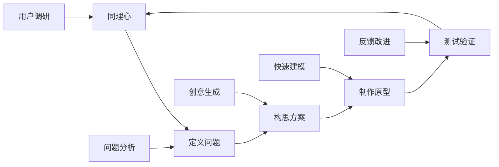

# 01 跨学科项目学习

## 📖 概述

- **定义**: 跨学科项目学习是一种以真实问题为导向，整合多个学科知识和技能，通过项目实施培养学生综合能力的教育模式
- **范围**: 涵盖STEAM教育、设计思维、项目式学习、创客教育、社会实践等多个维度
- **学习目标**:
  - 掌握跨学科知识整合与应用能力
  - 培养设计思维和创新能力
  - 发展协作沟通和项目管理技能
  - 建立问题解决和批判性思维
- **先修知识**: 各学科基础理论、[逻辑学与批判性思维](../01-哲学科学基础/03-逻辑学与批判性思维.md)

## 🏗️ 知识架构

### 1. 理论基础

#### 1.1 核心概念

**🔬 STEAM整合模型**

| 学科 | 核心贡献 | 项目角色 | 能力培养 |
|------|----------|----------|----------|
| **S科学** | 探究方法 | 理论基础 | 科学思维 |
| **T技术** | 工具应用 | 实现手段 | 技术素养 |
| **E工程** | 设计思维 | 解决方案 | 工程能力 |
| **A艺术** | 创意表达 | 美学设计 | 审美能力 |
| **M数学** | 量化分析 | 逻辑支撑 | 数学建模 |

#### 1.2 项目学习循环

**🔄 设计思维流程**

### 2. 实践应用

#### 2.1 项目案例

**🌍 可持续发展项目示例**

| 项目阶段 | 学科整合 | 具体活动 | 学习成果 |
|---------|----------|----------|----------|
| **问题识别** | 地理+环境科学 | 环境调研、数据收集 | 问题意识 |
| **方案设计** | 工程+艺术+数学 | 创新设计、建模分析 | 设计能力 |
| **技术实现** | 科学+技术 | 实验验证、技术应用 | 实践能力 |
| **社会推广** | 语言+社会 | 传播策略、社区参与 | 沟通能力 |

## 🔗 知识关联

### 内部链接

- [科学教育方法论](../02-核心学科理论/02-科学教育方法论.md)
- [数学教育理论与实践](../02-核心学科理论/01-数学教育理论与实践.md)

## 🎯 学习检验

### 自检问题

1. 跨学科项目学习的核心特征是什么？
2. 如何设计有效的STEAM项目？
3. 设计思维在项目学习中的应用？

---
*跨学科整合 | 项目式学习 | 设计思维培养*
