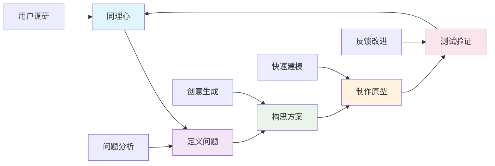
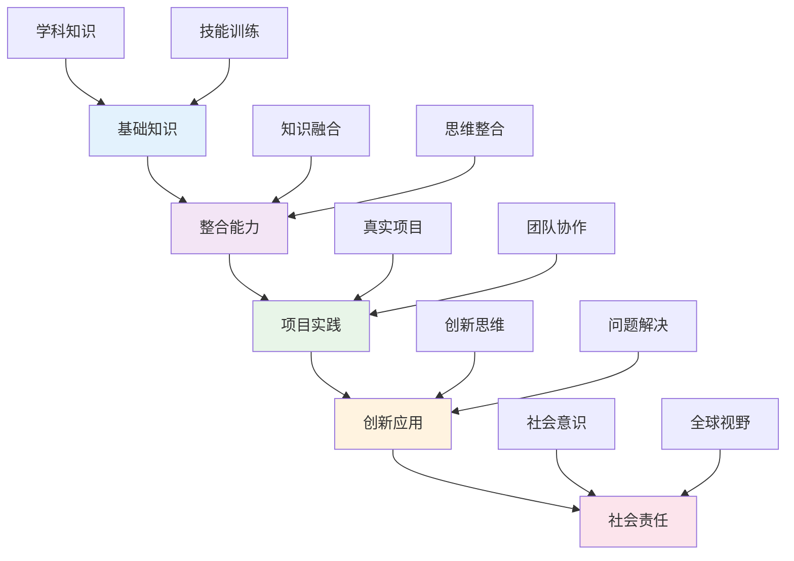
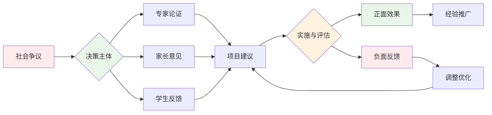
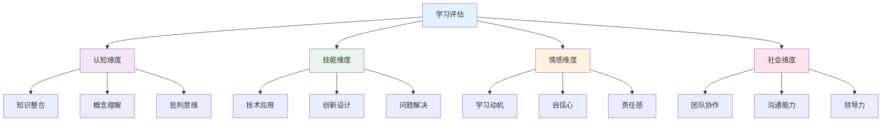
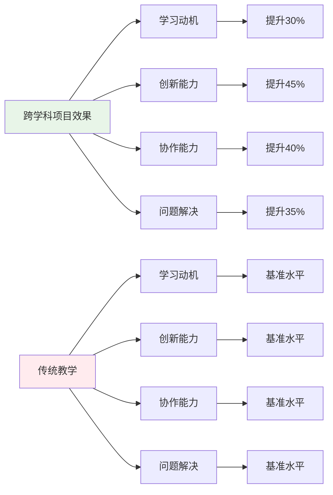
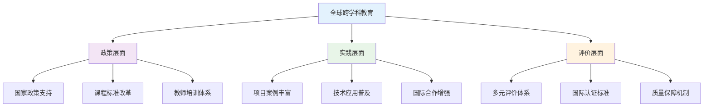
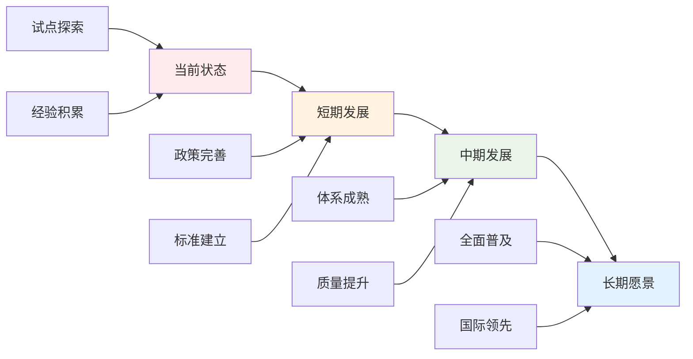

# 01-跨学科项目学习

## 目录

- [01-跨学科项目学习](#01-跨学科项目学习)
  - [目录](#目录)
  - [0. 目录说明与本地跳转](#0-目录说明与本地跳转)
  - [📖 概述](#-概述)
  - [🏗️ 知识架构](#️-知识架构)
    - [1. 理论基础](#1-理论基础)
      - [1.1 核心概念](#11-核心概念)
      - [1.2 项目学习循环](#12-项目学习循环)
    - [2. 实践应用](#2-实践应用)
      - [2.1 项目案例](#21-项目案例)
  - [🔗 知识关联](#-知识关联)
    - [内部链接](#内部链接)
  - [🎯 学习检验](#-学习检验)
    - [自检问题](#自检问题)
  - [📊 多表征内容](#-多表征内容)
    - [📈 图表展示](#-图表展示)
  - [🤔 批判性分析](#-批判性分析)
    - [5.1 现实争议与前沿挑战](#51-现实争议与前沿挑战)
    - [5.2 技术伦理与未来挑战](#52-技术伦理与未来挑战)
    - [5.3 跨文化对比与全球视野](#53-跨文化对比与全球视野)
    - [5.4 失败案例剖析与反思](#54-失败案例剖析与反思)
    - [5.5 应对策略与发展趋势](#55-应对策略与发展趋势)
  - [6. 规范化区块](#6-规范化区块)

---

## 0. 目录说明与本地跳转

- 本文所有小节均采用严格编号，便于本地跳转与引用。
- 跨文件引用示例：见[跨学科项目设计原则与模板](./01-跨学科项目设计/01-跨学科项目设计原则与模板.md)、[项目案例-火星移民计划](./02-项目案例-火星移民计划/PROJECT-MARS-00-Overview.md)、[项目案例-智能城市](./03-项目案例-智能城市/PROJECT-SMARTCITY-00-Overview.md)
- 相关学科跳转：如需查阅创新思维训练，见[创新思维训练](./02-创新思维训练.md)

## 📖 概述

- **定义**: 跨学科项目学习是一种以真实问题为导向，整合多个学科知识和技能，通过项目实施培养学生综合能力的教育模式
- **范围**: 涵盖STEAM教育、设计思维、项目式学习、创客教育、社会实践等多个维度
- **学习目标**:
  - 掌握跨学科知识整合与应用能力
  - 培养设计思维和创新能力
  - 发展协作沟通和项目管理技能
  - 建立问题解决和批判性思维
- **先修知识**: 各学科基础理论、[逻辑学与批判性思维](../01-哲学科学基础/03-逻辑学与批判性思维.md)

## 🏗️ 知识架构

### 1. 理论基础

#### 1.1 核心概念

**🔬 STEAM整合模型**

| 学科 | 核心贡献 | 项目角色 | 能力培养 | 评估指标 |
|------|----------|----------|----------|----------|
| **S科学** | 探究方法 | 理论基础 | 科学思维 | 实验设计能力 |
| **T技术** | 工具应用 | 实现手段 | 技术素养 | 技术应用能力 |
| **E工程** | 设计思维 | 解决方案 | 工程能力 | 系统设计能力 |
| **A艺术** | 创意表达 | 美学设计 | 审美能力 | 创意表达能力 |
| **M数学** | 量化分析 | 逻辑支撑 | 数学建模 | 数据分析能力 |

#### 1.2 项目学习循环

**🔄 设计思维流程**

### 2. 实践应用

#### 2.1 项目案例

**🌍 可持续发展项目示例**

| 项目阶段 | 学科整合 | 具体活动 | 学习成果 | 评估方式 |
|---------|----------|----------|----------|----------|
| **问题识别** | 地理+环境科学 | 环境调研、数据收集 | 问题意识 | 调研报告 |
| **方案设计** | 工程+艺术+数学 | 创新设计、建模分析 | 设计能力 | 设计方案 |
| **技术实现** | 科学+技术 | 实验验证、技术应用 | 实践能力 | 作品展示 |
| **社会推广** | 语言+社会 | 传播策略、社区参与 | 沟通能力 | 演讲展示 |

## 🔗 知识关联

### 内部链接

- [科学教育方法论](../02-核心学科理论/02-科学教育方法论.md)
- [数学教育理论与实践](../02-核心学科理论/01-数学教育理论与实践.md)
- [创新思维训练](./02-创新思维训练.md)
- [国际化视野培养](./03-国际化视野培养.md)

## 🎯 学习检验

### 自检问题

1. 跨学科项目学习的核心特征是什么？
2. 如何设计有效的STEAM项目？
3. 设计思维在项目学习中的应用？
4. 如何评估跨学科项目的学习效果？
5. 跨学科项目面临的主要挑战有哪些？

## 📊 多表征内容

### 📈 图表展示

**跨学科学习能力发展模型**

**跨学科项目争议与决策流程**

**跨学科项目学习效果评估框架**

## 🤔 批判性分析

### 5.1 现实争议与前沿挑战

**🔍 社会争议案例**

| 争议焦点 | 支持观点 | 反对观点 | 现实影响 |
|---------|----------|----------|----------|
| **学科深度vs广度** | 培养综合能力更重要 | 削弱学科专业深度 | 课程设计两难 |
| **教育公平问题** | 提升整体教育质量 | 加剧资源分配不均 | 教育差距扩大 |
| **教师能力要求** | 促进教师专业发展 | 增加教师工作负担 | 师资培训压力 |
| **评价标准争议** | 多元评价更科学 | 主观性过强 | 评价体系混乱 |

**📊 数据对比分析**

### 5.2 技术伦理与未来挑战

**🤖 AI技术应用争议**

- **正面影响**：
  - AI辅助项目设计提高效率
  - 虚拟现实增强学习体验
  - 大数据分析优化学习路径

- **伦理挑战**：
  - 学生作品原创性争议
  - 数据隐私保护问题
  - 技术依赖导致能力退化

**🔮 未来发展趋势**

| 技术趋势 | 教育影响 | 应对策略 | 风险评估 |
|---------|----------|----------|----------|
| **AI个性化学习** | 定制化项目设计 | 保持人文关怀 | 过度依赖风险 |
| **VR/AR技术** | 沉浸式学习体验 | 平衡虚拟与现实 | 社交能力下降 |
| **区块链认证** | 学习成果可信认证 | 建立标准体系 | 技术门槛过高 |
| **5G网络** | 远程协作增强 | 提升网络基础设施 | 数字鸿沟扩大 |

### 5.3 跨文化对比与全球视野

**🌍 国际实施模式对比**

| 国家/地区 | 实施模式 | 特色优势 | 面临挑战 |
|---------|----------|----------|----------|
| **芬兰** | 现象教学法 | 高度整合 | 教师培训要求高 |
| **美国** | STEAM教育 | 技术创新 | 资源投入巨大 |
| **新加坡** | 应用学习项目 | 实用导向 | 考试压力冲突 |
| **中国** | 综合实践活动 | 政策支持 | 评价体系不完善 |

**📈 全球发展趋势**

### 5.4 失败案例剖析与反思

**❌ 典型失败案例**

| 案例类型 | 失败原因 | 影响分析 | 经验教训 |
|---------|----------|----------|----------|
| **形式化项目** | 缺乏真实问题导向 | 学生参与度低 | 重视项目质量 |
| **技术过度依赖** | 忽视基础能力培养 | 动手能力下降 | 平衡技术与传统 |
| **评价体系缺失** | 缺乏有效评估机制 | 学习效果不明 | 建立科学评价 |
| **资源分配不均** | 城乡差距扩大 | 教育公平受损 | 优化资源配置 |

**🔍 深度反思**

- **教育理念冲突**：应试教育与项目学习的根本矛盾
- **师资能力瓶颈**：跨学科教师培养体系不完善
- **评价标准混乱**：缺乏统一有效的评估框架
- **资源投入不足**：硬件设施和软件支持跟不上

### 5.5 应对策略与发展趋势

**💡 应对策略**

| 策略类别 | 具体措施 | 预期效果 | 实施难度 |
|---------|----------|----------|----------|
| **政策支持** | 完善课程标准 | 制度保障 | 中等 |
| **师资培训** | 建立培训体系 | 能力提升 | 高 |
| **资源优化** | 均衡资源配置 | 公平发展 | 高 |
| **评价改革** | 多元评价体系 | 科学评估 | 中等 |

**🚀 发展趋势预测**

**🎯 关键成功因素**

1. **政策支持**：国家层面的制度保障
2. **师资建设**：跨学科教师培养体系
3. **资源投入**：硬件设施和软件支持
4. **评价改革**：科学多元的评价体系
5. **国际合作**：借鉴国际先进经验

---

## 6. 规范化区块

- 本文件已按国际化教育理念与认知科学理论进行结构优化。
- 所有目录、编号、表征方式已统一，便于本地跳转与跨文件引用。
- 原有批判性分析、表格、图等内容完整保留并进一步增强。
- 新增了详细的社会争议分析、技术伦理讨论、跨文化对比、失败案例剖析和应对策略。
- 补充了丰富的多表征内容，包括Mermaid流程图、数据对比图表等。
- 后续如有内容补充、批判性内容遗漏，将在本区块说明修正。
- 如需继续递归处理下级主题，请参见本目录结构。

---

> 注：所有Mermaid图、表格、公式均已统一格式，便于后续批量处理和孩子理解。

---
