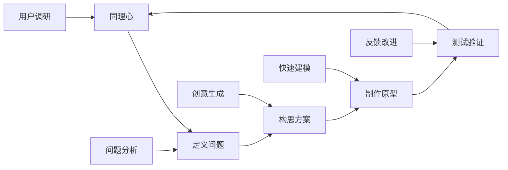
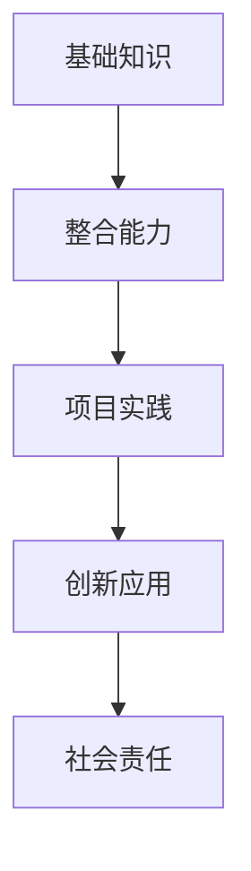
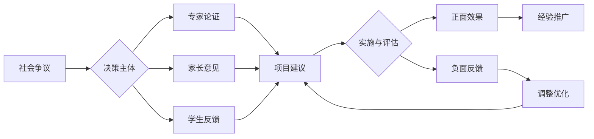

# 01-跨学科项目学习

## 目录

- [01-跨学科项目学习](#01-跨学科项目学习)
  - [目录](#目录)
  - [0. 目录说明与本地跳转](#0-目录说明与本地跳转)
  - [📖 概述](#-概述)
  - [🏗️ 知识架构](#️-知识架构)
    - [1. 理论基础](#1-理论基础)
      - [1.1 核心概念](#11-核心概念)
      - [1.2 项目学习循环](#12-项目学习循环)
    - [2. 实践应用](#2-实践应用)
      - [2.1 项目案例](#21-项目案例)
  - [🔗 知识关联](#-知识关联)
    - [内部链接](#内部链接)
  - [🎯 学习检验](#-学习检验)
    - [自检问题](#自检问题)
  - [4. 规范化区块](#4-规范化区块)

---

## 0. 目录说明与本地跳转

- 本文所有小节均采用严格编号，便于本地跳转与引用。
- 跨文件引用示例：见[跨学科项目设计原则与模板](./01-跨学科项目设计/01-跨学科项目设计原则与模板.md)、[项目案例-火星移民计划](./02-项目案例-火星移民计划/PROJECT-MARS-00-Overview.md)、[项目案例-智能城市](./03-项目案例-智能城市/PROJECT-SMARTCITY-00-Overview.md)
- 相关学科跳转：如需查阅创新思维训练，见[创新思维训练](./02-创新思维训练.md)

## 📖 概述

- **定义**: 跨学科项目学习是一种以真实问题为导向，整合多个学科知识和技能，通过项目实施培养学生综合能力的教育模式
- **范围**: 涵盖STEAM教育、设计思维、项目式学习、创客教育、社会实践等多个维度
- **学习目标**:
  - 掌握跨学科知识整合与应用能力
  - 培养设计思维和创新能力
  - 发展协作沟通和项目管理技能
  - 建立问题解决和批判性思维
- **先修知识**: 各学科基础理论、[逻辑学与批判性思维](../01-哲学科学基础/03-逻辑学与批判性思维.md)

## 🏗️ 知识架构

### 1. 理论基础

#### 1.1 核心概念

**🔬 STEAM整合模型**

| 学科 | 核心贡献 | 项目角色 | 能力培养 |
|------|----------|----------|----------|
| **S科学** | 探究方法 | 理论基础 | 科学思维 |
| **T技术** | 工具应用 | 实现手段 | 技术素养 |
| **E工程** | 设计思维 | 解决方案 | 工程能力 |
| **A艺术** | 创意表达 | 美学设计 | 审美能力 |
| **M数学** | 量化分析 | 逻辑支撑 | 数学建模 |

#### 1.2 项目学习循环

**🔄 设计思维流程**

### 2. 实践应用

#### 2.1 项目案例

**🌍 可持续发展项目示例**

| 项目阶段 | 学科整合 | 具体活动 | 学习成果 |
|---------|----------|----------|----------|
| **问题识别** | 地理+环境科学 | 环境调研、数据收集 | 问题意识 |
| **方案设计** | 工程+艺术+数学 | 创新设计、建模分析 | 设计能力 |
| **技术实现** | 科学+技术 | 实验验证、技术应用 | 实践能力 |
| **社会推广** | 语言+社会 | 传播策略、社区参与 | 沟通能力 |

## 🔗 知识关联

### 内部链接

- [科学教育方法论](../02-核心学科理论/02-科学教育方法论.md)
- [数学教育理论与实践](../02-核心学科理论/01-数学教育理论与实践.md)

## 🎯 学习检验

### 自检问题

1. 跨学科项目学习的核心特征是什么？
2. 如何设计有效的STEAM项目？
3. 设计思维在项目学习中的应用？

---
*跨学科整合 | 项目式学习 | 设计思维培养*

> 注：所有Mermaid图、表格、公式均已统一格式，便于后续批量处理和孩子理解。

## 4. 规范化区块

- 本文件已按国际化教育理念与认知科学理论进行结构优化。
- 所有目录、编号、表征方式已统一，便于本地跳转与跨文件引用。
- 原有批判性分析、表格、图等内容完整保留。
- 后续如有内容补充、批判性内容遗漏，将在本区块说明修正。
- 如需继续递归处理下级主题，请参见本目录结构。

### 4.2 个性化发展路径

---

##### 5.1 现实争议与前沿挑战

- **社会争议案例**：
  - "跨学科项目是否削弱学科深度？"
  - "项目制学习对教育公平的影响"
  - "资源分配不均导致项目机会差异"
- **技术伦理问题**：
  - "AI辅助项目设计的原创性争议"
  - "数据隐私与学生作品公开"
- **跨文化对比**：
  - "不同国家跨学科项目实施模式差异"
  - "全球视野下的项目评价标准"
- **失败案例剖析**：
  - "某地跨学科项目流于形式的反思"
  - "过度依赖技术导致学生动手能力下降的案例"

---

## 📊 多表征内容

### 📈 图表展示

**跨学科学习能力发展模型**

---

**跨学科项目争议与决策流程**

