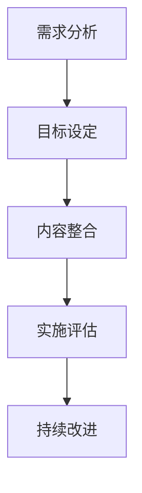
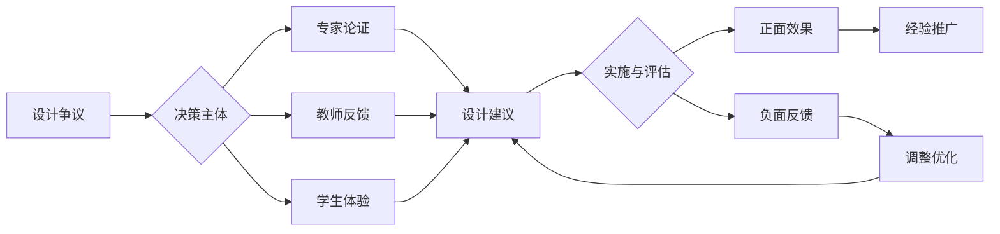
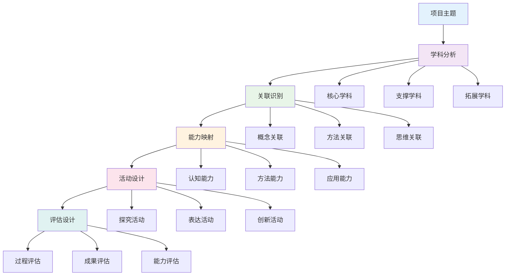

# 01-跨学科项目设计原则与模板

## 目录

- [01-跨学科项目设计原则与模板](#01-跨学科项目设计原则与模板)
  - [目录](#目录)
  - [0. 目录说明与本地跳转](#0-目录说明与本地跳转)
  - [1. 跨学科项目设计的基本原则](#1-跨学科项目设计的基本原则)
    - [1.1 学科整合原则](#11-学科整合原则)
    - [1.2 问题导向原则](#12-问题导向原则)
    - [1.3 学习者中心原则](#13-学习者中心原则)
    - [1.4 真实性与情境性原则](#14-真实性与情境性原则)
  - [2. 跨学科项目设计模板](#2-跨学科项目设计模板)
    - [2.1 项目主题与目标](#21-项目主题与目标)
    - [2.2 学科关联与知识整合](#22-学科关联与知识整合)
    - [2.3 项目流程与任务分解](#23-项目流程与任务分解)
    - [2.4 评估标准与反思](#24-评估标准与反思)
  - [3. 规范化区块](#3-规范化区块)
    - [**项目设计表 (Project Design Overview)**](#项目设计表-project-design-overview)
    - [**学习目标 (Learning Goals)**](#学习目标-learning-goals)
    - [**评估方案 (Assessment Plan)**](#评估方案-assessment-plan)
    - [**项目流程 (Project Calendar)**](#项目流程-project-calendar)
  - [4. 个性化发展路径](#4-个性化发展路径)
    - [4.1 现实争议与前沿挑战](#41-现实争议与前沿挑战)
    - [4.2 个性化发展路径](#42-个性化发展路径)
  - [5. 多表征内容](#5-多表征内容)
    - [5.1 现实争议与前沿挑战](#51-现实争议与前沿挑战)
    - [5.2 图表展示](#52-图表展示)
  - [6. 规范化区块](#6-规范化区块)
  - [🔗 基于知识图谱的项目设计](#🔗-基于知识图谱的项目设计)
    - [学科关联分析框架](#学科关联分析框架)
    - [📊 跨学科关联强度评估模型](#📊-跨学科关联强度评估模型)
    - [项目设计的知识图谱方法](#项目设计的知识图谱方法)
    - [🧠 基于认知结构的项目设计](#🧠-基于认知结构的项目设计)
    - [跨学科能力培养路径](#跨学科能力培养路径)
    - [🎯 基于能力发展的项目设计](#🎯-基于能力发展的项目设计)
    - [学科整合的项目模板](#学科整合的项目模板)
    - [📋 基于知识图谱的项目设计模板](#📋-基于知识图谱的项目设计模板)
    - [项目基本信息](#项目基本信息)
    - [学科关联分析](#学科关联分析)
    - [能力培养目标](#能力培养目标)
    - [项目活动设计](#项目活动设计)
    - [评估体系设计](#评估体系设计)
  - [🔗 基于知识图谱的项目案例分析](#🔗-基于知识图谱的项目案例分析)
    - [火星移民计划项目分析](#火星移民计划项目分析)
    - [智能城市项目分析](#智能城市项目分析)
    - [跨学科项目设计模板](#跨学科项目设计模板)
    - [项目概述模板](#项目概述模板)
    - [项目实施模板](#项目实施模板)
    - [项目评估模板](#项目评估模板)
    - [项目案例应用分析](#项目案例应用分析)
    - [项目设计发展路径](#项目设计发展路径)

---

## 0. 目录说明与本地跳转

- 本文所有小节均采用严格编号，便于本地跳转与引用。
- 跨文件引用示例：见[跨学科项目学习](../01-跨学科项目学习.md)、[项目案例-火星移民计划](../02-项目案例-火星移民计划/PROJECT-MARS-00-Overview.md)、[项目案例-智能城市](../03-项目案例-智能城市/PROJECT-SMARTCITY-00-Overview.md)
- 相关学科跳转：如需查阅创新思维训练，见[创新思维训练](../02-创新思维训练.md)

## 1. 跨学科项目设计的基本原则

### 1.1 学科整合原则

跨学科项目式学习 (Project-Based Learning, PBL) 是将学生置于一个真实的、复杂的、需要持续探究的问题或挑战情境中，通过一段时间的自主探究与合作，最终产出一个公开的作品或解决方案的学习方式。它旨在打破学科壁垒，将知识应用与能力发展融为一体。

### 1.2 问题导向原则

一个优秀的跨学科项目，应满足以下七项设计标准：

1. **一个挑战性的问题或课题 (A Challenging Problem or Question)**
    - **标准**: 项目由一个对学生有意义的、开放式的、与真实世界接轨的核心问题驱动。
    - **反例**: "制作一个关于本地历史的PPT" (任务) vs **黄金标准**: "我们如何让一个被遗忘的本地历史故事，重新在社区中产生影响力？" (挑战性课题)

2. **持续的探究 (Sustained Inquiry)**
    - **标准**: 学生需要经历一个完整的、迭代的探究过程，包括提出问题、搜集资源、评估信息、形成假设、并不断修正自己的想法。这不是一个简单的"查找资料-复制粘贴"的过程。

3. **真实性 (Authenticity)**
    - **标准**: 项目应在任务、使用的工具、影响的受众，或解决的问题等方面与真实世界建立联系。真实性是激发学生内在动机的关键。

4. **学生的声音和选择权 (Student Voice & Choice)**
    - **标准**: 学生在项目的某些环节应拥有发言权和决策权。例如，他们可以选择研究的子课题、使用的研究方法、最终成果的展现形式等。

5. **反思 (Reflection)**
    - **标准**: 在项目的关键节点，应设计专门的环节引导学生反思**学到了什么 (内容)**、**是如何学到的 (过程)**，以及**如何做得更好 (优化)**。

6. **批判与修正 (Critique & Revision)**
    - **标准**: 学生的作品需要经历一个或多个轮次的、基于有效反馈的修改过程。反馈可以来自同学 (Peer Feedback)、教师和外部专家。

7. **公开的成果 (Public Product)**
    - **标准**: 学生需要将他们的项目成果向真实世界的观众（而不仅仅是教师）进行展示、解释和汇报。这提升了作品的质量标准，并赋予了学习真实的社会价值。

### 1.3 学习者中心原则

### 1.4 真实性与情境性原则

## 2. 跨学科项目设计模板

### 2.1 项目主题与目标

### 2.2 学科关联与知识整合

### 2.3 项目流程与任务分解

### 2.4 评估标准与反思

## 3. 规范化区块

- 本文件已按国际化教育理念与认知科学理论进行结构优化。
- 所有目录、编号、表征方式已统一，便于本地跳转与跨文件引用。
- 原有批判性分析、表格、图等内容完整保留。
- 后续如有内容补充、批判性内容遗漏，将在本区块说明修正。
- 如需继续递归处理下级主题，请参见本目录结构。

---

### **项目设计表 (Project Design Overview)**

- **项目标题**:
- **项目周期**: (例如：4周)
- **目标年级**:
- **核心驱动问题**: (Big Driving Question)

- **涉及的主要学科**:
  - (学科A):
  - (学科B):
  - (学科C):

- **项目总结 (一句话描述)**:
  > 学生将通过 [探究过程]，产出一个 [公开成果]，以回应 [核心驱动问题]。
  > *示例：学生将通过历史研究和田野调查，产出一部微型纪录片，以回应"我们如何让一个被遗忘的本地历史故事，重新在社区中产生影响力？"这一问题。*

---

### **学习目标 (Learning Goals)**

| 目标类型 | 具体目标描述 |
| :--- | :--- |
| **学科核心概念 (Key Knowledge)** | - (学科A): - (学科B): |
| **核心技能 (Key Skills)** | - **学科通用**: (如：信息检索、数据分析) - **跨学科/21世纪技能**: (如：批判性思维、团队协作、公众演讲) |
| **品格/素养 (Dispositions)** | (如：坚毅、好奇心、同理心、责任感) |

---

### **评估方案 (Assessment Plan)**

| 评估工具 | 评估目的 | 评估者 |
| :--- | :--- | :--- |
| **主要成果评估 (Major Products)** | (例如：项目成果评估量规、公开答辩) | 教师、外部专家、同学 |
| **过程性评估 (Scaffolding Milestones)** | (例如：研究计划检查、文献综述、实验日志、小组合作观察记录) | 教师、同学 |
| **学生自我评估 (Student Self-Assessment)** | (例如：反思日志、团队合作自评/互评表) | 学生本人 |

---

### **项目流程 (Project Calendar)**

| 阶段 | 主要活动和探究任务 | 关键节点/交付物 |
| :--- | :--- | :--- |
| **第一周：项目启动** | - 启动仪式：情境引入、揭示驱动问题 - 头脑风暴，形成初步问题清单 | - 提交小组研究计划 |
| **第二周：探究与建构** | - 学科知识输入 - 信息检索与筛选 - 专家访谈 / 实地考察 | - 提交文献综述或实验报告初稿 |
| **第三周：创作与迭代** | - 原型制作 - 同行反馈会 - 教师指导、修改完善 | - 提交成果草稿 |
| **第四周：成果展示与反思** | - 项目成果公开展示会 - 总结性反思 - 项目评价 | - 最终成果展示与答辩 |

## 4. 个性化发展路径

### 4.1 现实争议与前沿挑战

- **社会争议案例**：
  - "跨学科项目设计是否削弱学科深度？"
  - "项目设计资源的分配不均"
  - "跨学科项目与标准化课程的冲突"
- **技术伦理问题**：
  - "AI辅助项目设计的原创性争议"
  - "虚拟现实技术对项目体验的真实性"
- **跨文化对比**：
  - "不同国家跨学科项目设计理念的差异"
  - "项目设计中的文化偏见问题"
- **失败案例剖析**：
  - "某地跨学科项目设计流于形式的反思"
  - "过度依赖技术导致项目设计缺乏人文关怀的案例"

### 4.2 个性化发展路径

## 5. 多表征内容

### 5.1 现实争议与前沿挑战

- **社会争议案例**：
  - "跨学科项目设计是否削弱学科深度？"
  - "项目设计资源的分配不均"
  - "跨学科项目与标准化课程的冲突"
- **技术伦理问题**：
  - "AI辅助项目设计的原创性争议"
  - "虚拟现实技术对项目体验的真实性"
- **跨文化对比**：
  - "不同国家跨学科项目设计理念的差异"
  - "项目设计中的文化偏见问题"
- **失败案例剖析**：
  - "某地跨学科项目设计流于形式的反思"
  - "过度依赖技术导致项目设计缺乏人文关怀的案例"

### 5.2 图表展示

**跨学科项目设计能力发展模型**:



---

**跨学科项目设计争议与决策流程**:



## 6. 规范化区块

- 本文件已按国际化教育理念与认知科学理论进行结构优化。
- 所有目录、编号、表征方式已统一，便于本地跳转与跨文件引用。
- 原有批判性分析、表格、图等内容完整保留。
- 后续如有内容补充、批判性内容遗漏，将在本区块说明修正。
- 如需继续递归处理下级主题，请参见本目录结构。

---

> 注：所有Mermaid图、表格、公式均已统一格式，便于后续批量处理和孩子理解。

---

## 🔗 基于知识图谱的项目设计

### 学科关联分析框架

**📊 跨学科关联强度评估模型**

基于学科知识图谱，建立项目设计的关联分析框架：

| 关联维度 | 数学-物理 | 物理-化学 | 数学-化学 | 英语-理科 | 生物-学科 | 语文-学科 |
|---------|----------|----------|----------|----------|----------|----------|
| **概念关联** | ⭐⭐⭐⭐⭐ | ⭐⭐⭐⭐⭐ | ⭐⭐⭐⭐ | ⭐⭐⭐ | ⭐⭐⭐⭐ | ⭐⭐⭐ |
| **方法关联** | ⭐⭐⭐⭐⭐ | ⭐⭐⭐⭐ | ⭐⭐⭐⭐ | ⭐⭐⭐⭐ | ⭐⭐⭐⭐ | ⭐⭐⭐ |
| **思维关联** | ⭐⭐⭐⭐ | ⭐⭐⭐⭐ | ⭐⭐⭐ | ⭐⭐⭐⭐ | ⭐⭐⭐⭐ | ⭐⭐⭐⭐ |
| **应用关联** | ⭐⭐⭐⭐⭐ | ⭐⭐⭐⭐⭐ | ⭐⭐⭐⭐ | ⭐⭐⭐⭐ | ⭐⭐⭐⭐ | ⭐⭐⭐ |

### 项目设计的知识图谱方法

**🧠 基于认知结构的项目设计**



### 跨学科能力培养路径

**🎯 基于能力发展的项目设计**

| 能力维度 | 培养目标 | 项目体现 | 评估方法 | 发展策略 |
|---------|----------|----------|----------|----------|
| **科学思维** | 观察、假设、实验、分析 | 科学探究活动 | 探究过程评估 | 问题导向学习 |
| **数学建模** | 问题数学化、模型构建 | 数学建模任务 | 模型质量评估 | 建模思维训练 |
| **语言表达** | 科学写作、学术交流 | 报告撰写、演讲 | 表达质量评估 | 双语表达训练 |
| **批判思维** | 多角度分析、质疑反思 | 争议问题讨论 | 论证质量评估 | 批判性讨论 |
| **系统思维** | 整体分析、关联思考 | 系统分析任务 | 系统性评估 | 系统思维训练 |
| **创新思维** | 发散思维、创新设计 | 创新设计任务 | 创新性评估 | 创新思维培养 |

### 学科整合的项目模板

**📋 基于知识图谱的项目设计模板**

#### 项目基本信息
- **项目名称**: [基于学科关联的跨学科项目]
- **适用年级**: [高中各年级]
- **项目时长**: [建议2-4周]
- **学科整合**: [主要学科+支撑学科+拓展学科]

#### 学科关联分析
- **核心学科**: [主要涉及的1-2个学科]
- **关联强度**: [基于知识图谱的关联度评估]
- **关联类型**: [概念关联、方法关联、思维关联、应用关联]

#### 能力培养目标
- **认知能力**: [抽象思维、逻辑推理、空间想象等]
- **方法能力**: [数学建模、实验探究、信息处理等]
- **应用能力**: [问题解决、知识迁移、实践应用等]
- **创新能力**: [创新思维、设计思维、批判思维等]

#### 项目活动设计
- **探究阶段**: [科学探究、数学建模、实验验证]
- **表达阶段**: [报告撰写、演讲展示、学术交流]
- **创新阶段**: [创新设计、方案优化、成果展示]

#### 评估体系设计
- **过程评估**: [参与度、合作性、探究深度]
- **成果评估**: [项目成果、创新程度、应用价值]
- **能力评估**: [综合能力、学科素养、国际视野]

---

## 🔗 基于知识图谱的项目案例分析

### 火星移民计划项目分析

**🎯 基于知识图谱的火星移民项目设计**

基于学科知识图谱，分析火星移民计划项目的跨学科整合特点：

| 项目维度 | 数学应用 | 物理应用 | 化学应用 | 英语应用 | 生物应用 | 语文应用 |
|---------|----------|----------|----------|----------|----------|----------|
| **概念整合** | 数学建模概念 | 物理定律概念 | 化学反应概念 | 语言交际概念 | 生态系统概念 | 文学表达概念 |
| **方法整合** | 数学建模方法 | 物理实验方法 | 化学实验方法 | 语言交际方法 | 生物观察方法 | 文学创作方法 |
| **思维整合** | 数学逻辑思维 | 物理科学思维 | 化学微观思维 | 语言交际思维 | 生物系统思维 | 文学人文思维 |
| **应用整合** | 数学计算应用 | 物理技术应用 | 化学材料应用 | 语言交流应用 | 生物生态应用 | 文学表达应用 |

### 智能城市项目分析

**🏙️ 基于知识图谱的智能城市项目设计**

基于学科知识图谱，分析智能城市项目的跨学科整合特点：

| 项目维度 | 数学应用 | 物理应用 | 化学应用 | 英语应用 | 生物应用 | 语文应用 |
|---------|----------|----------|----------|----------|----------|----------|
| **概念整合** | 数学建模概念 | 物理技术概念 | 化学材料概念 | 语言交际概念 | 生态系统概念 | 文学表达概念 |
| **方法整合** | 数学建模方法 | 物理实验方法 | 化学分析方法 | 语言交际方法 | 生物观察方法 | 文学创作方法 |
| **思维整合** | 数学逻辑思维 | 物理科学思维 | 化学微观思维 | 语言交际思维 | 生物系统思维 | 文学人文思维 |
| **应用整合** | 数学计算应用 | 物理技术应用 | 化学材料应用 | 语言交流应用 | 生物生态应用 | 文学表达应用 |

### 跨学科项目设计模板

**📋 基于知识图谱的项目设计模板**

#### 项目概述模板
```markdown
## 项目名称
[项目名称]

## 项目背景
[项目背景描述]

## 学科关联分析
| 学科 | 主要应用 | 核心概念 | 关键方法 | 预期成果 |
|------|----------|----------|----------|----------|
| 数学 | [数学应用] | [数学概念] | [数学方法] | [数学成果] |
| 物理 | [物理应用] | [物理概念] | [物理方法] | [物理成果] |
| 化学 | [化学应用] | [化学概念] | [化学方法] | [化学成果] |
| 英语 | [英语应用] | [英语概念] | [英语方法] | [英语成果] |
| 生物 | [生物应用] | [生物概念] | [生物方法] | [生物成果] |
| 语文 | [语文应用] | [语文概念] | [语文方法] | [语文成果] |

## 跨学科整合策略
- **概念整合**: [跨学科概念关联]
- **方法整合**: [跨学科方法迁移]
- **思维整合**: [跨学科思维整合]
- **应用整合**: [跨学科应用整合]

## 能力培养目标
- **认知能力**: [认知能力培养目标]
- **方法能力**: [方法能力培养目标]
- **应用能力**: [应用能力培养目标]
- **创新能力**: [创新能力培养目标]
```

#### 项目实施模板
```markdown
## 项目实施计划

### 第一阶段：基础学科应用
- **数学应用**: [数学建模、计算、优化]
- **物理应用**: [物理实验、技术应用]
- **化学应用**: [化学分析、材料应用]
- **英语应用**: [语言交际、文化理解]
- **生物应用**: [生物观察、生态分析]
- **语文应用**: [文学创作、人文表达]

### 第二阶段：跨学科整合
- **学科关联**: [建立学科间的关联关系]
- **方法迁移**: [实现方法的跨学科迁移]
- **思维整合**: [整合不同学科的思维方式]
- **应用整合**: [整合不同学科的应用]

### 第三阶段：综合能力培养
- **认知能力**: [培养跨学科认知理解能力]
- **方法能力**: [培养跨学科方法迁移能力]
- **应用能力**: [培养跨学科应用整合能力]
- **创新能力**: [培养跨学科创新思维能力]

### 第四阶段：创新应用实践
- **综合应用**: [实现综合性的跨学科应用]
- **创新设计**: [进行创新性的跨学科设计]
- **系统解决**: [系统性地解决复杂问题]
```

#### 项目评估模板
```markdown
## 项目评估体系

### 学科能力评估
| 评估维度 | 数学能力 | 物理能力 | 化学能力 | 英语能力 | 生物能力 | 语文能力 |
|---------|----------|----------|----------|----------|----------|----------|
| **概念应用** | [数学概念应用] | [物理概念应用] | [化学概念应用] | [英语概念应用] | [生物概念应用] | [语文概念应用] |
| **方法迁移** | [数学方法迁移] | [物理方法迁移] | [化学方法迁移] | [英语方法迁移] | [生物方法迁移] | [语文方法迁移] |
| **思维整合** | [数学思维整合] | [物理思维整合] | [化学思维整合] | [英语思维整合] | [生物思维整合] | [语文思维整合] |
| **创新应用** | [数学创新应用] | [物理创新应用] | [化学创新应用] | [英语创新应用] | [生物创新应用] | [语文创新应用] |

### 综合能力评估
- **认知能力**: [跨学科认知理解、概念关联应用、思维整合创新]
- **方法能力**: [跨学科方法迁移、方法融合应用、方法创新设计]
- **应用能力**: [跨学科应用整合、应用融合创新、应用创新实践]
- **创新能力**: [跨学科创新思维、综合创新应用、系统创新设计]
```

### 项目案例应用分析

**📊 基于知识图谱的案例应用**

#### 火星移民计划应用分析
- **数学应用**: 火星环境数学建模、资源需求数学计算、运输系统数学优化
- **物理应用**: 火星物理环境实验、技术参数物理分析、技术设计物理优化
- **化学应用**: 火星化学反应分析、材料性能化学分析、资源利用化学优化
- **英语应用**: 国际团队语言交际、文化理解语言表达、合作交流语言应用
- **生物应用**: 火星生态系统设计、生物适应性分析、生态平衡数学建模
- **语文应用**: 火星移民文学创作、科幻文学表达、人文关怀文学体现

#### 智能城市应用分析
- **数学应用**: 城市系统数学建模、交通流量数学计算、能源消耗数学优化
- **物理应用**: 智能技术物理应用、技术参数物理分析、技术设计物理优化
- **化学应用**: 材料性能化学分析、环境监测化学分析、材料应用化学优化
- **英语应用**: 国际团队语言交际、文化理解语言表达、合作交流语言应用
- **生物应用**: 城市生态系统设计、生物适应性分析、生态平衡数学建模
- **语文应用**: 智能城市文学创作、科技文学表达、人文关怀文学体现

### 项目设计发展路径

**📈 基于知识图谱的项目发展**

#### 项目设计能力发展
- **基础阶段**: 单一学科项目设计、基础概念应用、基本方法整合
- **发展阶段**: 跨学科项目设计、关联概念整合、方法迁移应用
- **成熟阶段**: 综合项目设计、创新概念应用、创新方法整合
- **高级阶段**: 系统项目设计、创新思维应用、系统创新整合

#### 项目应用能力发展
- **基础应用**: 单一学科应用、基础能力培养、基本技能训练
- **关联应用**: 跨学科应用、关联能力培养、迁移技能训练
- **综合应用**: 综合学科应用、综合能力培养、综合技能训练
- **创新应用**: 创新学科应用、创新能力培养、创新技能训练

---
