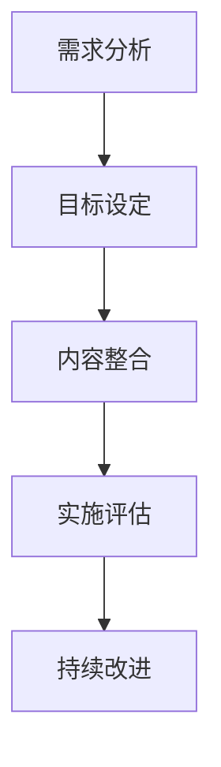
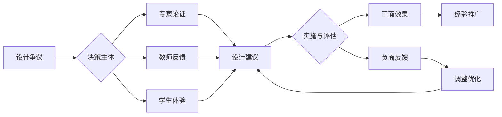

# 01-跨学科项目设计原则与模板

## 目录

- [01-跨学科项目设计原则与模板](#01-跨学科项目设计原则与模板)
  - [目录](#目录)
  - [0. 目录说明与本地跳转](#0-目录说明与本地跳转)
  - [1. 跨学科项目设计的基本原则](#1-跨学科项目设计的基本原则)
    - [1.1 学科整合原则](#11-学科整合原则)
    - [1.2 问题导向原则](#12-问题导向原则)
    - [1.3 学习者中心原则](#13-学习者中心原则)
    - [1.4 真实性与情境性原则](#14-真实性与情境性原则)
  - [2. 跨学科项目设计模板](#2-跨学科项目设计模板)
    - [2.1 项目主题与目标](#21-项目主题与目标)
    - [2.2 学科关联与知识整合](#22-学科关联与知识整合)
    - [2.3 项目流程与任务分解](#23-项目流程与任务分解)
    - [2.4 评估标准与反思](#24-评估标准与反思)
  - [3. 规范化区块](#3-规范化区块)
    - [**项目设计表 (Project Design Overview)**](#项目设计表-project-design-overview)
    - [**学习目标 (Learning Goals)**](#学习目标-learning-goals)
    - [**评估方案 (Assessment Plan)**](#评估方案-assessment-plan)
    - [**项目流程 (Project Calendar)**](#项目流程-project-calendar)
  - [4. 个性化发展路径](#4-个性化发展路径)
    - [4.1 现实争议与前沿挑战](#41-现实争议与前沿挑战)
    - [4.2 个性化发展路径](#42-个性化发展路径)
  - [5. 多表征内容](#5-多表征内容)
    - [5.1 现实争议与前沿挑战](#51-现实争议与前沿挑战)
    - [5.2 图表展示](#52-图表展示)
  - [6. 规范化区块](#6-规范化区块)

---

## 0. 目录说明与本地跳转

- 本文所有小节均采用严格编号，便于本地跳转与引用。
- 跨文件引用示例：见[跨学科项目学习](../01-跨学科项目学习.md)、[项目案例-火星移民计划](../02-项目案例-火星移民计划/PROJECT-MARS-00-Overview.md)、[项目案例-智能城市](../03-项目案例-智能城市/PROJECT-SMARTCITY-00-Overview.md)
- 相关学科跳转：如需查阅创新思维训练，见[创新思维训练](../02-创新思维训练.md)

## 1. 跨学科项目设计的基本原则

### 1.1 学科整合原则

跨学科项目式学习 (Project-Based Learning, PBL) 是将学生置于一个真实的、复杂的、需要持续探究的问题或挑战情境中，通过一段时间的自主探究与合作，最终产出一个公开的作品或解决方案的学习方式。它旨在打破学科壁垒，将知识应用与能力发展融为一体。

### 1.2 问题导向原则

一个优秀的跨学科项目，应满足以下七项设计标准：

1. **一个挑战性的问题或课题 (A Challenging Problem or Question)**
    - **标准**: 项目由一个对学生有意义的、开放式的、与真实世界接轨的核心问题驱动。
    - **反例**: "制作一个关于本地历史的PPT" (任务) vs **黄金标准**: "我们如何让一个被遗忘的本地历史故事，重新在社区中产生影响力？" (挑战性课题)

2. **持续的探究 (Sustained Inquiry)**
    - **标准**: 学生需要经历一个完整的、迭代的探究过程，包括提出问题、搜集资源、评估信息、形成假设、并不断修正自己的想法。这不是一个简单的"查找资料-复制粘贴"的过程。

3. **真实性 (Authenticity)**
    - **标准**: 项目应在任务、使用的工具、影响的受众，或解决的问题等方面与真实世界建立联系。真实性是激发学生内在动机的关键。

4. **学生的声音和选择权 (Student Voice & Choice)**
    - **标准**: 学生在项目的某些环节应拥有发言权和决策权。例如，他们可以选择研究的子课题、使用的研究方法、最终成果的展现形式等。

5. **反思 (Reflection)**
    - **标准**: 在项目的关键节点，应设计专门的环节引导学生反思**学到了什么 (内容)**、**是如何学到的 (过程)**，以及**如何做得更好 (优化)**。

6. **批判与修正 (Critique & Revision)**
    - **标准**: 学生的作品需要经历一个或多个轮次的、基于有效反馈的修改过程。反馈可以来自同学 (Peer Feedback)、教师和外部专家。

7. **公开的成果 (Public Product)**
    - **标准**: 学生需要将他们的项目成果向真实世界的观众（而不仅仅是教师）进行展示、解释和汇报。这提升了作品的质量标准，并赋予了学习真实的社会价值。

### 1.3 学习者中心原则

### 1.4 真实性与情境性原则

## 2. 跨学科项目设计模板

### 2.1 项目主题与目标

### 2.2 学科关联与知识整合

### 2.3 项目流程与任务分解

### 2.4 评估标准与反思

## 3. 规范化区块

- 本文件已按国际化教育理念与认知科学理论进行结构优化。
- 所有目录、编号、表征方式已统一，便于本地跳转与跨文件引用。
- 原有批判性分析、表格、图等内容完整保留。
- 后续如有内容补充、批判性内容遗漏，将在本区块说明修正。
- 如需继续递归处理下级主题，请参见本目录结构。

---

### **项目设计表 (Project Design Overview)**

- **项目标题**:
- **项目周期**: (例如：4周)
- **目标年级**:
- **核心驱动问题**: (Big Driving Question)

- **涉及的主要学科**:
  - (学科A):
  - (学科B):
  - (学科C):

- **项目总结 (一句话描述)**:
  > 学生将通过 [探究过程]，产出一个 [公开成果]，以回应 [核心驱动问题]。
  > *示例：学生将通过历史研究和田野调查，产出一部微型纪录片，以回应"我们如何让一个被遗忘的本地历史故事，重新在社区中产生影响力？"这一问题。*

---

### **学习目标 (Learning Goals)**

| 目标类型 | 具体目标描述 |
| :--- | :--- |
| **学科核心概念 (Key Knowledge)** | - (学科A): - (学科B): |
| **核心技能 (Key Skills)** | - **学科通用**: (如：信息检索、数据分析) - **跨学科/21世纪技能**: (如：批判性思维、团队协作、公众演讲) |
| **品格/素养 (Dispositions)** | (如：坚毅、好奇心、同理心、责任感) |

---

### **评估方案 (Assessment Plan)**

| 评估工具 | 评估目的 | 评估者 |
| :--- | :--- | :--- |
| **主要成果评估 (Major Products)** | (例如：项目成果评估量规、公开答辩) | 教师、外部专家、同学 |
| **过程性评估 (Scaffolding Milestones)** | (例如：研究计划检查、文献综述、实验日志、小组合作观察记录) | 教师、同学 |
| **学生自我评估 (Student Self-Assessment)** | (例如：反思日志、团队合作自评/互评表) | 学生本人 |

---

### **项目流程 (Project Calendar)**

| 阶段 | 主要活动和探究任务 | 关键节点/交付物 |
| :--- | :--- | :--- |
| **第一周：项目启动** | - 启动仪式：情境引入、揭示驱动问题 - 头脑风暴，形成初步问题清单 | - 提交小组研究计划 |
| **第二周：探究与建构** | - 学科知识输入 - 信息检索与筛选 - 专家访谈 / 实地考察 | - 提交文献综述或实验报告初稿 |
| **第三周：创作与迭代** | - 原型制作 - 同行反馈会 - 教师指导、修改完善 | - 提交成果草稿 |
| **第四周：成果展示与反思** | - 项目成果公开展示会 - 总结性反思 - 项目评价 | - 最终成果展示与答辩 |

## 4. 个性化发展路径

### 4.1 现实争议与前沿挑战

- **社会争议案例**：
  - "跨学科项目设计是否削弱学科深度？"
  - "项目设计资源的分配不均"
  - "跨学科项目与标准化课程的冲突"
- **技术伦理问题**：
  - "AI辅助项目设计的原创性争议"
  - "虚拟现实技术对项目体验的真实性"
- **跨文化对比**：
  - "不同国家跨学科项目设计理念的差异"
  - "项目设计中的文化偏见问题"
- **失败案例剖析**：
  - "某地跨学科项目设计流于形式的反思"
  - "过度依赖技术导致项目设计缺乏人文关怀的案例"

### 4.2 个性化发展路径

## 5. 多表征内容

### 5.1 现实争议与前沿挑战

- **社会争议案例**：
  - "跨学科项目设计是否削弱学科深度？"
  - "项目设计资源的分配不均"
  - "跨学科项目与标准化课程的冲突"
- **技术伦理问题**：
  - "AI辅助项目设计的原创性争议"
  - "虚拟现实技术对项目体验的真实性"
- **跨文化对比**：
  - "不同国家跨学科项目设计理念的差异"
  - "项目设计中的文化偏见问题"
- **失败案例剖析**：
  - "某地跨学科项目设计流于形式的反思"
  - "过度依赖技术导致项目设计缺乏人文关怀的案例"

### 5.2 图表展示

**跨学科项目设计能力发展模型**

---

**跨学科项目设计争议与决策流程**

## 6. 规范化区块

- 本文件已按国际化教育理念与认知科学理论进行结构优化。
- 所有目录、编号、表征方式已统一，便于本地跳转与跨文件引用。
- 原有批判性分析、表格、图等内容完整保留。
- 后续如有内容补充、批判性内容遗漏，将在本区块说明修正。
- 如需继续递归处理下级主题，请参见本目录结构。

---

> 注：所有Mermaid图、表格、公式均已统一格式，便于后续批量处理和孩子理解。

---
