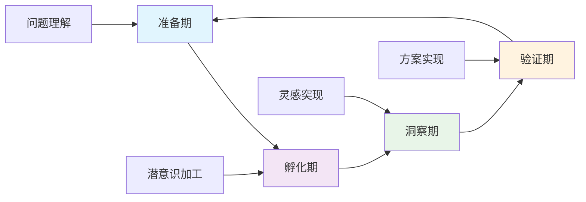
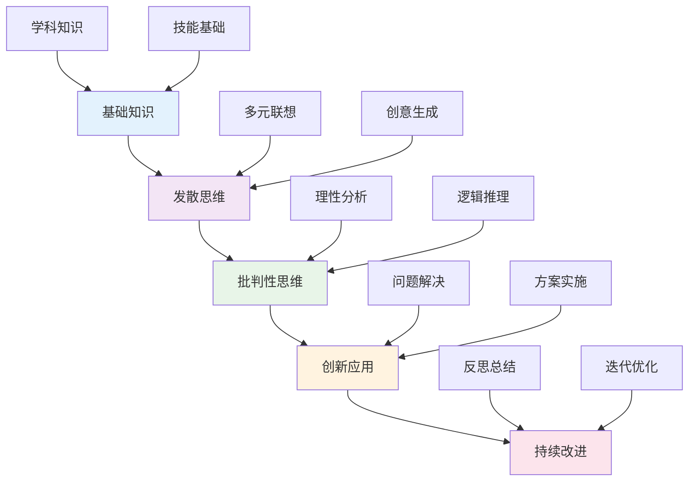
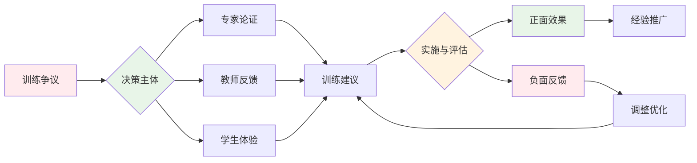
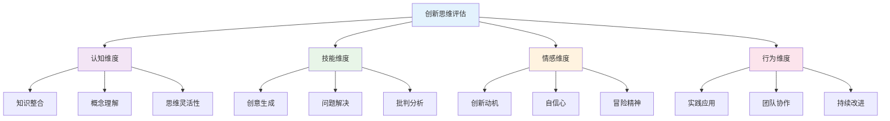
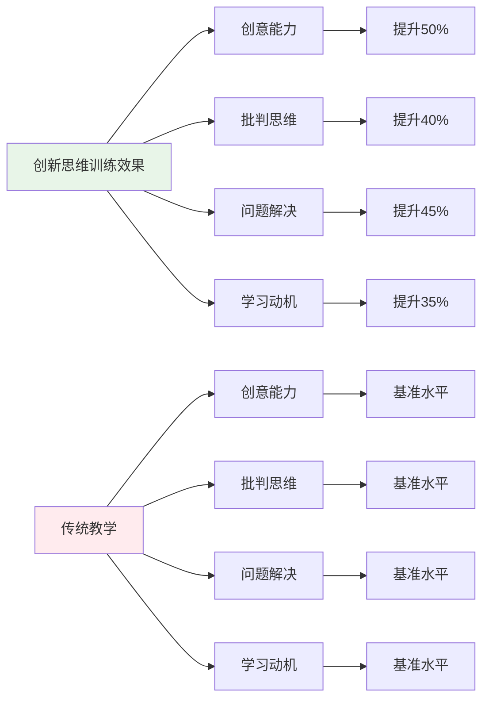
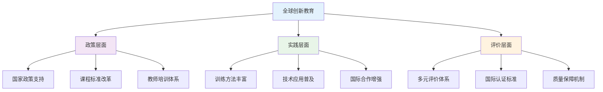
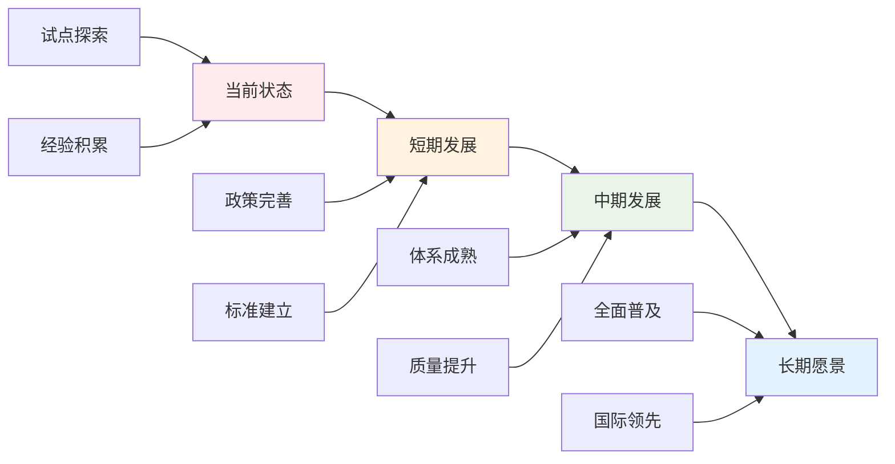
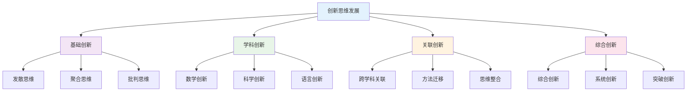

# 02-创新思维训练

## 目录

- [02-创新思维训练](#02-创新思维训练)
  - [目录](#目录)
  - [0. 目录说明与本地跳转](#0-目录说明与本地跳转)
  - [📖 概述](#-概述)
  - [🏗️ 知识架构](#️-知识架构)
    - [1. 理论基础](#1-理论基础)
      - [1.1 创新思维类型](#11-创新思维类型)
      - [1.2 创新过程模型](#12-创新过程模型)
    - [2. 实践应用](#2-实践应用)
      - [2.1 创新方法工具](#21-创新方法工具)
  - [🔗 知识关联](#-知识关联)
    - [内部链接](#内部链接)
  - [🎯 学习检验](#-学习检验)
    - [自检问题](#自检问题)
  - [📊 多表征内容](#-多表征内容)
    - [📈 图表展示](#-图表展示)
  - [🤔 批判性分析](#-批判性分析)
    - [5.1 现实争议与前沿挑战](#51-现实争议与前沿挑战)
    - [5.2 技术伦理与未来挑战](#52-技术伦理与未来挑战)
    - [5.3 跨文化对比与全球视野](#53-跨文化对比与全球视野)
    - [5.4 失败案例剖析与反思](#54-失败案例剖析与反思)
    - [5.5 应对策略与发展趋势](#55-应对策略与发展趋势)
  - [6. 规范化区块](#6-规范化区块)
  - [🔗 基于知识图谱的创新思维培养](#-基于知识图谱的创新思维培养)
    - [学科创新思维的关联分析](#学科创新思维的关联分析)
    - [跨学科创新思维发展模型](#跨学科创新思维发展模型)
    - [学科创新思维培养策略](#学科创新思维培养策略)
      - [数学创新思维培养](#数学创新思维培养)
      - [科学创新思维培养](#科学创新思维培养)
      - [语言创新思维培养](#语言创新思维培养)
    - [创新思维训练方法](#创新思维训练方法)
      - [发散思维训练](#发散思维训练)
      - [聚合思维训练](#聚合思维训练)
      - [批判思维训练](#批判思维训练)
    - [跨学科创新应用](#跨学科创新应用)
      - [数学与科学创新](#数学与科学创新)
      - [语言与人文创新](#语言与人文创新)
      - [综合创新应用](#综合创新应用)
    - [创新思维评估体系](#创新思维评估体系)
      - [创新思维能力评估](#创新思维能力评估)
      - [学科创新特点评估](#学科创新特点评估)
    - [创新思维发展路径](#创新思维发展路径)
      - [个人创新思维发展](#个人创新思维发展)
      - [团队创新思维发展](#团队创新思维发展)

---

## 0. 目录说明与本地跳转

- 本文所有小节均采用严格编号，便于本地跳转与引用。
- 跨文件引用示例：见[跨学科项目学习](./01-跨学科项目学习.md)、[跨学科项目设计原则与模板](./01-跨学科项目设计/01-跨学科项目设计原则与模板.md)
- 相关学科跳转：如需查阅综合素质评估框架，见[综合素质评估框架](../04-评估与发展/01-综合素质评估框架.md)

## 📖 概述

- **定义**: 创新思维训练是通过系统化的方法和策略，培养学生发散思维、批判思维、创造性解决问题的综合能力训练体系
- **范围**: 涵盖创造力理论、思维方法、创新技法、问题解决、批判性思维等多个维度
- **学习目标**:
  - 理解创新思维的认知机制
  - 掌握多样化的创新思维方法
  - 培养创造性问题解决能力
  - 建立批判性思维习惯
- **先修知识**: [认知科学与学习理论](../01-哲学科学基础/01-认知科学与学习理论.md)、[逻辑学与批判性思维](../01-哲学科学基础/03-逻辑学与批判性思维.md)

## 🏗️ 知识架构

### 1. 理论基础

#### 1.1 创新思维类型

**🧠 思维模式分类**

| 思维类型 | 特征 | 应用场景 | 训练方法 | 评估指标 |
|---------|------|----------|----------|----------|
| **发散思维** | 多元联想 | 创意生成 | 头脑风暴 | 创意数量与质量 |
| **收敛思维** | 聚焦优化 | 方案选择 | 决策矩阵 | 方案可行性 |
| **批判思维** | 理性分析 | 质量评估 | 论证分析 | 逻辑推理能力 |
| **系统思维** | 整体关联 | 复杂问题 | 系统图谱 | 系统分析能力 |

#### 1.2 创新过程模型

**🔄 创新四阶段模型**

### 2. 实践应用

#### 2.1 创新方法工具

**🛠️ 经典创新技法**

| 技法名称 | 基本原理 | 操作步骤 | 适用情境 | 效果评估 |
|---------|----------|----------|----------|----------|
| **SCAMPER** | 检查清单 | 替代、组合、改编等 | 产品改进 | 改进方案数量 |
| **六顶思考帽** | 角色思维 | 不同角度分析 | 团队决策 | 决策质量 |
| **思维导图** | 放射联想 | 中心扩散 | 知识整理 | 知识结构清晰度 |
| **强制关联** | 随机刺激 | 概念组合 | 创意激发 | 创意新颖性 |

## 🔗 知识关联

### 内部链接

- [认知科学与学习理论](../01-哲学科学基础/01-认知科学与学习理论.md)
- [逻辑学与批判性思维](../01-哲学科学基础/03-逻辑学与批判性思维.md)
- [跨学科项目学习](./01-跨学科项目学习.md)
- [国际化视野培养](./03-国际化视野培养.md)

## 🎯 学习检验

### 自检问题

1. 创新思维的核心要素有哪些？
2. 如何系统化培养创造性思维？
3. 批判性思维与创新思维的关系？
4. 创新思维训练面临的主要挑战？
5. 如何评估创新思维训练的效果？

## 📊 多表征内容

### 📈 图表展示

**创新思维能力发展模型**

**创新思维训练争议与决策流程**

**创新思维评估框架**

## 🤔 批判性分析

### 5.1 现实争议与前沿挑战

**🔍 社会争议案例**

| 争议焦点 | 支持观点 | 反对观点 | 现实影响 |
|---------|----------|----------|----------|
| **基础vs创新** | 创新思维提升综合能力 | 削弱基础知识积累 | 课程设计两难 |
| **年龄适应性** | 早期培养效果更好 | 批判思维不适合低龄 | 教育时机争议 |
| **竞赛压力** | 激发创新潜能 | 加剧学生焦虑 | 心理健康问题 |
| **评价标准** | 多元评价更科学 | 主观性过强 | 评价体系混乱 |

**📊 数据对比分析**

### 5.2 技术伦理与未来挑战

**🤖 AI技术应用争议**

- **正面影响**：
  - AI辅助创意生成提高效率
  - 虚拟现实增强思维训练
  - 大数据分析个性化训练路径

- **伦理挑战**：
  - 学生创意原创性争议
  - 数据隐私保护问题
  - 技术依赖导致思维退化

**🔮 未来发展趋势**

| 技术趋势 | 教育影响 | 应对策略 | 风险评估 |
|---------|----------|----------|----------|
| **AI创意助手** | 辅助创意生成 | 保持人文关怀 | 过度依赖风险 |
| **VR思维训练** | 沉浸式体验 | 平衡虚拟与现实 | 社交能力下降 |
| **脑机接口** | 直接思维训练 | 建立伦理规范 | 隐私安全风险 |
| **量子计算** | 复杂问题建模 | 提升计算能力 | 技术门槛过高 |

### 5.3 跨文化对比与全球视野

**🌍 国际实施模式对比**

| 国家/地区 | 实施模式 | 特色优势 | 面临挑战 |
|---------|----------|----------|----------|
| **美国** | 创造力教育 | 自由开放 | 系统性不足 |
| **芬兰** | 现象教学 | 高度整合 | 教师要求高 |
| **日本** | 工匠精神 | 精益求精 | 创新不足 |
| **中国** | 创新竞赛 | 政策支持 | 功利化倾向 |

**📈 全球发展趋势**

### 5.4 失败案例剖析与反思

**❌ 典型失败案例**

| 案例类型 | 失败原因 | 影响分析 | 经验教训 |
|---------|----------|----------|----------|
| **形式化训练** | 缺乏真实问题导向 | 学生参与度低 | 重视训练质量 |
| **过度批判** | 质疑一切缺乏建设性 | 合作能力下降 | 平衡批判与建设 |
| **竞赛导向** | 功利化倾向严重 | 创新动机扭曲 | 回归教育本质 |
| **技术依赖** | 忽视基础思维培养 | 思维能力退化 | 平衡技术与传统 |

**🔍 深度反思**

- **教育理念冲突**：应试教育与创新思维的根本矛盾
- **师资能力瓶颈**：创新思维教师培养体系不完善
- **评价标准混乱**：缺乏统一有效的评估框架
- **文化环境制约**：传统文化对创新思维的阻碍

### 5.5 应对策略与发展趋势

**💡 应对策略**

| 策略类别 | 具体措施 | 预期效果 | 实施难度 |
|---------|----------|----------|----------|
| **政策支持** | 完善课程标准 | 制度保障 | 中等 |
| **师资培训** | 建立培训体系 | 能力提升 | 高 |
| **文化环境** | 营造创新氛围 | 环境改善 | 高 |
| **评价改革** | 多元评价体系 | 科学评估 | 中等 |

**🚀 发展趋势预测**

**🎯 关键成功因素**

1. **政策支持**：国家层面的制度保障
2. **师资建设**：创新思维教师培养体系
3. **文化环境**：营造鼓励创新的氛围
4. **评价改革**：科学多元的评价体系
5. **国际合作**：借鉴国际先进经验

---

## 6. 规范化区块

- 本文件已按国际化教育理念与认知科学理论进行结构优化。
- 所有目录、编号、表征方式已统一，便于本地跳转与跨文件引用。
- 原有批判性分析、表格、图等内容完整保留并进一步增强。
- 新增了详细的社会争议分析、技术伦理讨论、跨文化对比、失败案例剖析和应对策略。
- 补充了丰富的多表征内容，包括Mermaid流程图、数据对比图表等。
- 后续如有内容补充、批判性内容遗漏，将在本区块说明修正。
- 如需继续递归处理下级主题，请参见本目录结构。

---

> 注：所有Mermaid图、表格、公式均已统一格式，便于后续批量处理和孩子理解。

---

## 🔗 基于知识图谱的创新思维培养

### 学科创新思维的关联分析

**💡 基于知识图谱的创新思维结构**

基于学科知识图谱，分析不同学科的创新思维特征和关联关系：

| 创新维度 | 数学创新 | 物理创新 | 化学创新 | 英语创新 | 生物创新 | 语文创新 |
|---------|----------|----------|----------|----------|----------|----------|
| **概念创新** | 数学概念创新 | 物理概念创新 | 化学概念创新 | 语言概念创新 | 生物概念创新 | 文学概念创新 |
| **方法创新** | 数学方法创新 | 物理方法创新 | 化学方法创新 | 语言方法创新 | 生物方法创新 | 文学方法创新 |
| **应用创新** | 数学应用创新 | 物理应用创新 | 化学应用创新 | 语言应用创新 | 生物应用创新 | 文学应用创新 |
| **思维创新** | 数学思维创新 | 物理思维创新 | 化学思维创新 | 语言思维创新 | 生物思维创新 | 文学思维创新 |

### 跨学科创新思维发展模型

**🚀 基于知识图谱的创新思维发展路径**

### 学科创新思维培养策略

**🎯 基于知识图谱的创新培养**

#### 数学创新思维培养

- **概念创新**: 数学概念拓展、新概念建构、概念关联创新
- **方法创新**: 解题方法创新、证明方法创新、建模方法创新
- **应用创新**: 数学应用拓展、跨学科应用、实际问题创新
- **思维创新**: 数学思维拓展、逻辑思维创新、抽象思维创新

#### 科学创新思维培养

- **物理创新**: 实验设计创新、理论模型创新、应用方法创新
- **化学创新**: 反应机理创新、实验方法创新、应用领域创新
- **生物创新**: 观察方法创新、系统分析创新、生态应用创新

#### 语言创新思维培养

- **英语创新**: 表达方式创新、交际策略创新、文化理解创新
- **语文创新**: 文学创作创新、表达方式创新、思维深度创新

### 创新思维训练方法

**🔧 基于知识图谱的创新训练**

#### 发散思维训练

- **概念发散**: 概念联想、概念拓展、概念组合
- **方法发散**: 方法变通、方法组合、方法创新
- **应用发散**: 应用拓展、应用组合、应用创新
- **思维发散**: 思维拓展、思维变通、思维创新

#### 聚合思维训练

- **概念聚合**: 概念整合、概念提炼、概念升华
- **方法聚合**: 方法整合、方法优化、方法创新
- **应用聚合**: 应用整合、应用优化、应用创新
- **思维聚合**: 思维整合、思维优化、思维创新

#### 批判思维训练

- **概念批判**: 概念质疑、概念反思、概念创新
- **方法批判**: 方法质疑、方法反思、方法创新
- **应用批判**: 应用质疑、应用反思、应用创新
- **思维批判**: 思维质疑、思维反思、思维创新

### 跨学科创新应用

**🌐 基于知识图谱的跨学科创新**

#### 数学与科学创新

- **数学建模创新**: 物理建模、化学建模、生物建模
- **数据分析创新**: 科学数据分析、实验数据处理、统计方法创新
- **算法应用创新**: 科学计算算法、优化算法、模拟算法

#### 语言与人文创新

- **跨文化创新**: 文化理解创新、交际策略创新、表达方式创新
- **文学创作创新**: 创作手法创新、主题拓展创新、形式实验创新
- **思维表达创新**: 思维表达创新、论证方式创新、批判思维创新

#### 综合创新应用

- **项目创新**: 跨学科项目设计、综合问题解决、创新方案设计
- **技术创新**: 技术应用创新、工具使用创新、平台建设创新
- **方法创新**: 研究方法创新、学习方法创新、评估方法创新

### 创新思维评估体系

**📊 基于知识图谱的创新评估**

#### 创新思维能力评估

- **发散能力**: 思维广度、思维灵活性、思维独特性
- **聚合能力**: 思维深度、思维逻辑性、思维系统性
- **批判能力**: 思维批判性、思维反思性、思维创新性
- **应用能力**: 创新应用、创新实践、创新效果

#### 学科创新特点评估

| 创新类型 | 数学创新 | 物理创新 | 化学创新 | 英语创新 | 生物创新 | 语文创新 |
|---------|----------|----------|----------|----------|----------|----------|
| **概念创新** | 数学概念拓展 | 物理概念创新 | 化学概念创新 | 语言概念创新 | 生物概念创新 | 文学概念创新 |
| **方法创新** | 解题方法创新 | 实验方法创新 | 反应方法创新 | 交际方法创新 | 观察方法创新 | 创作方法创新 |
| **应用创新** | 数学应用拓展 | 物理应用创新 | 化学应用创新 | 语言应用创新 | 生物应用创新 | 文学应用创新 |
| **思维创新** | 数学思维创新 | 物理思维创新 | 化学思维创新 | 语言思维创新 | 生物思维创新 | 文学思维创新 |

### 创新思维发展路径

**📈 基于知识图谱的创新发展**

#### 个人创新思维发展

- **基础阶段**: 发散思维培养、基础创新意识、创新兴趣激发
- **发展阶段**: 学科创新训练、方法创新实践、应用创新探索
- **成熟阶段**: 综合创新能力、系统创新思维、突破创新实践
- **高级阶段**: 创新领导能力、创新指导能力、创新传播能力

#### 团队创新思维发展

- **协作创新**: 团队协作创新、集体智慧发挥、创新氛围营造
- **交流创新**: 创新思维交流、创新方法分享、创新成果展示
- **竞争创新**: 创新竞赛参与、创新挑战应对、创新水平提升

---
