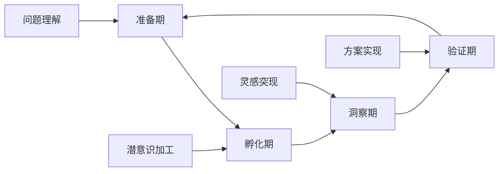

# 02 创新思维训练

## 📖 概述

- **定义**: 创新思维训练是通过系统化的方法和策略，培养学生发散思维、批判思维、创造性解决问题的综合能力训练体系
- **范围**: 涵盖创造力理论、思维方法、创新技法、问题解决、批判性思维等多个维度
- **学习目标**:
  - 理解创新思维的认知机制
  - 掌握多样化的创新思维方法
  - 培养创造性问题解决能力
  - 建立批判性思维习惯
- **先修知识**: [认知科学与学习理论](../01-哲学科学基础/01-认知科学与学习理论.md)、[逻辑学与批判性思维](../01-哲学科学基础/03-逻辑学与批判性思维.md)

## 🏗️ 知识架构

### 1. 理论基础

#### 1.1 创新思维类型

**🧠 思维模式分类**

| 思维类型 | 特征 | 应用场景 | 训练方法 |
|---------|------|----------|----------|
| **发散思维** | 多元联想 | 创意生成 | 头脑风暴 |
| **收敛思维** | 聚焦优化 | 方案选择 | 决策矩阵 |
| **批判思维** | 理性分析 | 质量评估 | 论证分析 |
| **系统思维** | 整体关联 | 复杂问题 | 系统图谱 |

#### 1.2 创新过程模型

**🔄 创新四阶段模型**

### 2. 实践应用

#### 2.1 创新方法工具

**🛠️ 经典创新技法**

| 技法名称 | 基本原理 | 操作步骤 | 适用情境 |
|---------|----------|----------|----------|
| **SCAMPER** | 检查清单 | 替代、组合、改编等 | 产品改进 |
| **六顶思考帽** | 角色思维 | 不同角度分析 | 团队决策 |
| **思维导图** | 放射联想 | 中心扩散 | 知识整理 |
| **强制关联** | 随机刺激 | 概念组合 | 创意激发 |

## 🔗 知识关联

### 内部链接

- [认知科学与学习理论](../01-哲学科学基础/01-认知科学与学习理论.md)
- [逻辑学与批判性思维](../01-哲学科学基础/03-逻辑学与批判性思维.md)

## 🎯 学习检验

### 自检问题

1. 创新思维的核心要素有哪些？
2. 如何系统化培养创造性思维？
3. 批判性思维与创新思维的关系？

---
*创造力培养 | 思维方法训练 | 问题解决能力*
