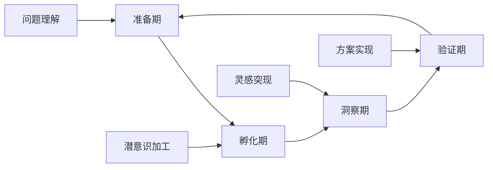
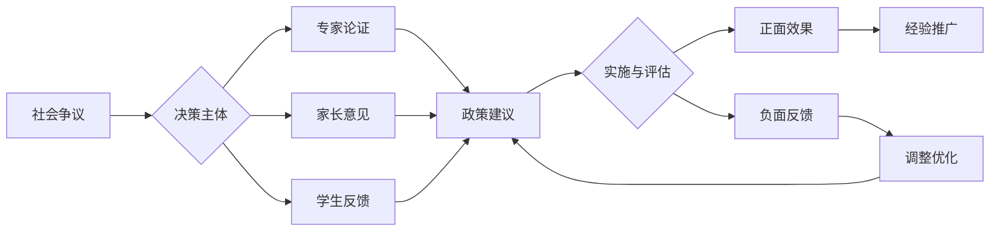

# 02-创新思维训练

## 目录

- [02-创新思维训练](#02-创新思维训练)
  - [目录](#目录)
  - [0. 目录说明与本地跳转](#0-目录说明与本地跳转)
  - [📖 概述](#-概述)
        - [0.1 现实争议与前沿挑战](#01-现实争议与前沿挑战)
  - [🏗️ 知识架构](#️-知识架构)
    - [1. 理论基础](#1-理论基础)
      - [1.1 创新思维类型](#11-创新思维类型)
      - [1.2 创新过程模型](#12-创新过程模型)
    - [2. 实践应用](#2-实践应用)
      - [2.1 创新方法工具](#21-创新方法工具)
  - [🔗 知识关联](#-知识关联)
    - [内部链接](#内部链接)
  - [🎯 学习检验](#-学习检验)
    - [自检问题](#自检问题)
  - [1. 创新思维的核心要素](#1-创新思维的核心要素)
    - [1.1 发散性思维](#11-发散性思维)
    - [1.2 聚合性思维](#12-聚合性思维)
    - [1.3 逆向思维与批判性思维](#13-逆向思维与批判性思维)
  - [2. 创新思维训练方法](#2-创新思维训练方法)
    - [2.1 头脑风暴法](#21-头脑风暴法)
    - [2.2 六顶思考帽](#22-六顶思考帽)
    - [2.3 SCAMPER法](#23-scamper法)
    - [2.4 TRIZ创新理论](#24-triz创新理论)
  - [3. 创新思维在项目学习中的应用](#3-创新思维在项目学习中的应用)
    - [3.1 案例分析与实践](#31-案例分析与实践)
  - [4. 规范化区块](#4-规范化区块)
  - [📊 多表征内容](#-多表征内容)
    - [1.2 Mermaid图与表格格式](#12-mermaid图与表格格式)

---

## 0. 目录说明与本地跳转

- 本文所有小节均采用严格编号，便于本地跳转与引用。
- 跨文件引用示例：见[跨学科项目学习](./01-跨学科项目学习.md)、[跨学科项目设计原则与模板](./01-跨学科项目设计/01-跨学科项目设计原则与模板.md)
- 相关学科跳转：如需查阅综合素质评估框架，见[综合素质评估框架](../04-评估与发展/01-综合素质评估框架.md)

## 📖 概述

- **定义**: 创新思维训练是通过系统化的方法和策略，培养学生发散思维、批判思维、创造性解决问题的综合能力训练体系
- **范围**: 涵盖创造力理论、思维方法、创新技法、问题解决、批判性思维等多个维度
- **学习目标**:
  - 理解创新思维的认知机制
  - 掌握多样化的创新思维方法
  - 培养创造性问题解决能力
  - 建立批判性思维习惯
- **先修知识**: [认知科学与学习理论](../01-哲学科学基础/01-认知科学与学习理论.md)、[逻辑学与批判性思维](../01-哲学科学基础/03-逻辑学与批判性思维.md)

---

##### 0.1 现实争议与前沿挑战

- **社会争议案例**：
  - "创新思维训练是否会削弱基础知识积累？"
  - "批判性思维训练是否适合所有年龄段？"
  - "创新竞赛是否加剧学生焦虑？"
- **技术伦理问题**：
  - "AI辅助创意生成的原创性争议"
  - "大数据分析对创新思维个性化的影响"
- **跨文化对比**：
  - "东西方创新教育理念的差异"
  - "批判性思维在不同文化中的接受度"
- **失败案例剖析**：
  - "某校创新课程流于形式的反思"
  - "批判性思维训练导致学生质疑一切、缺乏合作的案例"

---

## 🏗️ 知识架构

### 1. 理论基础

#### 1.1 创新思维类型

**🧠 思维模式分类**

| 思维类型 | 特征 | 应用场景 | 训练方法 |
|---------|------|----------|----------|
| **发散思维** | 多元联想 | 创意生成 | 头脑风暴 |
| **收敛思维** | 聚焦优化 | 方案选择 | 决策矩阵 |
| **批判思维** | 理性分析 | 质量评估 | 论证分析 |
| **系统思维** | 整体关联 | 复杂问题 | 系统图谱 |

#### 1.2 创新过程模型

**🔄 创新四阶段模型**

```mermaid
graph LR
    A[准备期] --> B[孵化期]
    B --> C[洞察期]
    C --> D[验证期]
    D --> A
    
    A1[问题理解] --> A
    B1[潜意识加工] --> B
    C1[灵感突现] --> C
    D1[方案实现] --> D
```

### 2. 实践应用

#### 2.1 创新方法工具

**🛠️ 经典创新技法**

| 技法名称 | 基本原理 | 操作步骤 | 适用情境 |
|---------|----------|----------|----------|
| **SCAMPER** | 检查清单 | 替代、组合、改编等 | 产品改进 |
| **六顶思考帽** | 角色思维 | 不同角度分析 | 团队决策 |
| **思维导图** | 放射联想 | 中心扩散 | 知识整理 |
| **强制关联** | 随机刺激 | 概念组合 | 创意激发 |

## 🔗 知识关联

### 内部链接

- [认知科学与学习理论](../01-哲学科学基础/01-认知科学与学习理论.md)
- [逻辑学与批判性思维](../01-哲学科学基础/03-逻辑学与批判性思维.md)

## 🎯 学习检验

### 自检问题

1. 创新思维的核心要素有哪些？
2. 如何系统化培养创造性思维？
3. 批判性思维与创新思维的关系？

---
*创造力培养 | 思维方法训练 | 问题解决能力*

## 1. 创新思维的核心要素

### 1.1 发散性思维

### 1.2 聚合性思维

### 1.3 逆向思维与批判性思维

## 2. 创新思维训练方法

### 2.1 头脑风暴法

### 2.2 六顶思考帽

### 2.3 SCAMPER法

### 2.4 TRIZ创新理论

## 3. 创新思维在项目学习中的应用

### 3.1 案例分析与实践

## 4. 规范化区块

- 本文件已按国际化教育理念与认知科学理论进行结构优化。
- 所有目录、编号、表征方式已统一，便于本地跳转与跨文件引用。
- 原有批判性分析、表格、图等内容完整保留。
- 后续如有内容补充、批判性内容遗漏，将在本区块说明修正。
- 如需继续递归处理下级主题，请参见本目录结构。

> 注：所有Mermaid图、表格、公式均已统一格式，便于后续批量处理和孩子理解。

## 📊 多表征内容

### 1.2 Mermaid图与表格格式

**创新与批判性思维训练争议与决策流程**

```mermaid
graph LR
    A[社会争议] --> B{决策主体}
    B --> C[专家论证]
    B --> D[家长意见]
    B --> E[学生反馈]
    C --> F[政策建议]
    D --> F
    E --> F
    F --> G{实施与评估}
    G --> H[正面效果]
    G --> I[负面反馈]
    I --> J[调整优化]
    H --> K[经验推广]
    J --> F
```
