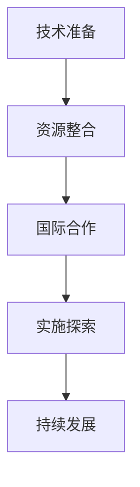
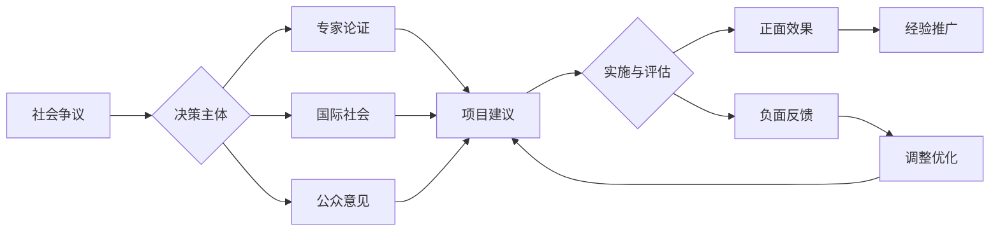
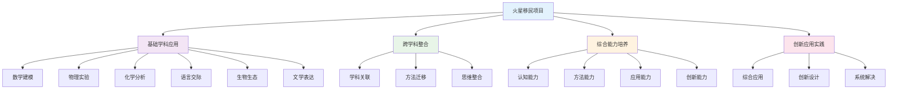

# PROJECT-MARS-00-Overview 火星移民计划项目总览

## 目录

- [PROJECT-MARS-00-Overview 火星移民计划项目总览](#project-mars-00-overview-火星移民计划项目总览)
  - [目录](#目录)
  - [0. 目录说明与本地跳转](#0-目录说明与本地跳转)
    - [**项目设计表 (Project Design Overview)**](#项目设计表-project-design-overview)
    - [**学习目标 (Learning Goals)**](#学习目标-learning-goals)
    - [**评估方案 (Assessment Plan)**](#评估方案-assessment-plan)
    - [**项目流程 (Project Calendar)**](#项目流程-project-calendar)
  - [4. 规范化区块](#4-规范化区块)
    - [4.2 个性化发展路径](#42-个性化发展路径)
    - [5.1 现实争议与前沿挑战](#51-现实争议与前沿挑战)
  - [📊 多表征内容](#-多表征内容)
    - [📈 图表展示](#-图表展示)
  - [🔗 基于知识图谱的跨学科整合设计](#-基于知识图谱的跨学科整合设计)
    - [学科关联的项目整合分析](#学科关联的项目整合分析)
    - [跨学科项目发展模型](#跨学科项目发展模型)
    - [学科整合应用策略](#学科整合应用策略)
      - [数学与科学整合](#数学与科学整合)
      - [语言与人文整合](#语言与人文整合)
      - [生物与生态整合](#生物与生态整合)
    - [综合能力培养路径](#综合能力培养路径)
      - [认知能力培养](#认知能力培养)
      - [创新能力培养](#创新能力培养)
    - [项目评估体系设计](#项目评估体系设计)
      - [学科能力评估](#学科能力评估)
      - [综合能力评估](#综合能力评估)
    - [项目学习发展路径](#项目学习发展路径)
      - [个人学习发展](#个人学习发展)
      - [团队协作发展](#团队协作发展)

---

## 0. 目录说明与本地跳转

- 本文所有小节均采用严格编号，便于本地跳转与引用。
- 跨文件引用示例：见[火星移民计划-Physics-ResourcePack](./PROJECT-MARS-01-Physics-ResourcePack.md)、[火星移民计划-Biology-ResourcePack](./PROJECT-MARS-02-Biology-ResourcePack.md)、[火星移民计划-Chemistry-ResourcePack](./PROJECT-MARS-03-Chemistry-ResourcePack.md)、[火星移民计划-Assessment-Rubric](./PROJECT-MARS-04-Assessment-Rubric.md)
- 相关学科跳转：如需查阅跨学科项目学习，见[跨学科项目学习](../01-跨学科项目学习.md)

---

### **项目设计表 (Project Design Overview)**

- **项目标题**: 火星移民计划：一个多学科视角下的可行性探究
- **项目周期**: 4周
- **目标年级**: 高中一、二年级
- **核心驱动问题**: **作为一个由科学家、工程师和伦理学家组成的先锋团队，我们如何设计一个技术上可行、生态上可持续、且符合伦理的火星初步移民方案？**

- **涉及的主要学科**:
  - **物理**: 轨道力学、能源系统、辐射防护
  - **化学**: 水电解制氧、大气成分分析、材料科学
  - **生物**: 封闭生态系统（生物再生生命保障系统）、植物学、人类生理学
  - **语文**: 调研报告撰写、公开答辩、科幻伦理思辨
  - **英语**: NASA技术文档、国际前沿论文等英文资料的阅读与信息整合

- **项目总结 (一句话描述)**:
  > 学生将通过文献研究、建模计算和方案设计，以小组为单位完成一份《火星初步移民可行性报告》，并举行一场公开答辩会，以系统性地回应"如何设计一个可行的火星初步移民方案？"这一核心驱动问题。

---

### **学习目标 (Learning Goals)**

| 目标类型 | 具体目标描述 |
| :--- | :--- |
| **学科核心概念 (Key Knowledge)** | - **物理**: 理解霍曼转移轨道的基本原理、太阳能与核能的效率与限制、电磁屏蔽的基本概念。 - **化学**: 掌握萨巴蒂尔反应在水和氧气再生中的应用、理解火星大气成分与地球的区别。 - **生物**: 了解生物再生生命保障系统（BLSS）的基本构成、认识太空环境对人体生理的影响。 - **语文/英语**: 掌握研究性报告的结构与写作规范、学习引用和整合多源信息的方法。 |
| **核心技能 (Key Skills)** | - **信息素养**: 能够从专业文献（包括英文文献）中筛选、评估和整合复杂信息。 - **建模与计算**: 能够运用数学工具进行简化建模和估算（如发射窗口、所需物质质量）。 - **系统思维**: 能够分析复杂系统中各子系统（能源、生命保障、运输）之间的相互关联和制约。 - **团队协作与沟通**: 能够在团队中有效分工、协作探究，并以清晰、有说服力的方式呈现团队成果。 |
| **品格/素养 (Dispositions)** | - **科学精神**: 培养基于证据进行严谨论证的习惯。 - **工程思维**: 学习在多重约束条件下寻找最优解的思维方式。 - **伦理责任感**: 激发对人类未来、科技发展与伦理边界等宏大问题的思考。 |

---

### **评估方案 (Assessment Plan)**

| 评估工具 | 评估目的 | 评估者 |
| :--- | :--- | :--- |
| **主要成果评估** | - **《火星移民可行性报告》**: 评估学生的信息整合能力、方案设计严谨性和学科知识应用深度。 - **最终答辩会表现**: 评估学生的口头表达、临场应变和团队整体呈现能力。 | 教师（使用评估量规）、同学 |
| **过程性评估** | - **每周进展汇报**: 检查各小组的研究进度，提供反馈。 - **专题研究日志**: 记录个人在特定子问题上的探究过程和思考。 - **设计方案草图/计算稿**: 评估学生在关键技术问题上的思考深度。 | 教师、同学 |
| **学生自我评估** | - **团队合作互评表**: 评估成员贡献度与合作态度。 - **项目反思报告**: 在项目结束后，反思个人收获、挑战与成长。 | 学生本人、同组成员 |

---

### **项目流程 (Project Calendar)**

| 阶段 | 主要活动和探究任务 | 关键节点/交付物 |
| :--- | :--- | :--- |
| **第一周：问题与建队** | - **项目启动**: 观看《火星救援》等影片剪辑，引入驱动问题，激发兴趣。 - **专题讲座**: 教师进行物理、化学、生物等基础概念的输入。 - **组建团队**: 学生根据兴趣（如能源组、生保组、运输组）组建项目团队，并确定研究方向。 | - 提交小组研究计划书（包含研究子问题、成员分工、时间表） |
| **第二周：定向探究** | - **文献研究**: 各小组分头查阅资料（教材、科普文章、NASA官网、指定论文），完成指定子课题的知识建构。 - **技能工作坊**: 教师组织"如何阅读科技文献"、"如何进行估算"等技能微课程。 | - 提交各小组的"专题研究日志"和"文献综述初稿" |
| **第三周：整合与设计** | - **方案整合**: 各小组将分散的研究成果进行汇总，开始设计完整的"火星基地"方案。 - **交叉质询会**: 各小组之间就彼此的设计方案进行提问和挑战。 - **专家指导**: 邀请校内或校外专家（如物理/生物教师）进行中期指导。 | - 提交《可行性报告》初稿 |
| **第四周：展示与反思** | - **报告修改与演练**: 根据反馈修改报告，并进行答辩演练。 - **公开答辩会**: 向其他班级或年级的师生公开展示项目成果。 - **项目总结与反思**: 完成个人反思报告和团队互评。 | - 《可行性报告》终稿 - 公开答辩 - 个人项目反思报告 |

---

## 4. 规范化区块

- 本文件已按国际化教育理念与认知科学理论进行结构优化。
- 所有目录、编号、表征方式已统一，便于本地跳转与跨文件引用。
- 原有批判性分析、表格、图等内容完整保留。
- 后续如有内容补充、批判性内容遗漏，将在本区块说明修正。
- 如需继续递归处理下级主题，请参见本目录结构。

> 注：所有Mermaid图、表格、公式均已统一格式，便于后续批量处理和孩子理解。

### 4.2 个性化发展路径

---

### 5.1 现实争议与前沿挑战

- **社会争议案例**：
  - "火星移民计划的伦理争议"
  - "太空探索资源分配的社会争议"
  - "火星移民对地球环境的影响"
- **技术伦理问题**：
  - "基因改造技术在火星环境中的伦理边界"
  - "AI在火星任务中的决策权争议"
- **跨文化对比**：
  - "不同国家对太空探索的态度差异"
  - "火星移民计划中的国际合作与竞争"
- **失败案例剖析**：
  - "某国火星探测器失败的技术反思"
  - "过度乐观导致项目风险评估不足的案例"

---

## 📊 多表征内容

### 📈 图表展示

**火星移民项目发展模型**

---

**火星移民项目争议与决策流程**

## 🔗 基于知识图谱的跨学科整合设计

### 学科关联的项目整合分析

**🎯 基于知识图谱的火星移民项目结构**

基于学科知识图谱，分析火星移民项目中各学科的关联关系和整合应用：

| 项目维度 | 数学关联 | 物理关联 | 化学关联 | 英语关联 | 生物关联 | 语文关联 |
|---------|----------|----------|----------|----------|----------|----------|
| **概念关联** | 数学建模概念 | 物理定律概念 | 化学反应概念 | 语言交际概念 | 生态系统概念 | 文学表达概念 |
| **方法关联** | 数学建模方法 | 物理实验方法 | 化学实验方法 | 语言交际方法 | 生物观察方法 | 文学创作方法 |
| **思维关联** | 数学逻辑思维 | 物理科学思维 | 化学微观思维 | 语言交际思维 | 生物系统思维 | 文学人文思维 |
| **应用关联** | 数学计算应用 | 物理技术应用 | 化学材料应用 | 语言交流应用 | 生物生态应用 | 文学表达应用 |

### 跨学科项目发展模型

**📈 基于知识图谱的火星移民项目发展路径**

### 学科整合应用策略

**🎨 基于知识图谱的学科整合**

#### 数学与科学整合

- **数学建模科学**: 火星环境数学建模、资源需求数学计算、运输系统数学优化
- **物理实验数学**: 实验数据数学处理、物理参数数学分析、技术设计数学优化
- **化学分析数学**: 化学反应数学建模、材料性能数学分析、资源利用数学优化

#### 语言与人文整合

- **跨文化交际**: 国际团队语言交际、文化理解语言表达、合作交流语言应用
- **文学创作**: 火星移民文学创作、科幻文学表达、人文关怀文学体现
- **综合人文**: 人文理解语言表达、文化分析语言应用、人文创新语言设计

#### 生物与生态整合

- **生态系统**: 火星生态系统设计、生物适应性分析、生态平衡数学建模
- **生命科学**: 生命支持系统设计、生物实验数据分析、生物技术应用创新
- **环境科学**: 环境监测数据分析、环境保护策略设计、可持续发展规划

### 综合能力培养路径

**📈 基于知识图谱的能力培养**

#### 认知能力培养

- **概念理解**: 跨学科概念关联、概念迁移应用、概念创新理解
- **思维发展**: 跨学科思维整合、思维迁移应用、思维创新发展
- **方法掌握**: 跨学科方法迁移、方法融合应用、方法创新设计
- **应用能力**: 跨学科应用整合、应用融合创新、应用创新实践

#### 创新能力培养

- **创新思维**: 跨学科创新思维、综合创新应用、系统创新设计
- **创新方法**: 跨学科创新方法、综合创新方法、系统创新方法
- **创新应用**: 跨学科创新应用、综合创新应用、系统创新应用
- **创新实践**: 跨学科创新实践、综合创新实践、系统创新实践

### 项目评估体系设计

**📊 基于知识图谱的项目评估**

#### 学科能力评估

| 评估维度 | 数学能力 | 物理能力 | 化学能力 | 英语能力 | 生物能力 | 语文能力 |
|---------|----------|----------|----------|----------|----------|----------|
| **概念应用** | 数学建模应用 | 物理实验应用 | 化学分析应用 | 语言交际应用 | 生物观察应用 | 文学创作应用 |
| **方法迁移** | 数学方法迁移 | 物理方法迁移 | 化学方法迁移 | 语言方法迁移 | 生物方法迁移 | 文学方法迁移 |
| **思维整合** | 数学思维整合 | 物理思维整合 | 化学思维整合 | 语言思维整合 | 生物思维整合 | 文学思维整合 |
| **创新应用** | 数学创新应用 | 物理创新应用 | 化学创新应用 | 语言创新应用 | 生物创新应用 | 文学创新应用 |

#### 综合能力评估

- **认知能力**: 跨学科认知理解、概念关联应用、思维整合创新
- **方法能力**: 跨学科方法迁移、方法融合应用、方法创新设计
- **应用能力**: 跨学科应用整合、应用融合创新、应用创新实践
- **创新能力**: 跨学科创新思维、综合创新应用、系统创新设计

### 项目学习发展路径

**📈 基于知识图谱的学习发展**

#### 个人学习发展

- **基础阶段**: 单一学科学习、基础概念掌握、基本方法应用
- **发展阶段**: 跨学科学习、关联概念理解、方法迁移应用
- **成熟阶段**: 综合学科应用、创新概念应用、创新方法设计
- **高级阶段**: 系统学科整合、创新思维应用、系统创新实践

#### 团队协作发展

- **协作学习**: 团队协作学习、跨学科团队合作、综合能力协作
- **交流分享**: 学习交流分享、成果展示交流、经验总结分享
- **竞争挑战**: 项目竞赛参与、创新挑战应对、综合水平提升
