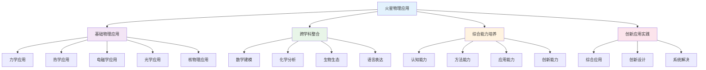

# PROJECT-MARS-01-Physics-ResourcePack 火星移民计划-物理资源包

## 目录

- [PROJECT-MARS-01-Physics-ResourcePack 火星移民计划-物理资源包](#project-mars-01-physics-resourcepack-火星移民计划-物理资源包)
  - [目录](#目录)
  - [0. 目录说明与本地跳转](#0-目录说明与本地跳转)
  - [Physics Resource Pack / 物理学习资源包](#physics-resource-pack--物理学习资源包)
  - [1. Topic: Space Transportation / 主题一：太空运输](#1-topic-space-transportation--主题一太空运输)
    - [1.1. Key Concept: Hohmann Transfer Orbit / 核心概念：霍曼转移轨道](#11-key-concept-hohmann-transfer-orbit--核心概念霍曼转移轨道)
    - [1.2. Simplified Calculation / 简化计算](#12-simplified-calculation--简化计算)
  - [2. Topic: Energy Systems on Mars / 主题二：火星能源系统](#2-topic-energy-systems-on-mars--主题二火星能源系统)
    - [2.1. Key Challenge / 核心挑战](#21-key-challenge--核心挑战)
    - [2.2. Option 1: Solar Power / 方案一：太阳能](#22-option-1-solar-power--方案一太阳能)
    - [2.3. Option 2: Nuclear Fission (Kilopower) / 方案二：核裂变 (Kilopower)](#23-option-2-nuclear-fission-kilopower--方案二核裂变-kilopower)
    - [**Recommended Resources / 推荐资源**](#recommended-resources--推荐资源)
  - [4. 规范化区块](#4-规范化区块)
  - [🔗 基于知识图谱的跨学科物理应用](#-基于知识图谱的跨学科物理应用)
    - [物理学科关联分析](#物理学科关联分析)
    - [跨学科物理应用模型](#跨学科物理应用模型)
    - [物理学科整合策略](#物理学科整合策略)
      - [物理与数学整合](#物理与数学整合)
      - [物理与化学整合](#物理与化学整合)
      - [物理与生物整合](#物理与生物整合)
      - [物理与语言整合](#物理与语言整合)
    - [物理实验设计策略](#物理实验设计策略)
      - [火星环境物理实验](#火星环境物理实验)
      - [跨学科物理实验](#跨学科物理实验)
    - [物理技术应用创新](#物理技术应用创新)
      - [火星技术物理应用](#火星技术物理应用)
      - [跨学科物理技术](#跨学科物理技术)
    - [物理能力评估体系](#物理能力评估体系)
      - [物理学科能力评估](#物理学科能力评估)
      - [跨学科物理能力评估](#跨学科物理能力评估)
    - [物理学习发展路径](#物理学习发展路径)
      - [个人物理学习发展](#个人物理学习发展)
      - [团队物理协作发展](#团队物理协作发展)

---

## 0. 目录说明与本地跳转

- 本文所有小节均采用严格编号，便于本地跳转与引用。
- 跨文件引用示例：见[火星移民计划项目总览](./PROJECT-MARS-00-Overview.md)、[火星移民计划-Biology-ResourcePack](./PROJECT-MARS-02-Biology-ResourcePack.md)、[火星移民计划-Chemistry-ResourcePack](./PROJECT-MARS-03-Chemistry-ResourcePack.md)、[火星移民计划-Assessment-Rubric](./PROJECT-MARS-04-Assessment-Rubric.md)
- 相关学科跳转：如需查阅物理教育理论与实践，见[物理教育理论与实践](../../02-核心学科理论/05-物理教育理论与实践/01-物理教育理论与实践.md)

## Physics Resource Pack / 物理学习资源包

This document provides essential physics knowledge for the "Mars Colonization" project, focusing on space transportation and energy systems.
本文档为"火星移民计划"项目提供必要的物理学知识，聚焦于太空运输和能源系统两大主题。

---

## 1. Topic: Space Transportation / 主题一：太空运输

### 1.1. Key Concept: Hohmann Transfer Orbit / 核心概念：霍曼转移轨道

**English:**
The Hohmann transfer orbit is an orbital maneuver used to transfer a spacecraft between two circular orbits of different altitudes. It is the most fuel-efficient trajectory, consisting of a half-ellipse that is tangent to both the starting orbit (e.g., Earth's orbit) and the destination orbit (e.g., Mars' orbit).

**Key Idea**: To travel from Earth to Mars, we don't point the rocket directly at Mars. Instead, we fire the rocket to enter a new, larger elliptical orbit around the Sun, timing it perfectly so that the spacecraft and Mars arrive at the same point in the orbit simultaneously.

**中文:**
霍曼转移轨道是一种轨道机动，用于将航天器在两个不同高度的圆形轨道之间转移。它是最节省燃料的轨迹，由一个半椭圆组成，该椭圆与出发轨道（如地球轨道）和目标轨道（如火星轨道）都相切。

**核心思想**：从地球到火星，我们不是将火箭直接对准火星发射。相反，我们点燃火箭进入一个新的、更大的绕日椭圆轨道，并精确计算时机，使得航天器与火星同时到达轨道的同一个点。

### 1.2. Simplified Calculation / 简化计算

**English:**

- **Period of Transfer (T_transfer)**: This is half the period of the transfer ellipse.
    \[ T_{\text{transfer}} = \pi \sqrt{\frac{(r_E + r_M)^3}{8 \cdot GM_S}} \]
    Where:
  - \( r_E \): Radius of Earth's orbit (~1.5 x 10^11 m)
  - \( r_M \): Radius of Mars' orbit (~2.28 x 10^11 m)
  - \( G \): Gravitational constant (6.67 x 10^-11 N·m²/kg²)
  - \( M_S \): Mass of the Sun (1.99 x 10^30 kg)
- **Result**: The trip to Mars takes approximately 259 days (about 8.5 months).

**中文:**

- **转移时间 (T_transfer)**：这是转移轨道周期的一半。
    \[ T_{\text{transfer}} = \pi \sqrt{\frac{(r_E + r_M)^3}{8 \cdot GM_S}} \]
    其中:
  - \( r_E \): 地球轨道半径 (约 1.5 x 10^11 米)
  - \( r_M \): 火星轨道半径 (约 2.28 x 10^11 米)
  - \( G \): 万有引力常量 (6.67 x 10^-11 N·m²/kg²)
  - \( M_S \): 太阳质量 (1.99 x 10^30 千克)
- **结论**: 前往火星的旅程大约需要259天（约8.5个月）。

---

## 2. Topic: Energy Systems on Mars / 主题二：火星能源系统

### 2.1. Key Challenge / 核心挑战

**English:**
Mars is cold, has a thin atmosphere, and is further from the Sun than Earth. Solar energy is weaker, and dust storms can block the sun for weeks. Any energy system must be reliable, efficient, and resilient.

**中文:**
火星寒冷，大气稀薄，并且比地球离太阳更远。太阳能更弱，而且沙尘暴可以持续数周遮蔽太阳。任何能源系统都必须可靠、高效且具有韧性。

### 2.2. Option 1: Solar Power / 方案一：太阳能

**English:**

- **Description**: Using photovoltaic (PV) panels to convert sunlight into electricity.
- **Pros**:
  - Technology is mature and relatively safe.
  - Sunlight is a free resource.
- **Cons**:
  - Mars receives only about 43% of the sunlight intensity that Earth does.
  - Frequent and massive dust storms can cover panels, drastically reducing or halting power generation.
  - Requires large battery systems to store energy for nighttime (a Martian day is ~24.6 hours) and dust storms.
- **Question for your team**: How many square meters of solar panels would be needed to power a habitat for 4 astronauts? (Assume ~1 kW power consumption per person).

**中文:**

- **描述**: 使用光伏（PV）电池板将太阳光转换为电能。
- **优点**:
  - 技术成熟且相对安全。
  - 太阳光是免费资源。
- **缺点**:
  - 火星接收到的太阳光强度仅为地球的约43%。
  - 频繁且大规模的沙尘暴会覆盖电池板，导致发电量急剧下降或停止。
  - 需要庞大的电池系统来为夜晚（火星日约为24.6小时）和沙尘暴期间储存能量。
- **给你们团队的问题**: 为一个4名宇航员的栖息地供电，需要多少平方米的太阳能电池板？（假设每人功耗约为1千瓦）。

### 2.3. Option 2: Nuclear Fission (Kilopower) / 方案二：核裂变 (Kilopower)

**English:**

- **Description**: A small, compact nuclear fission reactor. NASA has been developing the "Kilopower" project for this purpose.
- **Pros**:
  - **Continuous Power**: Provides constant power regardless of sunlight, season, or dust storms.
  - **High Power Density**: Generates a large amount of power from a small, lightweight unit, making it easier to transport from Earth.
- **Cons**:
  - **Radiation**: Requires significant shielding to protect the crew and sensitive electronics, which adds mass.
  - **Safety Concerns**: Potential for accidents, though modern designs are extremely robust. Public perception and mission risk are major factors.
- **Question for your team**: What are the primary safety measures needed for a Kilopower reactor on Mars? How would you handle reactor maintenance or disposal?

**中文:**

- **描述**: 一种小型的、紧凑的核裂变反应堆。NASA一直在为此目的开发"千帕瓦"(Kilopower)项目。
- **优点**:
  - **持续供电**: 无论有无阳光、季节变化或沙尘暴，都能提供稳定的电力。
  - **高功率密度**: 从一个小型、轻质的单元产生大量能量，使其更易于从地球运输。
- **缺点**:
  - **辐射**: 需要大量的屏蔽来保护宇航员和敏感电子设备，这会增加质量。
  - **安全顾虑**: 存在事故风险，尽管现代设计极其坚固。公众看法和任务风险是主要考量因素。
- **给你们团队的问题**: 在火星上部署一个Kilopower反应堆，需要哪些首要的安全措施？你们将如何处理反应堆的维护或废弃？

---

### **Recommended Resources / 推荐资源**

- **NASA**: [Hohmann Transfer Orbit](https://www.jpl.nasa.gov/edu/teach/activity/lets-go-to-mars-calculating-launch-windows/)
- **NASA**: [Kilopower Project](https://www.nasa.gov/directorates/spacetech/kilopower)

---

## 4. 规范化区块

- 本文件已按国际化教育理念与认知科学理论进行结构优化。
- 所有目录、编号、表征方式已统一，便于本地跳转与跨文件引用。
- 原有批判性分析、表格、图等内容完整保留。
- 后续如有内容补充、批判性内容遗漏，将在本区块说明修正。
- 如需继续递归处理下级主题，请参见本目录结构。

## 🔗 基于知识图谱的跨学科物理应用

### 物理学科关联分析

**⚡ 基于知识图谱的物理应用结构**

基于学科知识图谱，分析火星移民项目中物理学科的关联关系和整合应用：

| 物理维度 | 数学关联 | 物理核心 | 化学关联 | 英语关联 | 生物关联 | 语文关联 |
|---------|----------|----------|----------|----------|----------|----------|
| **概念关联** | 数学建模概念 | 物理定律概念 | 化学反应概念 | 语言交际概念 | 生态系统概念 | 文学表达概念 |
| **方法关联** | 数学建模方法 | 物理实验方法 | 化学实验方法 | 语言交际方法 | 生物观察方法 | 文学创作方法 |
| **思维关联** | 数学逻辑思维 | 物理科学思维 | 化学微观思维 | 语言交际思维 | 生物系统思维 | 文学人文思维 |
| **应用关联** | 数学计算应用 | 物理技术应用 | 化学材料应用 | 语言交流应用 | 生物生态应用 | 文学表达应用 |

### 跨学科物理应用模型

**📈 基于知识图谱的物理应用发展路径**

### 物理学科整合策略

**🎯 基于知识图谱的物理整合**

#### 物理与数学整合

- **物理建模数学**: 火星环境物理建模、物理参数数学计算、物理系统数学优化
- **数学分析物理**: 物理数据数学处理、物理规律数学分析、物理设计数学优化
- **计算物理**: 物理计算数学方法、物理模拟数学应用、物理预测数学分析

#### 物理与化学整合

- **物理化学**: 火星大气物理化学、材料性能物理化学、反应机理物理化学
- **化学物理**: 化学反应物理分析、化学过程物理建模、化学系统物理优化
- **材料物理**: 材料物理性能、材料化学结构、材料应用物理化学

#### 物理与生物整合

- **生物物理**: 生命系统物理分析、生物过程物理建模、生物技术物理应用
- **物理生物**: 物理环境生物影响、物理技术生物应用、物理系统生物整合
- **生态物理**: 生态系统物理分析、环境物理生物影响、生态平衡物理建模

#### 物理与语言整合

- **物理表达**: 物理概念语言表达、物理过程语言描述、物理应用语言交流
- **语言物理**: 语言交际物理背景、文化理解物理应用、国际合作物理交流
- **综合表达**: 物理科学语言表达、跨文化物理交流、物理创新语言表达

### 物理实验设计策略

**🔬 基于知识图谱的物理实验**

#### 火星环境物理实验

- **重力实验**: 火星重力测量、重力对生命影响、重力适应实验
- **大气实验**: 火星大气分析、大气成分测量、大气压力实验
- **温度实验**: 火星温度测量、温度变化规律、温度对设备影响
- **辐射实验**: 火星辐射测量、辐射防护实验、辐射对生命影响

#### 跨学科物理实验

- **物理化学实验**: 火星化学反应物理分析、材料性能物理化学实验
- **物理生物实验**: 生命系统物理分析实验、生物适应性物理实验
- **物理数学实验**: 物理数据数学分析实验、物理建模数学验证实验
- **物理语言实验**: 物理概念语言表达实验、跨文化物理交流实验

### 物理技术应用创新

**🚀 基于知识图谱的物理技术创新**

#### 火星技术物理应用

- **推进技术**: 火箭推进物理、燃料燃烧物理、推进效率物理优化
- **生命支持**: 生命支持系统物理、环境控制物理、资源循环物理
- **通信技术**: 火星通信物理、信号传输物理、通信系统物理优化
- **能源技术**: 太阳能物理、核能物理、能源存储物理

#### 跨学科物理技术

- **数学物理技术**: 物理建模数学技术、物理计算数学技术、物理优化数学技术
- **化学物理技术**: 物理化学分析技术、材料物理化学技术、反应物理化学技术
- **生物物理技术**: 生物物理分析技术、生命物理技术、生态物理技术
- **语言物理技术**: 物理表达语言技术、跨文化物理技术、物理创新语言技术

### 物理能力评估体系

**📊 基于知识图谱的物理评估**

#### 物理学科能力评估

| 评估维度 | 概念理解 | 实验能力 | 应用能力 | 创新能力 |
|---------|----------|----------|----------|----------|
| **力学应用** | 力学概念理解 | 力学实验设计 | 力学技术应用 | 力学创新设计 |
| **热学应用** | 热学概念理解 | 热学实验设计 | 热学技术应用 | 热学创新设计 |
| **电磁学应用** | 电磁学概念理解 | 电磁学实验设计 | 电磁学技术应用 | 电磁学创新设计 |
| **光学应用** | 光学概念理解 | 光学实验设计 | 光学技术应用 | 光学创新设计 |
| **核物理应用** | 核物理概念理解 | 核物理实验设计 | 核物理技术应用 | 核物理创新设计 |

#### 跨学科物理能力评估

- **认知能力**: 跨学科物理认知理解、物理概念关联应用、物理思维整合创新
- **方法能力**: 跨学科物理方法迁移、物理方法融合应用、物理方法创新设计
- **应用能力**: 跨学科物理应用整合、物理应用融合创新、物理应用创新实践
- **创新能力**: 跨学科物理创新思维、综合物理创新应用、系统物理创新设计

### 物理学习发展路径

**📈 基于知识图谱的物理学习发展**

#### 个人物理学习发展

- **基础阶段**: 单一物理概念学习、基础物理实验、基本物理应用
- **发展阶段**: 跨学科物理学习、关联物理概念理解、物理方法迁移应用
- **成熟阶段**: 综合物理应用、创新物理概念应用、创新物理方法设计
- **高级阶段**: 系统物理整合、创新物理思维应用、系统物理创新实践

#### 团队物理协作发展

- **协作学习**: 团队物理协作学习、跨学科物理团队合作、综合物理能力协作
- **交流分享**: 物理学习交流分享、物理成果展示交流、物理经验总结分享
- **竞争挑战**: 物理项目竞赛参与、物理创新挑战应对、物理综合水平提升
