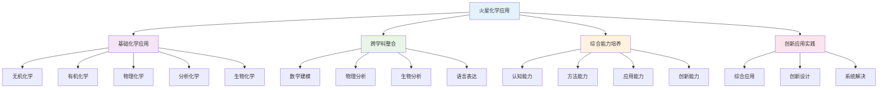

# PROJECT-MARS-03-Chemistry-ResourcePack 火星移民计划-化学资源包

## 目录

- [PROJECT-MARS-03-Chemistry-ResourcePack 火星移民计划-化学资源包](#project-mars-03-chemistry-resourcepack-火星移民计划-化学资源包)
  - [目录](#目录)
  - [0. 目录说明与本地跳转](#0-目录说明与本地跳转)
  - [Chemistry Resource Pack / 化学学习资源包](#chemistry-resource-pack--化学学习资源包)
  - [1. Topic: In-Situ Resource Utilization (ISRU) / 主题一：就地资源利用](#1-topic-in-situ-resource-utilization-isru--主题一就地资源利用)
    - [1.1. Key Concept: ISRU / 核心概念：ISRU](#11-key-concept-isru--核心概念isru)
    - [1.2. Core Technology: MOXIE \& Sabatier Reaction / 核心技术：MOXIE 和萨巴蒂尔反应](#12-core-technology-moxie--sabatier-reaction--核心技术moxie-和萨巴蒂尔反应)
  - [2. Topic: Martian Soil Chemistry / 主题二：火星土壤化学](#2-topic-martian-soil-chemistry--主题二火星土壤化学)
    - [2.1. Composition of Martian Regolith / 火星风化层的成分](#21-composition-of-martian-regolith--火星风化层的成分)
    - [2.2. Application: Making Bricks on Mars / 应用：在火星上制造砖块](#22-application-making-bricks-on-mars--应用在火星上制造砖块)
    - [**Recommended Resources / 推荐资源**](#recommended-resources--推荐资源)
  - [4. 规范化区块](#4-规范化区块)
  - [🔗 基于知识图谱的跨学科化学应用](#🔗-基于知识图谱的跨学科化学应用)
    - [化学学科关联分析](#化学学科关联分析)
    - [跨学科化学应用模型](#跨学科化学应用模型)
    - [化学学科整合策略](#化学学科整合策略)
    - [化学实验设计策略](#化学实验设计策略)
    - [化学技术应用创新](#化学技术应用创新)
    - [化学能力评估体系](#化学能力评估体系)
    - [化学学习发展路径](#化学学习发展路径)

---

## 0. 目录说明与本地跳转

- 本文所有小节均采用严格编号，便于本地跳转与引用。
- 跨文件引用示例：见[火星移民计划项目总览](./PROJECT-MARS-00-Overview.md)、[火星移民计划-Physics-ResourcePack](./PROJECT-MARS-01-Physics-ResourcePack.md)、[火星移民计划-Biology-ResourcePack](./PROJECT-MARS-02-Biology-ResourcePack.md)、[火星移民计划-Assessment-Rubric](./PROJECT-MARS-04-Assessment-Rubric.md)
- 相关学科跳转：如需查阅化学教育理论与实践，见[化学教育理论与实践](../../02-核心学科理论/06-化学教育理论与实践/01-化学教育理论与实践.md)

## Chemistry Resource Pack / 化学学习资源包

This document provides essential chemistry knowledge for the "Mars Colonization" project, focusing on resource regeneration and materials science on Mars.
本文档为"火星移民计划"项目提供必要的化学知识，聚焦于火星上的物质再生和材料科学。

---

## 1. Topic: In-Situ Resource Utilization (ISRU) / 主题一：就地资源利用

### 1.1. Key Concept: ISRU / 核心概念：ISRU

**English:**
ISRU is the practice of collecting, processing, and using materials found or manufactured on another celestial body (like Mars) to replace materials that would otherwise be brought from Earth. The primary goal is to reduce the mass, cost, and risk of space missions. The most critical ISRU process for Mars is generating oxygen and water.

**Key Idea**: Living off the land. Instead of packing everything for a multi-year trip, we use local Martian resources to produce what we need.

**中文:**
ISRU（就地资源利用）是指收集、处理和使用在其他天体（如火星）上发现或制造的材料，以取代那些原本需要从地球带来的物资。其主要目标是降低航天任务的质量、成本和风险。对火星而言，最关键的ISRU过程是生产氧气和水。

**核心思想**："靠山吃山"。我们利用火星本地的资源来生产所需品，而不是为长达数年的旅程打包所有东西。

### 1.2. Core Technology: MOXIE & Sabatier Reaction / 核心技术：MOXIE 和萨巴蒂尔反应

**English:**
**1. MOXIE (Mars Oxygen In-Situ Resource Utilization Experiment)**

- **Purpose**: To produce oxygen directly from the Martian atmosphere.
- **Process**: It's essentially reverse fuel cell. MOXIE pulls in the Martian air (which is 95% CO₂), heats it to ~800°C, and uses solid oxide electrolysis to split CO₂ molecules into oxygen (O₂) and carbon monoxide (CO).
    \[ 2\text{CO}_2 \rightarrow 2\text{CO} + \text{O}_2 \]
- **Significance**: NASA's Perseverance rover has already successfully tested MOXIE on Mars, proving this technology works. The generated oxygen can be used for breathing and as a rocket propellant oxidizer for the return trip.

**2. The Sabatier Reaction**

- **Purpose**: To produce water (H₂O) and methane (CH₄).
- **Process**: This reaction combines carbon dioxide (from the Martian atmosphere) with hydrogen (which must be brought from Earth) over a catalyst at high temperatures and pressures.
    \[ \text{CO}_2 + 4\text{H}_2 \rightarrow \text{CH}_4 + 2\text{H}_2\text{O} \]
- **Significance**: This is a powerful two-for-one deal. It produces water, which can be used for drinking, growing plants, or split into oxygen (for breathing) and hydrogen (which can be recycled back into the Sabatier reactor). It also produces methane, a key rocket fuel component.

**中文:**
**1. MOXIE（火星氧气就地资源利用实验）**

- **目的**：直接从火星大气中生产氧气。
- **过程**：它本质上是一个逆向的燃料电池。MOXIE吸入火星空气（其中95%是CO₂），将其加热到约800°C，并使用固体氧化物电解技术将CO₂分子分解成氧气（O₂）和一氧化碳（CO）。
    \[ 2\text{CO}_2 \rightarrow 2\text{CO} + \text{O}_2 \]
- **意义**：NASA的"毅力号"火星车已经成功在火星上测试了MOXIE，证明了这项技术的可行性。生产的氧气可用于呼吸，以及作为返程火箭的推进剂氧化剂。

**2. 萨巴蒂尔反应 (The Sabatier Reaction)**

- **目的**：生产水（H₂O）和甲烷（CH₄）。
- **过程**：该反应在高温高压和催化剂作用下，将二氧化碳（来自火星大气）与氢气（必须从地球带来）结合。
    \[ \text{CO}_2 + 4\text{H}_2 \rightarrow \text{CH}_4 + 2\text{H}_2\text{O} \]
- **意义**：这是一笔强大的"一举两得"的交易。它生产了水，水可以用来饮用、种植植物，或被电解成氧气（用于呼吸）和氢气（可被回收至萨巴蒂尔反应器中）。它还生产了甲烷，一个关键的火箭燃料组分。

---

## 2. Topic: Martian Soil Chemistry / 主题二：火星土壤化学

### 2.1. Composition of Martian Regolith / 火星风化层的成分

**English:**
Martian soil, or regolith, is very different from Earth's soil.

- **Primary Components**: It's mainly composed of silicon oxides and iron oxides (which give Mars its red color).
- **Key Challenge - Perchlorates (e.g., Mg(ClO₄)₂)**: The soil contains a significant amount of perchlorate salts. These are toxic to humans and most microbes. They must be removed before the soil can be used for agriculture.
- **Water Ice**: Large amounts of water ice are frozen in the soil, especially near the poles. This is a critical resource.
- **Lack of Organics**: Unlike Earth's soil, it contains virtually no organic matter (the decomposed remains of living things).

**中文:**
火星土壤，或称风化层，与地球土壤截然不同。

- **主要成分**：它主要由氧化硅和氧化铁（这使火星呈现红色）组成。
- **核心挑战 - 高氯酸盐（如 Mg(ClO₄)₂）**：土壤中含有大量的高氯酸盐。这些物质对人类和大多数微生物都有毒。在将土壤用于农业之前，必须将其移除。
- **水冰**：大量的固态水冰被冻结在土壤中，尤其是在极地附近。这是一个至关重要的资源。
- **缺乏有机物**：与地球土壤不同，它几乎不含有机物（生物分解后的残留物）。

### 2.2. Application: Making Bricks on Mars / 应用：在火星上制造砖块

**English:**

- **Problem**: Transporting building materials from Earth is extremely expensive. We need to build habitats using local materials.
- **Solution**: Researchers have found that Martian regolith simulant can be compressed under high pressure to form strong, stable bricks, without needing an oven or any binding additives. The sharp, angular shape of the regolith particles allows them to interlock tightly. This could be a simple and low-energy way to build structures on Mars.
- **Question for your team**: What are the advantages of this compression method compared to traditional Earth-based brick-making (which involves baking clay)? What tests would you need to run on these Martian bricks to ensure they are safe for building a habitat?

**中文:**

- **问题**：从地球运输建筑材料极其昂贵。我们需要用当地材料来建造栖息地。
- **解决方案**：研究人员发现，模拟的火星风化层可以在高压下被压缩成坚固、稳定的砖块，而无需烤箱或任何粘合添加剂。风化层颗粒的尖锐、有棱角的形状使它们能够紧密地互锁。这可能是在火星上建造结构的一种简单、低能耗的方法。
- **给你们团队的问题**：与传统的地球制砖方法（涉及烘烤粘土）相比，这种压缩法有什么优势？你需要对这些火星砖进行哪些测试，以确保它们用于建造栖息地是安全的？

---

### **Recommended Resources / 推荐资源**

- **NASA**: [MOXIE Instrument](https://mars.nasa.gov/mars2020/spacecraft/instruments/moxie/)
- **Article**: [Making Bricks on Mars Could Be This Simple (Universe Today)](https://www.universetoday.com/133744/making-bricks-mars-simple/)
- **Video**: [Where will we get water, oxygen and fuel on Mars? (TEDx)](https://www.youtube.com/watch?v=s-9G8a8i7iY)

---

## 4. 规范化区块

- 本文件已按国际化教育理念与认知科学理论进行结构优化。
- 所有目录、编号、表征方式已统一，便于本地跳转与跨文件引用。
- 原有批判性分析、表格、图等内容完整保留。
- 后续如有内容补充、批判性内容遗漏，将在本区块说明修正。
- 如需继续递归处理下级主题，请参见本目录结构。

## 🔗 基于知识图谱的跨学科化学应用

### 化学学科关联分析

**⚗️ 基于知识图谱的化学应用结构**

基于学科知识图谱，分析火星移民项目中化学学科的关联关系和整合应用：

| 化学维度 | 数学关联 | 物理关联 | 化学核心 | 英语关联 | 生物关联 | 语文关联 |
|---------|----------|----------|----------|----------|----------|----------|
| **概念关联** | 数学建模概念 | 物理定律概念 | 化学反应概念 | 语言交际概念 | 生态系统概念 | 文学表达概念 |
| **方法关联** | 数学建模方法 | 物理实验方法 | 化学实验方法 | 语言交际方法 | 生物观察方法 | 文学创作方法 |
| **思维关联** | 数学逻辑思维 | 物理科学思维 | 化学微观思维 | 语言交际思维 | 生物系统思维 | 文学人文思维 |
| **应用关联** | 数学计算应用 | 物理技术应用 | 化学材料应用 | 语言交流应用 | 生物生态应用 | 文学表达应用 |

### 跨学科化学应用模型

**📈 基于知识图谱的化学应用发展路径**

### 化学学科整合策略

**🎯 基于知识图谱的化学整合**

#### 化学与数学整合
- **化学建模数学**: 化学反应数学建模、化学过程数学计算、化学系统数学优化
- **数学分析化学**: 化学数据数学处理、化学规律数学分析、化学设计数学优化
- **计算化学**: 化学计算数学方法、化学模拟数学应用、化学预测数学分析

#### 化学与物理整合
- **物理化学**: 化学过程物理分析、化学反应物理建模、化学技术物理应用
- **化学物理**: 物理过程化学分析、物理技术化学应用、物理系统化学整合
- **材料化学**: 材料化学性能、材料物理化学、材料应用化学物理

#### 化学与生物整合
- **生物化学**: 生物化学反应、生物分子化学、生物代谢化学
- **化学生物**: 化学物质生物影响、化学反应生物应用、化学系统生物整合
- **分子化学**: 分子化学、生物分子化学、分子化学技术

#### 化学与语言整合
- **化学表达**: 化学概念语言表达、化学过程语言描述、化学应用语言交流
- **语言化学**: 语言交际化学背景、文化理解化学应用、国际合作化学交流
- **综合表达**: 化学科学语言表达、跨文化化学交流、化学创新语言表达

### 化学实验设计策略

**🔬 基于知识图谱的化学实验**

#### 火星环境化学实验
- **大气实验**: 火星大气化学分析、大气成分化学测量、大气反应化学实验
- **土壤实验**: 火星土壤化学分析、土壤成分化学测量、土壤反应化学实验
- **水实验**: 火星水化学分析、水成分化学测量、水反应化学实验
- **材料实验**: 火星材料化学分析、材料性能化学测量、材料反应化学实验

#### 跨学科化学实验
- **化学物理实验**: 化学反应物理分析、化学过程物理实验
- **化学生物实验**: 化学物质生物影响实验、化学反应生物实验
- **化学数学实验**: 化学数据数学分析实验、化学建模数学验证实验
- **化学语言实验**: 化学概念语言表达实验、跨文化化学交流实验

### 化学技术应用创新

**⚗️ 基于知识图谱的化学技术创新**

#### 火星化学技术应用
- **材料技术**: 火星材料化学技术、材料性能化学、材料应用化学
- **能源技术**: 火星能源化学技术、燃料化学、能源存储化学
- **生命支持**: 生命支持系统化学、环境控制化学、资源循环化学
- **环境技术**: 火星环境化学技术、环境监测化学、环境修复化学

#### 跨学科化学技术
- **数学化学技术**: 化学建模数学技术、化学计算数学技术、化学优化数学技术
- **物理化学技术**: 化学物理分析技术、材料化学物理技术、反应化学物理技术
- **生物化学技术**: 化学生物分析技术、分子化学技术、代谢化学技术
- **语言化学技术**: 化学表达语言技术、跨文化化学技术、化学创新语言技术

### 化学能力评估体系

**📊 基于知识图谱的化学评估**

#### 化学学科能力评估
| 评估维度 | 概念理解 | 实验能力 | 应用能力 | 创新能力 |
|---------|----------|----------|----------|----------|
| **无机化学** | 无机概念理解 | 无机实验设计 | 无机技术应用 | 无机创新设计 |
| **有机化学** | 有机概念理解 | 有机实验设计 | 有机技术应用 | 有机创新设计 |
| **物理化学** | 物理化学概念理解 | 物理化学实验设计 | 物理化学技术应用 | 物理化学创新设计 |
| **分析化学** | 分析概念理解 | 分析实验设计 | 分析技术应用 | 分析创新设计 |
| **生物化学** | 生物化学概念理解 | 生物化学实验设计 | 生物化学技术应用 | 生物化学创新设计 |

#### 跨学科化学能力评估
- **认知能力**: 跨学科化学认知理解、化学概念关联应用、化学思维整合创新
- **方法能力**: 跨学科化学方法迁移、化学方法融合应用、化学方法创新设计
- **应用能力**: 跨学科化学应用整合、化学应用融合创新、化学应用创新实践
- **创新能力**: 跨学科化学创新思维、综合化学创新应用、系统化学创新设计

### 化学学习发展路径

**📈 基于知识图谱的化学学习发展**

#### 个人化学学习发展
- **基础阶段**: 单一化学概念学习、基础化学实验、基本化学应用
- **发展阶段**: 跨学科化学学习、关联化学概念理解、化学方法迁移应用
- **成熟阶段**: 综合化学应用、创新化学概念应用、创新化学方法设计
- **高级阶段**: 系统化学整合、创新化学思维应用、系统化学创新实践

#### 团队化学协作发展
- **协作学习**: 团队化学协作学习、跨学科化学团队合作、综合化学能力协作
- **交流分享**: 化学学习交流分享、化学成果展示交流、化学经验总结分享
- **竞争挑战**: 化学项目竞赛参与、化学创新挑战应对、化学综合水平提升
