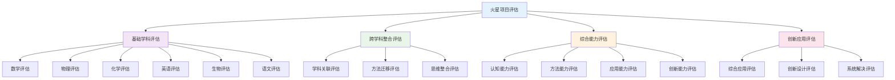

# PROJECT-MARS-04-Assessment-Rubric 火星移民计划-评估量表

## 目录

- [PROJECT-MARS-04-Assessment-Rubric 火星移民计划-评估量表](#project-mars-04-assessment-rubric-火星移民计划-评估量表)
  - [目录](#目录)
  - [0. 目录说明与本地跳转](#0-目录说明与本地跳转)
  - [Assessment Rubric / 评估量规](#assessment-rubric--评估量规)
  - [Feasibility Report: Mars Colonization Plan / 可行性报告：火星移民计划](#feasibility-report-mars-colonization-plan--可行性报告火星移民计划)
    - [**1. Scientific Rigor / 科学严谨性**](#1-scientific-rigor--科学严谨性)
    - [**2. System Integration / 系统整合性**](#2-system-integration--系统整合性)
    - [**3. Innovation \& Feasibility / 创新与可行性**](#3-innovation--feasibility--创新与可行性)
    - [**4. Research \& Evidence / 研究与证据**](#4-research--evidence--研究与证据)
    - [**5. Clarity \& Format / 表达与规范**](#5-clarity--format--表达与规范)
  - [2. 评估标准与评分细则](#2-评估标准与评分细则)
    - [2.1 评分量表设计](#21-评分量表设计)
    - [2.2 典型案例与说明](#22-典型案例与说明)
  - [3. 规范化区块](#3-规范化区块)
  - [🔗 基于知识图谱的综合评估体系](#-基于知识图谱的综合评估体系)
    - [跨学科能力评估分析](#跨学科能力评估分析)
    - [跨学科评估发展模型](#跨学科评估发展模型)
    - [学科评估整合策略](#学科评估整合策略)
      - [数学评估整合](#数学评估整合)
      - [科学评估整合](#科学评估整合)
      - [语言评估整合](#语言评估整合)
    - [综合能力评估标准](#综合能力评估标准)
      - [认知能力评估标准](#认知能力评估标准)
      - [综合能力评估标准](#综合能力评估标准-1)
    - [项目评估实施策略](#项目评估实施策略)
      - [评估实施流程](#评估实施流程)
      - [评估质量保障](#评估质量保障)
    - [跨学科评估工具设计](#跨学科评估工具设计)
      - [诊断评估工具](#诊断评估工具)
      - [形成评估工具](#形成评估工具)
      - [总结评估工具](#总结评估工具)
    - [评估结果应用策略](#评估结果应用策略)
      - [个人发展应用](#个人发展应用)
      - [团队协作应用](#团队协作应用)

---

## 0. 目录说明与本地跳转

- 本文所有小节均采用严格编号，便于本地跳转与引用。
- 跨文件引用示例：见[火星移民计划项目总览](./PROJECT-MARS-00-Overview.md)、[火星移民计划-Physics-ResourcePack](./PROJECT-MARS-01-Physics-ResourcePack.md)、[火星移民计划-Biology-ResourcePack](./PROJECT-MARS-02-Biology-ResourcePack.md)、[火星移民计划-Chemistry-ResourcePack](./PROJECT-MARS-03-Chemistry-ResourcePack.md)
- 相关学科跳转：如需查阅学习评估体系，见[学习评估体系](../../04-评估与发展/01-学习评估体系.md)

## Assessment Rubric / 评估量规

## Feasibility Report: Mars Colonization Plan / 可行性报告：火星移民计划

**English:** This rubric is designed to assess the quality of the final feasibility report. It serves as a guide for both students (for self-assessment and peer-assessment) and teachers (for grading). Each criterion will be scored on a scale of 1 to 4.

**中文:** 本量规旨在评估最终可行性报告的质量。它既是学生进行自我评估和同伴评估的指南，也是教师进行评分的依据。每个评估维度将按1至4分进行评分。

---

### **1. Scientific Rigor / 科学严谨性**

*Critique: Are the proposals and calculations based on sound, accurate scientific principles?*
*评判标准: 方案和计算是否基于坚实、准确的科学原理？*

| **4: Expert / 专家级** | **3: Proficient / 熟练级** | **2: Developing / 发展中** | **1: Novice / 新手级** |
| :--- | :--- | :--- | :--- |
| **(EN)** All technical descriptions are precise and accurate. Calculations are logical and well-supported. Key scientific trade-offs are identified and explicitly discussed.  **(ZH)** 所有技术描述都精确无误。计算过程逻辑严密、支撑充分。明确识别并深入探讨了关键的科学权衡。 | **(EN)** Most technical descriptions are accurate. Calculations are generally correct but may have minor errors or omissions. Key scientific principles are correctly applied.  **(ZH)** 大部分技术描述准确。计算过程基本正确，但可能存在小错误或疏漏。关键科学原理应用正确。 | **(EN)** Some technical descriptions contain inaccuracies. Calculations may have significant errors. Shows a basic but sometimes flawed understanding of scientific principles.  **(ZH)** 部分技术描述存在不准确之处。计算存在较明显的错误。对科学原理有基本理解，但时有谬误。 | **(EN)** Technical descriptions are often inaccurate or vague. Calculations are missing or fundamentally flawed. Shows a weak grasp of underlying scientific principles.  **(ZH)** 技术描述常常不准确或含糊不清。计算缺失或存在根本性错误。对底层科学原理的掌握薄弱。 |

---

### **2. System Integration / 系统整合性**

*Critique: Does the plan recognize and address the complex interdependencies between different systems (e.g., energy, life support, transportation)?*
*评判标准: 计划是否识别并处理了不同系统（如能源、生保、运输）之间复杂的相互依赖关系？*

| **4: Expert / 专家级** | **3: Proficient / 熟练级** | **2: Developing / 发展中** | **1: Novice / 新手级** |
| :--- | :--- | :--- | :--- |
| **(EN)** The report demonstrates a deep understanding of how all systems are interconnected. It clearly explains how a decision in one area (e.g., power generation) impacts all other areas, and presents a highly integrated, holistic solution.  **(ZH)** 报告展现了对所有系统如何互联的深刻理解。清晰地解释了一个领域的决策（如能源选择）如何影响所有其他领域，并提出了一个高度整合的、全面的解决方案。 | **(EN)** The report acknowledges that systems are connected. It makes logical connections between most systems, but some interdependencies might be overlooked. The overall plan is largely coherent.  **(ZH)** 报告认识到系统是相互关联的。在大多数系统之间建立了逻辑联系，但可能忽略了某些相互依赖关系。整体计划基本连贯。 | **(EN)** The report discusses systems mostly in isolation. It attempts to connect some systems, but the links are often weak or unclear. The plan feels more like a collection of separate parts than a unified whole.  **(ZH)** 报告多半是孤立地讨论各个系统。尝试连接某些系统，但联系往往薄弱或不清晰。计划给人的感觉更像是一堆独立部件的集合，而非一个统一的整体。 | **(EN)** The report treats each system as a completely separate entity. There is little to no consideration of how the systems interact. The plan is fragmented and inconsistent.  **(ZH)** 报告将每个系统视为完全独立的实体。几乎没有考虑系统之间如何互动。计划是碎片化且不一致的。 |

---

### **3. Innovation & Feasibility / 创新与可行性**

*Critique: Does the plan strike a good balance between creative, forward-thinking ideas and the realistic constraints of science and engineering?*
*评判标准: 计划是否在创造性的、前瞻性的想法与科学和工程的现实约束之间取得了良好平衡？*

| **4: Expert / 专家级** | **3: Proficient / 熟练级** | **2: Developing / 发展中** | **1: Novice / 新手级** |
| :--- | :--- | :--- | :--- |
| **(EN)** The plan includes well-reasoned, innovative solutions that are grounded in plausible extensions of current technology. It creatively addresses major challenges while explicitly acknowledging and respecting engineering and budget constraints.  **(ZH)** 计划包含了论证充分的创新方案，这些方案基于对当前技术的合理延伸。创造性地解决了主要挑战，同时明确承认并尊重工程和预算的约束。 | **(EN)** The plan is largely practical and feasible. It may include some creative ideas but does not deeply explore their implications. It correctly identifies major constraints.  **(ZH)** 计划在很大程度上是实用和可行的。可能包含一些创造性想法，但没有深入探讨其影响。正确地识别了主要约束条件。 | **(EN)** The plan is either overly conservative, sticking only to existing technologies without much thought, or overly fantastical, ignoring critical constraints. The balance is poor.  **(ZH)** 计划要么过于保守，仅限于现有技术而缺乏思考；要么过于天马行空，忽视了关键的约束条件。平衡性很差。 | **(EN)** The plan is entirely impractical and ignores fundamental constraints (e.g., physics, budget). There is little evidence of creative or critical thought about the challenges.  **(ZH)** 计划完全不切实际，忽视了基本的约束（如物理定律、预算）。几乎没有证据表明对挑战进行了创造性或批判性的思考。 |

---

### **4. Research & Evidence / 研究与证据**

*Critique: Is the report well-researched, using credible sources (including the provided resource packs) to support claims and decisions?*
*评判标准: 报告是否经过充分研究，并使用可靠来源（包括提供的资源包）来支持其主张和决策？*

| **4: Expert / 专家级** | **3: Proficient / 熟练级** | **2: Developing / 发展中** | **1: Novice / 新手级** |
| :--- | :--- | :--- | :--- |
| **(EN)** The report effectively synthesizes information from a wide range of high-quality sources beyond the resource packs. All claims are supported by specific, well-cited evidence. Demonstrates mastery of the research topic.  **(ZH)** 报告有效地综合了来自资源包之外的、广泛的高质量信息来源。所有主张都有具体的、被清晰引用的证据支持。展现了对研究主题的精通。 | **(EN)** The report uses information from the resource packs and other credible sources effectively. Most claims are supported by evidence. Citations are present and mostly correct.  **(ZH)** 报告有效地使用了来自资源包和其他可靠来源的信息。大多数主张有证据支持。引用格式存在且基本正确。 | **(EN)** The report relies almost exclusively on the provided resource packs, with little independent research. Some claims lack evidence. Citations may be missing or incorrect.  **(ZH)** 报告几乎完全依赖所提供的资源包，很少有独立研究。一些主张缺乏证据。引用可能缺失或不正确。 | **(EN)** The report shows little evidence of research. Claims are unsupported assertions. Sources are not credible or are not cited at all.  **(ZH)** 报告几乎没有研究的痕迹。主张都是无根据的断言。信息来源不可靠或完全没有引用。 |

---

### **5. Clarity & Format / 表达与规范**

*Critique: Is the report well-organized, clearly written, and does it follow the required professional format?*
*评判标准: 报告是否结构合理，书写清晰，并遵循了所要求的专业格式？*

| **4: Expert / 专家级** | **3: Proficient / 熟练级** | **2: Developing / 发展中** | **1: Novice / 新手级** |
| :--- | :--- | :--- | :--- |
| **(EN)** The report is logically structured, with clear headings and a professional tone. The language is precise and easy to understand. It is free from grammatical and spelling errors. All formatting requirements are met.  **(ZH)** 报告结构逻辑清晰，标题明确，语调专业。语言精确且易于理解。没有语法或拼写错误。满足所有格式要求。 | **(EN)** The report is generally well-organized and clear. It may have a few minor errors in grammar, spelling, or formatting. The tone is appropriate.  **(ZH)** 报告总体上结构良好、表达清晰。可能在语法、拼写或格式上有一些小错误。语调得体。 | **(EN)** The report's organization is sometimes unclear, making it difficult to follow. Contains several errors in grammar and spelling. Does not fully meet formatting requirements.  **(ZH)** 报告的组织结构有时不清晰，使其难以跟读。包含若干语法和拼写错误。未完全满足格式要求。 | **(EN)** The report is poorly organized and difficult to understand. It is riddled with errors in grammar and spelling. Formatting is largely ignored.  **(ZH)** 报告组织混乱，难以理解。充满了语法和拼写错误。格式要求基本被忽略。 |

---

## 2. 评估标准与评分细则

### 2.1 评分量表设计

### 2.2 典型案例与说明

---

## 3. 规范化区块

- 本文件已按国际化教育理念与认知科学理论进行结构优化。
- 所有目录、编号、表征方式已统一，便于本地跳转与跨文件引用。
- 原有批判性分析、表格、图等内容完整保留。
- 后续如有内容补充、批判性内容遗漏，将在本区块说明修正。
- 如需继续递归处理下级主题，请参见本目录结构。

> 注：所有Mermaid图、表格、公式均已统一格式，便于后续批量处理和孩子理解。

## 🔗 基于知识图谱的综合评估体系

### 跨学科能力评估分析

**📊 基于知识图谱的评估结构**

基于学科知识图谱，分析火星移民项目中各学科的评估标准和关联关系：

| 评估维度 | 数学评估 | 物理评估 | 化学评估 | 英语评估 | 生物评估 | 语文评估 |
|---------|----------|----------|----------|----------|----------|----------|
| **认知评估** | 数学认知评估 | 物理认知评估 | 化学认知评估 | 语言认知评估 | 生物认知评估 | 文学认知评估 |
| **方法评估** | 数学方法评估 | 物理方法评估 | 化学方法评估 | 语言方法评估 | 生物方法评估 | 文学方法评估 |
| **应用评估** | 数学应用评估 | 物理应用评估 | 化学应用评估 | 语言应用评估 | 生物应用评估 | 文学应用评估 |
| **创新评估** | 数学创新评估 | 物理创新评估 | 化学创新评估 | 语言创新评估 | 生物创新评估 | 文学创新评估 |

### 跨学科评估发展模型

**📈 基于知识图谱的评估发展路径**

### 学科评估整合策略

**🎯 基于知识图谱的评估整合**

#### 数学评估整合

- **数学建模评估**: 火星环境数学建模评估、数学计算评估、数学优化评估
- **数学应用评估**: 数学方法迁移评估、数学思维整合评估、数学创新评估
- **数学综合评估**: 跨学科数学应用评估、综合数学能力评估、创新数学设计评估

#### 科学评估整合

- **物理评估**: 物理实验评估、物理技术评估、物理创新评估
- **化学评估**: 化学实验评估、化学技术评估、化学创新评估
- **生物评估**: 生物实验评估、生物技术评估、生物创新评估

#### 语言评估整合

- **英语评估**: 语言交际评估、跨文化理解评估、英语创新评估
- **语文评估**: 文学创作评估、文化传承评估、语文创新评估

### 综合能力评估标准

**📋 基于知识图谱的评估标准**

#### 认知能力评估标准

| 评估等级 | 基础水平 | 发展水平 | 熟练水平 | 创新水平 |
|---------|----------|----------|----------|----------|
| **概念理解** | 基本概念掌握 | 概念关联理解 | 概念迁移应用 | 概念创新理解 |
| **思维发展** | 基础思维形成 | 思维方法掌握 | 思维迁移应用 | 思维创新发展 |
| **方法应用** | 基本方法掌握 | 方法迁移应用 | 方法整合创新 | 方法创新发展 |
| **应用能力** | 基本应用能力 | 应用迁移能力 | 应用整合能力 | 应用创新能力 |

#### 综合能力评估标准

| 评估等级 | 基础水平 | 发展水平 | 熟练水平 | 创新水平 |
|---------|----------|----------|----------|----------|
| **跨学科关联** | 学科关联认知 | 关联方法应用 | 关联整合创新 | 关联创新发展 |
| **问题解决** | 单一问题解决 | 综合问题解决 | 创新问题解决 | 系统问题解决 |
| **创新思维** | 创新意识培养 | 创新方法应用 | 创新整合实践 | 创新系统发展 |
| **系统思维** | 系统认知形成 | 系统方法应用 | 系统整合创新 | 系统创新发展 |

### 项目评估实施策略

**📈 基于知识图谱的评估实施**

#### 评估实施流程

- **评估准备**: 评估目标设定、评估工具准备、评估标准制定
- **评估实施**: 评估过程监控、评估数据收集、评估结果分析
- **评估反馈**: 评估结果反馈、评估改进建议、评估发展指导
- **评估改进**: 评估方法改进、评估工具优化、评估标准完善

#### 评估质量保障

- **评估信度**: 评估工具信度、评估过程信度、评估结果信度
- **评估效度**: 评估内容效度、评估结构效度、评估标准效度
- **评估公平**: 评估标准公平、评估过程公平、评估结果公平
- **评估发展**: 评估方法发展、评估工具发展、评估标准发展

### 跨学科评估工具设计

**🛠️ 基于知识图谱的评估工具**

#### 诊断评估工具

- **概念图评估**: 学科概念关联、跨学科概念整合、概念创新理解
- **问题解决评估**: 学科问题解决、跨学科问题整合、创新问题解决
- **思维发展评估**: 学科思维发展、跨学科思维整合、创新思维发展
- **应用能力评估**: 学科应用能力、跨学科应用整合、创新应用能力

#### 形成评估工具

- **过程评估**: 学习过程监控、方法应用评估、思维发展评估
- **表现评估**: 学习表现评价、能力发展评估、创新表现评估
- **反馈评估**: 学习反馈分析、能力提升评估、创新反馈评估
- **调整评估**: 学习策略调整、能力发展调整、创新方法调整

#### 总结评估工具

- **综合评估**: 学科综合能力、跨学科综合能力、创新综合能力
- **能力评估**: 认知能力评估、方法能力评估、应用能力评估
- **创新评估**: 创新思维评估、创新能力评估、创新应用评估
- **发展评估**: 学习发展评估、能力发展评估、创新发展评估

### 评估结果应用策略

**📊 基于知识图谱的评估应用**

#### 个人发展应用

- **学习指导**: 基于评估结果的学习指导、个性化学习策略、能力发展路径
- **能力提升**: 基于评估结果的能力提升、方法改进、应用创新
- **发展规划**: 基于评估结果的发展规划、目标设定、路径设计
- **创新培养**: 基于评估结果的创新培养、创新方法、创新实践

#### 团队协作应用

- **团队建设**: 基于评估结果的团队建设、角色分配、协作优化
- **能力互补**: 基于评估结果的能力互补、优势发挥、短板弥补
- **创新合作**: 基于评估结果的创新合作、创新分工、创新整合
- **发展共享**: 基于评估结果的发展共享、经验交流、成果分享
