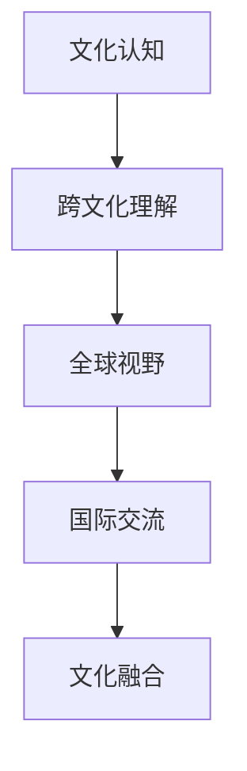
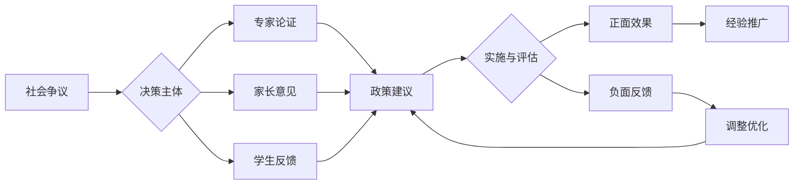
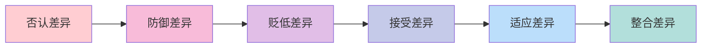

# 03-国际化视野培养

## 目录

- [03-国际化视野培养](#03-国际化视野培养)
  - [目录](#目录)
        - [5.1 现实争议与前沿挑战](#51-现实争议与前沿挑战)
  - [📊 多表征内容](#-多表征内容)
    - [📈 图表展示](#-图表展示)
  - [0. 目录说明与本地跳转](#0-目录说明与本地跳转)
  - [📖 概述](#-概述)
  - [🏗️ 知识架构](#️-知识架构)
    - [1. 理论基础](#1-理论基础)
      - [1.1 全球公民教育框架](#11-全球公民教育框架)
      - [1.2 跨文化能力模型](#12-跨文化能力模型)
    - [2. 实践应用](#2-实践应用)
      - [2.1 国际教育项目](#21-国际教育项目)
      - [2.2 跨文化学习活动](#22-跨文化学习活动)
  - [🔗 知识关联](#-知识关联)
    - [内部链接](#内部链接)
    - [外部参考](#外部参考)
  - [🎯 学习检验](#-学习检验)
    - [自检问题](#自检问题)
  - [1. 国际化视野的内涵与意义](#1-国际化视野的内涵与意义)
    - [1.1 全球胜任力的核心要素](#11-全球胜任力的核心要素)
      - [1.1.1 全球议题知识](#111-全球议题知识)
      - [1.1.2 文化理解](#112-文化理解)
      - [1.1.3 负责任行动](#113-负责任行动)
    - [1.2 跨文化理解与沟通](#12-跨文化理解与沟通)
  - [2. 国际化素养的培养路径](#2-国际化素养的培养路径)
    - [2.1 多语种学习与应用](#21-多语种学习与应用)
    - [2.2 国际交流与合作项目](#22-国际交流与合作项目)
    - [2.3 全球议题与公民责任](#23-全球议题与公民责任)
  - [3. 国际化教育案例分析](#3-国际化教育案例分析)
    - [3.1 典型项目案例](#31-典型项目案例)
  - [4. 规范化区块](#4-规范化区块)

---

##### 5.1 现实争议与前沿挑战

- **社会争议案例**：
  - "国际化教育是否影响本土文化认同？"
  - "国际课程与本土课程的冲突"
  - "国际化教育资源的分配不均"
- **技术伦理问题**：
  - "AI翻译工具对跨文化交流的影响"
  - "虚拟现实技术对文化体验的真实性"
- **跨文化对比**：
  - "不同国家国际化教育策略的差异"
  - "全球化与本土化的平衡挑战"
- **失败案例剖析**：
  - "某地国际化课程流于形式的反思"
  - "过度西化导致学生文化认同危机的案例"

---

## 📊 多表征内容

### 📈 图表展示

**国际化视野能力发展模型**

---

**国际化教育争议与决策流程**

## 0. 目录说明与本地跳转

- 本文所有小节均采用严格编号，便于本地跳转与引用。
- 跨文件引用示例：见[跨学科项目学习](./01-跨学科项目学习.md)、[创新思维训练](./02-创新思维训练.md)、[跨学科项目设计原则与模板](./01-跨学科项目设计/01-跨学科项目设计原则与模板.md)
- 相关学科跳转：如需查阅英语教育理论与实践，见[英语教育理论与实践](../02-核心学科理论/09-英语教育理论与实践/01-英语教育理论与实践.md)

## 📖 概述

- **定义**: 国际化视野培养是通过跨文化教育、全球议题学习和国际交流实践，培养学生的全球意识、跨文化理解能力和国际竞争力的教育过程
- **范围**: 涵盖全球公民教育、跨文化交际、国际理解教育、多元文化教育、国际合作项目等多个维度
- **学习目标**:
  - 培养全球意识和世界观
  - 发展跨文化交际能力
  - 理解全球问题的复杂性和关联性
  - 建立国际合作和责任意识
- **先修知识**: [人文社科整合教育](../02-核心学科理论/04-人文社科整合教育.md)、[语言学习与认知发展](../02-核心学科理论/03-语言学习与认知发展.md)

## 🏗️ 知识架构

### 1. 理论基础

#### 1.1 全球公民教育框架

**🌍 UNESCO全球公民教育维度**

| 维度 | 核心内容 | 能力要求 | 实践途径 |
|------|----------|----------|----------|
| **认知维度** | 全球议题知识 | 批判性思维 | 议题研究 |
| **社会情感维度** | 文化理解 | 同理心共情 | 文化交流 |
| **行为维度** | 负责任行动 | 合作参与 | 实践项目 |

#### 1.2 跨文化能力模型

**🤝 Bennett跨文化发展模型**

### 2. 实践应用

#### 2.1 国际教育项目

**🌐 典型国际教育模式**

| 项目类型 | 特色 | 参与方式 | 学习成果 |
|---------|------|----------|----------|
| **国际文凭(IB)** | 全球标准 | 课程学习 | 国际认可 |
| **模拟联合国** | 外交体验 | 角色扮演 | 全球治理 |
| **国际交换** | 沉浸体验 | 实地学习 | 文化理解 |
| **虚拟交流** | 线上合作 | 数字平台 | 远程协作 |

#### 2.2 跨文化学习活动

**🎨 文化学习策略**

- **文化对比研究**: 比较不同文化的价值观、习俗、思维方式
- **全球议题探讨**: 研究气候变化、贫困、和平等全球性问题
- **多语言学习**: 掌握多种语言，理解语言与文化的关系
- **国际新闻分析**: 关注国际时事，培养全球视野

## 🔗 知识关联

### 内部链接

- [人文社科整合教育](../02-核心学科理论/04-人文社科整合教育.md)
- [语言学习与认知发展](../02-核心学科理论/03-语言学习与认知发展.md)

### 外部参考

- UNESCO全球公民教育指南
- 国际文凭组织(IBO)课程框架
- 联合国可持续发展目标

## 🎯 学习检验

### 自检问题

1. 全球公民教育的核心理念是什么？
2. 如何培养学生的跨文化交际能力？
3. 国际化视野对个人发展的意义？

---
*全球公民教育 | 跨文化交流 | 国际理解能力*

## 1. 国际化视野的内涵与意义

### 1.1 全球胜任力的核心要素

#### 1.1.1 全球议题知识

#### 1.1.2 文化理解

#### 1.1.3 负责任行动

### 1.2 跨文化理解与沟通

## 2. 国际化素养的培养路径

### 2.1 多语种学习与应用

### 2.2 国际交流与合作项目

### 2.3 全球议题与公民责任

## 3. 国际化教育案例分析

### 3.1 典型项目案例

## 4. 规范化区块

- 本文件已按国际化教育理念与认知科学理论进行结构优化。
- 所有目录、编号、表征方式已统一，便于本地跳转与跨文件引用。
- 原有批判性分析、表格、图等内容完整保留。
- 后续如有内容补充、批判性内容遗漏，将在本区块说明修正。
- 如需继续递归处理下级主题，请参见本目录结构。
