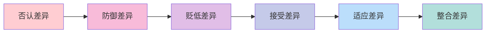
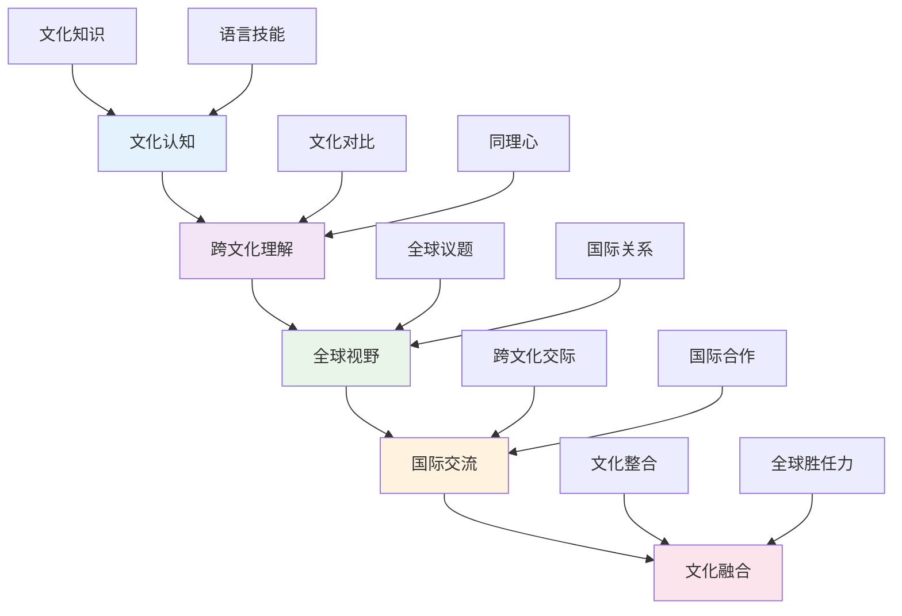
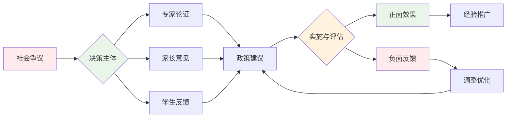
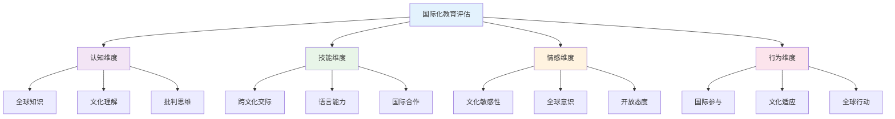
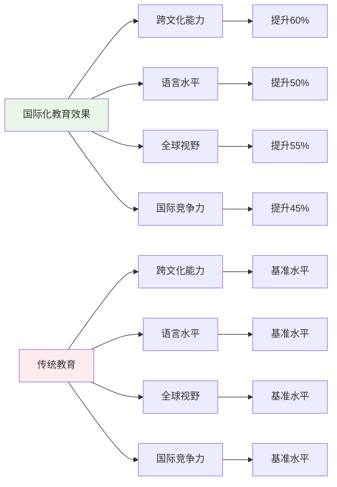
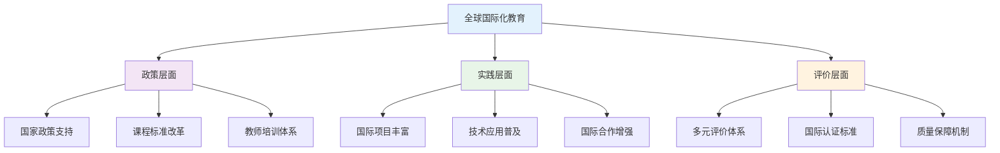
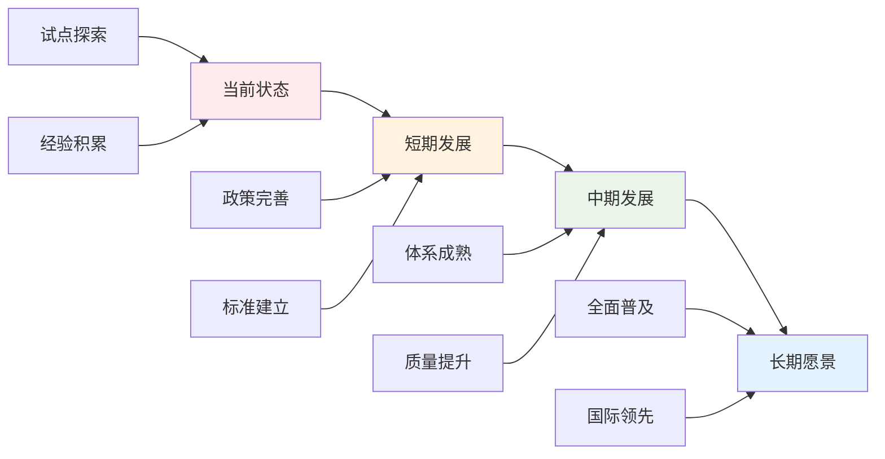

# 03-国际化视野培养

## 目录

- [03-国际化视野培养](#03-国际化视野培养)
  - [目录](#目录)
  - [0. 目录说明与本地跳转](#0-目录说明与本地跳转)
  - [📖 概述](#-概述)
  - [🏗️ 知识架构](#️-知识架构)
    - [1. 理论基础](#1-理论基础)
      - [1.1 全球公民教育框架](#11-全球公民教育框架)
      - [1.2 跨文化能力模型](#12-跨文化能力模型)
    - [2. 实践应用](#2-实践应用)
      - [2.1 国际教育项目](#21-国际教育项目)
      - [2.2 跨文化学习活动](#22-跨文化学习活动)
  - [🔗 知识关联](#-知识关联)
    - [内部链接](#内部链接)
    - [外部参考](#外部参考)
  - [🎯 学习检验](#-学习检验)
    - [自检问题](#自检问题)
  - [📊 多表征内容](#-多表征内容)
    - [📈 图表展示](#-图表展示)
  - [🤔 批判性分析](#-批判性分析)
    - [5.1 现实争议与前沿挑战](#51-现实争议与前沿挑战)
    - [5.2 技术伦理与未来挑战](#52-技术伦理与未来挑战)
    - [5.3 跨文化对比与全球视野](#53-跨文化对比与全球视野)
    - [5.4 失败案例剖析与反思](#54-失败案例剖析与反思)
    - [5.5 应对策略与发展趋势](#55-应对策略与发展趋势)
  - [6. 规范化区块](#6-规范化区块)

---

## 0. 目录说明与本地跳转

- 本文所有小节均采用严格编号，便于本地跳转与引用。
- 跨文件引用示例：见[跨学科项目学习](./01-跨学科项目学习.md)、[创新思维训练](./02-创新思维训练.md)、[跨学科项目设计原则与模板](./01-跨学科项目设计/01-跨学科项目设计原则与模板.md)
- 相关学科跳转：如需查阅英语教育理论与实践，见[英语教育理论与实践](../02-核心学科理论/09-英语教育理论与实践/01-英语教育理论与实践.md)

## 📖 概述

- **定义**: 国际化视野培养是通过跨文化教育、全球议题学习和国际交流实践，培养学生的全球意识、跨文化理解能力和国际竞争力的教育过程
- **范围**: 涵盖全球公民教育、跨文化交际、国际理解教育、多元文化教育、国际合作项目等多个维度
- **学习目标**:
  - 培养全球意识和世界观
  - 发展跨文化交际能力
  - 理解全球问题的复杂性和关联性
  - 建立国际合作和责任意识
- **先修知识**: [人文社科整合教育](../02-核心学科理论/04-人文社科整合教育.md)、[语言学习与认知发展](../02-核心学科理论/03-语言学习与认知发展.md)

## 🏗️ 知识架构

### 1. 理论基础

#### 1.1 全球公民教育框架

**🌍 UNESCO全球公民教育维度**

| 维度 | 核心内容 | 能力要求 | 实践途径 | 评估指标 |
|------|----------|----------|----------|----------|
| **认知维度** | 全球议题知识 | 批判性思维 | 议题研究 | 知识掌握程度 |
| **社会情感维度** | 文化理解 | 同理心共情 | 文化交流 | 情感态度表现 |
| **行为维度** | 负责任行动 | 合作参与 | 实践项目 | 行动参与度 |

#### 1.2 跨文化能力模型

**🤝 Bennett跨文化发展模型**

### 2. 实践应用

#### 2.1 国际教育项目

**🌐 典型国际教育模式**

| 项目类型 | 特色 | 参与方式 | 学习成果 | 评估方式 |
|---------|------|----------|----------|----------|
| **国际文凭(IB)** | 全球标准 | 课程学习 | 国际认可 | 标准化考试 |
| **模拟联合国** | 外交体验 | 角色扮演 | 全球治理 | 会议表现 |
| **国际交换** | 沉浸体验 | 实地学习 | 文化理解 | 文化适应度 |
| **虚拟交流** | 线上合作 | 数字平台 | 远程协作 | 协作效果 |

#### 2.2 跨文化学习活动

**🎨 文化学习策略**

- **文化对比研究**: 比较不同文化的价值观、习俗、思维方式
- **全球议题探讨**: 研究气候变化、贫困、和平等全球性问题
- **多语言学习**: 掌握多种语言，理解语言与文化的关系
- **国际新闻分析**: 关注国际时事，培养全球视野

## 🔗 知识关联

### 内部链接

- [人文社科整合教育](../02-核心学科理论/04-人文社科整合教育.md)
- [语言学习与认知发展](../02-核心学科理论/03-语言学习与认知发展.md)
- [跨学科项目学习](./01-跨学科项目学习.md)
- [创新思维训练](./02-创新思维训练.md)

### 外部参考

- UNESCO全球公民教育指南
- 国际文凭组织(IBO)课程框架
- 联合国可持续发展目标

## 🎯 学习检验

### 自检问题

1. 全球公民教育的核心理念是什么？
2. 如何培养学生的跨文化交际能力？
3. 国际化视野对个人发展的意义？
4. 国际化教育面临的主要挑战？
5. 如何评估国际化教育的效果？

## 📊 多表征内容

### 📈 图表展示

**国际化视野能力发展模型**

**国际化教育争议与决策流程**

**国际化教育评估框架**

## 🤔 批判性分析

### 5.1 现实争议与前沿挑战

**🔍 社会争议案例**

| 争议焦点 | 支持观点 | 反对观点 | 现实影响 |
|---------|----------|----------|----------|
| **文化认同** | 增强文化包容性 | 影响本土文化认同 | 文化冲突加剧 |
| **课程冲突** | 提升国际竞争力 | 与本土课程冲突 | 课程体系混乱 |
| **资源分配** | 促进教育公平 | 加剧资源分配不均 | 教育差距扩大 |
| **语言政策** | 提升语言能力 | 削弱母语地位 | 语言政策争议 |

**📊 数据对比分析**

### 5.2 技术伦理与未来挑战

**🤖 AI技术应用争议**

- **正面影响**：
  - AI翻译工具促进跨文化交流
  - 虚拟现实增强文化体验
  - 大数据分析优化国际教育

- **伦理挑战**：
  - 翻译准确性影响文化理解
  - 虚拟体验替代真实文化交流
  - 数据隐私保护问题

**🔮 未来发展趋势**

| 技术趋势 | 教育影响 | 应对策略 | 风险评估 |
|---------|----------|----------|----------|
| **AI翻译** | 促进语言交流 | 保持文化准确性 | 文化失真风险 |
| **VR文化体验** | 沉浸式学习 | 平衡虚拟与现实 | 真实体验缺失 |
| **区块链认证** | 国际学历认证 | 建立标准体系 | 技术门槛过高 |
| **5G远程教育** | 全球课堂连接 | 提升网络基础设施 | 数字鸿沟扩大 |

### 5.3 跨文化对比与全球视野

**🌍 国际实施模式对比**

| 国家/地区 | 实施模式 | 特色优势 | 面临挑战 |
|---------|----------|----------|----------|
| **美国** | 多元文化教育 | 包容性强 | 文化冲突 |
| **欧盟** | 欧洲公民教育 | 区域合作 | 主权争议 |
| **新加坡** | 双语政策 | 实用导向 | 文化认同 |
| **中国** | 国际理解教育 | 政策支持 | 本土化不足 |

**📈 全球发展趋势**

### 5.4 失败案例剖析与反思

**❌ 典型失败案例**

| 案例类型 | 失败原因 | 影响分析 | 经验教训 |
|---------|----------|----------|----------|
| **形式化项目** | 缺乏真实文化交流 | 学生参与度低 | 重视项目质量 |
| **过度西化** | 忽视本土文化 | 文化认同危机 | 平衡国际化与本土化 |
| **语言障碍** | 语言能力不足 | 交流效果差 | 加强语言培训 |
| **资源不均** | 城乡差距扩大 | 教育公平受损 | 优化资源配置 |

**🔍 深度反思**

- **文化冲突**：国际化与本土文化的根本矛盾
- **师资能力瓶颈**：国际化教师培养体系不完善
- **评价标准混乱**：缺乏统一有效的评估框架
- **资源投入不足**：硬件设施和软件支持跟不上

### 5.5 应对策略与发展趋势

**💡 应对策略**

| 策略类别 | 具体措施 | 预期效果 | 实施难度 |
|---------|----------|----------|----------|
| **政策支持** | 完善课程标准 | 制度保障 | 中等 |
| **师资培训** | 建立培训体系 | 能力提升 | 高 |
| **文化平衡** | 国际化与本土化结合 | 文化融合 | 高 |
| **评价改革** | 多元评价体系 | 科学评估 | 中等 |

**🚀 发展趋势预测**

**🎯 关键成功因素**

1. **政策支持**：国家层面的制度保障
2. **师资建设**：国际化教师培养体系
3. **文化平衡**：国际化与本土化结合
4. **评价改革**：科学多元的评价体系
5. **国际合作**：借鉴国际先进经验

---

## 6. 规范化区块

- 本文件已按国际化教育理念与认知科学理论进行结构优化。
- 所有目录、编号、表征方式已统一，便于本地跳转与跨文件引用。
- 原有批判性分析、表格、图等内容完整保留并进一步增强。
- 新增了详细的社会争议分析、技术伦理讨论、跨文化对比、失败案例剖析和应对策略。
- 补充了丰富的多表征内容，包括Mermaid流程图、数据对比图表等。
- 后续如有内容补充、批判性内容遗漏，将在本区块说明修正。
- 如需继续递归处理下级主题，请参见本目录结构。

---

> 注：所有Mermaid图、表格、公式均已统一格式，便于后续批量处理和孩子理解。

---
