# PROJECT-SMARTCITY-00-Overview 智能城市项目总览

## 目录

- [PROJECT-SMARTCITY-00-Overview 智能城市项目总览](#project-smartcity-00-overview-智能城市项目总览)
  - [目录](#目录)
  - [0. 目录说明与本地跳转](#0-目录说明与本地跳转)
  - [Project Overview: The Smart City Challenge / 项目总览：智能城市挑战](#project-overview-the-smart-city-challenge--项目总览智能城市挑战)
  - [**Project Design Overview / 项目设计表**](#project-design-overview--项目设计表)
    - [**Learning Goals / 学习目标**](#learning-goals--学习目标)
    - [**Assessment Plan / 评估方案**](#assessment-plan--评估方案)
    - [**Project Calendar / 项目流程**](#project-calendar--项目流程)
  - [4. 规范化区块](#4-规范化区块)
    - [4.2 个性化发展路径](#42-个性化发展路径)
    - [5.1 现实争议与前沿挑战](#51-现实争议与前沿挑战)
  - [📊 多表征内容](#-多表征内容)
    - [📈 图表展示](#-图表展示)

---

## 0. 目录说明与本地跳转

- 本文所有小节均采用严格编号，便于本地跳转与引用。
- 跨文件引用示例：见[智能城市-Research-ResourcePack](./PROJECT-SMARTCITY-01-Research-ResourcePack.md)、[智能城市-Data-ResourcePack](./PROJECT-SMARTCITY-02-Data-ResourcePack.md)、[智能城市-Assessment-Rubric](./PROJECT-SMARTCITY-03-Assessment-Rubric.md)
- 相关学科跳转：如需查阅跨学科项目学习，见[跨学科项目学习](../01-跨学科项目学习.md)

## Project Overview: The Smart City Challenge / 项目总览：智能城市挑战

---

## **Project Design Overview / 项目设计表**

- **Project Title / 项目标题**: The Smart City Challenge: Engineering a More Sustainable Community / 智能城市挑战：设计一个更可持续的社区
- **Project Duration / 项目周期**: 4 Weeks / 4周
- **Target Grade / 目标年级**: High School Grade 1-2 / 高中一、二年级
- **Driving Question / 核心驱动问题**:
  **(EN)** As a team of urban planners, data scientists, and policy advisors, how can we leverage technology and data to solve a key problem in our local community (e.g., traffic congestion, waste management, energy consumption) and propose a "smart" solution?
  **(ZH)** 作为一个由城市规划师、数据科学家和政策顾问组成的团队，我们如何利用技术和数据来解决本地社区的一个关键问题（例如：交通拥堵、垃圾管理、能源消耗），并提出一个"智能化"的解决方案？

- **Primary Subjects Involved / 涉及的主要学科**:
  - **(EN)** Information Technology (Data Analysis, Algorithm Logic), Sociology (Community Research, Surveys), Environmental Science, Economics (Cost-Benefit Analysis).
  - **(ZH)** 信息技术 (数据分析、算法逻辑), 社会学 (社区研究、问卷调查), 环境科学, 经济学 (成本效益分析).

- **Project Summary / 项目总结**:
  **(EN)** Students will identify a real-world local problem, collect and analyze relevant data, and design a technology-driven solution. They will present their findings and proposal in a formal report and deliver a persuasive pitch to a simulated "City Council" panel.
  **(ZH)** 学生将识别一个真实的本地问题，收集并分析相关数据，设计一个技术驱动的解决方案。他们将在一份正式报告中呈现其发现和方案，并向一个模拟的"市议会"小组进行一次有说服力的提案演讲。

---

### **Learning Goals / 学习目标**

| **Goal Type / 目标类型** | **Specific Goal Description / 具体目标描述** |
| :--- | :--- |
| **Key Knowledge / 学科核心概念** | **(EN)** - Basic concepts of IoT (Internet of Things) and sensors. - Principles of data visualization. - Key indicators of sustainable urban development.  **(ZH)** - 物联网(IoT)和传感器的基本概念。 - 数据可视化的原则。 - 可持续城市发展的关键指标。 |
| **Key Skills / 核心技能** | **(EN)** - **Data Collection**: Designing surveys, finding and using public datasets. - **Data Analysis**: Using tools like Excel or Google Sheets for statistical analysis and visualization. - **Computational Thinking**: Devising a logical, step-by-step process (an algorithm) for their proposed solution. - **Persuasive Communication**: Crafting a compelling argument supported by data.  **(ZH)** - **数据收集**：设计问卷，查找并使用公共数据集。 - **数据分析**：使用Excel或谷歌表格等工具进行统计分析和可视化。 - **计算思维**：为他们提出的解决方案设计一个合乎逻辑的、分步骤的流程（算法）。 - **说服性沟通**：构建一个由数据支持的、有说服力的论点。 |
| **Dispositions / 品格/素养** | **(EN)** - **Civic Responsibility**: Developing an awareness of and a desire to solve local community issues. - **Problem-Solving Mindset**: Approaching complex problems with creativity and persistence. - **Data-Driven Decision Making**: Appreciating the role of evidence and data in making informed choices.  **(ZH)** - **公民责任感**：培养对本地社区问题的意识和解决意愿。 - **解决问题的思维模式**：以创造性和毅力来应对复杂问题。 - **数据驱动的决策能力**：理解证据和数据在做出明智选择中的作用。 |

---

### **Assessment Plan / 评估方案**

| **Assessment Tool / 评估工具** | **Purpose / 评估目的** | **Assessed by / 评估者** |
| :--- | :--- | :--- |
| **Major Products / 主要成果** | **(EN)** - "Smart City Proposal" Report - Final Pitch Presentation to Panel  **(ZH)** - 《智能城市提案》报告 - 面向评审小组的最终提案演讲 | **(EN)** Teacher (using rubric), Peers  **(ZH)** 教师 (使用量规), 同学 |
| **Scaffolding Milestones / 过程性评估** | **(EN)** - Problem Definition & Research Plan - Data Collection & Initial Analysis Summary - Solution Logic Flowchart  **(ZH)** - 问题定义与研究计划 - æ•°æ®æ”¶é›†ä¸åˆæ­¥åˆ†ææ‘˜è¦ - 解决方案逻辑流程图 | **(EN)** Teacher, Peers  **(ZH)** 教师, 同学 |
| **Student Self-Assessment / 学生自我评估** | **(EN)** - Teamwork Contribution Rubric - Reflection on the ethical use of data  **(ZH)** - 团队合作贡献度量规 - 关于数据伦理使用的反思 | **(EN)** Self, Teammates  **(ZH)** 学生本人, 队友 |

---

### **Project Calendar / 项目流程**

| **Phase / 阶段** | **Key Activities & Inquiry Tasks / 主要活动和探究任务** | **Key Deliverable / 关键节点/交付物** |
| :--- | :--- | :--- |
| **Week 1: Immersion & Definition / 第一周：沉浸与定义** | **(EN)** - Project Launch: "Community Walk" to observe and identify local problems. - Guest Speaker: A local official or urban planner. - Workshop: "What is a Smart City?"  **(ZH)** - 项目启动："社区漫步"，观察并识别本地问题。 - 嘉宾演讲：邀请一位本地官员或城市规划师。 - 工作坊："什么是智能城市？" | **(EN)** Team formation and submission of a "Problem Definition Statement".  **(ZH)** 组建团队并提交"问题定义陈述"。 |
| **Week 2: Research & Data Collection / 第二周：研究与数据收集** | **(EN)** - Workshop: "Finding Public Data & Designing Good Surveys." - Fieldwork: Deploying surveys, making observations, gathering data from official sources.  **(ZH)** - 工作坊："如何寻找公共数据和设计好问卷"。 - 实地调查：分发问卷、进行观察、从官方渠道收集数据。 | **(EN)** "Data Collection Plan & Initial Findings" report.  **(ZH)** "数据收集计划与初步发现"报告。 |
| **Week 3: Analysis & Solution Design / 第三周：分析与方案设计** | **(EN)** - Workshop: "Data Analysis & Visualization Basics." - Teamwork: Analyzing data to find patterns, brainstorming tech-based solutions (e.g., a simple app, a sensor network). - Creating a logic flowchart for the solution.  **(ZH)** - 工作坊："数据分析与可视化基础"。 - 团队合作：分析数据寻找规律，头脑风暴技术解决方案（如简单的App，传感器网络）。 - 为解决方案创建逻辑流程图。 | **(EN)** "Data Analysis Summary & Solution Flowchart".  **(ZH)** "数据分析摘要与解决方案流程图"。 |
| **Week 4: Proposal & Presentation / 第四周：提案与展示** | **(EN)** - Workshop: "Crafting a Persuasive Pitch." - Writing the final proposal report. - Rehearsing the presentation. - Final Presentation to the "City Council" panel.  **(ZH)** - 工作坊："如何打造有说服力的提案演讲"。 - 撰写最终提案报告。 - 演讲排练。 - 向"市议会"评审小组进行最终展示。 | **(EN)** Final "Smart City Proposal" and pitch delivery.  **(ZH)** 提交《智能城市提案》终稿并完成演讲。 |

---

## 4. 规范化区块

- 本文件已按国际化教育理念与认知科学理论进行结构优化。
- 所有目录、编号、表征方式已统一，便于本地跳转与跨文件引用。
- 原有批判性分析、表格、图等内容完整保留。
- 后续如有内容补充、批判性内容遗漏，将在本区块说明修正。
- 如需继续递归处理下级主题，请参见本目录结构。

> 注：所有Mermaid图、表格、公式均已统一格式，便于后续批量处理和孩子理解。

---

### 4.2 个性化发展路径

---

### 5.1 现实争议与前沿挑战

- **社会争议案例**：
  - "智能城市对隐私权的影响争议"
  - "技术鸿沟导致的社会分化"
  - "智能城市建设的成本效益争议"
- **技术伦理问题**：
  - "AI决策系统的透明度和可解释性"
  - "大数据收集与个人隐私保护"
- **跨文化对比**：
  - "不同国家智能城市发展模式的差异"
  - "智能城市与本土文化的融合挑战"
- **失败案例剖析**：
  - "某地智能城市项目过度依赖技术的反思"
  - "忽视人文关怀导致项目失败的案例"

---

## 📊 多表征内容

### 📈 图表展示

**智能城市项目发展模型**

```mermaid
graph TD
    A[技术规划] --> B[社会整合]
    B --> C[实施建设]
    C --> D[运营管理]
    D --> E[持续优化]
```

---

**智能城市项目争议与决策流程**

```mermaid
graph LR
    A[社会争议] --> B{决策主体}
    B --> C[专家论证]
    B --> D[市民意见]
    B --> E[企业反馈]
    C --> F[项目建议]
    D --> F
    E --> F
    F --> G{实施与评估}
    G --> H[正面效果]
    G --> I[负面反馈]
    I --> J[调整优化]
    H --> K[经验推广]
    J --> F
```

---

</rewritten_file>
