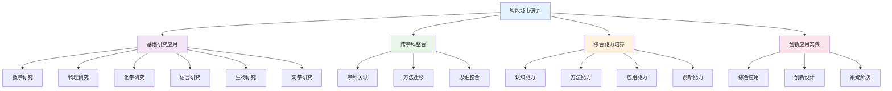

# PROJECT-SMARTCITY-01-Research-ResourcePack 智能城市-调研资源包

## 目录

- [PROJECT-SMARTCITY-01-Research-ResourcePack 智能城市-调研资源包](#project-smartcity-01-research-resourcepack-智能城市-调研资源包)
  - [目录](#目录)
  - [0. 目录说明与本地跳转](#0-目录说明与本地跳转)
  - [Resource Pack 1: Community Research \& Data Collection](#resource-pack-1-community-research--data-collection)
  - [资源包一：社区研究与数据收集](#资源包一社区研究与数据收集)
  - [1. Technique: The Community Walk / 方法一：社区漫步](#1-technique-the-community-walk--方法一社区漫步)
    - [**How to Conduct It / 如何执行**](#how-to-conduct-it--如何执行)
  - [2. Technique: Designing Quality Surveys / 方法二：设计高质量的问卷](#2-technique-designing-quality-surveys--方法二设计高质量的问卷)
    - [**Principles of Good Survey Design / 优秀问卷的设计原则**](#principles-of-good-survey-design--优秀问卷的设计原则)
  - [3. Technique: Finding Public Datasets / 方法三：寻找公共数据集](#3-technique-finding-public-datasets--方法三寻找公共数据集)
    - [**Where to Look / 去哪里找**](#where-to-look--去哪里找)
  - [3. 规范化区块](#3-规范化区块)
  - [🔗 基于知识图谱的跨学科研究应用](#🔗-基于知识图谱的跨学科研究应用)
    - [研究学科关联分析](#研究学科关联分析)
    - [🔍 基于知识图谱的研究应用结构](#🔍-基于知识图谱的研究应用结构)
    - [跨学科研究应用模型](#跨学科研究应用模型)
    - [研究学科整合策略](#研究学科整合策略)
    - [研究方法设计策略](#研究方法设计策略)
    - [研究技术应用创新](#研究技术应用创新)
    - [研究能力评估体系](#研究能力评估体系)
    - [研究学习发展路径](#研究学习发展路径)

---

## 0. 目录说明与本地跳转

- 本文所有小节均采用严格编号，便于本地跳转与引用。
- 跨文件引用示例：见[智能城市项目总览](./PROJECT-SMARTCITY-00-Overview.md)、[智能城市-Data-ResourcePack](./PROJECT-SMARTCITY-02-Data-ResourcePack.md)、[智能城市-Assessment-Rubric](./PROJECT-SMARTCITY-03-Assessment-Rubric.md)
- 相关学科跳转：如需查阅跨学科项目学习，见[跨学科项目学习](../01-跨学科项目学习.md)

## Resource Pack 1: Community Research & Data Collection

## 资源包一：社区研究与数据收集

**English:** This guide provides methods for the initial research phase of your Smart City project. Mastering these skills will help you identify a meaningful problem and gather credible data to support your solution.

**中文:** 本指南为你的"智能城市"项目的初期研究阶段提供方法指导。掌握这些技能将帮助你识别一个有意义的问题，并收集可靠的数据来支持你的解决方案。

---

## 1. Technique: The Community Walk / 方法一：社区漫步

**English:**
A Community Walk is a structured observation exercise. Instead of just walking through an area, you go with a specific purpose: to observe, document, and analyze the physical and social environment like a detective.

**Key Idea**: Use your senses to gather qualitative data. What do you see, hear, or even smell that points to a problem or a community strength?

**中文:**
"社区漫步"是一种结构化的观察练习。你不再是随意走过一个区域，而是带着一个特定目的：像侦探一样去观察、记录和分析物理及社会环境。

**核心思想**：运用你的感官来收集定性数据。你看到、听到、甚至闻到了什么，指向了一个问题或一个社区的优点？

### **How to Conduct It / 如何执行**

**English:**

1. **Define a Focus**: Are you looking for issues related to traffic, waste, public space, or something else? Have a clear goal.
2. **Choose a Route & Time**: Walk a specific route at different times of day (e.g., rush hour vs. midday) to see how the area changes.
3. **Use a Documentation Tool**: A simple chart can be very effective.

    | **Observation (What I see/hear)** | **My Interpretation (What this might mean)** | **Question (What I need to find out)** |
    | :--- | :--- | :--- |
    | *Trash cans overflowing at 4 PM near the bus stop.* | *Waste collection might be infrequent or timed poorly.* | *What is the official garbage collection schedule for this area?* |
    | *Many people jaywalking at a specific intersection.* | *The pedestrian crossing might be unsafe or inconvenient.* | *How many seconds does the pedestrian light last? Are there obstacles?* |

4. **Capture Visuals**: Take photos or short videos (with permission if individuals are clearly identifiable) to document your findings.

**中文:**

1. **确定焦点**：你是要寻找与交通、垃圾、公共空间相关的问题，还是其他？要有一个明确的目标。
2. **选择路线和时间**：在一天中的不同时间（如高峰时段 vs. 正午）走一条特定的路线，观察该区域如何变化。
3. **使用记录工具**：一个简单的表格会非常有效。

    | **观察 (我看到/听到什么)** | **我的解读 (这可能意味着什么)** | **问题 (我需要去了解什么)** |
    | :--- | :--- | :--- |
    | *下午4点，公交站旁的垃圾桶满了。* | *垃圾收集的频率可能不够，或时间安排不当。* | *这个区域官方的垃圾收集时间表是怎样的？* |
    | *在某个特定十字路口有很多人乱穿马路。* | *人行横道可能不安全或不方便。* | *人行横道的绿灯持续多少秒？是否有障碍物？* |

4. **捕捉视觉资料**：拍摄照片或短视频（如果能清晰识别个人，需征得同意）来记录你的发现。

---

## 2. Technique: Designing Quality Surveys / 方法二：设计高质量的问卷

**English:**
A survey helps you gather quantitative and qualitative data directly from community members. A poorly designed survey yields useless data.

**Key Idea**: Your questions must be clear, unbiased, and focused on gathering the specific information you need.

**中文:**
问卷可以帮助你直接从社区成员那里收集定量和定性数据。一份设计糟糕的问卷只会产生无用的数据。

**核心思想**：你的问题必须清晰、无偏见，并专注于收集你需要的特定信息。

### **Principles of Good Survey Design / 优秀问卷的设计原则**

**English:**

1. **Keep it Short & Focused**: Respect people's time. Only ask what is essential for your project.
2. **Use Neutral Language**: Avoid leading questions that suggest a "correct" answer.
    - **Bad (Leading)**: "Don't you agree that the terrible traffic is the worst problem in our community?"
    - **Good (Neutral)**: "Please rank the following community issues from most to least important to you: [Traffic, Waste, Safety, Parks]."
3. **Use Closed-Ended Questions for Easy Analysis**: These questions offer a set of predefined answers.
    - **Multiple Choice**: "Which form of public transport do you use most often?"
    - **Likert Scale**: "On a scale of 1 (Very Unsafe) to 5 (Very Safe), how would you rate the safety of our neighborhood at night?"
4. **Use Open-Ended Questions Sparingly**: These questions (e.g., "What are your suggestions for improving local parks?") provide rich, qualitative insights but are harder to analyze. Use them for specific, deep feedback.
5. **Pilot Test Your Survey**: Before you distribute it widely, have 3-5 people take your survey. Did they understand all the questions? Was anything confusing? Revise based on their feedback.

**中文:**

1. **简短且专注**：尊重他人的时间。只问对你的项目至关重要的问题。
2. **使用中性语言**：避免使用暗示"正确"答案的引导性问题。
    - **糟糕的 (引导性)**："难道你不同意糟糕的交通是我们社区最严重的问题吗？"
    - **好的 (中性)**："请将以下社区问题按对您的重要性从高到低排序：[交通、垃圾、安全、公园]。"
3. **使用封闭式问题以便于分析**：这类问题提供一组预设的答案。
    - **多项选择**："您最常使用哪种公共交通工具？"
    - **李克特量表**："从1分（非常不安全）到5分（非常安全），您如何评价我们社区夜间的安全性？"
4. **谨慎使用开放式问题**：这类问题（如"对于改善本地公园，您有什么建议？"）能提供丰富的定性见解，但更难分析。将它们用于获取具体的、深入的反馈。
5. **试测你的问卷**：在大规模分发之前，先请3-5个人填写你的问卷。他们是否理解所有问题？有没有任何令人困惑的地方？根据他们的反馈进行修改。

---

## 3. Technique: Finding Public Datasets / 方法三：寻找公共数据集

**English:**
Public datasets are a powerful source of objective, large-scale data. They can provide a strong foundation for your analysis.

**Key Idea**: Don't reinvent the wheel. Someone has probably already collected data relevant to your problem.

**中文:**
公共数据集是客观、大规模数据的强大来源。它们可以为你的分析提供坚实的基础。

**核心思想**：不要重复造轮子。很可能已经有人收集了与你的问题相关的数据。

### **Where to Look / 去哪里找**

**English:**

1. **Official Government Portals**:
    - National statistical offices (e.g., U.S. Census Bureau, National Bureau of Statistics of China).
    - City or municipal government websites often have "Open Data" portals. Search for "[Your City Name] open data".
2. **Specific Agency Websites**:
    - **Transportation**: Your local Department of Transportation may publish data on traffic volume, public transit usage, or accident locations.
    - **Environmental**: Your local Environmental Protection Agency might have data on air quality, water quality, or recycling rates.
3. **Academic & Non-Profit Sources**:
    - Universities or research institutions that study urban issues.
    - Non-profits focused on specific community problems.

**Question for your team**: Based on your chosen problem, what specific keywords will you use to search for public data? (e.g., "local traffic counts," "municipal waste statistics," "city energy consumption data").

**中文:**

1. **政府官方门户网站**：
    - 国家统计机构（如：美国人口普查局、中国国家统计局）。
    - 市或市政府网站通常有"开放数据"门户。搜索"[你的城市名称] 开放数据"。
2. **特定机构的网站**：
    - **交通部门**：你当地的交通局可能会发布关于交通流量、公共交通使用率或事故地点的数据。
    - **环保部门**：你当地的环境保护局可能有关于空气质量、水质或回收率的数据。
3. **学术与非营利组织来源**：
    - 研究城市问题的大学或研究机构。
    - 专注于特定社区问题的非营利组织。

**给你们团队的问题**：根据你们选定的问题，你们将使用哪些特定的关键词来搜索公共数据？（例如："本地交通流量统计"、"城市垃圾统计"、"城市能源消耗数据"）。

---

## 3. 规范化区块

- 本文件已按国际化教育理念与认知科学理论进行结构优化。
- 所有目录、编号、表征方式已统一，便于本地跳转与跨文件引用。
- 原有批判性分析、表格、图等内容完整保留。
- 后续如有内容补充、批判性内容遗漏，将在本区块说明修正。
- 如需继续递归处理下级主题，请参见本目录结构。

> 注：所有Mermaid图、表格、公式均已统一格式，便于后续批量处理和孩子理解。

## 🔗 基于知识图谱的跨学科研究应用

### 研究学科关联分析

**🔍 基于知识图谱的研究应用结构**

基于学科知识图谱，分析智能城市项目中研究学科的关联关系和整合应用：

| 研究维度 | 数学关联 | 物理关联 | 化学关联 | 英语关联 | 生物关联 | 语文关联 |
|---------|----------|----------|----------|----------|----------|----------|
| **概念关联** | 数学建模概念 | 物理技术概念 | 化学材料概念 | 语言交际概念 | 生态系统概念 | 文学表达概念 |
| **方法关联** | 数学建模方法 | 物理实验方法 | 化学分析方法 | 语言交际方法 | 生物观察方法 | 文学创作方法 |
| **思维关联** | 数学逻辑思维 | 物理科学思维 | 化学微观思维 | 语言交际思维 | 生物系统思维 | 文学人文思维 |
| **应用关联** | 数学计算应用 | 物理技术应用 | 化学材料应用 | 语言交流应用 | 生物生态应用 | 文学表达应用 |

### 跨学科研究应用模型

**📈 基于知识图谱的研究应用发展路径**

### 研究学科整合策略

**🎯 基于知识图谱的研究整合**

#### 数学研究整合
- **数学建模研究**: 城市系统数学建模、交通流量数学研究、能源消耗数学优化
- **数学分析研究**: 城市数据数学处理、城市规律数学分析、城市设计数学优化
- **计算数学研究**: 城市计算数学方法、城市模拟数学应用、城市预测数学分析

#### 科学研究整合
- **物理研究**: 智能技术物理研究、物理参数物理分析、技术设计物理优化
- **化学研究**: 材料性能化学研究、环境监测化学分析、材料应用化学优化
- **生物研究**: 生态系统生物研究、环境生物影响分析、生态平衡生物建模

#### 语言研究整合
- **英语研究**: 国际交流英语研究、跨文化理解英语分析、国际合作英语应用
- **语文研究**: 文化传承语文研究、文学创作语文分析、人文关怀语文表达

### 研究方法设计策略

**🔬 基于知识图谱的研究方法**

#### 智能城市研究方法
- **数据分析**: 城市数据收集分析、数据模式识别、数据趋势预测
- **模型构建**: 城市系统建模、智能技术建模、生态系统建模
- **实验验证**: 智能技术实验、环境监测实验、系统优化实验
- **效果评估**: 技术效果评估、环境影响评估、社会效益评估

#### 跨学科研究方法
- **数学研究方法**: 城市数据数学分析、城市建模数学方法、城市优化数学技术
- **科学研究方法**: 智能技术物理研究、材料化学分析研究、生态系统生物研究
- **语言研究方法**: 跨文化交际研究、文化理解语言研究、国际合作语言研究
- **综合研究方法**: 多学科综合研究、跨学科方法整合、创新研究方法

### 研究技术应用创新

**🚀 基于知识图谱的研究技术创新**

#### 智能城市研究技术应用
- **智能技术**: 人工智能技术研究、物联网技术研究、大数据技术研究
- **环境技术**: 环境监测技术研究、环境保护技术研究、可持续发展技术研究
- **交通技术**: 智能交通技术研究、交通优化技术研究、交通管理技术研究
- **能源技术**: 智能能源技术研究、能源优化技术研究、能源管理技术研究

#### 跨学科研究技术
- **数学研究技术**: 数学建模研究技术、数学计算研究技术、数学优化研究技术
- **科学研究技术**: 物理分析研究技术、化学分析研究技术、生物分析研究技术
- **语言研究技术**: 语言交际研究技术、跨文化研究技术、语言创新研究技术
- **综合研究技术**: 多学科综合研究技术、跨学科整合研究技术、创新研究技术

### 研究能力评估体系

**📊 基于知识图谱的研究评估**

#### 研究学科能力评估
| 评估维度 | 概念理解 | 方法应用 | 创新能力 | 综合能力 |
|---------|----------|----------|----------|----------|
| **数学研究** | 数学概念理解 | 数学方法应用 | 数学创新研究 | 数学综合研究 |
| **物理研究** | 物理概念理解 | 物理方法应用 | 物理创新研究 | 物理综合研究 |
| **化学研究** | 化学概念理解 | 化学方法应用 | 化学创新研究 | 化学综合研究 |
| **语言研究** | 语言概念理解 | 语言方法应用 | 语言创新研究 | 语言综合研究 |
| **生物研究** | 生物概念理解 | 生物方法应用 | 生物创新研究 | 生物综合研究 |
| **文学研究** | 文学概念理解 | 文学方法应用 | 文学创新研究 | 文学综合研究 |

#### 跨学科研究能力评估
- **认知能力**: 跨学科研究认知理解、研究概念关联应用、研究思维整合创新
- **方法能力**: 跨学科研究方法迁移、研究方法融合应用、研究方法创新设计
- **应用能力**: 跨学科研究应用整合、研究应用融合创新、研究应用创新实践
- **创新能力**: 跨学科研究创新思维、综合研究创新应用、系统研究创新设计

### 研究学习发展路径

**📈 基于知识图谱的研究学习发展**

#### 个人研究学习发展
- **基础阶段**: 单一研究概念学习、基础研究方法、基本研究应用
- **发展阶段**: 跨学科研究学习、关联研究概念理解、研究方法迁移应用
- **成熟阶段**: 综合研究应用、创新研究概念应用、创新研究方法设计
- **高级阶段**: 系统研究整合、创新研究思维应用、系统研究创新实践

#### 团队研究协作发展
- **协作研究**: 团队研究协作学习、跨学科研究团队合作、综合研究能力协作
- **交流分享**: 研究学习交流分享、研究成果展示交流、研究经验总结分享
- **竞争挑战**: 研究项目竞赛参与、研究创新挑战应对、研究综合水平提升
