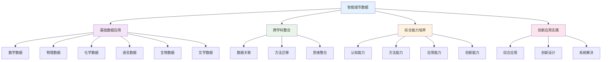

# PROJECT-SMARTCITY-02-Data-ResourcePack 智能城市-数据资源包

## 目录

- [PROJECT-SMARTCITY-02-Data-ResourcePack 智能城市-数据资源包](#project-smartcity-02-data-resourcepack-智能城市-数据资源包)
  - [目录](#目录)
  - [0. 目录说明与本地跳转](#0-目录说明与本地跳转)
  - [Resource Pack 2: Data Analysis \& Visualization](#resource-pack-2-data-analysis--visualization)
  - [资源包二：数据分析与可视化](#资源包二数据分析与可视化)
  - [1. Concept: Data Cleaning / 概念一：数据清洗](#1-concept-data-cleaning--概念一数据清洗)
    - [**Common Cleaning Tasks (in Excel / Google Sheets) / 常见的清洗任务 (在Excel/谷歌表格中)**](#common-cleaning-tasks-in-excel--google-sheets--常见的清洗任务-在excel谷歌表格中)
  - [2. Technique: Basic Statistical Analysis / 方法二：基础统计分析](#2-technique-basic-statistical-analysis--方法二基础统计分析)
    - [**Essential Metrics (in Excel / Google Sheets) / 核心指标 (在Excel/谷歌表格中)**](#essential-metrics-in-excel--google-sheets--核心指标-在excel谷歌表格中)
  - [3. Technique: Data Visualization / 方法三：数据可视化](#3-technique-data-visualization--方法三数据可视化)
    - [**Which Chart Should I Use? / 我该用哪种图表？**](#which-chart-should-i-use--我该用哪种图表)
  - [3. 规范化区块](#3-规范化区块)
  - [🔗 基于知识图谱的跨学科数据应用](#🔗-基于知识图谱的跨学科数据应用)
    - [数据学科关联分析](#数据学科关联分析)
    - [🔍 基于知识图谱的数据应用结构](#🔍-基于知识图谱的数据应用结构)
    - [跨学科数据应用模型](#跨学科数据应用模型)
    - [数据学科整合策略](#数据学科整合策略)
    - [数据处理方法设计策略](#数据处理方法设计策略)
    - [数据技术应用创新](#数据技术应用创新)
    - [数据能力评估体系](#数据能力评估体系)
    - [数据学习发展路径](#数据学习发展路径)

---

## 0. 目录说明与本地跳转

- 本文所有小节均采用严格编号，便于本地跳转与引用。
- 跨文件引用示例：见[智能城市项目总览](./PROJECT-SMARTCITY-00-Overview.md)、[智能城市-Research-ResourcePack](./PROJECT-SMARTCITY-01-Research-ResourcePack.md)、[智能城市-Assessment-Rubric](./PROJECT-SMARTCITY-03-Assessment-Rubric.md)
- 相关学科跳转：如需查阅创新思维训练，见[创新思维训练](../02-创新思维训练.md)

## Resource Pack 2: Data Analysis & Visualization

## 资源包二：数据分析与可视化

**English:** This guide introduces the basic skills needed to make sense of your data. Raw data is just a collection of numbers and text; analysis turns it into insights, and visualization turns insights into a compelling story.

**中文:** 本指南介绍理解数据所需的基本技能。原始数据只是一堆数字和文本的集合；分析将其转化为洞见，而可视化则将洞见转化为一个有说服力的故事。

---

## 1. Concept: Data Cleaning / 概念一：数据清洗

**English:**
Data cleaning is the process of fixing or removing incorrect, corrupted, incorrectly formatted, duplicate, or incomplete data within a dataset. It is the most crucial first step before analysis.

**Key Idea**: Garbage in, garbage out. If your data is messy, your analysis will be meaningless.

**中文:**
数据清洗是在一个数据集中修复或移除不正确、已损坏、格式错误、重复或不完整数据的过程。它是分析前最关键的第一步。

**核心思想**：垃圾进，垃圾出。如果你的数据一团糟，你的分析将毫无意义。

### **Common Cleaning Tasks (in Excel / Google Sheets) / 常见的清洗任务 (在Excel/谷歌表格中)**

**English:**

1. **Removing Duplicates**: Use the "Remove Duplicates" feature to ensure each entry is unique.
2. **Handling Missing Values**:
    - **Identify**: Sort or filter your data to find blank cells.
    - **Decide**: Can you fill in the blank with a reasonable default (like "N/A" for text or 0 for some numbers)? Or should you delete the entire row if it's missing critical information? There is no single right answer; your team must decide and document it.
3. **Standardizing Formats**: Ensure consistency.
    - **Text**: Make sure "New York", "new york", and "NY" are all standardized to one format (e.g., "New York").
    - **Numbers**: Ensure all numerical data are formatted as numbers, not text.
4. **Identifying Outliers**: An outlier is a data point that is significantly different from other observations.
    - **How to spot**: Sort your data from largest to smallest. Does any value look suspiciously high or low? (e.g., a survey response of "150" for age).
    - **What to do**: Investigate it. Is it a typo (e.g., meant to be "15")? Or is it an invalid entry that should be removed?

**中文:**

1. **移除重复项**：使用"删除重复项"功能来确保每个条目都是唯一的。
2. **处理缺失值**：
    - **识别**：对数据进行排序或筛选，找到空白单元格。
    - **决策**：你能用一个合理的默认值（如文本用"N/A"，某些数字用0）来填充空白吗？或者，如果该行缺少关键信息，是否应该将其整行删除？没有唯一的正确答案；你的团队必须做出决定并记录下来。
3. **统一格式**：确保一致性。
    - **文本**：确保"北京", "beijing", 和"BJ"都统一为一种格式（如"北京"）。
    - **数字**：确保所有数值型数据都格式化为数字，而不是文本。
4. **识别异常值**：异常值是与其他观察值有显著差异的数据点。
    - **如何发现**：将数据从大到小排序。有没有哪个值看起来高得或低得可疑？（例如，年龄的问卷回复是"150"）。
    - **如何处理**：调查它。是拼写错误（比如，本意是"15"）吗？还是一个应该被移除的无效条目？

---

## 2. Technique: Basic Statistical Analysis / 方法二：基础统计分析

**English:**
Once your data is clean, you can use basic statistics to summarize its main features.

**Key Idea**: Find the "center" and "spread" of your data to understand the big picture.

**中文:**
一旦你的数据干净了，你就可以使用基础统计来总结其主要特征。

**核心思想**：找到数据的"中心"和"分布"，以理解其概貌。

### **Essential Metrics (in Excel / Google Sheets) / 核心指标 (在Excel/谷歌表格中)**

**English:**

- **For Numerical Data (e.g., age, travel time)**:
  - **Mean (Average)**: The sum of values divided by the count of values. Formula: `=AVERAGE(range)`. Best for data without extreme outliers.
  - **Median**: The middle value in a sorted list of numbers. Formula: `=MEDIAN(range)`. Better than the mean when you have outliers that skew the average.
  - **Mode**: The most frequently occurring value. Formula: `=MODE(range)`.
- **For Categorical Data (e.g., 'Yes/No' answers, transportation type)**:
  - **Count & Percentage**: Count how many times each category appears. Then, calculate the percentage of the total. A **Pivot Table** is the most powerful tool for this.

**中文:**

- **对于数值型数据（如：年龄、出行时间）**：
  - **平均值 (Mean)**：所有数值的总和除以数值的个数。公式：`=AVERAGE(范围)`。最适用于没有极端异常值的数据。
  - **中位数 (Median)**：一组排序后数字的中间值。公式：`=MEDIAN(范围)`。当数据中存在可能扭曲平均值的异常值时，中位数比平均值更好。
  - **众数 (Mode)**：出现频率最高的值。公式：`=MODE(范围)`。
- **对于分类型数据（如："是/否"的回答，交通工具类型）**：
  - **计数与百分比**：计算每个类别出现的次数。然后，计算其占总数的百分比。**数据透视表 (Pivot Table)** 是实现此功能最强大的工具。

---

## 3. Technique: Data Visualization / 方法三：数据可视化

**English:**
Visualization turns your analysis into a story that an audience can quickly understand. The goal is clarity, not decoration.

**Key Idea**: Choose the right chart for the right job.

**中文:**
可视化将你的分析转变为一个观众能迅速理解的故事。其目标是清晰，而非装饰。

**核心思想**：为正确的工作选择正确的图表。

### **Which Chart Should I Use? / 我该用哪种图表？**

| **Chart Type / 图表类型** | **Best For... / 最适用于...** | **Example / 示例** |
| :--- | :--- | :--- |
| **Bar Chart / 条形图** | **Comparing categories.** Comparing distinct items or groups. | *Comparing the number of people who use buses, subways, and cars.* *比较使用公交、地铁和汽车的人数。* |
| **Pie Chart / 饼图** | **Showing parts of a whole.** Use only when you have a few categories that add up to 100%. Avoid using it if categories are numerous or similar in size. | *Showing the percentage breakdown of a household's energy consumption (e.g., lighting, heating, appliances).* *展示一个家庭能源消耗的百分比构成（如：照明、供暖、电器）。* |
| **Line Chart / 折线图** | **Showing trends over time.** Connecting data points to show how a value changes over a continuous period. | *Tracking the change in a neighborhood's reported recycling volume over the last 12 months.* *追踪过去12个月某社区报告的回收物量的变化。* |
| **Scatter Plot / 散点图** | **Showing the relationship between two numerical variables.** To see if one variable tends to increase as the other does (correlation). | *Plotting a city's population density against its average public transit commute time.* *绘制城市人口密度与其平均公共交通通勤时间的关系图。* |

**Final Tip**: Always label your axes clearly, give your chart a descriptive title, and keep the design simple and clean.

**最后提示**：始终清晰地标注你的坐标轴，给你的图表一个描述性的标题，并保持设计简洁明了。

---

## 3. 规范化区块

- 本文件已按国际化教育理念与认知科学理论进行结构优化。
- 所有目录、编号、表征方式已统一，便于本地跳转与跨文件引用。
- 原有批判性分析、表格、图等内容完整保留。
- 后续如有内容补充、批判性内容遗漏，将在本区块说明修正。
- 如需继续递归处理下级主题，请参见本目录结构。

> 注：所有Mermaid图、表格、公式均已统一格式，便于后续批量处理和孩子理解。

## 🔗 基于知识图谱的跨学科数据应用

### 数据学科关联分析

**🔍 基于知识图谱的数据应用结构**

基于学科知识图谱，分析智能城市项目中数据学科的关联关系和整合应用：

| 数据维度 | 数学关联 | 物理关联 | 化学关联 | 英语关联 | 生物关联 | 语文关联 |
|---------|----------|----------|----------|----------|----------|----------|
| **概念关联** | 数学统计概念 | 物理数据概念 | 化学分析概念 | 语言数据概念 | 生物数据概念 | 文学数据概念 |
| **方法关联** | 数学统计方法 | 物理数据处理 | 化学数据分析 | 语言数据处理 | 生物数据分析 | 文学数据处理 |
| **思维关联** | 数学逻辑思维 | 物理科学思维 | 化学分析思维 | 语言交际思维 | 生物系统思维 | 文学人文思维 |
| **应用关联** | 数学计算应用 | 物理技术应用 | 化学分析应用 | 语言交流应用 | 生物生态应用 | 文学表达应用 |

### 跨学科数据应用模型

**📈 基于知识图谱的数据应用发展路径**

### 数据学科整合策略

**🎯 基于知识图谱的数据整合**

#### 数学数据整合
- **数学统计**: 城市数据数学统计、交通数据数学分析、能源数据数学建模
- **数学建模**: 城市系统数学建模、数据规律数学分析、数据预测数学方法
- **计算数学**: 城市数据计算数学、数据模拟数学应用、数据优化数学技术

#### 科学数据整合
- **物理数据**: 智能技术物理数据、物理参数数据分析、技术设计数据优化
- **化学数据**: 材料性能化学数据、环境监测化学分析、材料应用数据优化
- **生物数据**: 生态系统生物数据、环境生物影响分析、生态平衡数据建模

#### 语言数据整合
- **英语数据**: 国际交流英语数据、跨文化理解数据分析、国际合作数据应用
- **语文数据**: 文化传承语文数据、文学创作数据分析、人文关怀数据表达

### 数据处理方法设计策略

**🔬 基于知识图谱的数据处理方法**

#### 智能城市数据处理方法
- **数据收集**: 城市数据收集方法、数据来源识别、数据质量评估
- **数据处理**: 城市数据清洗处理、数据格式标准化、数据完整性检查
- **数据分析**: 城市数据模式分析、数据趋势识别、数据关联分析
- **数据可视化**: 城市数据图表展示、数据交互可视化、数据故事讲述

#### 跨学科数据处理方法
- **数学数据处理**: 城市数据数学分析、数据建模数学方法、数据优化数学技术
- **科学数据处理**: 智能技术物理数据处理、材料化学数据分析、生态系统生物数据处理
- **语言数据处理**: 跨文化交际数据处理、文化理解语言数据分析、国际合作语言数据处理
- **综合数据处理**: 多学科综合数据处理、跨学科数据整合、创新数据处理方法

### 数据技术应用创新

**🚀 基于知识图谱的数据技术创新**

#### 智能城市数据技术应用
- **智能技术**: 人工智能数据处理、物联网数据收集、大数据分析技术
- **环境技术**: 环境监测数据处理、环境保护数据分析、可持续发展数据技术
- **交通技术**: 智能交通数据处理、交通优化数据分析、交通管理数据技术
- **能源技术**: 智能能源数据处理、能源优化数据分析、能源管理数据技术

#### 跨学科数据技术
- **数学数据技术**: 数学建模数据技术、数学计算数据技术、数学优化数据技术
- **科学数据技术**: 物理分析数据技术、化学分析数据技术、生物分析数据技术
- **语言数据技术**: 语言交际数据技术、跨文化数据技术、语言创新数据技术
- **综合数据技术**: 多学科综合数据技术、跨学科整合数据技术、创新数据技术

### 数据能力评估体系

**📊 基于知识图谱的数据评估**

#### 数据学科能力评估
| 评估维度 | 概念理解 | 方法应用 | 创新能力 | 综合能力 |
|---------|----------|----------|----------|----------|
| **数学数据** | 数学概念理解 | 数学方法应用 | 数学创新数据 | 数学综合数据 |
| **物理数据** | 物理概念理解 | 物理方法应用 | 物理创新数据 | 物理综合数据 |
| **化学数据** | 化学概念理解 | 化学方法应用 | 化学创新数据 | 化学综合数据 |
| **语言数据** | 语言概念理解 | 语言方法应用 | 语言创新数据 | 语言综合数据 |
| **生物数据** | 生物概念理解 | 生物方法应用 | 生物创新数据 | 生物综合数据 |
| **文学数据** | 文学概念理解 | 文学方法应用 | 文学创新数据 | 文学综合数据 |

#### 跨学科数据能力评估
- **认知能力**: 跨学科数据认知理解、数据概念关联应用、数据思维整合创新
- **方法能力**: 跨学科数据方法迁移、数据方法融合应用、数据方法创新设计
- **应用能力**: 跨学科数据应用整合、数据应用融合创新、数据应用创新实践
- **创新能力**: 跨学科数据创新思维、综合数据创新应用、系统数据创新设计

### 数据学习发展路径

**📈 基于知识图谱的数据学习发展**

#### 个人数据学习发展
- **基础阶段**: 单一数据概念学习、基础数据处理方法、基本数据应用
- **发展阶段**: 跨学科数据学习、关联数据概念理解、数据方法迁移应用
- **成熟阶段**: 综合数据应用、创新数据概念应用、创新数据方法设计
- **高级阶段**: 系统数据整合、创新数据思维应用、系统数据创新实践

#### 团队数据协作发展
- **协作数据**: 团队数据协作学习、跨学科数据团队合作、综合数据能力协作
- **交流分享**: 数据学习交流分享、数据成果展示交流、数据经验总结分享
- **竞争挑战**: 数据项目竞赛参与、数据创新挑战应对、数据综合水平提升
