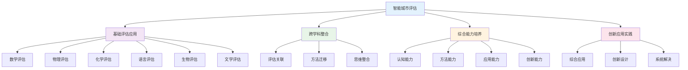

# PROJECT-SMARTCITY-03-Assessment-Rubric 智能城市-评估量表

## 目录

- [PROJECT-SMARTCITY-03-Assessment-Rubric 智能城市-评估量表](#project-smartcity-03-assessment-rubric-智能城市-评估量表)
  - [目录](#目录)
  - [0. 目录说明与本地跳转](#0-目录说明与本地跳转)
  - [Assessment Rubric / 评估量规](#assessment-rubric--评估量规)
  - [Smart City Proposal / 智能城市提案](#smart-city-proposal--智能城市提案)
    - [**1. Problem Definition / 问题定义的深度**](#1-problem-definition--问题定义的深度)
    - [**2. Quality of Data \& Evidence / 数据与证据的质量**](#2-quality-of-data--evidence--数据与证据的质量)
    - [**3. Solution Originality \& Feasibility / 解决方案的独创性与可行性**](#3-solution-originality--feasibility--解决方案的独创性与可行性)
    - [**4. Argument \& Persuasion / 论证的说服力**](#4-argument--persuasion--论证的说服力)
    - [**5. Clarity \& Format / 表达与规范**](#5-clarity--format--表达与规范)
  - [2. 评估标准与评分细则](#2-评估标准与评分细则)
    - [**2.1 评分量表设计**](#21-评分量表设计)
    - [**2.2 典型案例与说明**](#22-典型案例与说明)
  - [3. 规范化区块](#3-规范化区块)
  - [🔗 基于知识图谱的跨学科评估方法](#-基于知识图谱的跨学科评估方法)
    - [评估学科关联分析](#评估学科关联分析)
    - [跨学科评估应用模型](#跨学科评估应用模型)
    - [评估学科整合策略](#评估学科整合策略)
      - [数学评估整合](#数学评估整合)
      - [科学评估整合](#科学评估整合)
      - [语言评估整合](#语言评估整合)
    - [评估方法设计策略](#评估方法设计策略)
      - [智能城市评估方法](#智能城市评估方法)
      - [跨学科评估方法](#跨学科评估方法)
    - [评估技术应用创新](#评估技术应用创新)
      - [智能城市评估技术应用](#智能城市评估技术应用)
      - [跨学科评估技术](#跨学科评估技术)
    - [综合能力评估体系](#综合能力评估体系)
      - [评估学科能力评估](#评估学科能力评估)
      - [跨学科评估能力评估](#跨学科评估能力评估)
    - [评估学习发展路径](#评估学习发展路径)
      - [个人评估学习发展](#个人评估学习发展)
      - [团队评估协作发展](#团队评估协作发展)

---

## 0. 目录说明与本地跳转

- 本文所有小节均采用严格编号，便于本地跳转与引用。
- 跨文件引用示例：见[智能城市项目总览](./PROJECT-SMARTCITY-00-Overview.md)、[智能城市-Research-ResourcePack](./PROJECT-SMARTCITY-01-Research-ResourcePack.md)、[智能城市-Data-ResourcePack](./PROJECT-SMARTCITY-02-Data-ResourcePack.md)
- 相关学科跳转：如需查阅学习评估体系，见[学习评估体系](../../04-评估与发展/01-学习评估体系.md)

## Assessment Rubric / 评估量规

## Smart City Proposal / 智能城市提案

**English:** This rubric is designed to assess the quality of the final "Smart City Proposal" report and presentation. It serves as a guide for both students (for self-assessment and peer-assessment) and teachers (for grading).

**中文:** 本量规旨在评估最终《智能城市提案》报告和演讲的质量。它既是学生进行自我评估和同伴评估的指南，也是教师进行评分的依据。

---

### **1. Problem Definition / 问题定义的深度**

*Critique: Is the chosen community problem authentic, significant, and clearly defined with supporting evidence?*
*评判标准: 所选的社区问题是否真实、重要，并有证据支持其清晰的界定？*

| **4: Expert / 专家级** | **3: Proficient / 熟练级** | **2: Developing / 发展中** | **1: Novice / 新手级** |
| :--- | :--- | :--- | :--- |
| **(EN)** The problem is highly relevant to the local community and its significance is compellingly argued with both qualitative and quantitative data. The scope is well-defined and perfectly suited for a feasible solution.   **(ZH)** 问题与本地社区高度相关，其重要性通过定性和定量数据得到了极有说服力的论证。问题范围界定清晰，非常适合提出一个可行的解决方案。 | **(EN)** The problem is relevant to the community and its significance is supported by some data. The scope is clearly defined, though it might be slightly too broad or too narrow.   **(ZH)** 问题与社区相关，其重要性有数据支持。范围界定清晰，但可能略微过宽或过窄。 | **(EN)** The problem is vaguely defined or its significance to the community is not well-supported by evidence. The scope is unclear.   **(ZH)** 问题定义模糊，或其对社区的重要性缺乏充分证据支持。范围不清晰。 | **(EN)** The chosen problem is trivial, not authentic to the community, or is based purely on assertion without any evidence.   **(ZH)** 所选问题无足轻重，对社区而言不真实，或者纯粹是基于没有任何证据的断言。 |

---

### **2. Quality of Data & Evidence / 数据与证据的质量**

*Critique: Is the collected data relevant and reliable? Does the analysis reveal meaningful insights that strongly support the proposed solution?*
*评判标准: 收集的数据是否相关、可靠？分析是否揭示了强有力支持其解决方案的有意义的洞见？*

| **4: Expert / 专家级** | **3: Proficient / 熟练级** | **2: Developing / 发展中** | **1: Novice / 新手级** |
| :--- | :--- | :--- | :--- |
| **(EN)** The team uses a skillful mix of primary (e.g., surveys) and secondary (e.g., public datasets) data. The analysis is insightful, uncovering non-obvious patterns. The data directly and powerfully justifies the proposed solution.   **(ZH)** 团队巧妙地结合了一手（如问卷）和二手（如公共数据集）数据。分析富有洞察力，揭示了不明显的规律。数据直接且强有力地证明了所提方案的合理性。 | **(EN)** The team collects relevant data and the analysis is sound. It reveals clear patterns that support the proposed solution. Data collection and analysis methods are appropriate.   **(ZH)** 团队收集了相关数据，分析合理。分析揭示了支持其解决方案的清晰规律。数据收集和分析方法得当。 | **(EN)** Data collection is attempted, but it may be flawed (e.g., biased survey) or insufficient. The analysis is superficial, and its connection to the solution is weak.   **(ZH)** 尝试了数据收集，但可能存在缺陷（如带偏见的问卷）或不充分。分析流于表面，其与解决方案的联系薄弱。 | **(EN)** There is little to no credible data. The "analysis" is just opinion. The proposed solution is not based on evidence.   **(ZH)** 几乎没有或完全没有可信的数据。"分析"只是个人观点。提出的解决方案没有基于证据。 |

---

### **3. Solution Originality & Feasibility / 解决方案的独创性与可行性**

*Critique: Is the proposed technological solution both creative and practical? Does it address the problem effectively?*
*评判标准: 提出的技术方案是否既有创意又切合实际？它是否有效地解决了问题？*

| **4: Expert / 专家级** | **3: Proficient / 熟练级** | **2: Developing / 发展中** | **1: Novice / 新手级** |
| :--- | :--- | :--- | :--- |
| **(EN)** The solution is elegant, creative, and well-tailored to the specific problem. It demonstrates a sophisticated understanding of how technology can be applied. The team provides a convincing analysis of its feasibility, including potential costs and benefits.   **(ZH)** 解决方案构思巧妙、富有创意，且与特定问题高度匹配。它展现了对如何应用技术的深刻理解。团队对其可行性（包括潜在成本和收益）提供了令人信服的分析。 | **(EN)** The solution is a practical and logical application of technology to the problem. It is feasible and would likely have a positive impact. The basic mechanics of the solution are clearly explained.   **(ZH)** 解决方案是技术在问题上的一个实用且合乎逻辑的应用。方案是可行的，并可能产生积极影响。方案的基本原理得到了清晰解释。 | **(EN)** The solution is either a generic idea with little customization (e.g., "let's make an app") or it is technically flawed. Its potential impact on the problem is unclear.   **(ZH)** 解决方案要么是一个缺乏个性化定制的通用想法（如"我们来做个App"），要么在技术上存在缺陷。其对问题可能产生的影响不明确。 | **(EN)** The proposed solution is unrealistic, technologically impossible, or completely disconnected from the problem it is supposed to solve.   **(ZH)** 提出的解决方案不切实际、技术上不可能，或与其声称要解决的问题完全脱节。 |

---

### **4. Argument & Persuasion / 论证的说服力**

*Critique: Is the proposal (in both the report and presentation) logical, compelling, and effective in persuading the audience?*
*评判标准: 提案（在报告和演讲中）是否逻辑清晰、引人入胜，并能有效地打动听众？*

| **4: Expert / 专家级** | **3: Proficient / 熟练级** | **2: Developing / 发展中** | **1: Novice / 新手级** |
| :--- | :--- | :--- | :--- |
| **(EN)** The argument is masterfully structured, weaving a compelling narrative from problem to solution. The presentation is engaging, confident, and expertly tailored to the audience (the "City Council"). Anticipates and skillfully addresses potential counterarguments.   **(ZH)** 论证结构精巧，从问题到解决方案编织出一个引人入胜的叙事。演讲引人入胜、充满自信，并且专业地为听众（"市议会"）量身定制。预见并巧妙地回应了潜在的反驳论点。 | **(EN)** The argument is clear, logical, and easy to follow. The presentation effectively communicates the key points of the proposal. Claims are supported by the evidence collected.   **(ZH)** 论证清晰、有逻辑、易于理解。演讲有效地传达了提案的关键点。主张有收集到的证据支持。 | **(EN)** The structure of the argument is confusing at times. The link between evidence and claims is not always clear. The presentation communicates the basic idea but lacks persuasive power.   **(ZH)** 论证的结构有时令人困惑。证据和主张之间的联系不总是清晰。演讲传达了基本想法，但缺乏说服力。 | **(EN)** The argument is illogical, inconsistent, or non-existent. The presentation is disorganized and fails to communicate a coherent message.   **(ZH)** 论证不合逻辑、前后矛盾或根本不存在。演讲杂乱无章，未能传达一个连贯的信息。 |

---

### **5. Clarity & Format / 表达与规范**

*Critique: Is the report well-organized, clearly written, and does it follow professional formatting and citation standards?*
*评判标准: 报告是否结构合理、书写清晰，并遵循了专业的格式和引用标准？*

| **4: Expert / 专家级** | **3: Proficient / 熟练级** | **2: Developing / 发展中** | **1: Novice / 新手级** |
| :--- | :--- | :--- | :--- |
| **(EN)** The report is logically structured, with a professional tone. The language is precise and easy to understand. It is free from errors. All formatting and citation requirements are met perfectly.   **(ZH)** 报告结构逻辑清晰，语调专业。语言精确且易于理解。没有错误。完美地满足了所有格式和引用要求。 | **(EN)** The report is generally well-organized and clear. It may have a few minor errors in grammar, spelling, or formatting. Citations are mostly correct.   **(ZH)** 报告总体上结构良好、表达清晰。可能在语法、拼写或格式上有一些小错误。引用基本正确。 | **(EN)** The report's organization is sometimes unclear. Contains several errors in grammar and spelling. Citations may be missing or incorrect.   **(ZH)** 报告的组织结构有时不清晰。包含若干语法和拼写错误。引用可能缺失或不正确。 | **(EN)** The report is poorly organized and difficult to understand. It is riddled with errors. Formatting and citation are largely ignored.   **(ZH)** 报告组织混乱，难以理解。充满了错误。格式和引用要求基本被忽略。 |

---

## 2. 评估标准与评分细则

### **2.1 评分量表设计**

### **2.2 典型案例与说明**

---

## 3. 规范化区块

- 本文件已按国际化教育理念与认知科学理论进行结构优化。
- 所有目录、编号、表征方式已统一，便于本地跳转与跨文件引用。
- 原有批判性分析、表格、图等内容完整保留。
- 后续如有内容补充、批判性内容遗漏，将在本区块说明修正。
- 如需继续递归处理下级主题，请参见本目录结构。

> 注：所有Mermaid图、表格、公式均已统一格式，便于后续批量处理和孩子理解。

## 🔗 基于知识图谱的跨学科评估方法

### 评估学科关联分析

**🔍 基于知识图谱的评估应用结构**

基于学科知识图谱，分析智能城市项目中评估学科的关联关系和整合应用：

| 评估维度 | 数学关联 | 物理关联 | 化学关联 | 英语关联 | 生物关联 | 语文关联 |
|---------|----------|----------|----------|----------|----------|----------|
| **概念关联** | 数学评估概念 | 物理评估概念 | 化学评估概念 | 语言评估概念 | 生物评估概念 | 文学评估概念 |
| **方法关联** | 数学评估方法 | 物理评估方法 | 化学评估方法 | 语言评估方法 | 生物评估方法 | 文学评估方法 |
| **思维关联** | 数学逻辑思维 | 物理科学思维 | 化学分析思维 | 语言交际思维 | 生物系统思维 | 文学人文思维 |
| **应用关联** | 数学计算应用 | 物理技术应用 | 化学分析应用 | 语言交流应用 | 生物生态应用 | 文学表达应用 |

### 跨学科评估应用模型

**📈 基于知识图谱的评估应用发展路径**

### 评估学科整合策略

**🎯 基于知识图谱的评估整合**

#### 数学评估整合

- **数学建模评估**: 城市系统数学建模评估、交通流量数学评估、能源消耗数学评估
- **数学分析评估**: 城市数据数学处理评估、城市规律数学分析评估、城市设计数学评估
- **计算数学评估**: 城市计算数学方法评估、城市模拟数学应用评估、城市预测数学评估

#### 科学评估整合

- **物理评估**: 智能技术物理评估、物理参数物理分析评估、技术设计物理评估
- **化学评估**: 材料性能化学评估、环境监测化学分析评估、材料应用化学评估
- **生物评估**: 生态系统生物评估、环境生物影响分析评估、生态平衡生物评估

#### 语言评估整合

- **英语评估**: 国际交流英语评估、跨文化理解英语分析评估、国际合作英语评估
- **语文评估**: 文化传承语文评估、文学创作语文分析评估、人文关怀语文评估

### 评估方法设计策略

**🔬 基于知识图谱的评估方法**

#### 智能城市评估方法

- **数据分析评估**: 城市数据收集分析评估、数据模式识别评估、数据趋势预测评估
- **模型构建评估**: 城市系统建模评估、智能技术建模评估、生态系统建模评估
- **实验验证评估**: 智能技术实验评估、环境监测实验评估、系统优化实验评估
- **效果评估**: 技术效果评估、环境影响评估、社会效益评估

#### 跨学科评估方法

- **数学评估方法**: 城市数据数学分析评估、城市建模数学方法评估、城市优化数学技术评估
- **科学评估方法**: 智能技术物理评估、材料化学分析评估、生态系统生物评估
- **语言评估方法**: 跨文化交际评估、文化理解语言评估、国际合作语言评估
- **综合评估方法**: 多学科综合评估、跨学科方法整合评估、创新评估方法

### 评估技术应用创新

**🚀 基于知识图谱的评估技术创新**

#### 智能城市评估技术应用

- **智能技术**: 人工智能技术评估、物联网技术评估、大数据技术评估
- **环境技术**: 环境监测技术评估、环境保护技术评估、可持续发展技术评估
- **交通技术**: 智能交通技术评估、交通优化技术评估、交通管理技术评估
- **能源技术**: 智能能源技术评估、能源优化技术评估、能源管理技术评估

#### 跨学科评估技术

- **数学评估技术**: 数学建模评估技术、数学计算评估技术、数学优化评估技术
- **科学评估技术**: 物理分析评估技术、化学分析评估技术、生物分析评估技术
- **语言评估技术**: 语言交际评估技术、跨文化评估技术、语言创新评估技术
- **综合评估技术**: 多学科综合评估技术、跨学科整合评估技术、创新评估技术

### 综合能力评估体系

**📊 基于知识图谱的综合能力评估**

#### 评估学科能力评估

| 评估维度 | 概念理解 | 方法应用 | 创新能力 | 综合能力 |
|---------|----------|----------|----------|----------|
| **数学评估** | 数学概念理解 | 数学方法应用 | 数学创新评估 | 数学综合评估 |
| **物理评估** | 物理概念理解 | 物理方法应用 | 物理创新评估 | 物理综合评估 |
| **化学评估** | 化学概念理解 | 化学方法应用 | 化学创新评估 | 化学综合评估 |
| **语言评估** | 语言概念理解 | 语言方法应用 | 语言创新评估 | 语言综合评估 |
| **生物评估** | 生物概念理解 | 生物方法应用 | 生物创新评估 | 生物综合评估 |
| **文学评估** | 文学概念理解 | 文学方法应用 | 文学创新评估 | 文学综合评估 |

#### 跨学科评估能力评估

- **认知能力**: 跨学科评估认知理解、评估概念关联应用、评估思维整合创新
- **方法能力**: 跨学科评估方法迁移、评估方法融合应用、评估方法创新设计
- **应用能力**: 跨学科评估应用整合、评估应用融合创新、评估应用创新实践
- **创新能力**: 跨学科评估创新思维、综合评估创新应用、系统评估创新设计

### 评估学习发展路径

**📈 基于知识图谱的评估学习发展**

#### 个人评估学习发展

- **基础阶段**: 单一评估概念学习、基础评估方法、基本评估应用
- **发展阶段**: 跨学科评估学习、关联评估概念理解、评估方法迁移应用
- **成熟阶段**: 综合评估应用、创新评估概念应用、创新评估方法设计
- **高级阶段**: 系统评估整合、创新评估思维应用、系统评估创新实践

#### 团队评估协作发展

- **协作评估**: 团队评估协作学习、跨学科评估团队合作、综合评估能力协作
- **交流分享**: 评估学习交流分享、评估成果展示交流、评估经验总结分享
- **竞争挑战**: 评估项目竞赛参与、评估创新挑战应对、评估综合水平提升
