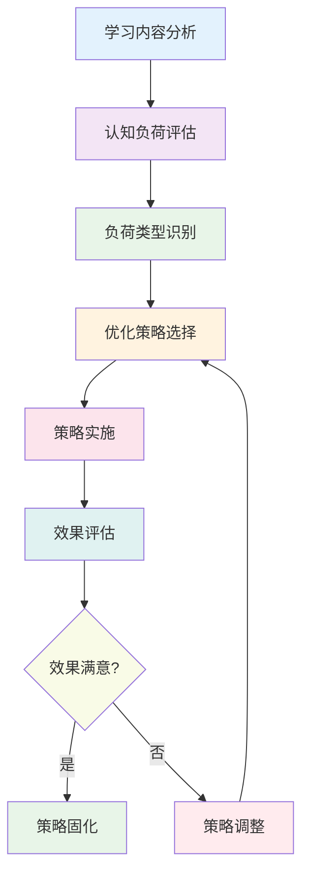
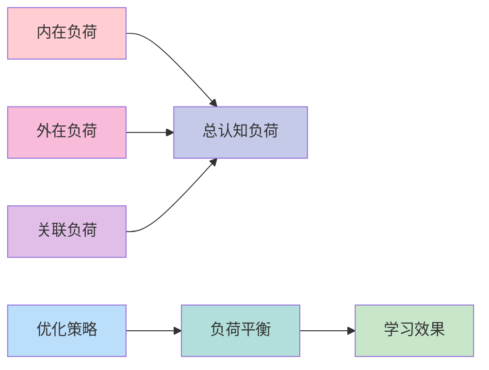

# 认知负荷优化实施指南

## 目录

- [认知负荷优化实施指南](#认知负荷优化实施指南)
  - [目录](#目录)
  - [📖 概述](#-概述)
  - [🧠 认知负荷理论基础](#-认知负荷理论基础)
    - [1. 认知负荷类型](#1-认知负荷类型)
    - [2. 认知负荷测量](#2-认知负荷测量)
    - [3. 优化目标设定](#3-优化目标设定)
  - [📚 教学策略优化](#-教学策略优化)
    - [4. 内在负荷优化](#4-内在负荷优化)
    - [5. 外在负荷优化](#5-外在负荷优化)
    - [6. 关联负荷优化](#6-关联负荷优化)
  - [🎯 具体实施方法](#-具体实施方法)
    - [7. 知识分块策略](#7-知识分块策略)
    - [8. 多媒体整合](#8-多媒体整合)
    - [9. 脚手架设计](#9-脚手架设计)
  - [📊 多表征内容](#-多表征内容)
    - [📈 图表展示](#-图表展示)
  - [🤔 批判性分析](#-批判性分析)
    - [优化策略的局限性](#优化策略的局限性)
    - [个体差异的处理](#个体差异的处理)
  - [🔧 评估与改进](#-评估与改进)
    - [评估指标体系](#评估指标体系)
    - [持续改进机制](#持续改进机制)

---

## 📖 概述

- **定义**: 基于认知负荷理论，通过系统性的教学策略优化，减少学习者的认知负担，提高学习效率
- **目标**: 在保证学习质量的前提下，最大化学习效率，避免认知过载
- **理论基础**: 认知负荷理论、工作记忆模型、多媒体学习理论
- **应用价值**: 指导教学设计，优化学习体验，提高学习效果

## 🧠 认知负荷理论基础

### 1. 认知负荷类型

**⚡ 认知负荷分类**

| 负荷类型 | 定义 | 特征 | 优化策略 |
|---------|------|------|----------|
| **内在负荷** | 材料本身的复杂性 | 不可减少 | 分块教学 |
| **外在负荷** | 呈现方式造成的负荷 | 可优化 | 改进设计 |
| **关联负荷** | 促进学习的认知活动 | 应增加 | 提供支持 |

**📊 负荷关系模型**

```text
总认知负荷 = 内在负荷 + 外在负荷 + 关联负荷
优化目标: 最小化(内在负荷 + 外在负荷) + 最大化(关联负荷)
```

**🎯 负荷平衡原则**

1. **内在负荷**: 控制在学习者能力范围内
2. **外在负荷**: 通过设计优化最小化
3. **关联负荷**: 在总负荷允许范围内最大化

### 2. 认知负荷测量

**📏 测量方法**

| 测量方法 | 指标 | 优点 | 缺点 |
|---------|------|------|------|
| **主观量表** | NASA-TLX | 操作简单 | 主观性强 |
| **生理指标** | 心率、瞳孔 | 客观准确 | 设备复杂 |
| **行为指标** | 反应时间 | 直接测量 | 干扰学习 |
| **眼动追踪** | 注视时间 | 精确测量 | 设备昂贵 |

**📊 负荷评估量表**

| 维度 | 评分范围 | 评估内容 | 优化目标 |
|------|----------|----------|----------|
| **心理需求** | 1-10 | 任务复杂性 | < 6 |
| **生理需求** | 1-10 | 身体疲劳 | < 5 |
| **时间压力** | 1-10 | 时间紧迫感 | < 6 |
| **努力程度** | 1-10 | 主观努力 | < 7 |
| **挫折水平** | 1-10 | 负面情绪 | < 4 |
| **表现水平** | 1-10 | 学习效果 | > 7 |

### 3. 优化目标设定

**🎯 优化目标**

```
目标函数: max(学习效果) - min(认知负荷)
约束条件:
- 认知负荷 ≤ 工作记忆容量
- 学习效果 ≥ 最低要求
- 时间投入 ≤ 可用时间
```

**📈 优化指标**

| 指标类型 | 具体指标 | 目标值 | 测量方法 |
|---------|----------|--------|----------|
| **学习效果** | 理解深度 | > 80% | 测试评估 |
| **认知负荷** | 主观负荷 | < 6 | 量表测量 |
| **学习效率** | 时间效率 | > 70% | 时间分析 |
| **迁移能力** | 应用能力 | > 60% | 实践评估 |

## 📚 教学策略优化

### 4. 内在负荷优化

**🔧 内在负荷管理策略**

| 策略类型 | 具体方法 | 适用场景 | 预期效果 |
|---------|----------|----------|----------|
| **概念分解** | 复杂概念分解为简单概念 | 抽象概念教学 | 负荷减少30% |
| **渐进学习** | 从简单到复杂的递进 | 新知识学习 | 负荷减少25% |
| **类比教学** | 用熟悉概念类比新概念 | 抽象理论教学 | 负荷减少20% |
| **实例教学** | 通过具体实例理解抽象 | 理论应用教学 | 负荷减少35% |

**📊 概念分解示例**

| 原始概念 | 分解概念 | 学习顺序 | 认知负荷 |
|---------|----------|----------|----------|
| **函数** | 变量、对应关系、表达式 | 1→2→3 | 低→中→高 |
| **导数** | 变化率、极限、几何意义 | 1→2→3 | 低→中→高 |
| **积分** | 面积、累加、反导数 | 1→2→3 | 低→中→高 |

### 5. 外在负荷优化

**🎨 多媒体设计原则**

| 设计原则 | 具体应用 | 负荷减少 | 实施难度 |
|---------|----------|----------|----------|
| **一致性原则** | 统一设计风格 | 15% | 低 |
| **简洁性原则** | 去除冗余信息 | 25% | 中等 |
| **层次性原则** | 信息层次清晰 | 20% | 中等 |
| **对比性原则** | 重要信息突出 | 30% | 低 |

**📱 界面设计优化**

| 设计要素 | 优化策略 | 认知负荷减少 | 实施建议 |
|---------|----------|-------------|----------|
| **布局设计** | 网格系统、对齐 | 20% | 使用设计模板 |
| **色彩搭配** | 对比度、一致性 | 15% | 遵循色彩理论 |
| **字体选择** | 可读性、层次性 | 10% | 选择标准字体 |
| **图标设计** | 简洁、语义明确 | 25% | 使用标准图标 |

### 6. 关联负荷优化

**🔄 关联负荷增强策略**

| 策略类型 | 具体方法 | 适用场景 | 预期效果 |
|---------|----------|----------|----------|
| **概念图** | 可视化概念关系 | 知识整合 | 理解深度+25% |
| **类比推理** | 建立概念类比 | 抽象概念 | 迁移能力+30% |
| **问题解决** | 应用知识解决问题 | 实践应用 | 应用能力+40% |
| **反思总结** | 主动反思学习过程 | 元认知培养 | 学习策略+20% |

**📊 关联负荷评估**

| 评估维度 | 评估指标 | 目标值 | 测量方法 |
|---------|----------|--------|----------|
| **概念关联** | 概念图完整性 | > 80% | 概念图分析 |
| **知识迁移** | 迁移成功率 | > 70% | 迁移测试 |
| **问题解决** | 解决效率 | > 75% | 问题解决测试 |
| **元认知** | 反思深度 | > 60% | 反思日志分析 |

## 🎯 具体实施方法

### 7. 知识分块策略

**📦 分块原则**

1. **容量原则**: 每块信息量不超过7±2个元素
2. **关联原则**: 块内元素高度关联
3. **层次原则**: 块间有清晰的层次关系
4. **渐进原则**: 从简单块到复杂块

**📊 分块示例**

| 学科 | 原始内容 | 分块策略 | 块化后结构 |
|------|----------|----------|------------|
| **数学** | 20个概念 | 4×5分组 | 4个知识块 |
| **物理** | 15个概念 | 3×5分组 | 3个知识块 |
| **化学** | 18个概念 | 3×6分组 | 3个知识块 |
| **生物** | 22个概念 | 4×5+2分组 | 5个知识块 |

**🔧 分块实施步骤**

1. **内容分析**: 识别核心概念和关联关系
2. **关联聚类**: 基于关联度进行概念聚类
3. **容量控制**: 确保每块容量在7±2范围内
4. **层次设计**: 建立块间的层次关系
5. **测试验证**: 通过测试验证分块效果

### 8. 多媒体整合

**🎬 多媒体设计原则**

| 原则 | 具体应用 | 认知负荷影响 | 实施建议 |
|------|----------|-------------|----------|
| **冗余原则** | 避免重复信息 | 减少外在负荷 | 统一信息源 |
| **空间接近** | 相关元素靠近 | 减少搜索负荷 | 合理布局 |
| **时间接近** | 相关元素同步 | 减少整合负荷 | 同步呈现 |
| **一致性** | 统一设计风格 | 减少适应负荷 | 建立规范 |

**📱 多媒体类型选择**

| 内容类型 | 推荐媒体 | 认知负荷 | 适用场景 |
|---------|----------|----------|----------|
| **概念解释** | 文字+图表 | 低 | 抽象概念 |
| **过程演示** | 动画+解说 | 中 | 动态过程 |
| **空间关系** | 3D模型 | 中 | 空间概念 |
| **数据展示** | 图表+文字 | 低 | 数据分析 |

### 9. 脚手架设计

**🏗️ 脚手架类型**

| 脚手架类型 | 功能 | 适用场景 | 实施方法 |
|---------|------|----------|----------|
| **概念脚手架** | 提供概念支持 | 新概念学习 | 类比、实例 |
| **过程脚手架** | 指导学习过程 | 复杂任务 | 步骤分解 |
| **策略脚手架** | 提供学习策略 | 策略培养 | 策略提示 |
| **元认知脚手架** | 促进反思 | 元认知培养 | 反思问题 |

**📊 脚手架设计原则**

| 设计原则 | 具体应用 | 效果评估 | 调整策略 |
|---------|----------|----------|----------|
| **适时性** | 在需要时提供 | 使用时机 | 动态调整 |
| **适量性** | 提供适度支持 | 支持程度 | 逐步减少 |
| **适切性** | 符合学习者特点 | 个性化程度 | 个体化设计 |
| **适时撤离** | 逐步减少支持 | 独立程度 | 渐进撤离 |

## 📊 多表征内容

### 📈 图表展示

**认知负荷优化流程图**



**认知负荷平衡模型**



## 🤔 批判性分析

### 优化策略的局限性

**⚠️ 局限性分析**

1. **个体差异**: 不同学习者的认知能力差异很大
2. **文化背景**: 文化背景影响认知负荷的感知
3. **学习风格**: 不同学习风格需要不同的优化策略
4. **动态变化**: 认知负荷在学习过程中动态变化

**🔄 应对策略**

- 建立个性化优化机制
- 考虑文化敏感性
- 提供多样化策略选择
- 建立动态调整机制

### 个体差异的处理

**👥 个体差异类型**

| 差异类型 | 影响因素 | 优化策略 | 实施建议 |
|---------|----------|----------|----------|
| **认知能力** | 工作记忆容量 | 个性化分块 | 能力测试 |
| **学习风格** | 感知偏好 | 多模态呈现 | 风格诊断 |
| **先验知识** | 知识基础 | 差异化起点 | 知识评估 |
| **动机水平** | 学习动机 | 动机激发 | 兴趣调查 |

**📊 个性化优化策略**

| 学习者类型 | 特征 | 优化策略 | 预期效果 |
|-----------|------|----------|----------|
| **高能力者** | 工作记忆大 | 大块学习 | 效率+30% |
| **低能力者** | 工作记忆小 | 小块学习 | 理解+40% |
| **视觉型** | 视觉偏好 | 图表为主 | 记忆+25% |
| **听觉型** | 听觉偏好 | 音频为主 | 理解+30% |

## 🔧 评估与改进

### 评估指标体系

**📊 评估维度**

| 评估维度 | 具体指标 | 测量方法 | 目标值 |
|---------|----------|----------|--------|
| **认知负荷** | 主观负荷评分 | NASA-TLX量表 | < 6 |
| **学习效果** | 理解深度 | 测试评估 | > 80% |
| **学习效率** | 时间效率 | 时间分析 | > 70% |
| **迁移能力** | 应用能力 | 实践评估 | > 60% |

### 持续改进机制

**🔄 改进循环**

1. **数据收集**: 收集学习效果和认知负荷数据
2. **数据分析**: 分析优化策略的效果
3. **策略调整**: 基于分析结果调整策略
4. **效果验证**: 验证调整后的策略效果
5. **策略固化**: 将有效策略固化为标准

**📈 改进指标**

| 改进指标 | 计算方法 | 目标值 | 监控频率 |
|---------|----------|--------|----------|
| **负荷减少率** | (原始负荷-优化后负荷)/原始负荷 | > 20% | 每周 |
| **效果提升率** | (优化后效果-原始效果)/原始效果 | > 15% | 每月 |
| **效率提升率** | (优化后效率-原始效率)/原始效率 | > 25% | 每月 |
| **满意度评分** | 学习者满意度评分 | > 4.0 | 每学期 |

---

*本文档为认知负荷优化提供了系统的实施指南，确保在保证学习质量的前提下最大化学习效率。* 