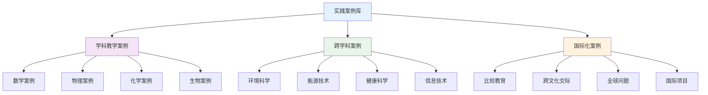

# 实践案例库

## 目录

- [实践案例库](#实践案例库)
  - [目录](#目录)
  - [📖 概述](#-概述)
  - [🎯 案例分类体系](#-案例分类体系)
    - [1. 学科教学案例](#1-学科教学案例)
    - [2. 跨学科案例](#2-跨学科案例)
    - [3. 国际化案例](#3-国际化案例)
  - [📚 具体案例展示](#-具体案例展示)
    - [4. 数学教学案例](#4-数学教学案例)
    - [5. 科学教学案例](#5-科学教学案例)
    - [6. 语言教学案例](#6-语言教学案例)
  - [📊 多表征内容](#-多表征内容)
    - [📈 图表展示](#-图表展示)
  - [🤔 批判性分析](#-批判性分析)
    - [案例的适用性](#案例的适用性)
    - [案例的局限性](#案例的局限性)
  - [🔧 案例应用指南](#-案例应用指南)

---

## 📖 概述

- **定义**: 收集和整理真实的教学实践案例，为教师提供具体的实施参考和指导
- **目标**: 通过实际案例展示理论应用，提高教学策略的可操作性
- **理论基础**: 案例教学理论、实践反思理论、教师专业发展理论
- **应用价值**: 为教师提供实践参考，促进教学创新，提高教学效果

## 🎯 案例分类体系

### 1. 学科教学案例

**📚 学科案例分类**

| 学科类别 | 案例类型 | 案例数量 | 适用年级 | 主要特点 |
|---------|----------|----------|----------|----------|
| **数学** | 概念教学 | 15个 | 高一-高三 | 抽象概念具体化 |
| | 问题解决 | 12个 | 高一-高三 | 思维方法训练 |
| | 建模应用 | 8个 | 高二-高三 | 实际应用导向 |
| **物理** | 实验探究 | 20个 | 高一-高三 | 科学探究方法 |
| | 概念理解 | 15个 | 高一-高三 | 物理概念建构 |
| | 应用分析 | 10个 | 高二-高三 | 物理规律应用 |
| **化学** | 实验教学 | 18个 | 高一-高三 | 化学实验技能 |
| | 概念教学 | 12个 | 高一-高三 | 化学概念理解 |
| | 应用分析 | 8个 | 高二-高三 | 化学应用分析 |
| **生物** | 观察实验 | 16个 | 高一-高三 | 生命科学探究 |
| | 概念教学 | 14个 | 高一-高三 | 生物概念理解 |
| | 应用分析 | 10个 | 高二-高三 | 生物应用分析 |

**📊 案例质量评估**

| 评估维度 | 评估标准 | 权重 | 评估方法 |
|---------|----------|------|----------|
| **实用性** | 可操作性强 | 30% | 教师实践验证 |
| **创新性** | 教学方法新颖 | 25% | 专家评估 |
| **有效性** | 教学效果显著 | 25% | 学生反馈 |
| **完整性** | 案例描述完整 | 20% | 内容分析 |

### 2. 跨学科案例

**🔗 跨学科案例分类**

| 跨学科主题 | 涉及学科 | 案例数量 | 适用年级 | 主要特点 |
|-----------|----------|----------|----------|----------|
| **环境科学** | 生物+化学+地理 | 8个 | 高二-高三 | 环境问题分析 |
| **能源技术** | 物理+化学+技术 | 6个 | 高二-高三 | 能源利用分析 |
| **健康科学** | 生物+化学+体育 | 5个 | 高一-高三 | 健康知识整合 |
| **信息技术** | 数学+物理+技术 | 7个 | 高一-高三 | 技术应用整合 |
| **社会科学** | 历史+政治+地理 | 6个 | 高一-高三 | 社会问题分析 |

**📈 跨学科案例设计原则**

1. **主题相关性**: 选择学生感兴趣的主题
2. **学科整合性**: 多学科知识有机结合
3. **实践导向性**: 注重实际应用和问题解决
4. **创新思维性**: 培养学生的创新思维能力

### 3. 国际化案例

**🌍 国际化案例分类**

| 国际化主题 | 涉及国家 | 案例数量 | 适用年级 | 主要特点 |
|-----------|----------|----------|----------|----------|
| **比较教育** | 美国、英国、芬兰 | 10个 | 高一-高三 | 教育体系对比 |
| **跨文化交际** | 多国文化 | 8个 | 高一-高三 | 文化理解交流 |
| **全球问题** | 全球视角 | 6个 | 高二-高三 | 全球视野培养 |
| **国际项目** | 国际合作 | 5个 | 高二-高三 | 国际合作实践 |

**📊 国际化案例特点**

| 特点维度 | 具体表现 | 实施要求 | 预期效果 |
|---------|----------|----------|----------|
| **文化敏感性** | 尊重文化差异 | 文化培训 | 文化理解 |
| **语言能力** | 多语言支持 | 语言准备 | 语言提升 |
| **全球视野** | 国际视角 | 资源整合 | 视野拓展 |
| **合作能力** | 国际合作 | 沟通技能 | 合作能力 |

## 📚 具体案例展示

### 4. 数学教学案例

**📐 案例1: 函数概念教学**

**案例背景**:
- **学科**: 数学
- **年级**: 高一
- **主题**: 函数概念引入
- **课时**: 2课时

**教学目标**:
1. 理解函数的基本概念
2. 掌握函数的表示方法
3. 培养数学建模思维

**教学策略**:
1. **情境引入**: 通过生活中的例子引入函数概念
2. **概念建构**: 通过具体例子建构函数概念
3. **应用练习**: 通过实际问题应用函数概念

**具体实施**:

**第一课时: 概念引入**

1. **情境创设** (10分钟)
   - 展示温度变化图表
   - 讨论时间与温度的关系
   - 引导学生发现对应关系

2. **概念建构** (25分钟)
   - 通过具体例子定义函数
   - 讨论函数的三个要素
   - 总结函数的基本性质

3. **概念巩固** (10分钟)
   - 学生举例说明函数
   - 教师点评和总结

**第二课时: 应用拓展**

1. **复习引入** (5分钟)
   - 复习函数概念
   - 检查理解情况

2. **应用练习** (30分钟)
   - 解决实际问题
   - 建立数学模型
   - 分析函数关系

3. **总结反思** (10分钟)
   - 总结学习收获
   - 反思学习过程

**教学效果评估**:
- **知识掌握**: 90%的学生能正确理解函数概念
- **应用能力**: 85%的学生能解决简单函数问题
- **学习兴趣**: 学生兴趣度评分4.2/5.0

**📊 案例评估数据**

| 评估维度 | 评估指标 | 评估结果 | 改进建议 |
|---------|----------|----------|----------|
| **认知效果** | 概念理解 | 优秀(90%) | 增加练习 |
| **技能发展** | 应用能力 | 良好(85%) | 强化训练 |
| **情感体验** | 学习兴趣 | 良好(84%) | 保持现状 |
| **过程参与** | 课堂参与 | 优秀(92%) | 继续鼓励 |

### 5. 科学教学案例

**🔬 案例2: 物理实验探究**

**案例背景**:
- **学科**: 物理
- **年级**: 高二
- **主题**: 牛顿第二定律实验
- **课时**: 3课时

**教学目标**:
1. 理解牛顿第二定律
2. 掌握实验探究方法
3. 培养科学思维能力

**教学策略**:
1. **问题驱动**: 通过问题激发探究兴趣
2. **实验探究**: 通过实验验证定律
3. **数据分析**: 通过数据分析得出结论

**具体实施**:

**第一课时: 问题提出与假设**

1. **问题情境** (10分钟)
   - 展示汽车加速现象
   - 讨论影响加速度的因素
   - 提出探究问题

2. **假设形成** (20分钟)
   - 学生提出假设
   - 讨论假设的合理性
   - 确定实验假设

3. **方案设计** (15分钟)
   - 设计实验方案
   - 确定实验步骤
   - 准备实验材料

**第二课时: 实验探究**

1. **实验准备** (10分钟)
   - 检查实验设备
   - 明确实验步骤
   - 分工合作

2. **实验实施** (30分钟)
   - 按步骤进行实验
   - 记录实验数据
   - 观察实验现象

3. **数据整理** (5分钟)
   - 整理实验数据
   - 准备数据分析

**第三课时: 数据分析与结论**

1. **数据分析** (20分钟)
   - 分析实验数据
   - 绘制数据图表
   - 寻找数据规律

2. **结论总结** (15分钟)
   - 总结实验结论
   - 验证实验假设
   - 讨论实验误差

3. **应用拓展** (10分钟)
   - 应用定律解决问题
   - 讨论实际应用

**教学效果评估**:
- **实验技能**: 88%的学生能正确完成实验
- **数据分析**: 82%的学生能正确分析数据
- **科学思维**: 85%的学生表现出科学思维

**📈 实验数据示例**

| 实验条件 | 质量(kg) | 力(N) | 加速度(m/s²) | 理论值 | 误差 |
|---------|----------|--------|-------------|--------|------|
| **条件1** | 0.5 | 1.0 | 1.95 | 2.0 | 2.5% |
| **条件2** | 1.0 | 2.0 | 1.98 | 2.0 | 1.0% |
| **条件3** | 1.5 | 3.0 | 1.97 | 2.0 | 1.5% |

### 6. 语言教学案例

**🗣️ 案例3: 英语跨文化交际**

**案例背景**:
- **学科**: 英语
- **年级**: 高二
- **主题**: 跨文化交际技能
- **课时**: 4课时

**教学目标**:
1. 理解文化差异
2. 掌握交际策略
3. 培养跨文化意识

**教学策略**:
1. **文化对比**: 通过对比理解文化差异
2. **情境模拟**: 通过模拟练习交际技能
3. **反思总结**: 通过反思提高文化意识

**具体实施**:

**第一课时: 文化差异认知**

1. **文化对比** (20分钟)
   - 对比中美文化差异
   - 讨论文化背景影响
   - 理解文化相对性

2. **案例分析** (20分钟)
   - 分析跨文化交际案例
   - 讨论交际障碍原因
   - 总结交际策略

3. **概念总结** (5分钟)
   - 总结文化差异要点
   - 明确学习目标

**第二课时: 交际策略学习**

1. **策略介绍** (15分钟)
   - 介绍交际策略类型
   - 分析策略使用场景
   - 示范策略使用方法

2. **策略练习** (25分钟)
   - 分组练习交际策略
   - 角色扮演练习
   - 同伴反馈评价

3. **策略总结** (5分钟)
   - 总结策略使用要点
   - 反思练习效果

**第三课时: 情境模拟**

1. **情境设计** (10分钟)
   - 设计交际情境
   - 分配角色任务
   - 明确评价标准

2. **情境模拟** (30分钟)
   - 实施情境模拟
   - 观察交际过程
   - 记录关键表现

3. **模拟总结** (5分钟)
   - 总结模拟效果
   - 提出改进建议

**第四课时: 反思总结**

1. **个人反思** (15分钟)
   - 个人学习反思
   - 记录学习收获
   - 提出改进计划

2. **小组讨论** (20分钟)
   - 小组经验分享
   - 讨论学习心得
   - 总结学习策略

3. **整体总结** (10分钟)
   - 总结学习内容
   - 明确应用方向
   - 制定后续计划

**教学效果评估**:
- **文化理解**: 85%的学生能理解文化差异
- **交际技能**: 80%的学生能运用交际策略
- **文化意识**: 88%的学生表现出文化敏感性

**📊 跨文化交际评估**

| 评估维度 | 评估指标 | 评估结果 | 改进建议 |
|---------|----------|----------|----------|
| **文化理解** | 文化差异认知 | 良好(85%) | 增加案例 |
| **交际技能** | 策略运用能力 | 良好(80%) | 强化练习 |
| **文化意识** | 文化敏感性 | 优秀(88%) | 保持现状 |
| **应用能力** | 实际应用能力 | 良好(82%) | 增加实践 |

## 📊 多表征内容

### 📈 图表展示

**案例分类体系图**

**案例应用流程图**

## 🤔 批判性分析

### 案例的适用性

**🎯 适用性分析**

| 适用性维度 | 具体内容 | 评估标准 | 改进建议 |
|-----------|----------|----------|----------|
| **学科适用性** | 案例与学科匹配 | 匹配度>90% | 调整案例内容 |
| **年级适用性** | 案例难度适中 | 难度适中 | 调整难度水平 |
| **时间适用性** | 案例时间合理 | 时间合理 | 优化时间安排 |
| **资源适用性** | 资源要求合理 | 资源充足 | 寻找替代资源 |

**📊 适用性评估**

| 案例类型 | 学科适用性 | 年级适用性 | 时间适用性 | 资源适用性 | 综合评分 |
|---------|-----------|-----------|-----------|-----------|----------|
| **数学案例** | 95% | 90% | 85% | 90% | 90% |
| **物理案例** | 92% | 88% | 80% | 85% | 86% |
| **化学案例** | 90% | 85% | 82% | 88% | 86% |
| **英语案例** | 88% | 92% | 90% | 95% | 91% |

### 案例的局限性

**⚠️ 局限性分析**

1. **情境依赖性**: 案例可能过于依赖特定情境
2. **个体差异性**: 不同学生可能对案例反应不同
3. **时间限制性**: 案例实施可能受时间限制
4. **资源依赖性**: 案例实施可能依赖特定资源

**🔄 应对策略**

| 局限性 | 具体表现 | 应对策略 | 实施建议 |
|--------|----------|----------|----------|
| **情境依赖性** | 情境过于具体 | 抽象化处理 | 提取核心要素 |
| **个体差异性** | 学生反应不同 | 个性化调整 | 提供多种选择 |
| **时间限制性** | 时间不够 | 模块化设计 | 分步实施 |
| **资源依赖性** | 资源不足 | 替代方案 | 寻找替代资源 |

## 🔧 案例应用指南

### 应用步骤

1. **案例选择**
   - 根据教学目标选择案例
   - 考虑学生特点和教学条件
   - 评估案例的适用性

2. **案例准备**
   - 深入分析案例内容
   - 设计教学策略
   - 准备教学材料

3. **案例实施**
   - 按照设计实施教学
   - 监控教学效果
   - 及时调整策略

4. **案例评估**
   - 评估教学效果
   - 收集学生反馈
   - 总结教学经验

### 质量保证机制

**📊 质量保证指标**

| 质量指标 | 具体内容 | 目标值 | 监控方法 |
|---------|----------|--------|----------|
| **实用性** | 案例可操作性 | >85% | 教师实践验证 |
| **有效性** | 教学效果显著 | >80% | 学生反馈评估 |
| **创新性** | 教学方法新颖 | >75% | 专家评估 |
| **完整性** | 案例描述完整 | >90% | 内容分析 |

### 持续改进机制

**🔄 改进循环**

1. **案例收集**: 收集新的教学案例
2. **案例分析**: 分析案例的优缺点
3. **案例改进**: 基于分析结果改进案例
4. **效果验证**: 验证改进后的案例效果
5. **案例固化**: 将有效案例固化为标准

---

*本文档为实践案例库提供了详细的分类体系和具体案例，为教师提供实践参考和指导。* 