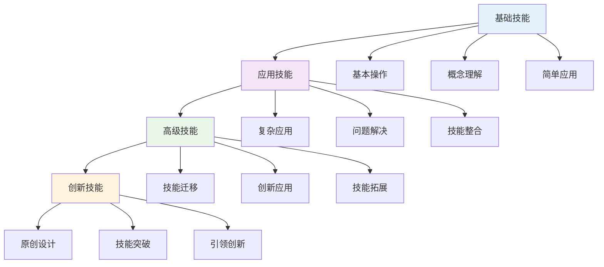
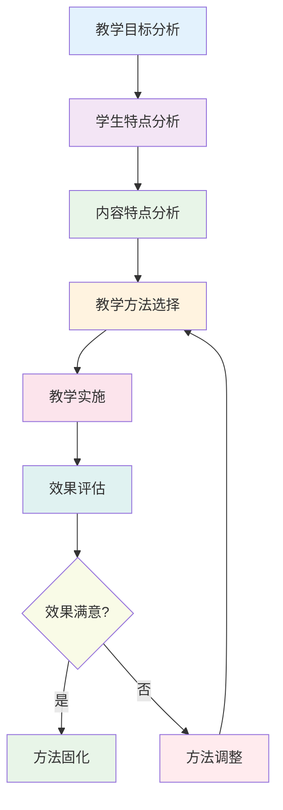
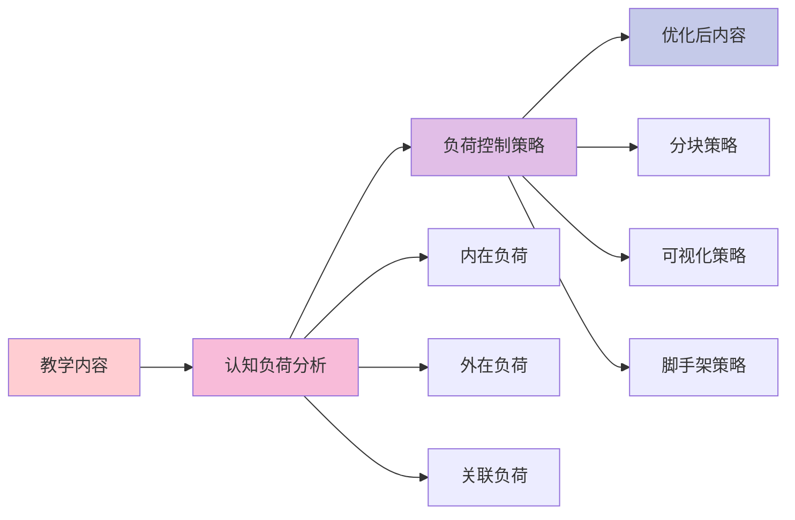

# 教学策略具体化实施指南

## 目录

- [教学策略具体化实施指南](#教学策略具体化实施指南)
  - [目录](#目录)
  - [📖 概述](#-概述)
  - [🎯 教学目标设计](#-教学目标设计)
    - [1. 认知目标设计](#1-认知目标设计)
    - [2. 技能目标设计](#2-技能目标设计)
    - [3. 情感目标设计](#3-情感目标设计)
  - [📚 教学内容组织](#-教学内容组织)
    - [4. 知识结构设计](#4-知识结构设计)
    - [5. 学习路径规划](#5-学习路径规划)
    - [6. 认知负荷控制](#6-认知负荷控制)
  - [🔄 教学方法选择](#-教学方法选择)
    - [7. 直接教学法](#7-直接教学法)
    - [8. 探究式教学法](#8-探究式教学法)
    - [9. 合作学习法](#9-合作学习法)
  - [📊 多表征内容](#-多表征内容)
    - [📈 图表展示](#-图表展示)
  - [🤔 批判性分析](#-批判性分析)
    - [策略选择的考虑因素](#策略选择的考虑因素)
    - [实施中的挑战](#实施中的挑战)
  - [🔧 实施与评估](#-实施与评估)
    - [实施步骤](#实施步骤)
    - [评估指标体系](#评估指标体系)
    - [持续改进机制](#持续改进机制)

---

## 📖 概述

- **定义**: 将教育理论转化为具体可操作的教学策略，为教师提供详细的教学指导
- **目标**: 确保教学策略的可操作性、有效性和适应性
- **理论基础**: 认知负荷理论、建构主义学习理论、多元智能理论
- **应用价值**: 指导实际教学实践，提高教学效果，促进学生全面发展

## 🎯 教学目标设计

### 1. 认知目标设计

**🧠 认知层次分类**

基于布鲁姆认知分类理论：

| 认知层次 | 行为动词 | 具体目标示例 | 评估方法 |
|---------|----------|-------------|----------|
| **记忆** | 识别、回忆、列举 | 能识别数学函数的基本形式 | 选择题、填空题 |
| **理解** | 解释、总结、举例 | 能解释物理定律的实际应用 | 简答题、案例分析 |
| **应用** | 计算、解决、演示 | 能解决化学计算问题 | 计算题、实验操作 |
| **分析** | 比较、分类、分析 | 能分析不同文化背景的差异 | 对比分析、研究报告 |
| **评价** | 评价、判断、批判 | 能评价不同观点的合理性 | 辩论、评论写作 |
| **创造** | 设计、创作、构建 | 能设计创新性解决方案 | 项目作品、创意设计 |

**📊 认知目标设计模板**

| 学科 | 核心概念 | 认知目标 | 具体表现 | 评估标准 |
|------|----------|----------|----------|----------|
| **数学** | 函数概念 | 理解函数的基本性质 | 能画出函数图像 | 图像准确性>90% |
| **物理** | 力学定律 | 应用牛顿定律 | 能解决力学问题 | 解题正确率>80% |
| **化学** | 化学反应 | 分析反应机理 | 能预测反应产物 | 预测准确率>75% |
| **语文** | 文学鉴赏 | 评价文学作品 | 能写出文学评论 | 评论深度>3分 |

### 2. 技能目标设计

**🛠️ 技能类型分类**

| 技能类型 | 具体技能 | 培养方法 | 评估方式 |
|---------|----------|----------|----------|
| **认知技能** | 批判思维、逻辑推理 | 问题解决、辩论 | 思维测试 |
| **实践技能** | 实验操作、技术应用 | 实验教学、项目实践 | 操作考核 |
| **社交技能** | 沟通协作、领导力 | 小组合作、角色扮演 | 同伴评价 |
| **创新技能** | 创意设计、问题发现 | 头脑风暴、创新项目 | 作品评价 |

**📈 技能发展路径**

### 3. 情感目标设计

**💝 情感目标维度**

| 情感维度 | 具体目标 | 培养策略 | 评估方法 |
|---------|----------|----------|----------|
| **学习兴趣** | 对学科产生浓厚兴趣 | 趣味性教学、成功体验 | 兴趣量表 |
| **学习动机** | 形成内在学习动机 | 目标设定、成就感 | 动机问卷 |
| **学习态度** | 形成积极学习态度 | 榜样示范、正面强化 | 态度量表 |
| **价值观** | 形成正确价值观 | 价值澄清、道德讨论 | 价值观问卷 |

**🎯 情感目标设计原则**

1. **渐进性原则**: 从简单到复杂的情感体验
2. **体验性原则**: 通过实际体验培养情感
3. **个性化原则**: 考虑学生个体差异
4. **持续性原则**: 长期坚持培养

## 📚 教学内容组织

### 4. 知识结构设计

**🔗 知识结构类型**

| 结构类型 | 特点 | 适用学科 | 设计原则 |
|---------|------|----------|----------|
| **层次结构** | 从基础到高级 | 数学、物理 | 逻辑递进 |
| **网络结构** | 概念相互关联 | 生物、化学 | 关联清晰 |
| **螺旋结构** | 循环深化 | 语文、历史 | 螺旋上升 |
| **模块结构** | 相对独立 | 技术、艺术 | 模块化设计 |

**📊 知识结构设计模板**

| 学科 | 核心概念 | 基础概念 | 应用概念 | 拓展概念 |
|------|----------|----------|----------|----------|
| **数学** | 函数 | 变量、对应关系 | 函数性质、图像 | 复合函数、反函数 |
| **物理** | 力学 | 力、运动 | 牛顿定律、能量 | 动量、角动量 |
| **化学** | 化学反应 | 原子、分子 | 化学键、反应 | 催化、平衡 |
| **生物** | 生命系统 | 细胞、组织 | 器官、系统 | 生态、进化 |

### 5. 学习路径规划

**🛤️ 学习路径设计原则**

1. **认知负荷原则**: 控制每步的认知负荷
2. **先验知识原则**: 基于学生已有知识
3. **兴趣激发原则**: 激发学习兴趣和动机
4. **反馈调整原则**: 及时反馈和调整

**📈 学习路径示例**

| 学习阶段 | 学习内容 | 教学方法 | 预期时间 | 评估方式 |
|---------|----------|----------|----------|----------|
| **引入阶段** | 概念引入 | 情境创设 | 10分钟 | 兴趣观察 |
| **理解阶段** | 概念理解 | 讲解演示 | 20分钟 | 理解测试 |
| **应用阶段** | 概念应用 | 练习实践 | 30分钟 | 应用测试 |
| **拓展阶段** | 概念拓展 | 探究活动 | 20分钟 | 拓展评价 |

### 6. 认知负荷控制

**⚡ 认知负荷控制策略**

| 控制策略 | 具体方法 | 适用场景 | 预期效果 |
|---------|----------|----------|----------|
| **分块策略** | 将复杂内容分解 | 抽象概念教学 | 负荷减少30% |
| **可视化策略** | 使用图表、动画 | 空间概念教学 | 负荷减少25% |
| **类比策略** | 用熟悉概念类比 | 新概念引入 | 负荷减少20% |
| **脚手架策略** | 提供学习支持 | 复杂任务学习 | 负荷减少35% |

**📊 认知负荷监控表**

| 教学环节 | 预期负荷 | 实际负荷 | 调整策略 | 效果评估 |
|---------|----------|----------|----------|----------|
| **概念引入** | 低(2-3) | 中(4-5) | 简化语言 | 负荷降低 |
| **概念理解** | 中(4-5) | 高(6-7) | 增加例子 | 理解提高 |
| **概念应用** | 中(4-5) | 中(4-5) | 保持现状 | 效果良好 |
| **概念拓展** | 高(6-7) | 高(6-7) | 分步进行 | 逐步掌握 |

## 🔄 教学方法选择

### 7. 直接教学法

**📝 直接教学法特点**

| 特点 | 优势 | 局限性 | 适用场景 |
|------|------|--------|----------|
| **结构化强** | 逻辑清晰、效率高 | 学生参与度低 | 基础知识教学 |
| **控制性强** | 教师主导、目标明确 | 创新性不足 | 技能训练 |
| **效率高** | 信息传递快 | 个性化不足 | 大班教学 |
| **标准化** | 易于评估 | 灵活性差 | 标准化考试 |

**📋 直接教学法实施步骤**

1. **复习检查** (5分钟)
   - 检查先验知识
   - 激活相关概念

2. **呈现目标** (2分钟)
   - 明确学习目标
   - 激发学习动机

3. **内容呈现** (15分钟)
   - 系统讲解内容
   - 使用多媒体辅助

4. **指导练习** (10分钟)
   - 教师指导练习
   - 及时纠正错误

5. **独立练习** (8分钟)
   - 学生独立练习
   - 巩固学习内容

### 8. 探究式教学法

**🔍 探究式教学法特点**

| 特点 | 优势 | 局限性 | 适用场景 |
|------|------|--------|----------|
| **学生中心** | 激发兴趣、培养能力 | 时间消耗大 | 科学探究 |
| **问题导向** | 培养问题解决能力 | 教师要求高 | 创新教学 |
| **过程重要** | 培养科学思维 | 效率相对低 | 实验教学 |
| **开放性强** | 培养创新思维 | 控制难度大 | 研究性学习 |

**🔬 探究式教学法实施步骤**

1. **问题提出** (5分钟)
   - 创设问题情境
   - 激发探究兴趣

2. **假设形成** (10分钟)
   - 学生提出假设
   - 教师引导讨论

3. **方案设计** (15分钟)
   - 设计探究方案
   - 确定实验步骤

4. **实验探究** (20分钟)
   - 实施探究活动
   - 收集实验数据

5. **结果分析** (10分钟)
   - 分析实验数据
   - 验证假设

6. **结论总结** (5分钟)
   - 总结探究结果
   - 反思探究过程

### 9. 合作学习法

**🤝 合作学习法特点**

| 特点 | 优势 | 局限性 | 适用场景 |
|------|------|--------|----------|
| **互动性强** | 培养社交技能 | 管理难度大 | 小组活动 |
| **资源共享** | 发挥集体智慧 | 个体差异大 | 项目学习 |
| **责任分担** | 培养责任感 | 搭便车现象 | 团队合作 |
| **多元评价** | 全面评价学生 | 评价复杂 | 综合评估 |

**👥 合作学习法实施步骤**

1. **小组组建** (5分钟)
   - 合理分组
   - 明确角色分工

2. **任务分配** (5分钟)
   - 明确学习任务
   - 分配具体工作

3. **合作学习** (25分钟)
   - 小组讨论交流
   - 共同完成任务

4. **成果展示** (10分钟)
   - 小组展示成果
   - 全班交流讨论

5. **评价反思** (5分钟)
   - 评价学习效果
   - 反思合作过程

## 📊 多表征内容

### 📈 图表展示

**教学方法选择流程图**

**认知负荷控制模型**

## 🤔 批判性分析

### 策略选择的考虑因素

**🎯 选择因素分析**

| 考虑因素 | 权重 | 具体内容 | 影响程度 |
|---------|------|----------|----------|
| **教学目标** | 30% | 认知、技能、情感目标 | 高 |
| **学生特点** | 25% | 认知能力、学习风格 | 高 |
| **内容特点** | 20% | 抽象程度、复杂度 | 中 |
| **教学条件** | 15% | 时间、设备、环境 | 中 |
| **教师能力** | 10% | 教学经验、专业素养 | 低 |

**📊 策略选择矩阵**

| 教学方法 | 认知目标 | 技能目标 | 情感目标 | 适用性评分 |
|---------|----------|----------|----------|-----------|
| **直接教学法** | 高 | 中 | 低 | 7.5/10 |
| **探究式教学法** | 中 | 高 | 高 | 8.0/10 |
| **合作学习法** | 中 | 高 | 高 | 8.5/10 |

### 实施中的挑战

**⚠️ 主要挑战**

1. **学生差异**: 不同学生的认知能力和学习风格差异很大
2. **时间限制**: 教学时间有限，难以实施复杂的教学策略
3. **资源不足**: 教学设备和材料可能不足
4. **评价困难**: 复杂教学策略的评价标准难以确定

**🔄 应对策略**

| 挑战类型 | 具体挑战 | 应对策略 | 实施建议 |
|---------|----------|----------|----------|
| **学生差异** | 能力水平不同 | 分层教学 | 建立学习档案 |
| **时间限制** | 教学时间不足 | 优化设计 | 精简教学内容 |
| **资源不足** | 设备材料缺乏 | 替代方案 | 利用现有资源 |
| **评价困难** | 标准不明确 | 多元评价 | 建立评价体系 |

## 🔧 实施与评估

### 实施步骤

1. **前期准备**
   - 分析教学目标和学生特点
   - 选择合适的教学策略
   - 准备教学材料和设备

2. **教学实施**
   - 按照设计步骤实施教学
   - 监控学生学习状态
   - 及时调整教学策略

3. **效果评估**
   - 收集学生学习数据
   - 分析教学效果
   - 总结教学经验

### 评估指标体系

**📊 评估维度**

| 评估维度 | 具体指标 | 评估方法 | 权重 |
|---------|----------|----------|------|
| **学习效果** | 知识掌握程度 | 测试评估 | 40% |
| **学习过程** | 学习参与度 | 观察记录 | 30% |
| **学习态度** | 学习兴趣和动机 | 问卷调查 | 20% |
| **技能发展** | 实践能力提升 | 表现评价 | 10% |

### 持续改进机制

**🔄 改进循环**

1. **数据收集**: 收集教学效果数据
2. **数据分析**: 分析教学策略效果
3. **策略调整**: 基于分析结果调整策略
4. **效果验证**: 验证调整后的策略效果
5. **策略固化**: 将有效策略固化为标准

---

*本文档为教学策略的具体化实施提供了详细的指导，确保教学策略的可操作性和有效性。* 