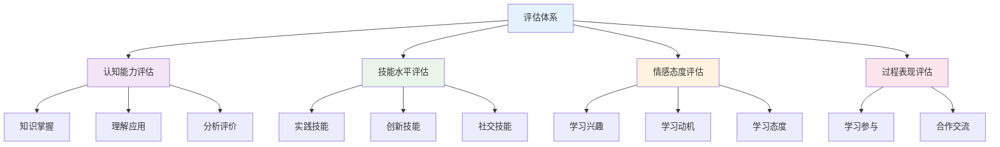
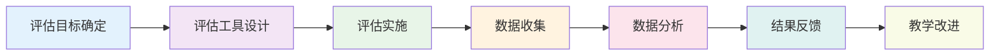

# 评估体系量化设计

## 目录

- [评估体系量化设计](#评估体系量化设计)
  - [目录](#目录)
  - [📖 概述](#-概述)
  - [📊 评估框架设计](#-评估框架设计)
    - [1. 评估维度确定](#1-评估维度确定)
    - [2. 评估指标体系](#2-评估指标体系)
    - [3. 评估权重分配](#3-评估权重分配)
  - [🔢 量化指标设计](#-量化指标设计)
    - [4. 认知能力评估](#4-认知能力评估)
    - [5. 技能水平评估](#5-技能水平评估)
    - [6. 情感态度评估](#6-情感态度评估)
  - [📈 测量方法设计](#-测量方法设计)
    - [7. 标准化测试](#7-标准化测试)
    - [8. 表现性评估](#8-表现性评估)
    - [9. 形成性评估](#9-形成性评估)
  - [📊 多表征内容](#-多表征内容)
    - [📈 图表展示](#-图表展示)
  - [🤔 批判性分析](#-批判性分析)
    - [量化评估的局限性](#量化评估的局限性)
    - [评估公平性考虑](#评估公平性考虑)
  - [🔧 实施与改进](#-实施与改进)
    - [实施步骤](#实施步骤)
    - [质量保证机制](#质量保证机制)
    - [持续改进机制](#持续改进机制)

---

## 📖 概述

- **定义**: 建立科学、客观、可量化的教育评估体系，为教学效果提供精确的测量标准
- **目标**: 确保评估的准确性、公平性和有效性，为教学改进提供数据支撑
- **理论基础**: 教育测量理论、心理测量学、认知科学评估理论
- **应用价值**: 指导教学实践，优化学习过程，提高教育质量

## 📊 评估框架设计

### 1. 评估维度确定

**🎯 评估维度分类**

| 评估维度 | 具体内容 | 评估重点 | 测量方法 |
|---------|----------|----------|----------|
| **认知维度** | 知识掌握、理解深度 | 学习效果 | 标准化测试 |
| **技能维度** | 实践能力、应用水平 | 能力发展 | 表现性评估 |
| **情感维度** | 学习态度、兴趣动机 | 学习体验 | 问卷调查 |
| **过程维度** | 学习参与、合作交流 | 学习过程 | 观察记录 |

**📊 评估维度权重**

| 评估维度 | 权重分配 | 具体指标 | 评估频率 |
|---------|----------|----------|----------|
| **认知维度** | 40% | 知识掌握、理解应用 | 每单元 |
| **技能维度** | 30% | 实践能力、创新能力 | 每项目 |
| **情感维度** | 20% | 学习兴趣、学习动机 | 每学期 |
| **过程维度** | 10% | 学习参与、合作交流 | 每节课 |

### 2. 评估指标体系

**📋 评估指标体系结构**

```
评估体系
├── 认知能力评估 (40%)
│   ├── 知识掌握 (15%)
│   ├── 理解应用 (15%)
│   └── 分析评价 (10%)
├── 技能水平评估 (30%)
│   ├── 实践技能 (15%)
│   ├── 创新技能 (10%)
│   └── 社交技能 (5%)
├── 情感态度评估 (20%)
│   ├── 学习兴趣 (10%)
│   ├── 学习动机 (5%)
│   └── 学习态度 (5%)
└── 过程表现评估 (10%)
    ├── 学习参与 (5%)
    └── 合作交流 (5%)
```

**📊 评估指标详细表**

| 一级指标 | 二级指标 | 三级指标 | 权重 | 评估方法 |
|---------|----------|----------|------|----------|
| **认知能力** | 知识掌握 | 概念理解 | 5% | 测试评估 |
| | | 原理应用 | 5% | 测试评估 |
| | | 问题解决 | 5% | 测试评估 |
| | 理解应用 | 知识迁移 | 5% | 应用测试 |
| | | 综合分析 | 5% | 综合测试 |
| | | 创新应用 | 5% | 创新测试 |
| | 分析评价 | 批判思维 | 5% | 思维测试 |
| | | 价值判断 | 5% | 评价测试 |
| **技能水平** | 实践技能 | 实验操作 | 10% | 操作考核 |
| | | 技术应用 | 5% | 项目评估 |
| | 创新技能 | 创意设计 | 5% | 作品评价 |
| | | 问题发现 | 5% | 创新评估 |
| | 社交技能 | 沟通协作 | 5% | 同伴评价 |
| **情感态度** | 学习兴趣 | 学科兴趣 | 5% | 兴趣量表 |
| | | 探究欲望 | 5% | 动机问卷 |
| | 学习动机 | 内在动机 | 3% | 动机量表 |
| | | 成就动机 | 2% | 动机问卷 |
| | 学习态度 | 学习投入 | 3% | 态度量表 |
| | | 学习坚持 | 2% | 观察记录 |
| **过程表现** | 学习参与 | 课堂参与 | 3% | 观察记录 |
| | | 作业完成 | 2% | 作业评价 |
| | 合作交流 | 小组合作 | 3% | 同伴评价 |
| | | 师生互动 | 2% | 观察记录 |

### 3. 评估权重分配

**⚖️ 权重分配原则**

1. **科学性原则**: 基于认知科学和教育理论
2. **公平性原则**: 考虑不同学习者的特点
3. **实用性原则**: 便于实际操作和测量
4. **发展性原则**: 促进学生全面发展

**📊 权重分配矩阵**

| 评估维度 | 基础权重 | 学科调整 | 年级调整 | 最终权重 |
|---------|----------|----------|----------|----------|
| **认知能力** | 40% | +5% | +0% | 45% |
| **技能水平** | 30% | +0% | +5% | 35% |
| **情感态度** | 20% | -5% | +0% | 15% |
| **过程表现** | 10% | +0% | -5% | 5% |

## 🔢 量化指标设计

### 4. 认知能力评估

**🧠 认知能力量化指标**

| 认知层次 | 量化指标 | 评分标准 | 测量工具 |
|---------|----------|----------|----------|
| **记忆** | 知识回忆率 | 0-100% | 回忆测试 |
| **理解** | 概念理解度 | 0-100% | 理解测试 |
| **应用** | 问题解决率 | 0-100% | 应用测试 |
| **分析** | 分析准确率 | 0-100% | 分析测试 |
| **评价** | 评价合理性 | 0-100% | 评价测试 |
| **创造** | 创新程度 | 0-100% | 创新评估 |

**📊 认知能力评估量表**

| 认知指标 | 优秀(90-100) | 良好(80-89) | 中等(70-79) | 及格(60-69) | 不及格(0-59) |
|---------|-------------|-------------|-------------|-------------|-------------|
| **知识掌握** | 准确率>90% | 准确率80-89% | 准确率70-79% | 准确率60-69% | 准确率<60% |
| **理解应用** | 应用率>90% | 应用率80-89% | 应用率70-79% | 应用率60-69% | 应用率<60% |
| **分析评价** | 分析率>90% | 分析率80-89% | 分析率70-79% | 分析率60-69% | 分析率<60% |

### 5. 技能水平评估

**🛠️ 技能水平量化指标**

| 技能类型 | 量化指标 | 评分标准 | 评估方法 |
|---------|----------|----------|----------|
| **实践技能** | 操作准确率 | 0-100% | 操作考核 |
| **创新技能** | 创新指数 | 0-100% | 创新评估 |
| **社交技能** | 合作效果 | 0-100% | 同伴评价 |
| **学习技能** | 学习效率 | 0-100% | 学习分析 |

**📈 技能评估量表**

| 技能指标 | 优秀(90-100) | 良好(80-89) | 中等(70-79) | 及格(60-69) | 不及格(0-59) |
|---------|-------------|-------------|-------------|-------------|-------------|
| **实践技能** | 熟练操作 | 基本熟练 | 一般操作 | 基本操作 | 操作困难 |
| **创新技能** | 原创设计 | 改进设计 | 模仿设计 | 简单设计 | 无设计 |
| **社交技能** | 主动合作 | 积极参与 | 被动参与 | 偶尔参与 | 不参与 |

### 6. 情感态度评估

**💝 情感态度量化指标**

| 情感维度 | 量化指标 | 评分标准 | 测量工具 |
|---------|----------|----------|----------|
| **学习兴趣** | 兴趣指数 | 0-100% | 兴趣量表 |
| **学习动机** | 动机强度 | 0-100% | 动机问卷 |
| **学习态度** | 态度评分 | 0-100% | 态度量表 |
| **学习体验** | 满意度 | 0-100% | 满意度调查 |

**📊 情感态度评估量表**

| 情感指标 | 优秀(90-100) | 良好(80-89) | 中等(70-79) | 及格(60-69) | 不及格(0-59) |
|---------|-------------|-------------|-------------|-------------|-------------|
| **学习兴趣** | 浓厚兴趣 | 较强兴趣 | 一般兴趣 | 较弱兴趣 | 无兴趣 |
| **学习动机** | 内在动机强 | 动机较强 | 动机一般 | 动机较弱 | 无动机 |
| **学习态度** | 积极主动 | 较为积极 | 一般态度 | 较为消极 | 消极态度 |

## 📈 测量方法设计

### 7. 标准化测试

**📝 标准化测试设计**

| 测试类型 | 测试内容 | 题目数量 | 时间限制 | 评分标准 |
|---------|----------|----------|----------|----------|
| **知识测试** | 概念理解 | 20题 | 30分钟 | 每题5分 |
| **应用测试** | 问题解决 | 10题 | 45分钟 | 每题10分 |
| **分析测试** | 综合分析 | 5题 | 60分钟 | 每题20分 |
| **创新测试** | 创新设计 | 2题 | 90分钟 | 每题50分 |

**📊 测试难度分布**

| 难度等级 | 题目比例 | 认知层次 | 预期得分率 |
|---------|----------|----------|-----------|
| **基础题** | 40% | 记忆、理解 | 80-100% |
| **中等题** | 40% | 应用、分析 | 60-80% |
| **难题** | 20% | 评价、创造 | 40-60% |

**🔍 测试质量指标**

| 质量指标 | 计算方法 | 目标值 | 评估方法 |
|---------|----------|--------|----------|
| **信度** | Cronbach's α | >0.8 | 内部一致性 |
| **效度** | 内容效度 | >0.8 | 专家评估 |
| **区分度** | 项目区分度 | >0.3 | 统计分析 |
| **难度** | 项目难度 | 0.3-0.7 | 统计分析 |

### 8. 表现性评估

**🎯 表现性评估设计**

| 评估类型 | 评估内容 | 评估标准 | 评估方法 |
|---------|----------|----------|----------|
| **实验操作** | 实验技能 | 操作准确性 | 观察记录 |
| **项目作品** | 创新能力 | 作品质量 | 作品评价 |
| **口头报告** | 表达能力 | 表达清晰度 | 表现评价 |
| **小组合作** | 合作能力 | 合作效果 | 同伴评价 |

**📊 表现性评估量表**

| 评估维度 | 优秀(90-100) | 良好(80-89) | 中等(70-79) | 及格(60-69) | 不及格(0-59) |
|---------|-------------|-------------|-------------|-------------|-------------|
| **操作技能** | 熟练准确 | 基本准确 | 一般准确 | 基本操作 | 操作错误 |
| **创新能力** | 原创性强 | 创新明显 | 有所创新 | 简单创新 | 无创新 |
| **表达能力** | 表达清晰 | 表达清楚 | 表达一般 | 表达基本 | 表达困难 |
| **合作能力** | 主动合作 | 积极参与 | 一般参与 | 被动参与 | 不合作 |

### 9. 形成性评估

**📈 形成性评估设计**

| 评估类型 | 评估内容 | 评估频率 | 评估方法 |
|---------|----------|----------|----------|
| **课堂观察** | 学习参与 | 每节课 | 观察记录 |
| **作业评价** | 学习效果 | 每次作业 | 作业评分 |
| **学习反思** | 学习过程 | 每周 | 反思日志 |
| **同伴评价** | 合作表现 | 每项目 | 同伴互评 |

**📊 形成性评估指标**

| 评估指标 | 评估内容 | 评分标准 | 权重 |
|---------|----------|----------|------|
| **课堂参与** | 回答问题 | 0-5分 | 20% |
| | 小组讨论 | 0-5分 | 30% |
| | 主动提问 | 0-5分 | 25% |
| | 课堂专注 | 0-5分 | 25% |
| **作业质量** | 完成情况 | 0-5分 | 30% |
| | 正确程度 | 0-5分 | 40% |
| | 创新程度 | 0-5分 | 30% |

## 📊 多表征内容

### 📈 图表展示

**评估体系结构图**



**评估流程设计**



## 🤔 批判性分析

### 量化评估的局限性

**⚠️ 局限性分析**

1. **简化复杂性**: 量化评估可能过度简化复杂的学习过程
2. **个体差异**: 标准化评估可能忽略个体差异
3. **文化偏见**: 评估工具可能存在文化偏见
4. **动态变化**: 学习过程是动态的，静态评估可能不准确

**🔄 应对策略**

| 局限性 | 具体表现 | 应对策略 | 实施建议 |
|--------|----------|----------|----------|
| **简化复杂性** | 忽略学习过程 | 多元评估 | 结合质性评估 |
| **个体差异** | 标准化不足 | 个性化评估 | 建立个人档案 |
| **文化偏见** | 文化敏感性 | 文化适应 | 本土化设计 |
| **动态变化** | 静态评估 | 动态评估 | 持续监控 |

### 评估公平性考虑

**⚖️ 公平性维度**

| 公平性维度 | 具体内容 | 评估标准 | 改进措施 |
|-----------|----------|----------|----------|
| **机会公平** | 评估机会均等 | 参与率>95% | 提供多种评估方式 |
| **过程公平** | 评估过程公正 | 无歧视现象 | 建立监督机制 |
| **结果公平** | 评估结果合理 | 差异在可接受范围 | 调整评估标准 |

**📊 公平性评估指标**

| 公平性指标 | 计算方法 | 目标值 | 监控频率 |
|-----------|----------|--------|----------|
| **参与率** | 参与人数/总人数 | >95% | 每学期 |
| **通过率** | 通过人数/参与人数 | 70-90% | 每学期 |
| **差异系数** | 标准差/平均值 | <0.3 | 每学期 |

## 🔧 实施与改进

### 实施步骤

1. **评估工具开发**
   - 设计评估量表
   - 建立评分标准
   - 进行试测验证

2. **评估实施**
   - 培训评估人员
   - 实施评估活动
   - 收集评估数据

3. **数据分析**
   - 统计分析数据
   - 生成评估报告
   - 提出改进建议

### 质量保证机制

**📊 质量保证指标**

| 质量指标 | 具体内容 | 目标值 | 监控方法 |
|---------|----------|--------|----------|
| **信度** | 评估一致性 | >0.8 | 统计分析 |
| **效度** | 评估准确性 | >0.8 | 专家评估 |
| **公平性** | 评估公平性 | >0.9 | 公平性分析 |
| **实用性** | 评估可操作性 | >0.8 | 实践验证 |

### 持续改进机制

**🔄 改进循环**

1. **数据收集**: 收集评估效果数据
2. **问题分析**: 分析评估中的问题
3. **工具改进**: 基于分析结果改进评估工具
4. **效果验证**: 验证改进后的评估效果
5. **标准固化**: 将有效标准固化为规范

---

*本文档为评估体系的量化设计提供了详细的指导，确保评估的科学性、公平性和有效性。* 