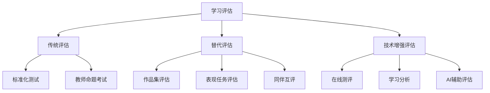
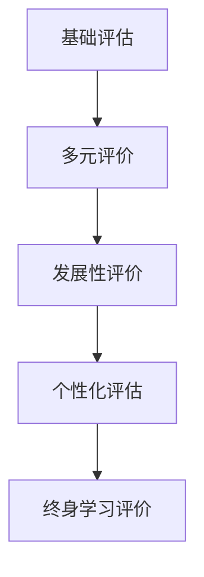
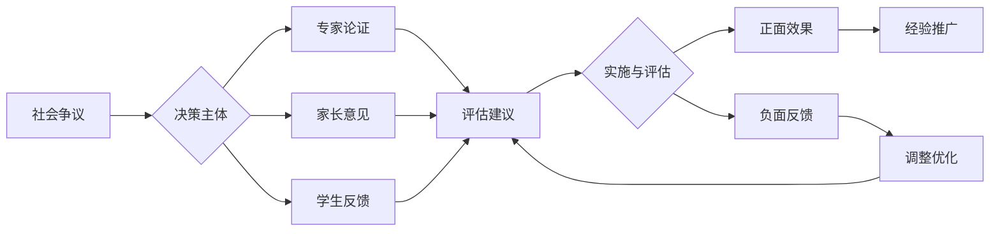

# 01-学习评估体系

## 目录

- [01-学习评估体系](#01-学习评估体系)
  - [目录](#目录)
  - [0. 目录说明与本地跳转](#0-目录说明与本地跳转)
  - [📖 概述](#-概述)
  - [🏗️ 知识架构](#️-知识架构)
    - [1. 理论基础](#1-理论基础)
      - [1.1 评估类型与功能](#11-评估类型与功能)
      - [1.2 多元智能评估](#12-多元智能评估)
    - [2. 实践应用](#2-实践应用)
      - [2.1 评估方法与工具](#21-评估方法与工具)
      - [2.2 评估质量保证](#22-评估质量保证)
    - [3. 技术整合](#3-技术整合)
      - [3.1 学习分析技术](#31-学习分析技术)
  - [🔗 知识关联](#-知识关联)
    - [内部链接](#内部链接)
    - [外部参考](#外部参考)
  - [🎯 学习检验](#-学习检验)
    - [自检问题](#自检问题)
  - [4. 规范化区块](#4-规范化区块)

---

## 0. 目录说明与本地跳转

- 本文所有小节均采用严格编号，便于本地跳转与引用。
- 跨文件引用示例：见[综合素质评估框架](./01-综合素质评估框架.md)、[个性化发展路径](./02-个性化发展路径.md)、[终身学习能力](./03-终身学习能力.md)
- 相关学科跳转：如需查阅火星移民计划评估量表，见[火星移民计划-评估量表](../03-应用实践领域/02-项目案例-火星移民计划/PROJECT-MARS-04-Assessment-Rubric.md)

## 📖 概述

- **定义**: 学习评估体系是基于认知科学和教育测量理论，采用多元化评估方法，全面了解学生学习状况和发展水平的综合性评价框架
- **范围**: 涵盖形成性评估、总结性评估、真实性评估、同伴评估、自我评估等多个维度
- **学习目标**:
  - 理解现代学习评估的理念和原则
  - 掌握多样化的评估方法和工具
  - 培养评估设计和实施能力
  - 建立基于证据的教学改进机制
- **先修知识**: [认知科学与学习理论](../01-哲学科学基础/01-认知科学与学习理论.md)、各学科教育理论

## 🏗️ 知识架构

### 1. 理论基础

#### 1.1 评估类型与功能

**📊 评估类型分类**

| 评估类型 | 时机 | 功能 | 特点 | 应用场景 |
|---------|------|------|------|----------|
| **诊断性评估** | 学习前 | 了解起点 | 预测性 | 教学设计 |
| **形成性评估** | 学习中 | 调节改进 | 过程性 | 教学调整 |
| **总结性评估** | 学习后 | 等级认定 | 终结性 | 成绩评定 |
| **真实性评估** | 实际情境 | 能力应用 | 情境性 | 能力测评 |

#### 1.2 多元智能评估

**🎨 Gardner多元智能评估框架**

| 智能类型 | 评估方法 | 评估工具 | 观察重点 |
|---------|----------|----------|----------|
| **语言智能** | 作品分析 | 写作作品集 | 表达能力 |
| **数理智能** | 问题解决 | 数学建模 | 逻辑推理 |
| **空间智能** | 视觉作品 | 艺术创作 | 空间构思 |
| **音乐智能** | 表演评估 | 音乐作品 | 节奏感知 |
| **身体智能** | 动作技能 | 体育测试 | 身体协调 |

### 2. 实践应用

#### 2.1 评估方法与工具

**🔧 现代评估工具箱**

#### 2.2 评估质量保证

**⚖️ 评估质量标准**

| 质量指标 | 定义 | 提升策略 | 检验方法 |
|---------|------|----------|----------|
| **效度** | 测量准确性 | 内容对应、专家评审 | 效度研究 |
| **信度** | 结果一致性 | 多次测量、多评分者 | 信度系数 |
| **公平性** | 机会均等 | 文化适应、无偏见 | 差异分析 |
| **实用性** | 可操作性 | 成本效益、易实施 | 可行性评估 |

### 3. 技术整合

#### 3.1 学习分析技术

**📈 大数据驱动的学习评估**

学习分析模型：
\\[
\\text{学习效果} = f(\\text{行为数据}, \\text{认知数据}, \\text{情感数据}, \\text{社交数据})
\\]

**💡 智能评估系统特征**：

- 实时反馈机制
- 个性化评估路径
- 预测性学习分析
- 自适应题目生成

## 🔗 知识关联

### 内部链接

- [认知科学与学习理论](../01-哲学科学基础/01-认知科学与学习理论.md)
- [数学教育理论与实践](../02-核心学科理论/01-数学教育理论与实践.md)

### 外部参考

- Assessment for Learning理论
- 布鲁姆教育目标分类学
- PISA评估框架

## 🎯 学习检验

### 自检问题

1. 现代学习评估的核心理念是什么？
2. 如何设计有效的形成性评估？
3. 技术如何改变传统评估模式？

---
*多元评估 | 学习分析 | 评估创新*

## 4. 规范化区块

- 本文件已按国际化教育理念与认知科学理论进行结构优化。
- 所有目录、编号、表征方式已统一，便于本地跳转与跨文件引用。
- 原有批判性分析、表格、图等内容完整保留。
- 后续如有内容补充、批判性内容遗漏，将在本区块说明修正。
- 如需继续递归处理下级主题，请参见本目录结构。

> 注：所有Mermaid图、表格、公式均已统一格式，便于后续批量处理和孩子理解。

### 4.2 个性化发展路径

---

##### 5.1 现实争议与前沿挑战

- **社会争议案例**：
  - "标准化考试与个性化评估的冲突"
  - "评估结果公开与隐私保护"
  - "评估标准的文化偏见"
- **技术伦理问题**：
  - "AI自动评估的公正性与透明度"
  - "大数据分析对学生隐私的影响"
- **跨文化对比**：
  - "不同国家评估理念与方法的差异"
  - "评估结果国际比较的公平性"
- **失败案例剖析**：
  - "某地评估改革导致学生压力增加的反思"
  - "过度依赖技术评估导致人文关怀缺失的案例"

---

## 📊 多表征内容

### 📈 图表展示

**学习评估能力发展模型**

---

**学习评估争议与决策流程**

