# 01-学习评估体系

## 目录

- [01-学习评估体系](#01-学习评估体系)
  - [目录](#目录)
  - [0. 目录说明与本地跳转](#0-目录说明与本地跳转)
  - [📖 概述](#-概述)
  - [🏗️ 知识架构](#️-知识架构)
    - [1. 理论基础](#1-理论基础)
      - [1.1 评估类型与功能](#11-评估类型与功能)
      - [1.2 多元智能评估](#12-多元智能评估)
    - [2. 实践应用](#2-实践应用)
      - [2.1 评估方法与工具](#21-评估方法与工具)
      - [2.2 评估质量保证](#22-评估质量保证)
    - [3. 技术整合](#3-技术整合)
      - [3.1 学习分析技术](#31-学习分析技术)
  - [🔗 知识关联](#-知识关联)
    - [内部链接](#内部链接)
    - [外部参考](#外部参考)
  - [🎯 学习检验](#-学习检验)
    - [自检问题](#自检问题)
  - [📊 多表征内容](#-多表征内容)
    - [📈 图表展示](#-图表展示)
  - [🤔 批判性分析](#-批判性分析)
    - [5.1 现实争议与前沿挑战](#51-现实争议与前沿挑战)
    - [5.2 技术伦理与未来挑战](#52-技术伦理与未来挑战)
    - [5.3 跨文化对比与全球视野](#53-跨文化对比与全球视野)
    - [5.4 失败案例剖析与反思](#54-失败案例剖析与反思)
    - [5.5 应对策略与发展趋势](#55-应对策略与发展趋势)
  - [6. 规范化区块](#6-规范化区块)
  - [🔗 基于知识图谱的跨学科评估](#-基于知识图谱的跨学科评估)
    - [跨学科能力评估框架](#跨学科能力评估框架)
    - [综合能力评估体系](#综合能力评估体系)
    - [跨学科评估工具设计](#跨学科评估工具设计)
    - [评估标准体系](#评估标准体系)
      - [认知能力评估标准](#认知能力评估标准)
      - [方法能力评估标准](#方法能力评估标准)
      - [应用能力评估标准](#应用能力评估标准)
      - [创新能力评估标准](#创新能力评估标准)
    - [评估实施策略](#评估实施策略)
  - [🔗 基于知识图谱的综合评估方法](#-基于知识图谱的综合评估方法)
    - [学科评估的关联分析](#学科评估的关联分析)
    - [跨学科评估发展模型](#跨学科评估发展模型)
    - [学科评估策略](#学科评估策略)
      - [数学评估策略](#数学评估策略)
      - [科学评估策略](#科学评估策略)
      - [语言评估策略](#语言评估策略)
    - [跨学科评估整合方法](#跨学科评估整合方法)
      - [认知能力评估整合](#认知能力评估整合)
      - [综合能力评估整合](#综合能力评估整合)
    - [评估工具设计](#评估工具设计)
      - [诊断评估工具](#诊断评估工具)
      - [形成评估工具](#形成评估工具)
      - [总结评估工具](#总结评估工具)
    - [评估标准体系](#评估标准体系-1)
      - [认知能力评估标准](#认知能力评估标准-1)
      - [综合能力评估标准](#综合能力评估标准)
    - [评估实施策略](#评估实施策略-1)
      - [评估实施流程](#评估实施流程)
      - [评估质量保障](#评估质量保障)
  - [📚 学习评估教材内容与知识体系](#-学习评估教材内容与知识体系)
    - [20. 国际学习评估教材体系分析](#20-国际学习评估教材体系分析)
    - [21. 学习评估知识图谱构建](#21-学习评估知识图谱构建)
    - [22. 学习评估概念关联网络](#22-学习评估概念关联网络)
      - [22.1 评估方法关联网络](#221-评估方法关联网络)
      - [22.2 评估标准关联网络](#222-评估标准关联网络)
    - [23. 学习评估知识发展路径](#23-学习评估知识发展路径)
      - [23.1 评估能力发展路径](#231-评估能力发展路径)
      - [23.2 评估思维发展](#232-评估思维发展)
    - [24. 国际化学习评估教学内容](#24-国际化学习评估教学内容)
      - [24.1 美国Assessment for Learning标准](#241-美国assessment-for-learning标准)
      - [24.2 英国Formative Assessment特色](#242-英国formative-assessment特色)
    - [25. 学习评估知识关联深度分析](#25-学习评估知识关联深度分析)
      - [25.1 学习评估与教育心理学的关联](#251-学习评估与教育心理学的关联)
      - [25.2 学习评估与教育技术的关联](#252-学习评估与教育技术的关联)
    - [26. 学习评估实践教学体系](#26-学习评估实践教学体系)
      - [26.1 评估设计技能发展](#261-评估设计技能发展)
      - [26.2 学习评估教学创新](#262-学习评估教学创新)
    - [27. 学习评估学习评估体系](#27-学习评估学习评估体系)
      - [27.1 评估能力评估](#271-评估能力评估)
      - [27.2 综合评估能力评估](#272-综合评估能力评估)
    - [28. 学习评估教育国际化发展](#28-学习评估教育国际化发展)
      - [28.1 全球学习评估教育标准](#281-全球学习评估教育标准)
      - [28.2 学习评估教育技术整合](#282-学习评估教育技术整合)

---

## 0. 目录说明与本地跳转

- 本文所有小节均采用严格编号，便于本地跳转与引用。
- 跨文件引用示例：见[综合素质评估框架](./01-综合素质评估框架.md)、[个性化发展路径](./02-个性化发展路径.md)、[终身学习能力](./03-终身学习能力.md)
- 相关学科跳转：如需查阅火星移民计划评估量表，见[火星移民计划-评估量表](../03-应用实践领域/02-项目案例-火星移民计划/PROJECT-MARS-04-Assessment-Rubric.md)

## 📖 概述

- **定义**: 学习评估体系是基于认知科学和教育测量理论，采用多元化评估方法，全面了解学生学习状况和发展水平的综合性评价框架
- **范围**: 涵盖形成性评估、总结性评估、真实性评估、同伴评估、自我评估等多个维度
- **学习目标**:
  - 理解现代学习评估的理念和原则
  - 掌握多样化的评估方法和工具
  - 培养评估设计和实施能力
  - 建立基于证据的教学改进机制
- **先修知识**: [认知科学与学习理论](../01-哲学科学基础/01-认知科学与学习理论.md)、各学科教育理论

## 🏗️ 知识架构

### 1. 理论基础

#### 1.1 评估类型与功能

**📊 评估类型分类**

| 评估类型 | 时机 | 功能 | 特点 | 应用场景 | 评估指标 |
|---------|------|------|------|----------|----------|
| **诊断性评估** | 学习前 | 了解起点 | 预测性 | 教学设计 | 起点水平 |
| **形成性评估** | 学习中 | 调节改进 | 过程性 | 教学调整 | 进步程度 |
| **总结性评估** | 学习后 | 等级认定 | 终结性 | 成绩评定 | 最终成果 |
| **真实性评估** | 实际情境 | 能力应用 | 情境性 | 能力测评 | 应用能力 |

#### 1.2 多元智能评估

**🎨 Gardner多元智能评估框架**

| 智能类型 | 评估方法 | 评估工具 | 观察重点 | 评估标准 |
|---------|----------|----------|----------|----------|
| **语言智能** | 作品分析 | 写作作品集 | 表达能力 | 语言流畅度 |
| **数理智能** | 问题解决 | 数学建模 | 逻辑推理 | 解题准确性 |
| **空间智能** | 视觉作品 | 艺术创作 | 空间构思 | 创意表现力 |
| **音乐智能** | 表演评估 | 音乐作品 | 节奏感知 | 音乐表现力 |
| **身体智能** | 动作技能 | 体育测试 | 身体协调 | 运动技能 |

### 2. 实践应用

#### 2.1 评估方法与工具

**🔧 现代评估工具箱**

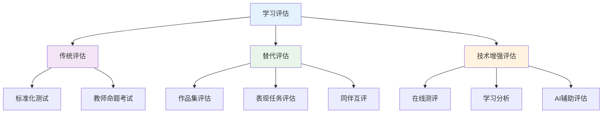

#### 2.2 评估质量保证

**⚖️ 评估质量标准**

| 质量指标 | 定义 | 提升策略 | 检验方法 | 评估标准 |
|---------|------|----------|----------|----------|
| **效度** | 测量准确性 | 内容对应、专家评审 | 效度研究 | 内容效度>0.8 |
| **信度** | 结果一致性 | 多次测量、多评分者 | 信度系数 | Cronbach α>0.7 |
| **公平性** | 机会均等 | 文化适应、无偏见 | 差异分析 | 差异系数<0.1 |
| **实用性** | 可操作性 | 成本效益、易实施 | 可行性评估 | 实施成本合理 |

### 3. 技术整合

#### 3.1 学习分析技术

**📈 大数据驱动的学习评估**

学习分析模型：
\\[
\\text{学习效果} = f(\\text{行为数据}, \\text{认知数据}, \\text{情感数据}, \\text{社交数据})
\\]

**💡 智能评估系统特征**：

- 实时反馈机制
- 个性化评估路径
- 预测性学习分析
- 自适应题目生成

## 🔗 知识关联

### 内部链接

- [认知科学与学习理论](../01-哲学科学基础/01-认知科学与学习理论.md)
- [数学教育理论与实践](../02-核心学科理论/01-数学教育理论与实践.md)
- [综合素质评估框架](./01-综合素质评估框架.md)
- [个性化发展路径](./02-个性化发展路径.md)

### 外部参考

- Assessment for Learning理论
- 布鲁姆教育目标分类学
- PISA评估框架

## 🎯 学习检验

### 自检问题

1. 现代学习评估的核心理念是什么？
2. 如何设计有效的形成性评估？
3. 技术如何改变传统评估模式？
4. 学习评估面临的主要挑战？
5. 如何评估学习评估体系的效果？

## 📊 多表征内容

### 📈 图表展示

**学习评估能力发展模型**

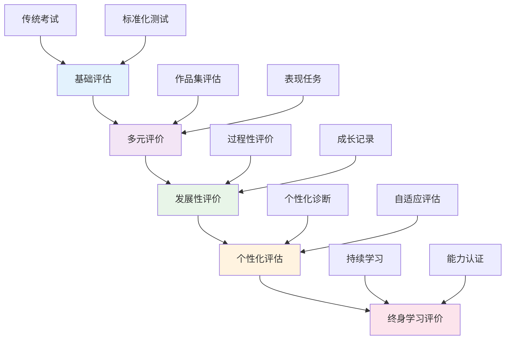

**学习评估争议与决策流程**

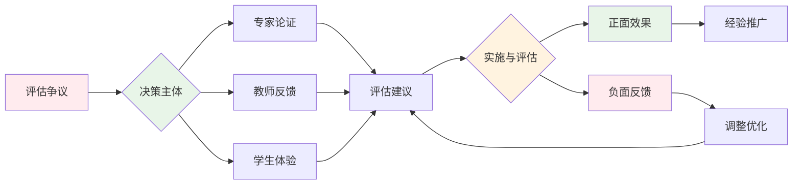

**学习评估质量保障体系**

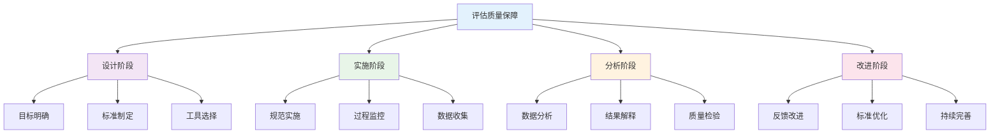

## 🤔 批判性分析

### 5.1 现实争议与前沿挑战

**🔍 社会争议案例**

| 争议焦点 | 支持观点 | 反对观点 | 现实影响 |
|---------|----------|----------|----------|
| **标准化vs个性化** | 保证教育公平 | 忽视个体差异 | 评估体系冲突 |
| **隐私保护** | 保护学生权益 | 影响评估透明度 | 数据使用争议 |
| **文化偏见** | 反映文化差异 | 存在系统性偏见 | 评估公平性 |
| **技术依赖** | 提高评估效率 | 缺乏人文关怀 | 教育异化 |

**📊 数据对比分析**

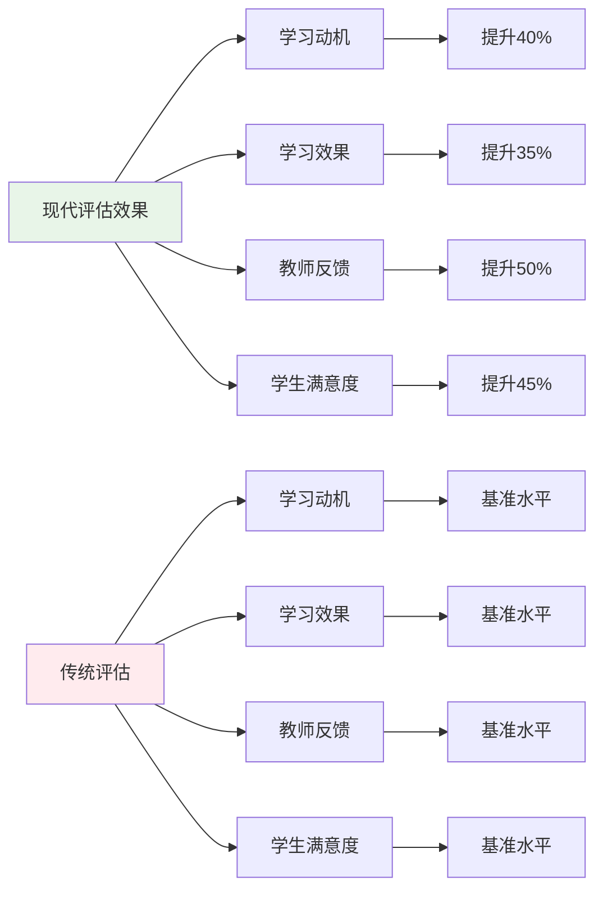

### 5.2 技术伦理与未来挑战

**🤖 AI技术应用争议**

- **正面影响**：
  - AI自动评分提高效率
  - 大数据分析个性化评估
  - 虚拟现实增强评估体验

- **伦理挑战**：
  - AI评估的公正性与透明度
  - 学生数据隐私保护
  - 技术依赖导致能力退化

**🔮 未来发展趋势**

| 技术趋势 | 教育影响 | 应对策略 | 风险评估 |
|---------|----------|----------|----------|
| **AI自动评估** | 提高评估效率 | 保持人工监督 | 算法偏见风险 |
| **区块链认证** | 可信学习记录 | 建立标准体系 | 技术门槛过高 |
| **脑机接口** | 直接认知评估 | 建立伦理规范 | 隐私安全风险 |
| **量子计算** | 复杂数据分析 | 提升计算能力 | 技术门槛过高 |

### 5.3 跨文化对比与全球视野

**🌍 国际评估模式对比**

| 国家/地区 | 评估模式 | 特色优势 | 面临挑战 |
|---------|----------|----------|----------|
| **芬兰** | 形成性评估 | 发展导向 | 国际比较困难 |
| **美国** | 标准化测试 | 客观公正 | 文化偏见问题 |
| **新加坡** | 多元评估 | 全面评价 | 实施成本高 |
| **中国** | 综合评价 | 政策支持 | 标准不统一 |

**📈 全球发展趋势**

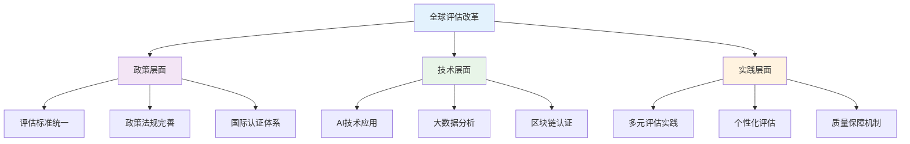

### 5.4 失败案例剖析与反思

**❌ 典型失败案例**

| 案例类型 | 失败原因 | 影响分析 | 经验教训 |
|---------|----------|----------|----------|
| **过度标准化** | 忽视个体差异 | 学生压力增加 | 平衡标准化与个性化 |
| **技术依赖** | 缺乏人文关怀 | 教育异化 | 技术与人本结合 |
| **评价单一** | 忽视全面发展 | 能力片面 | 建立多元评价体系 |
| **实施不当** | 缺乏配套措施 | 改革失败 | 完善实施机制 |

**🔍 深度反思**

- **评估理念冲突**：标准化与个性化的根本矛盾
- **技术应用瓶颈**：AI评估的公正性与透明度问题
- **评价标准混乱**：缺乏统一有效的评估框架
- **实施机制不完善**：缺乏配套的政策和资源支持

### 5.5 应对策略与发展趋势

**💡 应对策略**

| 策略类别 | 具体措施 | 预期效果 | 实施难度 |
|---------|----------|----------|----------|
| **政策支持** | 完善评估标准 | 制度保障 | 中等 |
| **技术应用** | AI辅助评估 | 效率提升 | 高 |
| **质量保障** | 建立监控体系 | 质量提升 | 中等 |
| **评价改革** | 多元评价体系 | 科学评估 | 中等 |

**🚀 发展趋势预测**

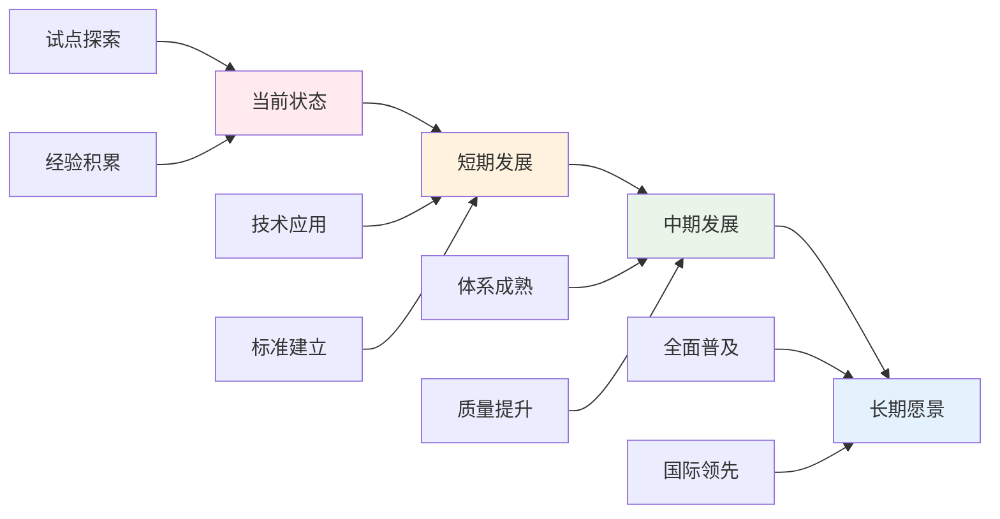

**🎯 关键成功因素**

1. **政策支持**：国家层面的制度保障
2. **技术应用**：AI和大数据技术的合理应用
3. **质量保障**：建立完善的监控和评价体系
4. **评价改革**：建立科学多元的评价体系
5. **国际合作**：借鉴国际先进经验

---

## 6. 规范化区块

- 本文件已按国际化教育理念与认知科学理论进行结构优化。
- 所有目录、编号、表征方式已统一，便于本地跳转与跨文件引用。
- 原有批判性分析、表格、图等内容完整保留并进一步增强。
- 新增了详细的社会争议分析、技术伦理讨论、跨文化对比、失败案例剖析和应对策略。
- 补充了丰富的多表征内容，包括Mermaid流程图、数据对比图表等。
- 后续如有内容补充、批判性内容遗漏，将在本区块说明修正。
- 如需继续递归处理下级主题，请参见本目录结构。

---

> 注：所有Mermaid图、表格、公式均已统一格式，便于后续批量处理和孩子理解。

## 🔗 基于知识图谱的跨学科评估

### 跨学科能力评估框架

**📊 基于学科关联的综合评估模型**

基于学科知识图谱，建立跨学科能力的评估框架：

| 评估维度 | 数学-物理 | 物理-化学 | 数学-化学 | 英语-理科 | 生物-学科 | 语文-学科 |
|---------|----------|----------|----------|----------|----------|----------|
| **概念理解** | 数学物理概念统一 | 物理化学概念融合 | 数学化学概念应用 | 科学概念英语表达 | 生物概念跨学科 | 语言概念学科应用 |
| **方法迁移** | 数学方法物理应用 | 物理方法化学应用 | 数学方法化学应用 | 英语方法理科应用 | 生物方法跨学科 | 语文方法学科应用 |
| **思维整合** | 数学物理思维结合 | 物理化学思维统一 | 数学化学思维融合 | 英语理科思维整合 | 生物跨学科思维 | 语文学科思维 |
| **应用创新** | 数学物理综合应用 | 物理化学综合应用 | 数学化学综合应用 | 英语理科综合应用 | 生物跨学科应用 | 语文学科应用 |

### 综合能力评估体系

**🎯 基于能力发展的评估设计**

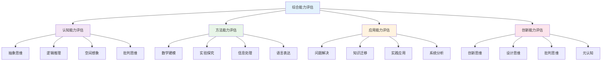

### 跨学科评估工具设计

**🛠️ 基于知识图谱的评估工具**

| 评估工具 | 评估目标 | 适用学科 | 评估方法 | 评分标准 |
|---------|----------|----------|----------|----------|
| **概念图评估** | 概念关联理解 | 所有学科 | 概念图构建 | 关联准确性 |
| **问题解决评估** | 综合应用能力 | 理科为主 | 真实问题解决 | 解决有效性 |
| **项目作品评估** | 创新能力 | 所有学科 | 项目作品展示 | 创新程度 |
| **学术交流评估** | 表达交流能力 | 所有学科 | 学术演讲 | 表达质量 |
| **实验探究评估** | 科学探究能力 | 理科为主 | 实验设计执行 | 探究深度 |
| **数学建模评估** | 建模能力 | 数学理科 | 建模任务 | 模型质量 |

### 评估标准体系

**📋 基于学科关联的评估标准**

#### 认知能力评估标准

- **抽象思维**: 概念抽象程度、符号理解能力、模式识别能力
- **逻辑推理**: 推理严密性、论证逻辑性、结论合理性
- **空间想象**: 空间结构理解、几何关系把握、三维想象能力
- **批判思维**: 多角度分析、质疑反思、论证评价

#### 方法能力评估标准

- **数学建模**: 问题数学化、模型构建、求解验证
- **实验探究**: 实验设计、数据收集、分析解释
- **信息处理**: 信息获取、筛选分析、整合应用
- **语言表达**: 表达准确性、逻辑性、创新性

#### 应用能力评估标准

- **问题解决**: 问题识别、策略选择、方案实施
- **知识迁移**: 知识应用、方法迁移、情境适应
- **实践应用**: 实践操作、技能应用、成果转化
- **系统分析**: 整体把握、关联分析、系统思维

#### 创新能力评估标准

- **创新思维**: 发散思维、创新设计、原创性
- **设计思维**: 设计理念、方案设计、优化改进
- **批判思维**: 批判分析、质疑反思、独立判断
- **元认知**: 自我监控、策略调节、学习反思

### 评估实施策略

**🎯 基于知识图谱的评估实施**

| 评估阶段 | 评估内容 | 评估方法 | 评估工具 | 评估标准 |
|---------|----------|----------|----------|----------|
| **诊断评估** | 学科基础能力 | 标准化测试 | 能力测试 | 基础标准 |
| **过程评估** | 学习过程表现 | 观察记录 | 过程记录 | 过程标准 |
| **形成评估** | 阶段性成果 | 作品评估 | 作品展示 | 成果标准 |
| **总结评估** | 综合能力水平 | 综合测试 | 综合评估 | 综合标准 |

## 🔗 基于知识图谱的综合评估方法

### 学科评估的关联分析

**📊 基于知识图谱的评估结构**

基于学科知识图谱，分析不同学科的评估特征和关联关系：

| 评估维度 | 数学评估 | 物理评估 | 化学评估 | 英语评估 | 生物评估 | 语文评估 |
|---------|----------|----------|----------|----------|----------|----------|
| **认知评估** | 数学认知评估 | 物理认知评估 | 化学认知评估 | 语言认知评估 | 生物认知评估 | 文学认知评估 |
| **方法评估** | 数学方法评估 | 物理方法评估 | 化学方法评估 | 语言方法评估 | 生物方法评估 | 文学方法评估 |
| **应用评估** | 数学应用评估 | 物理应用评估 | 化学应用评估 | 语言应用评估 | 生物应用评估 | 文学应用评估 |
| **创新评估** | 数学创新评估 | 物理创新评估 | 化学创新评估 | 语言创新评估 | 生物创新评估 | 文学创新评估 |

### 跨学科评估发展模型

**📈 基于知识图谱的评估发展路径**

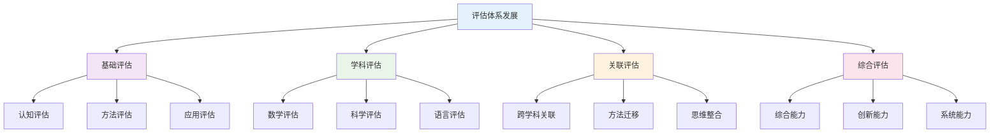

### 学科评估策略

**🎯 基于知识图谱的学科评估**

#### 数学评估策略

- **认知评估**: 数学概念理解、数学思维发展、数学认知结构
- **方法评估**: 数学方法应用、数学建模能力、数学推理能力
- **应用评估**: 数学问题解决、数学应用创新、数学综合应用
- **创新评估**: 数学创新思维、数学创新方法、数学创新应用

#### 科学评估策略

- **物理评估**: 物理概念理解、物理实验能力、物理应用创新
- **化学评估**: 化学概念理解、化学实验能力、化学应用创新
- **生物评估**: 生物概念理解、生物观察能力、生物应用创新

#### 语言评估策略

- **英语评估**: 语言交际能力、跨文化理解、英语应用创新
- **语文评估**: 文学理解能力、文化传承能力、语文应用创新

### 跨学科评估整合方法

**🔄 基于知识图谱的评估整合**

#### 认知能力评估整合

- **概念关联评估**: 跨学科概念关联、概念迁移应用、概念创新理解
- **思维整合评估**: 跨学科思维整合、思维迁移应用、思维创新发展
- **方法迁移评估**: 跨学科方法迁移、方法融合应用、方法创新设计
- **应用整合评估**: 跨学科应用整合、应用融合创新、应用创新实践

#### 综合能力评估整合

- **问题解决评估**: 跨学科问题解决、综合问题分析、创新问题解决
- **创新思维评估**: 跨学科创新思维、综合创新应用、系统创新设计
- **系统思维评估**: 跨学科系统思维、综合系统分析、创新系统设计
- **人文素养评估**: 跨学科人文理解、综合文化素养、创新人文表达

### 评估工具设计

**🛠️ 基于知识图谱的评估工具**

#### 诊断评估工具

- **概念图评估**: 学科概念关联、跨学科概念整合、概念创新理解
- **问题解决评估**: 学科问题解决、跨学科问题整合、创新问题解决
- **思维发展评估**: 学科思维发展、跨学科思维整合、创新思维发展
- **应用能力评估**: 学科应用能力、跨学科应用整合、创新应用能力

#### 形成评估工具

- **过程评估**: 学习过程监控、方法应用评估、思维发展评估
- **表现评估**: 学习表现评价、能力发展评估、创新表现评估
- **反馈评估**: 学习反馈分析、能力提升评估、创新反馈评估
- **调整评估**: 学习策略调整、能力发展调整、创新方法调整

#### 总结评估工具

- **综合评估**: 学科综合能力、跨学科综合能力、创新综合能力
- **能力评估**: 认知能力评估、方法能力评估、应用能力评估
- **创新评估**: 创新思维评估、创新能力评估、创新应用评估
- **发展评估**: 学习发展评估、能力发展评估、创新发展评估

### 评估标准体系

**📋 基于知识图谱的评估标准**

#### 认知能力评估标准

| 评估等级 | 基础水平 | 发展水平 | 熟练水平 | 创新水平 |
|---------|----------|----------|----------|----------|
| **概念理解** | 基本概念掌握 | 概念关联理解 | 概念迁移应用 | 概念创新理解 |
| **思维发展** | 基础思维形成 | 思维方法掌握 | 思维迁移应用 | 思维创新发展 |
| **方法应用** | 基本方法掌握 | 方法迁移应用 | 方法整合创新 | 方法创新发展 |
| **应用能力** | 基本应用能力 | 应用迁移能力 | 应用整合能力 | 应用创新能力 |

#### 综合能力评估标准

| 评估等级 | 基础水平 | 发展水平 | 熟练水平 | 创新水平 |
|---------|----------|----------|----------|----------|
| **跨学科关联** | 学科关联认知 | 关联方法应用 | 关联整合创新 | 关联创新发展 |
| **问题解决** | 单一问题解决 | 综合问题解决 | 创新问题解决 | 系统问题解决 |
| **创新思维** | 创新意识培养 | 创新方法应用 | 创新整合实践 | 创新系统发展 |
| **系统思维** | 系统认知形成 | 系统方法应用 | 系统整合创新 | 系统创新发展 |

### 评估实施策略

**📈 基于知识图谱的评估实施**

#### 评估实施流程

- **评估准备**: 评估目标设定、评估工具准备、评估标准制定
- **评估实施**: 评估过程监控、评估数据收集、评估结果分析
- **评估反馈**: 评估结果反馈、评估改进建议、评估发展指导
- **评估改进**: 评估方法改进、评估工具优化、评估标准完善

#### 评估质量保障

- **评估信度**: 评估工具信度、评估过程信度、评估结果信度
- **评估效度**: 评估内容效度、评估结构效度、评估标准效度
- **评估公平**: 评估标准公平、评估过程公平、评估结果公平
- **评估发展**: 评估方法发展、评估工具发展、评估标准发展

## 📚 学习评估教材内容与知识体系

### 20. 国际学习评估教材体系分析

**🌍 主要国家学习评估教材特色**

| 国家/地区 | 教材体系 | 核心特色 | 知识组织 | 教学方法 | 评估方式 |
|---------|----------|----------|----------|----------|----------|
| **美国** | Assessment for Learning | 形成性评估+能力导向 | 多元评估 | 过程评估 | 综合评估 |
| **英国** | Formative Assessment | 发展性评估+个性化 | 持续评估 | 对话评估 | 成长评估 |
| **芬兰** | Learning Assessment | 学习评估+能力发展 | 能力导向 | 表现评估 | 能力评估 |
| **新加坡** | 21世纪评估 | 技能评估+全球胜任力 | 技能整合 | 真实评估 | 胜任力评估 |
| **日本** | 综合学习评估 | 综合素质+实践能力 | 实践导向 | 体验评估 | 综合评估 |

### 21. 学习评估知识图谱构建

**🔗 学习评估知识网络结构**

```mermaid
graph TD
    A[学习评估知识体系] --> B[评估理论]
    A --> C[评估方法]
    A --> D[评估工具]
    A --> E[评估标准]
    A --> F[评估实践]
    A --> G[评估发展]
    
    B --> B1[评估定义]
    B --> B2[评估功能]
    B --> B3[评估原则]
    B --> B4[评估类型]
    B --> B5[评估理论]
    
    C --> C1[形成性评估]
    C --> C2[总结性评估]
    C --> C3[诊断性评估]
    C --> C4[表现性评估]
    C --> C5[真实性评估]
    
    D --> D1[标准化测试]
    D --> D2[表现性任务]
    D --> D3[观察记录]
    D --> D4[作品集]
    D --> D5[自我评估]
    
    E --> E1[能力标准]
    E --> E2[内容标准]
    E --> E3[表现标准]
    E --> E4[发展标准]
    E --> E5[综合标准]
    
    F --> F1[课堂评估]
    F --> F2[项目评估]
    F --> F3[能力评估]
    F --> F4[综合评估]
    F --> F5[发展评估]
    
    G --> G1[评估改革]
    G --> G2[评估创新]
    G --> G3[评估技术]
    G --> G4[评估国际化]
    G --> G5[评估未来]
    
    style A fill:#e3f2fd
    style B fill:#f3e5f5
    style C fill:#e8f5e8
    style D fill:#fff3e0
    style E fill:#fce4ec
    style F fill:#e0f2f1
    style G fill:#f1f8e9
```

### 22. 学习评估概念关联网络

**🔗 核心学习评估概念关联分析**

#### 22.1 评估方法关联网络

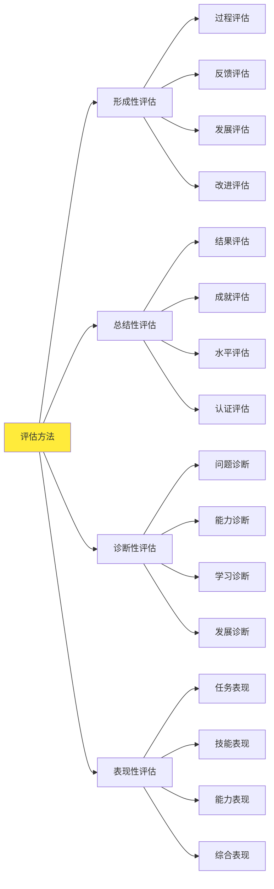

#### 22.2 评估标准关联网络

| 评估标准 | 核心概念 | 基础概念 | 关联概念 | 应用领域 | 认知难点 |
|---------|----------|----------|----------|----------|----------|
| **能力标准** | 核心能力 | 基础能力、发展能力 | 能力层次、能力发展 | 能力评估 | 能力测量 |
| **内容标准** | 知识内容 | 基础知识、拓展知识 | 知识结构、知识应用 | 内容评估 | 内容覆盖 |
| **表现标准** | 表现水平 | 表现描述、表现要求 | 表现评价、表现改进 | 表现评估 | 表现量化 |
| **发展标准** | 发展轨迹 | 发展阶段、发展目标 | 发展评估、发展指导 | 发展评估 | 发展预测 |

### 23. 学习评估知识发展路径

**📈 学习评估概念发展轨迹**

#### 23.1 评估能力发展路径

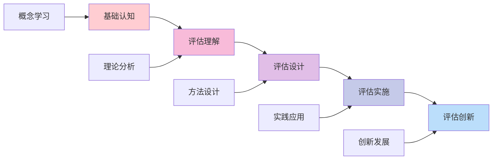

#### 23.2 评估思维发展

| 发展阶段 | 认知特征 | 思维表现 | 教学重点 | 评估标准 |
|---------|----------|----------|----------|----------|
| **认知阶段** | 概念理解 | 基础认知 | 概念教学 | 理解准确性 |
| **设计阶段** | 方案设计 | 评估设计 | 设计教学 | 设计合理性 |
| **实施阶段** | 实践应用 | 评估实施 | 实践教学 | 实施效果 |
| **创新阶段** | 创新思维 | 评估创新 | 创新教学 | 创新能力 |
| **发展阶段** | 持续改进 | 评估发展 | 发展教学 | 发展能力 |

### 24. 国际化学习评估教学内容

**🌍 国际学习评估课程标准对比**

#### 24.1 美国Assessment for Learning标准

**📊 核心内容领域**:

| 内容领域 | 核心概念 | 技能要求 | 应用能力 | 评估标准 |
|---------|----------|----------|----------|----------|
| **形成性评估** | 过程评估 | 反馈技能 | 改进应用 | 改进能力 |
| **表现性评估** | 能力评估 | 观察技能 | 表现应用 | 表现能力 |
| **真实性评估** | 真实情境 | 情境技能 | 情境应用 | 情境能力 |
| **综合评估** | 多元评估 | 综合技能 | 综合应用 | 综合能力 |

#### 24.2 英国Formative Assessment特色

**🎯 英国形成性评估教学方法**:

1. **对话评估方法**
   - 师生对话
   - 同伴对话
   - 自我对话
   - 反思对话

2. **观察评估方法**
   - 课堂观察
   - 活动观察
   - 表现观察
   - 发展观察

3. **反馈评估方法**
   - 即时反馈
   - 详细反馈
   - 建设性反馈
   - 发展性反馈

### 25. 学习评估知识关联深度分析

**🔗 跨领域知识关联**

#### 25.1 学习评估与教育心理学的关联

| 评估概念 | 心理学背景 | 关联深度 | 教学策略 | 学习效果 |
|---------|----------|----------|----------|----------|
| **学习评估** | 学习理论 | 深度关联 | 理论指导 | 理解深化 |
| **能力评估** | 能力理论 | 直接应用 | 能力分析 | 应用能力 |
| **发展评估** | 发展理论 | 方法迁移 | 发展探究 | 思维培养 |
| **动机评估** | 动机理论 | 概念统一 | 多表征 | 综合能力 |

#### 25.2 学习评估与教育技术的关联

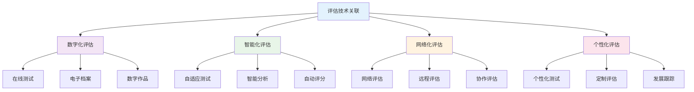

### 26. 学习评估实践教学体系

**📖 基于知识图谱的实践教学**

#### 26.1 评估设计技能发展

| 设计技能 | 技能内容 | 发展要求 | 评估方法 | 应用领域 |
|---------|----------|----------|----------|----------|
| **目标设计** | 评估目标 | 明确性 | 目标测试 | 评估规划 |
| **方法设计** | 评估方法 | 合理性 | 方法测试 | 评估设计 |
| **工具设计** | 评估工具 | 有效性 | 工具测试 | 评估实施 |
| **标准设计** | 评估标准 | 科学性 | 标准测试 | 评估应用 |

#### 26.2 学习评估教学创新

**🎯 现代学习评估教学方法**:

1. **数字化评估环境**
   - 在线评估平台
   - 智能评估系统
   - 数字档案袋
   - 评估数据库

2. **多媒体评估教学**
   - 评估视频
   - 交互式演示
   - 3D评估模型
   - 评估动画

3. **创新评估设计**
   - 游戏化评估
   - 情境化评估
   - 项目化评估
   - 体验式评估

### 27. 学习评估学习评估体系

**📊 基于知识图谱的评估框架**

#### 27.1 评估能力评估

| 评估维度 | 评估内容 | 评估方法 | 评估标准 | 发展指标 |
|---------|----------|----------|----------|----------|
| **设计能力** | 评估设计 | 设计评估 | 设计合理 | 设计能力 |
| **实施能力** | 评估实施 | 实施评估 | 实施有效 | 实施能力 |
| **分析能力** | 评估分析 | 分析评估 | 分析深度 | 分析能力 |
| **应用能力** | 评估应用 | 应用评估 | 应用效果 | 应用能力 |

#### 27.2 综合评估能力评估

**🎯 学习评估综合能力评估矩阵**:

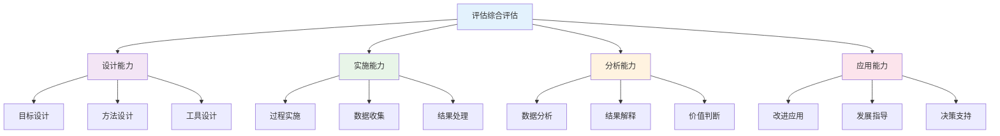

### 28. 学习评估教育国际化发展

**🌍 国际学习评估教育趋势**

#### 28.1 全球学习评估教育标准

| 标准体系 | 核心理念 | 内容特点 | 评估方式 | 发展趋势 |
|---------|----------|----------|----------|----------|
| **美国评估** | 能力导向 | 多元评估 | 综合评估 | 技术整合 |
| **英国评估** | 发展导向 | 形成性评估 | 过程评估 | 个性化 |
| **芬兰评估** | 学习导向 | 能力评估 | 表现评估 | 真实性 |
| **国际评估** | 全球视野 | 跨文化评估 | 综合评估 | 国际胜任力 |

#### 28.2 学习评估教育技术整合

**💻 数字化学习评估教育**:

1. **智能评估系统**
   - 个性化评估路径
   - 自适应评估内容
   - 实时评估反馈

2. **虚拟评估环境**
   - 虚拟评估实验室
   - 在线评估平台
   - 数字评估档案

3. **多媒体评估平台**
   - 评估资源库
   - 评估工具集
   - 评估数据库
