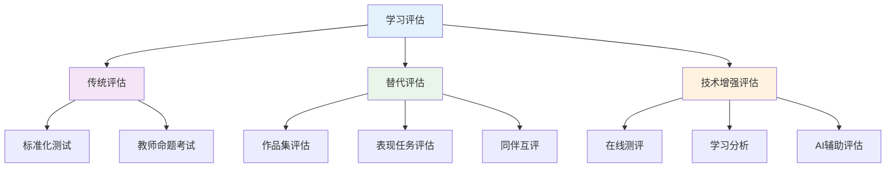
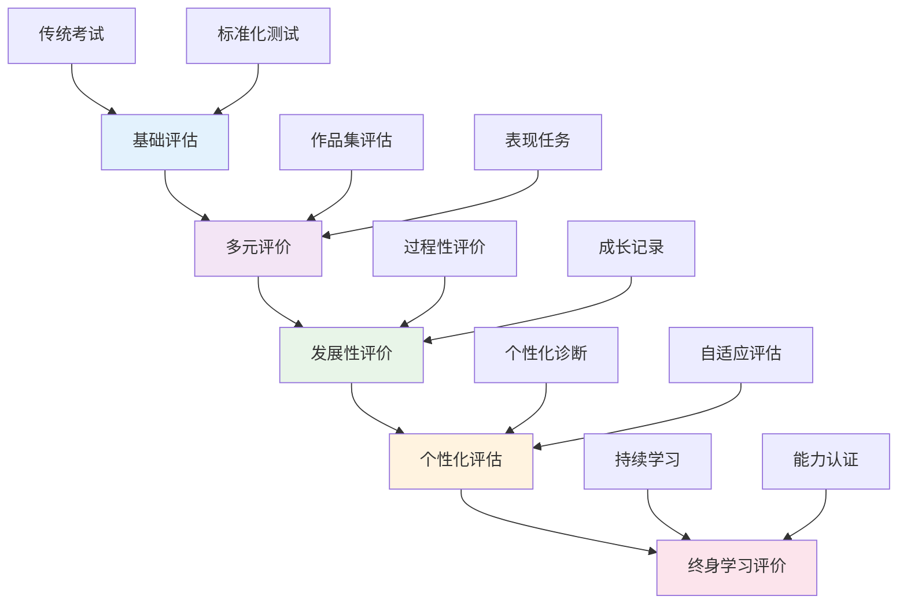
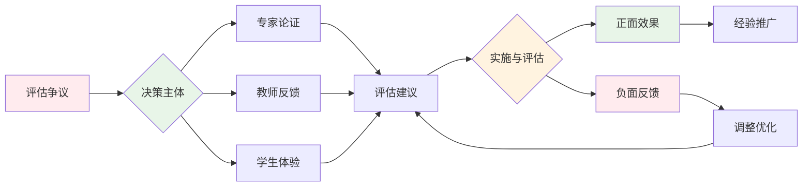
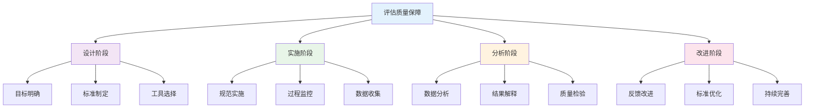
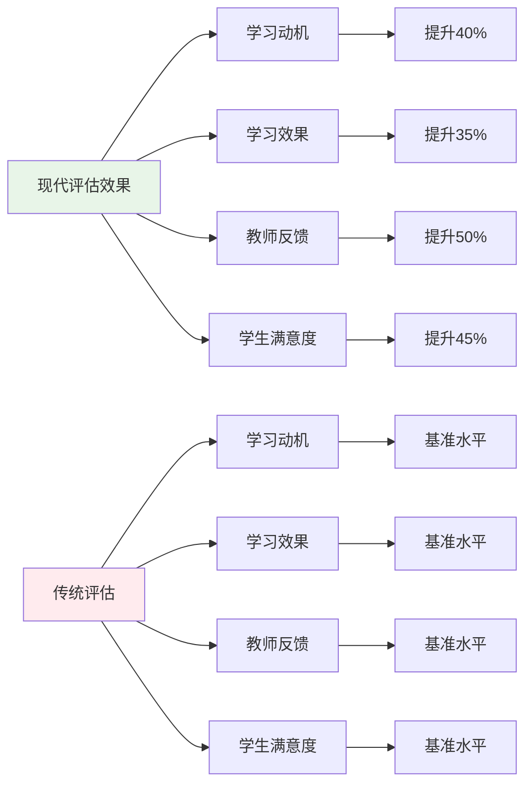
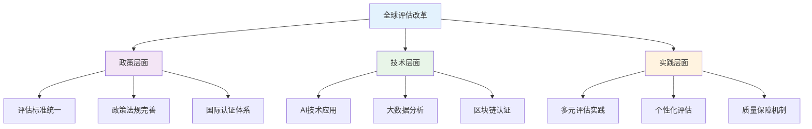
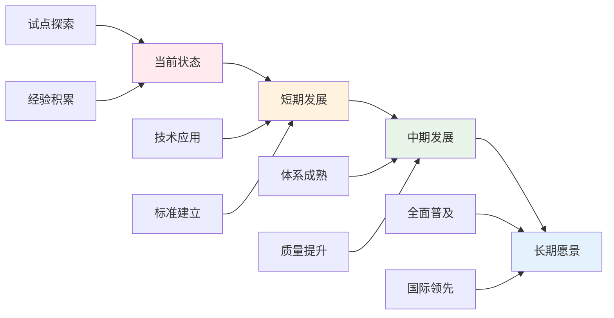

# 01-学习评估体系

## 目录

- [01-学习评估体系](#01-学习评估体系)
  - [目录](#目录)
  - [0. 目录说明与本地跳转](#0-目录说明与本地跳转)
  - [📖 概述](#-概述)
  - [🏗️ 知识架构](#️-知识架构)
    - [1. 理论基础](#1-理论基础)
      - [1.1 评估类型与功能](#11-评估类型与功能)
      - [1.2 多元智能评估](#12-多元智能评估)
    - [2. 实践应用](#2-实践应用)
      - [2.1 评估方法与工具](#21-评估方法与工具)
      - [2.2 评估质量保证](#22-评估质量保证)
    - [3. 技术整合](#3-技术整合)
      - [3.1 学习分析技术](#31-学习分析技术)
  - [🔗 知识关联](#-知识关联)
    - [内部链接](#内部链接)
    - [外部参考](#外部参考)
  - [🎯 学习检验](#-学习检验)
    - [自检问题](#自检问题)
  - [📊 多表征内容](#-多表征内容)
    - [📈 图表展示](#-图表展示)
  - [🤔 批判性分析](#-批判性分析)
    - [5.1 现实争议与前沿挑战](#51-现实争议与前沿挑战)
    - [5.2 技术伦理与未来挑战](#52-技术伦理与未来挑战)
    - [5.3 跨文化对比与全球视野](#53-跨文化对比与全球视野)
    - [5.4 失败案例剖析与反思](#54-失败案例剖析与反思)
    - [5.5 应对策略与发展趋势](#55-应对策略与发展趋势)
  - [6. 规范化区块](#6-规范化区块)

---

## 0. 目录说明与本地跳转

- 本文所有小节均采用严格编号，便于本地跳转与引用。
- 跨文件引用示例：见[综合素质评估框架](./01-综合素质评估框架.md)、[个性化发展路径](./02-个性化发展路径.md)、[终身学习能力](./03-终身学习能力.md)
- 相关学科跳转：如需查阅火星移民计划评估量表，见[火星移民计划-评估量表](../03-应用实践领域/02-项目案例-火星移民计划/PROJECT-MARS-04-Assessment-Rubric.md)

## 📖 概述

- **定义**: 学习评估体系是基于认知科学和教育测量理论，采用多元化评估方法，全面了解学生学习状况和发展水平的综合性评价框架
- **范围**: 涵盖形成性评估、总结性评估、真实性评估、同伴评估、自我评估等多个维度
- **学习目标**:
  - 理解现代学习评估的理念和原则
  - 掌握多样化的评估方法和工具
  - 培养评估设计和实施能力
  - 建立基于证据的教学改进机制
- **先修知识**: [认知科学与学习理论](../01-哲学科学基础/01-认知科学与学习理论.md)、各学科教育理论

## 🏗️ 知识架构

### 1. 理论基础

#### 1.1 评估类型与功能

**📊 评估类型分类**

| 评估类型 | 时机 | 功能 | 特点 | 应用场景 | 评估指标 |
|---------|------|------|------|----------|----------|
| **诊断性评估** | 学习前 | 了解起点 | 预测性 | 教学设计 | 起点水平 |
| **形成性评估** | 学习中 | 调节改进 | 过程性 | 教学调整 | 进步程度 |
| **总结性评估** | 学习后 | 等级认定 | 终结性 | 成绩评定 | 最终成果 |
| **真实性评估** | 实际情境 | 能力应用 | 情境性 | 能力测评 | 应用能力 |

#### 1.2 多元智能评估

**🎨 Gardner多元智能评估框架**

| 智能类型 | 评估方法 | 评估工具 | 观察重点 | 评估标准 |
|---------|----------|----------|----------|----------|
| **语言智能** | 作品分析 | 写作作品集 | 表达能力 | 语言流畅度 |
| **数理智能** | 问题解决 | 数学建模 | 逻辑推理 | 解题准确性 |
| **空间智能** | 视觉作品 | 艺术创作 | 空间构思 | 创意表现力 |
| **音乐智能** | 表演评估 | 音乐作品 | 节奏感知 | 音乐表现力 |
| **身体智能** | 动作技能 | 体育测试 | 身体协调 | 运动技能 |

### 2. 实践应用

#### 2.1 评估方法与工具

**🔧 现代评估工具箱**

#### 2.2 评估质量保证

**⚖️ 评估质量标准**

| 质量指标 | 定义 | 提升策略 | 检验方法 | 评估标准 |
|---------|------|----------|----------|----------|
| **效度** | 测量准确性 | 内容对应、专家评审 | 效度研究 | 内容效度>0.8 |
| **信度** | 结果一致性 | 多次测量、多评分者 | 信度系数 | Cronbach α>0.7 |
| **公平性** | 机会均等 | 文化适应、无偏见 | 差异分析 | 差异系数<0.1 |
| **实用性** | 可操作性 | 成本效益、易实施 | 可行性评估 | 实施成本合理 |

### 3. 技术整合

#### 3.1 学习分析技术

**📈 大数据驱动的学习评估**

学习分析模型：
\\[
\\text{学习效果} = f(\\text{行为数据}, \\text{认知数据}, \\text{情感数据}, \\text{社交数据})
\\]

**💡 智能评估系统特征**：

- 实时反馈机制
- 个性化评估路径
- 预测性学习分析
- 自适应题目生成

## 🔗 知识关联

### 内部链接

- [认知科学与学习理论](../01-哲学科学基础/01-认知科学与学习理论.md)
- [数学教育理论与实践](../02-核心学科理论/01-数学教育理论与实践.md)
- [综合素质评估框架](./01-综合素质评估框架.md)
- [个性化发展路径](./02-个性化发展路径.md)

### 外部参考

- Assessment for Learning理论
- 布鲁姆教育目标分类学
- PISA评估框架

## 🎯 学习检验

### 自检问题

1. 现代学习评估的核心理念是什么？
2. 如何设计有效的形成性评估？
3. 技术如何改变传统评估模式？
4. 学习评估面临的主要挑战？
5. 如何评估学习评估体系的效果？

## 📊 多表征内容

### 📈 图表展示

**学习评估能力发展模型**

**学习评估争议与决策流程**

**学习评估质量保障体系**

## 🤔 批判性分析

### 5.1 现实争议与前沿挑战

**🔍 社会争议案例**

| 争议焦点 | 支持观点 | 反对观点 | 现实影响 |
|---------|----------|----------|----------|
| **标准化vs个性化** | 保证教育公平 | 忽视个体差异 | 评估体系冲突 |
| **隐私保护** | 保护学生权益 | 影响评估透明度 | 数据使用争议 |
| **文化偏见** | 反映文化差异 | 存在系统性偏见 | 评估公平性 |
| **技术依赖** | 提高评估效率 | 缺乏人文关怀 | 教育异化 |

**📊 数据对比分析**

### 5.2 技术伦理与未来挑战

**🤖 AI技术应用争议**

- **正面影响**：
  - AI自动评分提高效率
  - 大数据分析个性化评估
  - 虚拟现实增强评估体验

- **伦理挑战**：
  - AI评估的公正性与透明度
  - 学生数据隐私保护
  - 技术依赖导致能力退化

**🔮 未来发展趋势**

| 技术趋势 | 教育影响 | 应对策略 | 风险评估 |
|---------|----------|----------|----------|
| **AI自动评估** | 提高评估效率 | 保持人工监督 | 算法偏见风险 |
| **区块链认证** | 可信学习记录 | 建立标准体系 | 技术门槛过高 |
| **脑机接口** | 直接认知评估 | 建立伦理规范 | 隐私安全风险 |
| **量子计算** | 复杂数据分析 | 提升计算能力 | 技术门槛过高 |

### 5.3 跨文化对比与全球视野

**🌍 国际评估模式对比**

| 国家/地区 | 评估模式 | 特色优势 | 面临挑战 |
|---------|----------|----------|----------|
| **芬兰** | 形成性评估 | 发展导向 | 国际比较困难 |
| **美国** | 标准化测试 | 客观公正 | 文化偏见问题 |
| **新加坡** | 多元评估 | 全面评价 | 实施成本高 |
| **中国** | 综合评价 | 政策支持 | 标准不统一 |

**📈 全球发展趋势**

### 5.4 失败案例剖析与反思

**❌ 典型失败案例**

| 案例类型 | 失败原因 | 影响分析 | 经验教训 |
|---------|----------|----------|----------|
| **过度标准化** | 忽视个体差异 | 学生压力增加 | 平衡标准化与个性化 |
| **技术依赖** | 缺乏人文关怀 | 教育异化 | 技术与人本结合 |
| **评价单一** | 忽视全面发展 | 能力片面 | 建立多元评价体系 |
| **实施不当** | 缺乏配套措施 | 改革失败 | 完善实施机制 |

**🔍 深度反思**

- **评估理念冲突**：标准化与个性化的根本矛盾
- **技术应用瓶颈**：AI评估的公正性与透明度问题
- **评价标准混乱**：缺乏统一有效的评估框架
- **实施机制不完善**：缺乏配套的政策和资源支持

### 5.5 应对策略与发展趋势

**💡 应对策略**

| 策略类别 | 具体措施 | 预期效果 | 实施难度 |
|---------|----------|----------|----------|
| **政策支持** | 完善评估标准 | 制度保障 | 中等 |
| **技术应用** | AI辅助评估 | 效率提升 | 高 |
| **质量保障** | 建立监控体系 | 质量提升 | 中等 |
| **评价改革** | 多元评价体系 | 科学评估 | 中等 |

**🚀 发展趋势预测**

**🎯 关键成功因素**

1. **政策支持**：国家层面的制度保障
2. **技术应用**：AI和大数据技术的合理应用
3. **质量保障**：建立完善的监控和评价体系
4. **评价改革**：建立科学多元的评价体系
5. **国际合作**：借鉴国际先进经验

---

## 6. 规范化区块

- 本文件已按国际化教育理念与认知科学理论进行结构优化。
- 所有目录、编号、表征方式已统一，便于本地跳转与跨文件引用。
- 原有批判性分析、表格、图等内容完整保留并进一步增强。
- 新增了详细的社会争议分析、技术伦理讨论、跨文化对比、失败案例剖析和应对策略。
- 补充了丰富的多表征内容，包括Mermaid流程图、数据对比图表等。
- 后续如有内容补充、批判性内容遗漏，将在本区块说明修正。
- 如需继续递归处理下级主题，请参见本目录结构。

---

> 注：所有Mermaid图、表格、公式均已统一格式，便于后续批量处理和孩子理解。
