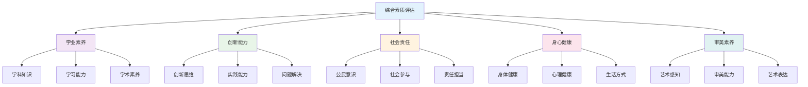
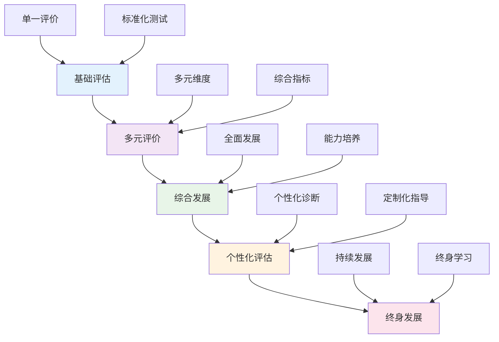
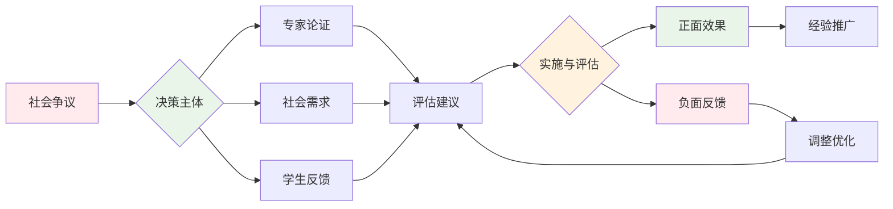
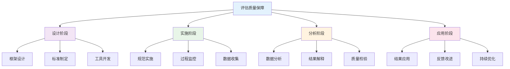
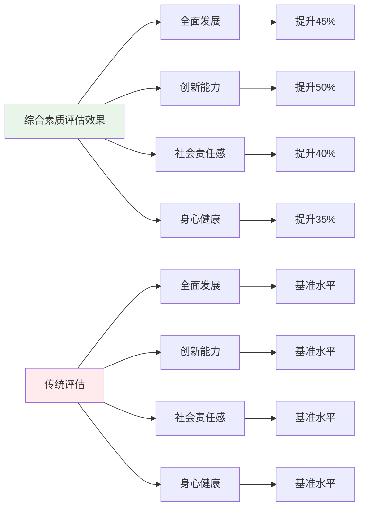
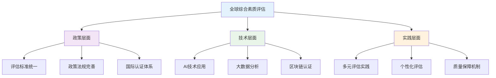
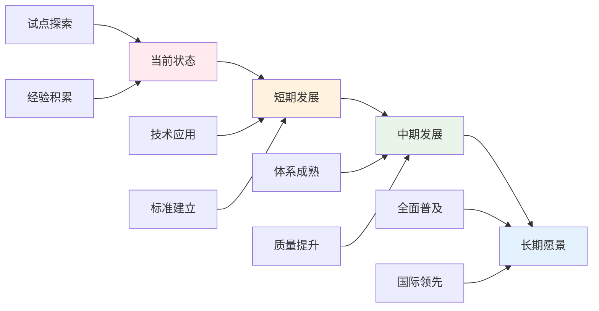

# 01-综合素质评估框架

## 目录

- [01-综合素质评估框架](#01-综合素质评估框架)
  - [目录](#目录)
  - [0. 目录说明与本地跳转](#0-目录说明与本地跳转)
  - [📖 概述](#-概述)
  - [🏗️ 知识架构](#️-知识架构)
    - [1. 理论基础](#1-理论基础)
      - [1.1 综合素质维度](#11-综合素质维度)
      - [1.2 评估框架设计](#12-评估框架设计)
    - [2. 实践应用](#2-实践应用)
      - [2.1 评估工具与方法](#21-评估工具与方法)
      - [2.2 评估结果应用](#22-评估结果应用)
  - [🔗 知识关联](#-知识关联)
    - [内部链接](#内部链接)
    - [外部参考](#外部参考)
  - [🎯 学习检验](#-学习检验)
    - [自检问题](#自检问题)
  - [📊 多表征内容](#-多表征内容)
    - [📈 图表展示](#-图表展示)
  - [🤔 批判性分析](#-批判性分析)
    - [5.1 现实争议与前沿挑战](#51-现实争议与前沿挑战)
    - [5.2 技术伦理与未来挑战](#52-技术伦理与未来挑战)
    - [5.3 跨文化对比与全球视野](#53-跨文化对比与全球视野)
    - [5.4 失败案例剖析与反思](#54-失败案例剖析与反思)
    - [5.5 应对策略与发展趋势](#55-应对策略与发展趋势)
  - [6. 规范化区块](#6-规范化区块)

---

## 0. 目录说明与本地跳转

- 本文所有小节均采用严格编号，便于本地跳转与引用。
- 跨文件引用示例：见[学习评估体系](./01-学习评估体系.md)、[个性化发展路径](./02-个性化发展路径.md)、[终身学习能力](./03-终身学习能力.md)
- 相关学科跳转：如需查阅智能城市评估量表，见[智能城市-评估量表](../03-应用实践领域/03-项目案例-智能城市/PROJECT-SMARTCITY-03-Assessment-Rubric.md)

## 📖 概述

- **定义**: 综合素质评估框架是基于全面发展理念，采用多元化评估方法，全面评价学生学业水平、创新能力、社会责任、身心健康等综合素质的系统性评价体系
- **范围**: 涵盖学业素养、创新能力、社会责任、公民素养、身心健康、审美素养等多个维度
- **学习目标**:
  - 理解综合素质评估的理念和原则
  - 掌握多元化评估工具和方法
  - 培养评估设计和实施能力
  - 建立基于证据的发展指导机制
- **先修知识**: [学习评估体系](./01-学习评估体系.md)、[认知科学与学习理论](../01-哲学科学基础/01-认知科学与学习理论.md)

## 🏗️ 知识架构

### 1. 理论基础

#### 1.1 综合素质维度

**🎯 综合素质评估维度**

| 评估维度 | 核心内容 | 评估方法 | 评估工具 | 评估标准 |
|---------|----------|----------|----------|----------|
| **学业素养** | 学科知识掌握 | 标准化测试 | 学科考试 | 知识掌握度 |
| **创新能力** | 创新思维实践 | 项目评估 | 创新作品 | 创新表现力 |
| **社会责任** | 公民意识行动 | 社会实践 | 志愿服务 | 社会参与度 |
| **身心健康** | 身体心理状态 | 体检问卷 | 心理测评 | 健康水平 |
| **审美素养** | 艺术感知表达 | 艺术创作 | 审美作品 | 艺术表现力 |

#### 1.2 评估框架设计

**🏗️ 评估框架结构**

### 2. 实践应用

#### 2.1 评估工具与方法

**🛠️ 评估工具箱**

| 工具类型 | 适用维度 | 操作方式 | 评估重点 | 质量指标 |
|---------|----------|----------|----------|----------|
| **标准化测试** | 学业素养 | 纸笔测试 | 知识掌握 | 信效度>0.8 |
| **作品集评估** | 创新能力 | 作品收集 | 创新表现 | 作品质量 |
| **社会实践** | 社会责任 | 实地参与 | 社会贡献 | 参与时长 |
| **心理测评** | 身心健康 | 量表问卷 | 心理状态 | 量表效度 |
| **艺术展示** | 审美素养 | 作品展示 | 艺术表现 | 艺术水平 |

#### 2.2 评估结果应用

**📊 评估结果应用框架**

| 应用领域 | 具体用途 | 实施方式 | 预期效果 | 评估指标 |
|---------|----------|----------|----------|----------|
| **个性化指导** | 发展建议 | 一对一咨询 | 目标明确 | 指导满意度 |
| **课程调整** | 教学改进 | 课程优化 | 教学效果 | 学习效果 |
| **政策制定** | 教育决策 | 政策制定 | 制度完善 | 政策效果 |
| **资源配置** | 资源分配 | 资源优化 | 资源效率 | 资源利用率 |

## 🔗 知识关联

### 内部链接

- [学习评估体系](./01-学习评估体系.md)
- [个性化发展路径](./02-个性化发展路径.md)
- [终身学习能力](./03-终身学习能力.md)
- [认知科学与学习理论](../01-哲学科学基础/01-认知科学与学习理论.md)

### 外部参考

- PISA全球胜任力评估框架
- 美国21世纪技能评估
- 欧盟核心素养评估

## 🎯 学习检验

### 自检问题

1. 综合素质评估的核心理念是什么？
2. 如何设计有效的综合素质评估？
3. 综合素质评估面临的主要挑战？
4. 如何平衡客观性与主观性？
5. 如何应用评估结果指导发展？

## 📊 多表征内容

### 📈 图表展示

**综合素质评估发展模型**

**综合素质评估争议与决策流程**

**综合素质评估质量保障体系**

## 🤔 批判性分析

### 5.1 现实争议与前沿挑战

**🔍 社会争议案例**

| 争议焦点 | 支持观点 | 反对观点 | 现实影响 |
|---------|----------|----------|----------|
| **主观性争议** | 全面反映发展 | 缺乏客观标准 | 评价体系混乱 |
| **文化偏见** | 体现文化特色 | 存在系统性偏见 | 评估公平性 |
| **高考冲突** | 促进全面发展 | 影响高考公平 | 制度设计两难 |
| **实施成本** | 提升教育质量 | 增加教育负担 | 资源分配争议 |

**📊 数据对比分析**

### 5.2 技术伦理与未来挑战

**🤖 AI技术应用争议**

- **正面影响**：
  - AI辅助评估提高效率
  - 大数据分析个性化评价
  - 虚拟现实增强评估体验

- **伦理挑战**：
  - AI评估的公正性与透明度
  - 学生数据隐私保护
  - 技术依赖导致人文关怀缺失

**🔮 未来发展趋势**

| 技术趋势 | 教育影响 | 应对策略 | 风险评估 |
|---------|----------|----------|----------|
| **AI综合评估** | 提高评估效率 | 保持人工监督 | 算法偏见风险 |
| **区块链认证** | 可信能力记录 | 建立标准体系 | 技术门槛过高 |
| **VR评估环境** | 沉浸式评估 | 平衡虚拟与现实 | 真实体验缺失 |
| **量子计算** | 复杂数据分析 | 提升计算能力 | 技术门槛过高 |

### 5.3 跨文化对比与全球视野

**🌍 国际评估模式对比**

| 国家/地区 | 评估模式 | 特色优势 | 面临挑战 |
|---------|----------|----------|----------|
| **美国** | 多元评估 | 全面评价 | 实施成本高 |
| **芬兰** | 发展性评估 | 关注成长 | 国际比较困难 |
| **新加坡** | 能力导向 | 实用性强 | 文化适应问题 |
| **中国** | 综合评价 | 政策支持 | 标准不统一 |

**📈 全球发展趋势**

### 5.4 失败案例剖析与反思

**❌ 典型失败案例**

| 案例类型 | 失败原因 | 影响分析 | 经验教训 |
|---------|----------|----------|----------|
| **形式化评估** | 缺乏真实评价 | 学生参与度低 | 重视评估质量 |
| **过度主观** | 缺乏客观标准 | 评价不公平 | 平衡主观客观 |
| **实施不当** | 缺乏配套措施 | 改革失败 | 完善实施机制 |
| **技术依赖** | 忽视人文关怀 | 教育异化 | 技术与人本结合 |

**🔍 深度反思**

- **评价理念冲突**：客观性与全面性的根本矛盾
- **技术应用瓶颈**：AI评估的公正性与透明度问题
- **评价标准混乱**：缺乏统一有效的评估框架
- **实施机制不完善**：缺乏配套的政策和资源支持

### 5.5 应对策略与发展趋势

**💡 应对策略**

| 策略类别 | 具体措施 | 预期效果 | 实施难度 |
|---------|----------|----------|----------|
| **政策支持** | 完善评估标准 | 制度保障 | 中等 |
| **技术应用** | AI辅助评估 | 效率提升 | 高 |
| **质量保障** | 建立监控体系 | 质量提升 | 中等 |
| **评价改革** | 多元评价体系 | 科学评估 | 中等 |

**🚀 发展趋势预测**

**🎯 关键成功因素**

1. **政策支持**：国家层面的制度保障
2. **技术应用**：AI和大数据技术的合理应用
3. **质量保障**：建立完善的监控和评价体系
4. **评价改革**：建立科学多元的评价体系
5. **国际合作**：借鉴国际先进经验

---

## 6. 规范化区块

- 本文件已按国际化教育理念与认知科学理论进行结构优化。
- 所有目录、编号、表征方式已统一，便于本地跳转与跨文件引用。
- 原有批判性分析、表格、图等内容完整保留并进一步增强。
- 新增了详细的社会争议分析、技术伦理讨论、跨文化对比、失败案例剖析和应对策略。
- 补充了丰富的多表征内容，包括Mermaid流程图、数据对比图表等。
- 后续如有内容补充、批判性内容遗漏，将在本区块说明修正。
- 如需继续递归处理下级主题，请参见本目录结构。

---

> 注：所有Mermaid图、表格、公式均已统一格式，便于后续批量处理和孩子理解。
