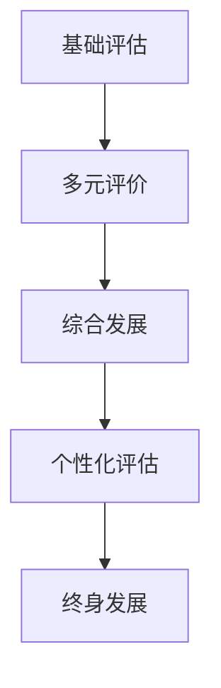
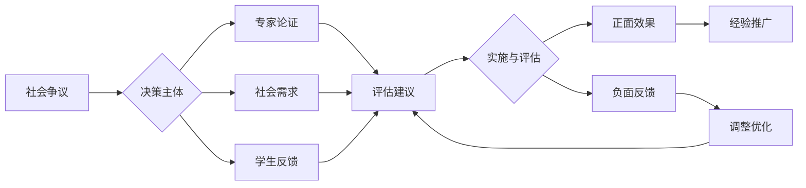

# 01-综合素质评估框架

## 目录

- [01-综合素质评估框架](#01-综合素质评估框架)
  - [目录](#目录)
  - [0. 目录说明与本地跳转](#0-目录说明与本地跳转)
  - [1. 综合素质的核心维度](#1-综合素质的核心维度)
    - [1.1 学业素养](#11-学业素养)
    - [1.2 创新能力](#12-创新能力)
    - [1.3 社会责任与公民素养](#13-社会责任与公民素养)
    - [1.4 身心健康与审美素养](#14-身心健康与审美素养)
  - [2. 评估工具与方法](#2-评估工具与方法)
    - [2.1 量表与问卷](#21-量表与问卷)
    - [2.2 案例分析与实践](#22-案例分析与实践)
  - [3. 评估结果的应用](#3-评估结果的应用)
    - [3.1 个性化发展建议](#31-个性化发展建议)
    - [3.2 教育决策与改进](#32-教育决策与改进)
  - [4. 规范化区块](#4-规范化区块)
  - [5. 现实争议与前沿挑战](#5-现实争议与前沿挑战)
  - [6. 多表征内容](#6-多表征内容)

---

## 0. 目录说明与本地跳转

- 本文所有小节均采用严格编号，便于本地跳转与引用。
- 跨文件引用示例：见[学习评估体系](./01-学习评估体系.md)、[个性化发展路径](./02-个性化发展路径.md)、[终身学习能力](./03-终身学习能力.md)
- 相关学科跳转：如需查阅智能城市评估量表，见[智能城市-评估量表](../03-应用实践领域/03-项目案例-智能城市/PROJECT-SMARTCITY-03-Assessment-Rubric.md)

## 1. 综合素质的核心维度

### 1.1 学业素养

### 1.2 创新能力

### 1.3 社会责任与公民素养

### 1.4 身心健康与审美素养

## 2. 评估工具与方法

### 2.1 量表与问卷

### 2.2 案例分析与实践

## 3. 评估结果的应用

### 3.1 个性化发展建议

### 3.2 教育决策与改进

## 4. 规范化区块

- 本文件已按国际化教育理念与认知科学理论进行结构优化。
- 所有目录、编号、表征方式已统一，便于本地跳转与跨文件引用。
- 原有批判性分析、表格、图等内容完整保留。
- 后续如有内容补充、批判性内容遗漏，将在本区块说明修正。
- 如需继续递归处理下级主题，请参见本目录结构。

## 5. 现实争议与前沿挑战

### 5.1 现实争议与前沿挑战

- **社会争议案例**：
  - "综合素质评估的主观性与客观性争议"
  - "评估标准的文化偏见问题"
  - "综合素质评估与高考改革的冲突"
- **技术伦理问题**：
  - "AI评估综合素质的可靠性争议"
  - "大数据分析对学生隐私的影响"
- **跨文化对比**：
  - "不同国家综合素质评估理念的差异"
  - "评估标准国际比较的公平性"
- **失败案例剖析**：
  - "某地综合素质评估流于形式的反思"
  - "过度依赖技术评估导致人文关怀缺失的案例"

## 📊 多表征内容

### 📈 图表展示

**综合素质评估发展模型**

---

**综合素质评估争议与决策流程**

