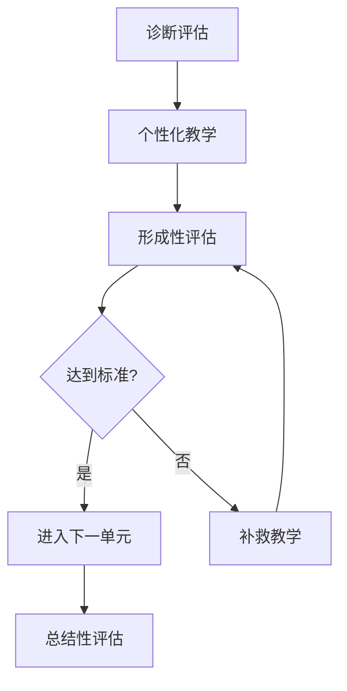

# 02 个性化发展路径

## 📖 概述

- **定义**: 个性化发展路径是基于学习者个体特征、能力水平和发展需求，设计的量身定制的学习方案和成长轨迹，旨在最大化每个学习者的潜能发展
- **范围**: 涵盖学习风格识别、能力评估、路径规划、资源配置、进展监测等多个维度
- **学习目标**:
  - 理解个体差异与学习的关系
  - 掌握个性化教育的设计原理
  - 培养自我认知和规划能力
  - 建立终身学习的发展理念
- **先修知识**: [认知科学与学习理论](../01-哲学科学基础/01-认知科学与学习理论.md)、[学习评估体系](./01-学习评估体系.md)

## 🏗️ 知识架构

### 1. 理论基础

#### 1.1 个体差异理论

**🧠 学习者特征维度**

| 差异维度 | 具体表现 | 评估工具 | 教育意义 |
|---------|----------|----------|----------|
| **认知风格** | 场独立/场依赖 | 认知风格测试 | 教学策略适配 |
| **学习偏好** | 视觉/听觉/动觉 | 学习风格量表 | 多模态呈现 |
| **智能类型** | 多元智能分布 | MI评估 | 优势发展 |
| **动机模式** | 内在/外在动机 | 动机问卷 | 激励机制 |

#### 1.2 发展阶段理论

**📈 Bloom掌握学习模型**

### 2. 实践应用

#### 2.1 个性化学习设计

**🎯 自适应学习系统架构**

| 组成要素 | 功能 | 技术实现 | 效果 |
|---------|------|----------|------|
| **学习者模型** | 特征建模 | 数据挖掘 | 精准画像 |
| **内容库** | 资源管理 | 标签分类 | 个性推荐 |
| **策略引擎** | 路径规划 | 算法优化 | 最优路径 |
| **反馈系统** | 实时调整 | 数据分析 | 持续改进 |

#### 2.2 发展路径规划

**🗺️ 个人学习地图**

个性化路径设计的数学模型：
\\[
\\text{最优路径} = \\arg\\min_{path} \\sum_{i=1}^{n} w_i \\cdot cost_i(path)
\\]

其中：

- $w_i$: 各维度权重
- $cost_i$: 学习成本函数
- $n$: 评估维度数量

### 3. 技术支持

#### 3.1 AI驱动的个性化

**🤖 智能教育系统特征**

- **学习行为分析**: 实时捕获学习轨迹
- **知识图谱构建**: 动态更新知识结构
- **预测性建模**: 预测学习困难和需求
- **自适应推荐**: 智能推荐学习资源

## 🔗 知识关联

### 内部链接

- [认知科学与学习理论](../01-哲学科学基础/01-认知科学与学习理论.md)
- [学习评估体系](./01-学习评估体系.md)

### 外部参考

- 个性化学习理论
- 自适应教育技术
- 学习分析学

## 🎯 学习检验

### 自检问题

1. 个性化教育的核心原理是什么？
2. 如何设计有效的个性化学习路径？
3. 技术如何支持个性化发展？

---
*个性化学习 | 适应性教育 | 智能化发展*
