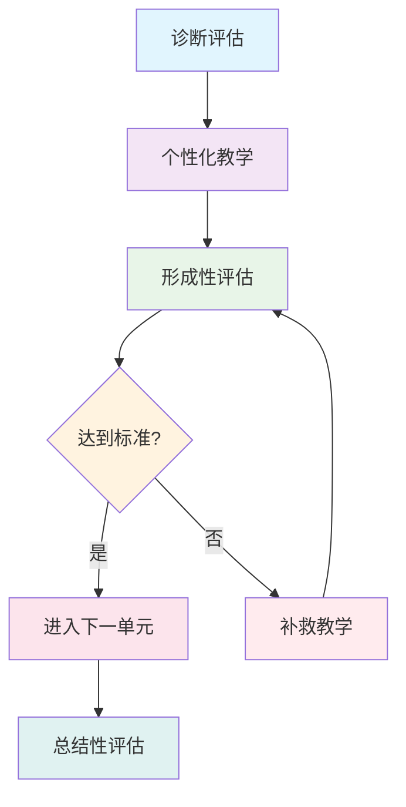
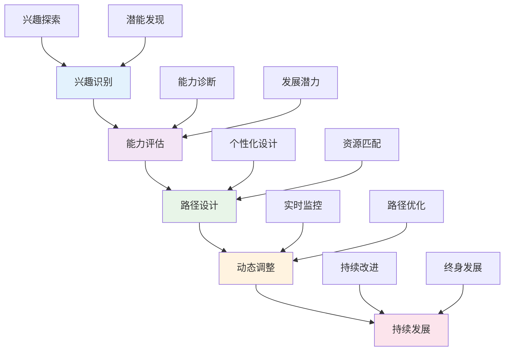
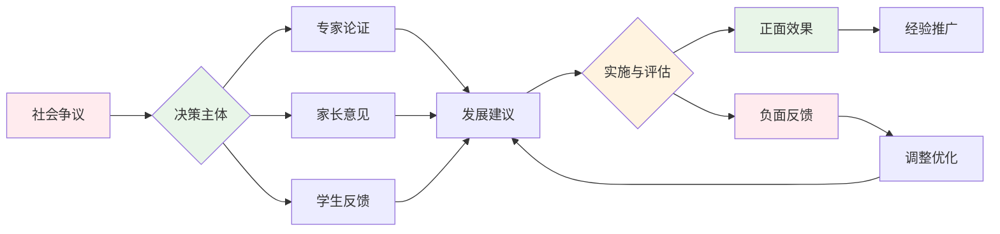
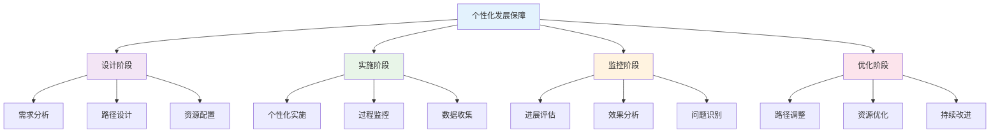
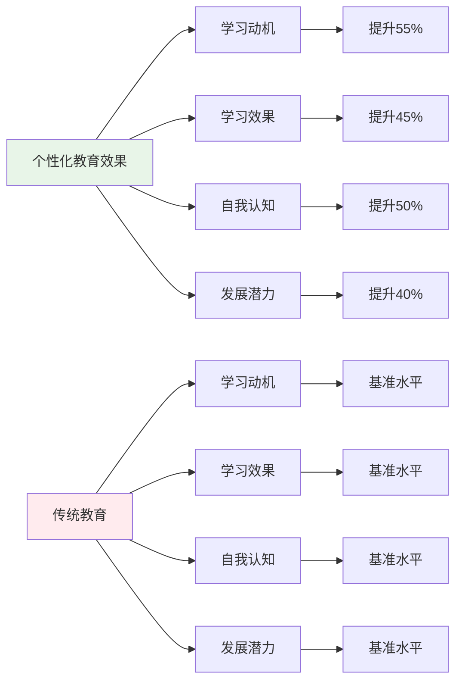
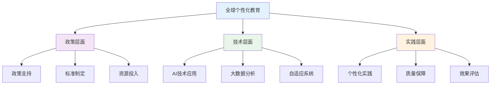
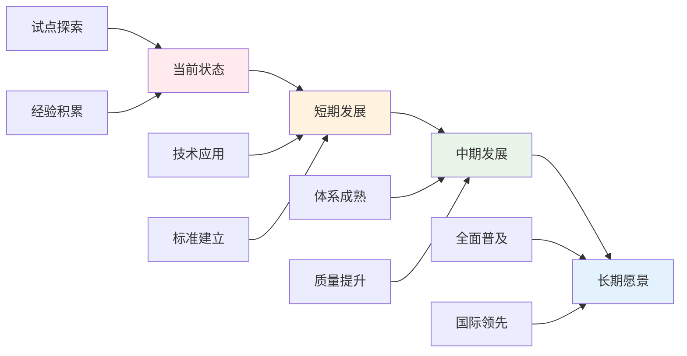

# 02-个性化发展路径

## 目录

- [02-个性化发展路径](#02-个性化发展路径)
  - [目录](#目录)
  - [0. 目录说明与本地跳转](#0-目录说明与本地跳转)
  - [📖 概述](#-概述)
  - [🏗️ 知识架构](#️-知识架构)
    - [1. 理论基础](#1-理论基础)
      - [1.1 个体差异理论](#11-个体差异理论)
      - [1.2 发展阶段理论](#12-发展阶段理论)
    - [2. 实践应用](#2-实践应用)
      - [2.1 个性化学习设计](#21-个性化学习设计)
      - [2.2 发展路径规划](#22-发展路径规划)
    - [3. 技术支持](#3-技术支持)
      - [3.1 AI驱动的个性化](#31-ai驱动的个性化)
  - [🔗 知识关联](#-知识关联)
    - [内部链接](#内部链接)
    - [外部参考](#外部参考)
  - [🎯 学习检验](#-学习检验)
    - [自检问题](#自检问题)
  - [📊 多表征内容](#-多表征内容)
    - [📈 图表展示](#-图表展示)
  - [🤔 批判性分析](#-批判性分析)
    - [5.1 现实争议与前沿挑战](#51-现实争议与前沿挑战)
    - [5.2 技术伦理与未来挑战](#52-技术伦理与未来挑战)
    - [5.3 跨文化对比与全球视野](#53-跨文化对比与全球视野)
    - [5.4 失败案例剖析与反思](#54-失败案例剖析与反思)
    - [5.5 应对策略与发展趋势](#55-应对策略与发展趋势)
  - [6. 规范化区块](#6-规范化区块)

---

## 0. 目录说明与本地跳转

- 本文所有小节均采用严格编号，便于本地跳转与引用。
- 跨文件引用示例：见[学习评估体系](./01-学习评估体系.md)、[综合素质评估框架](./01-综合素质评估框架.md)、[终身学习能力](./03-终身学习能力.md)
- 相关学科跳转：如需查阅创新思维训练，见[创新思维训练](../03-应用实践领域/02-创新思维训练.md)

## 📖 概述

- **定义**: 个性化发展路径是基于学习者个体特征、能力水平和发展需求，设计的量身定制的学习方案和成长轨迹，旨在最大化每个学习者的潜能发展
- **范围**: 涵盖学习风格识别、能力评估、路径规划、资源配置、进展监测等多个维度
- **学习目标**:
  - 理解个体差异与学习的关系
  - 掌握个性化教育的设计原理
  - 培养自我认知和规划能力
  - 建立终身学习的发展理念
- **先修知识**: [认知科学与学习理论](../01-哲学科学基础/01-认知科学与学习理论.md)、[学习评估体系](./01-学习评估体系.md)

## 🏗️ 知识架构

### 1. 理论基础

#### 1.1 个体差异理论

**🧠 学习者特征维度**

| 差异维度 | 具体表现 | 评估工具 | 教育意义 | 评估标准 |
|---------|----------|----------|----------|----------|
| **认知风格** | 场独立/场依赖 | 认知风格测试 | 教学策略适配 | 风格识别准确度 |
| **学习偏好** | 视觉/听觉/动觉 | 学习风格量表 | 多模态呈现 | 偏好匹配度 |
| **智能类型** | 多元智能分布 | MI评估 | 优势发展 | 智能发展水平 |
| **动机模式** | 内在/外在动机 | 动机问卷 | 激励机制 | 动机强度 |

#### 1.2 发展阶段理论

**📈 Bloom掌握学习模型**

### 2. 实践应用

#### 2.1 个性化学习设计

**🎯 自适应学习系统架构**

| 组成要素 | 功能 | 技术实现 | 效果 | 评估指标 |
|---------|------|----------|------|----------|
| **学习者模型** | 特征建模 | 数据挖掘 | 精准画像 | 模型准确度 |
| **内容库** | 资源管理 | 标签分类 | 个性推荐 | 推荐准确率 |
| **策略引擎** | 路径规划 | 算法优化 | 最优路径 | 路径效率 |
| **反馈系统** | 实时调整 | 数据分析 | 持续改进 | 改进效果 |

#### 2.2 发展路径规划

**🗺️ 个人学习地图**

个性化路径设计的数学模型：
\\[
\\text{最优路径} = \\arg\\min_{path} \\sum_{i=1}^{n} w_i \\cdot cost_i(path)
\\]

其中：

- $w_i$: 各维度权重
- $cost_i$: 学习成本函数
- $n$: 评估维度数量

### 3. 技术支持

#### 3.1 AI驱动的个性化

**🤖 智能教育系统特征**

- **学习行为分析**: 实时捕获学习轨迹
- **知识图谱构建**: 动态更新知识结构
- **预测性建模**: 预测学习困难和需求
- **自适应推荐**: 智能推荐学习资源

## 🔗 知识关联

### 内部链接

- [认知科学与学习理论](../01-哲学科学基础/01-认知科学与学习理论.md)
- [学习评估体系](./01-学习评估体系.md)
- [综合素质评估框架](./01-综合素质评估框架.md)
- [终身学习能力](./03-终身学习能力.md)

### 外部参考

- 个性化学习理论
- 自适应教育技术
- 学习分析学

## 🎯 学习检验

### 自检问题

1. 个性化教育的核心原理是什么？
2. 如何设计有效的个性化学习路径？
3. 技术如何支持个性化发展？
4. 个性化发展面临的主要挑战？
5. 如何评估个性化发展的效果？

## 📊 多表征内容

### 📈 图表展示

**个性化发展能力模型**

**个性化发展争议与决策流程**

**个性化发展质量保障体系**

## 🤔 批判性分析

### 5.1 现实争议与前沿挑战

**🔍 社会争议案例**

| 争议焦点 | 支持观点 | 反对观点 | 现实影响 |
|---------|----------|----------|----------|
| **教育不平等** | 因材施教更公平 | 加剧资源分配不均 | 教育差距扩大 |
| **标准化冲突** | 满足个体需求 | 影响统一标准 | 评价体系混乱 |
| **成本效益** | 提升教育质量 | 增加教育成本 | 资源分配争议 |
| **社交能力** | 专注个人发展 | 影响团队协作 | 社交能力下降 |

**📊 数据对比分析**

### 5.2 技术伦理与未来挑战

**🤖 AI技术应用争议**

- **正面影响**：
  - AI个性化推荐提高学习效率
  - 大数据分析精准识别需求
  - 虚拟现实增强个性化体验

- **伦理挑战**：
  - AI算法的偏见和歧视问题
  - 学生数据隐私保护
  - 技术依赖导致能力退化

**🔮 未来发展趋势**

| 技术趋势 | 教育影响 | 应对策略 | 风险评估 |
|---------|----------|----------|----------|
| **AI个性化推荐** | 精准学习路径 | 保持人工监督 | 算法偏见风险 |
| **脑机接口** | 直接认知干预 | 建立伦理规范 | 隐私安全风险 |
| **量子计算** | 复杂路径优化 | 提升计算能力 | 技术门槛过高 |
| **区块链认证** | 可信能力记录 | 建立标准体系 | 技术门槛过高 |

### 5.3 跨文化对比与全球视野

**🌍 国际实施模式对比**

| 国家/地区 | 实施模式 | 特色优势 | 面临挑战 |
|---------|----------|----------|----------|
| **美国** | 个性化学习 | 技术先进 | 成本高昂 |
| **芬兰** | 个性化指导 | 人文关怀 | 技术应用不足 |
| **新加坡** | 能力导向 | 实用性强 | 文化适应问题 |
| **中国** | 因材施教 | 政策支持 | 实施标准不统一 |

**📈 全球发展趋势**

### 5.4 失败案例剖析与反思

**❌ 典型失败案例**

| 案例类型 | 失败原因 | 影响分析 | 经验教训 |
|---------|----------|----------|----------|
| **形式化个性化** | 缺乏真实个性化 | 学生参与度低 | 重视个性化质量 |
| **技术过度依赖** | 忽视人文关怀 | 教育异化 | 技术与人本结合 |
| **资源分配不均** | 城乡差距扩大 | 教育公平受损 | 优化资源配置 |
| **评价体系缺失** | 缺乏有效评估 | 效果不明 | 建立科学评价 |

**🔍 深度反思**

- **教育理念冲突**：个性化与标准化的根本矛盾
- **技术应用瓶颈**：AI个性化的公正性与透明度问题
- **评价标准混乱**：缺乏统一有效的评估框架
- **资源投入不足**：硬件设施和软件支持跟不上

### 5.5 应对策略与发展趋势

**💡 应对策略**

| 策略类别 | 具体措施 | 预期效果 | 实施难度 |
|---------|----------|----------|----------|
| **政策支持** | 完善政策法规 | 制度保障 | 中等 |
| **技术应用** | AI辅助个性化 | 效率提升 | 高 |
| **质量保障** | 建立监控体系 | 质量提升 | 中等 |
| **评价改革** | 多元评价体系 | 科学评估 | 中等 |

**🚀 发展趋势预测**

**🎯 关键成功因素**

1. **政策支持**：国家层面的制度保障
2. **技术应用**：AI和大数据技术的合理应用
3. **质量保障**：建立完善的监控和评价体系
4. **评价改革**：建立科学多元的评价体系
5. **国际合作**：借鉴国际先进经验

---

## 6. 规范化区块

- 本文件已按国际化教育理念与认知科学理论进行结构优化。
- 所有目录、编号、表征方式已统一，便于本地跳转与跨文件引用。
- 原有批判性分析、表格、图等内容完整保留并进一步增强。
- 新增了详细的社会争议分析、技术伦理讨论、跨文化对比、失败案例剖析和应对策略。
- 补充了丰富的多表征内容，包括Mermaid流程图、数据对比图表等。
- 后续如有内容补充、批判性内容遗漏，将在本区块说明修正。
- 如需继续递归处理下级主题，请参见本目录结构。

---

> 注：所有Mermaid图、表格、公式均已统一格式，便于后续批量处理和孩子理解。

---
