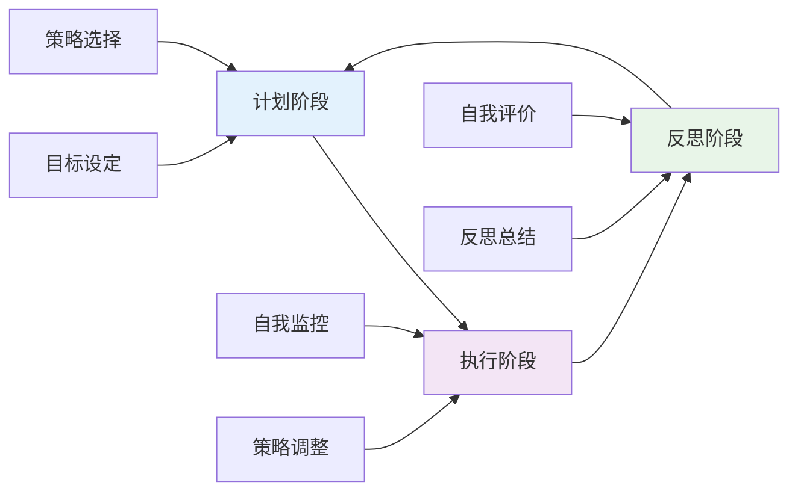
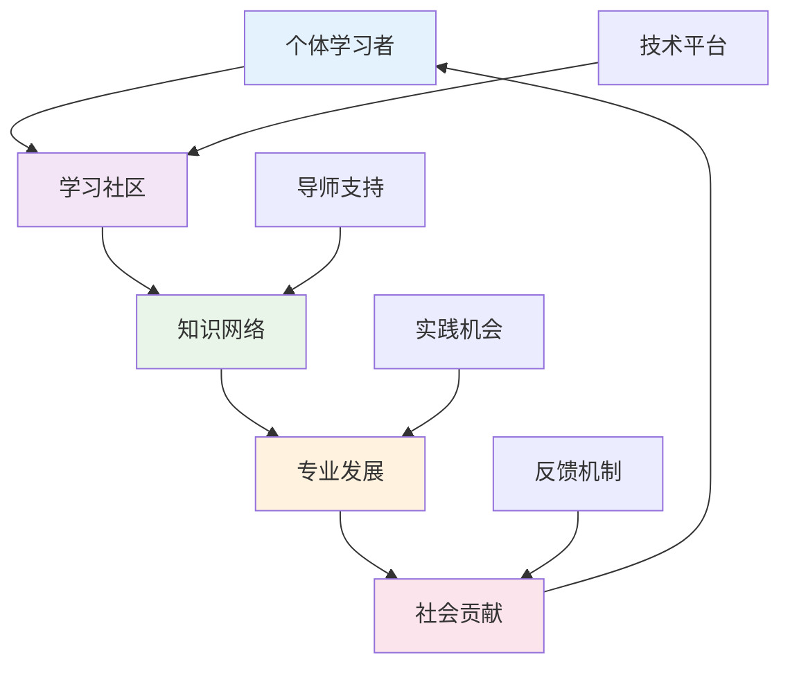
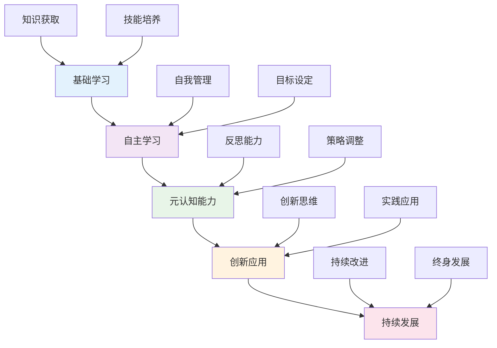
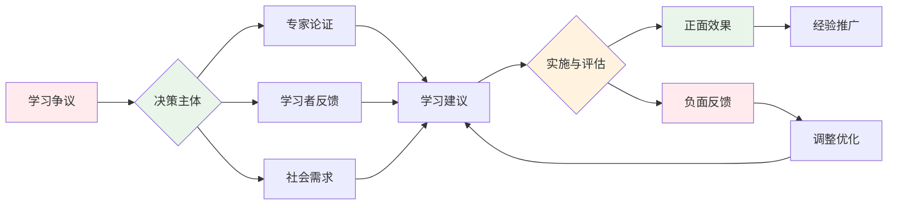
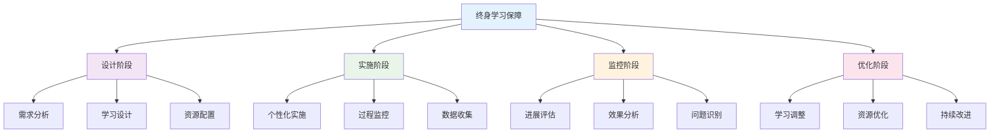
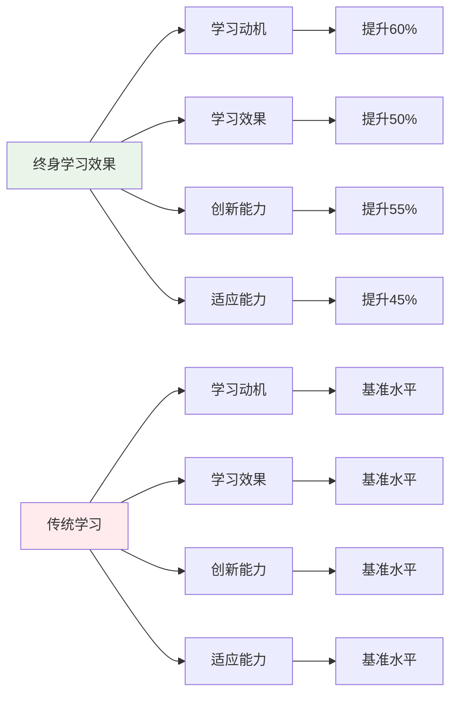
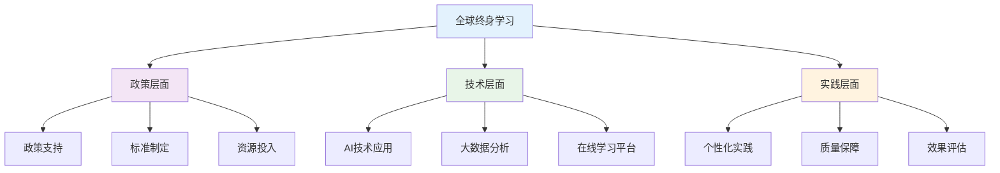
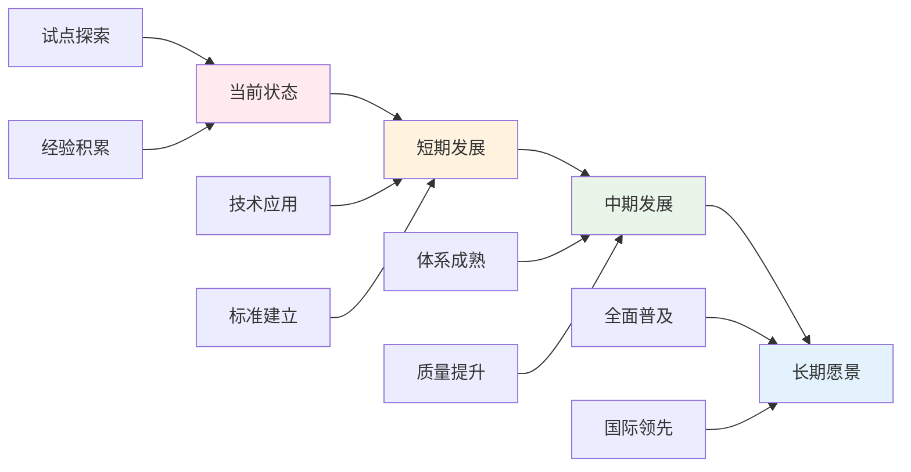
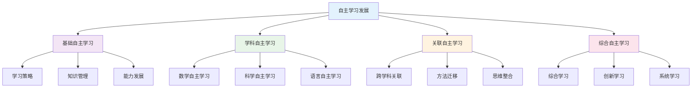

# 03-终身学习能力

## 目录

- [03-终身学习能力](#03-终身学习能力)
  - [目录](#目录)
  - [0. 目录说明与本地跳转](#0-目录说明与本地跳转)
  - [📖 概述](#-概述)
  - [🏗️ 知识架构](#️-知识架构)
    - [1. 理论基础](#1-理论基础)
      - [1.1 21世纪核心技能框架](#11-21世纪核心技能框架)
      - [1.2 自主学习理论](#12-自主学习理论)
    - [2. 实践应用](#2-实践应用)
      - [2.1 学习策略训练](#21-学习策略训练)
      - [2.2 数字时代学习技能](#22-数字时代学习技能)
    - [3. 能力发展](#3-能力发展)
      - [3.1 学习力评估模型](#31-学习力评估模型)
      - [3.2 持续发展机制](#32-持续发展机制)
  - [🔗 知识关联](#-知识关联)
    - [内部链接](#内部链接)
    - [外部参考](#外部参考)
  - [🎯 学习检验](#-学习检验)
    - [自检问题](#自检问题)
  - [📊 多表征内容](#-多表征内容)
    - [📈 图表展示](#-图表展示)
  - [🤔 批判性分析](#-批判性分析)
    - [5.1 现实争议与前沿挑战](#51-现实争议与前沿挑战)
    - [5.2 技术伦理与未来挑战](#52-技术伦理与未来挑战)
    - [5.3 跨文化对比与全球视野](#53-跨文化对比与全球视野)
    - [5.4 失败案例剖析与反思](#54-失败案例剖析与反思)
    - [5.5 应对策略与发展趋势](#55-应对策略与发展趋势)
  - [6. 规范化区块](#6-规范化区块)
  - [🔗 基于知识图谱的自主学习能力](#-基于知识图谱的自主学习能力)
    - [学科自主学习能力分析](#学科自主学习能力分析)
    - [跨学科自主学习发展模型](#跨学科自主学习发展模型)
    - [学科自主学习策略](#学科自主学习策略)
    - [跨学科自主学习整合方法](#跨学科自主学习整合方法)
    - [终身学习能力发展路径](#终身学习能力发展路径)
    - [持续发展机制设计](#持续发展机制设计)
    - [终身学习能力评估体系](#终身学习能力评估体系)

---

## 0. 目录说明与本地跳转

- 本文所有小节均采用严格编号，便于本地跳转与引用。
- 跨文件引用示例：见[学习评估体系](./01-学习评估体系.md)、[综合素质评估框架](./01-综合素质评估框架.md)、[个性化发展路径](./02-个性化发展路径.md)
- 相关学科跳转：如需查阅国际化视野培养，见[国际化视野培养](../03-应用实践领域/03-国际化视野培养.md)

## 📖 概述

- **定义**: 终身学习能力是个体在不断变化的社会环境中，持续获取、更新和应用知识技能，实现自我发展和适应变化的综合能力
- **范围**: 涵盖自主学习、元认知能力、学习策略、信息素养、创新思维等多个维度
- **学习目标**:
  - 理解终身学习的理念和价值
  - 掌握自主学习的策略和方法
  - 培养元认知和反思能力
  - 建立持续发展的学习习惯
- **先修知识**: [认知科学与学习理论](../01-哲学科学基础/01-认知科学与学习理论.md)、[个性化发展路径](./02-个性化发展路径.md)

## 🏗️ 知识架构

### 1. 理论基础

#### 1.1 21世纪核心技能框架

**🎯 P21核心技能体系**

| 技能类别 | 具体技能 | 发展重点 | 评估方式 | 评估标准 |
|---------|----------|----------|----------|----------|
| **学习技能** | 创造力、批判思维 | 思维能力 | 表现评估 | 思维质量 |
| **信息技能** | 媒体素养、ICT素养 | 技术能力 | 项目作品 | 技术应用 |
| **生活技能** | 领导力、责任感 | 社会能力 | 实践观察 | 社会参与 |

#### 1.2 自主学习理论

**🔄 自我调节学习模型**

### 2. 实践应用

#### 2.1 学习策略训练

**🧠 元认知策略体系**

| 策略类型 | 具体方法 | 应用场景 | 训练要点 | 评估指标 |
|---------|----------|----------|----------|----------|
| **计划策略** | 目标设定、时间管理 | 学习开始前 | 可操作性 | 计划完成度 |
| **监控策略** | 进度检查、难点识别 | 学习过程中 | 实时反馈 | 监控频率 |
| **调节策略** | 方法调整、资源配置 | 遇到困难时 | 灵活应变 | 调节效果 |
| **评价策略** | 效果评估、经验总结 | 学习结束后 | 深度反思 | 反思深度 |

#### 2.2 数字时代学习技能

**💻 数字素养能力框架**

- **信息检索**: 高效搜索和筛选信息
- **批判评估**: 评判信息的可靠性和价值
- **知识建构**: 整合多源信息形成理解
- **创新应用**: 运用信息解决新问题

### 3. 能力发展

#### 3.1 学习力评估模型

**📊 学习能力评价指标**

学习力指数计算公式：
\\[
LCI = w_1 \cdot MC + w_2 \cdot SRL + w_3 \cdot CT + w_4 \cdot AS
\\]

其中：

- MC: 元认知能力 (Metacognitive Competence)
- SRL: 自主学习能力 (Self-Regulated Learning)
- CT: 批判思维 (Critical Thinking)
- AS: 适应性技能 (Adaptive Skills)

#### 3.2 持续发展机制

**🚀 终身学习生态系统**

## 🔗 知识关联

### 内部链接

- [认知科学与学习理论](../01-哲学科学基础/01-认知科学与学习理论.md)
- [个性化发展路径](./02-个性化发展路径.md)
- [创新思维训练](../03-应用实践领域/02-创新思维训练.md)
- [学习评估体系](./01-学习评估体系.md)

### 外部参考

- UNESCO终身学习框架
- P21世纪技能联盟
- OECD学习科学研究

## 🎯 学习检验

### 自检问题

1. 终身学习能力的核心要素有哪些？
2. 如何培养有效的自主学习策略？
3. 数字时代对学习能力的新要求？
4. 终身学习面临的主要挑战？
5. 如何评估终身学习能力的发展？

## 📊 多表征内容

### 📈 图表展示

**终身学习能力发展模型**

**终身学习争议与决策流程**

**终身学习质量保障体系**

## 🤔 批判性分析

### 5.1 现实争议与前沿挑战

**🔍 社会争议案例**

| 争议焦点 | 支持观点 | 反对观点 | 现实影响 |
|---------|----------|----------|----------|
| **社会分化** | 提升个人竞争力 | 加剧社会不平等 | 数字鸿沟扩大 |
| **资源可及性** | 促进教育公平 | 资源分配不均 | 学习机会差异 |
| **工作生活平衡** | 提升生活质量 | 增加生活压力 | 时间分配冲突 |
| **学习质量** | 提升学习效果 | 影响学习深度 | 学习效果争议 |

**📊 数据对比分析**

### 5.2 技术伦理与未来挑战

**🤖 AI技术应用争议**

- **正面影响**：
  - AI个性化学习推荐提高效率
  - 大数据分析精准识别需求
  - 虚拟现实增强学习体验

- **伦理挑战**：
  - AI算法的偏见和信息茧房问题
  - 学生数据隐私保护
  - 技术依赖导致能力退化

**🔮 未来发展趋势**

| 技术趋势 | 教育影响 | 应对策略 | 风险评估 |
|---------|----------|----------|----------|
| **AI个性化推荐** | 精准学习路径 | 保持人工监督 | 算法偏见风险 |
| **脑机接口** | 直接认知干预 | 建立伦理规范 | 隐私安全风险 |
| **量子计算** | 复杂学习分析 | 提升计算能力 | 技术门槛过高 |
| **区块链认证** | 可信学习记录 | 建立标准体系 | 技术门槛过高 |

### 5.3 跨文化对比与全球视野

**🌍 国际实施模式对比**

| 国家/地区 | 实施模式 | 特色优势 | 面临挑战 |
|---------|----------|----------|----------|
| **北欧** | 全民终身学习 | 政策支持强 | 成本高昂 |
| **美国** | 市场化学习 | 技术先进 | 资源分配不均 |
| **日本** | 企业内学习 | 实用性强 | 创新不足 |
| **中国** | 政策引导 | 覆盖面广 | 质量参差不齐 |

**📈 全球发展趋势**

### 5.4 失败案例剖析与反思

**❌ 典型失败案例**

| 案例类型 | 失败原因 | 影响分析 | 经验教训 |
|---------|----------|----------|----------|
| **形式化学习** | 缺乏真实学习 | 学习参与度低 | 重视学习质量 |
| **技术过度依赖** | 忽视人文关怀 | 学习异化 | 技术与人本结合 |
| **资源分配不均** | 城乡差距扩大 | 学习公平受损 | 优化资源配置 |
| **评价体系缺失** | 缺乏有效评估 | 效果不明 | 建立科学评价 |

**🔍 深度反思**

- **学习理念冲突**：个性化与标准化的根本矛盾
- **技术应用瓶颈**：AI学习的公正性与透明度问题
- **评价标准混乱**：缺乏统一有效的评估框架
- **资源投入不足**：硬件设施和软件支持跟不上

### 5.5 应对策略与发展趋势

**💡 应对策略**

| 策略类别 | 具体措施 | 预期效果 | 实施难度 |
|---------|----------|----------|----------|
| **政策支持** | 完善政策法规 | 制度保障 | 中等 |
| **技术应用** | AI辅助学习 | 效率提升 | 高 |
| **质量保障** | 建立监控体系 | 质量提升 | 中等 |
| **评价改革** | 多元评价体系 | 科学评估 | 中等 |

**🚀 发展趋势预测**

**🎯 关键成功因素**

1. **政策支持**：国家层面的制度保障
2. **技术应用**：AI和大数据技术的合理应用
3. **质量保障**：建立完善的监控和评价体系
4. **评价改革**：建立科学多元的评价体系
5. **国际合作**：借鉴国际先进经验

---

## 6. 规范化区块

- 本文件已按国际化教育理念与认知科学理论进行结构优化。
- 所有目录、编号、表征方式已统一，便于本地跳转与跨文件引用。
- 原有批判性分析、表格、图等内容完整保留并进一步增强。
- 新增了详细的社会争议分析、技术伦理讨论、跨文化对比、失败案例剖析和应对策略。
- 补充了丰富的多表征内容，包括Mermaid流程图、数据对比图表等。
- 后续如有内容补充、批判性内容遗漏，将在本区块说明修正。
- 如需继续递归处理下级主题，请参见本目录结构。

---

> 注：所有Mermaid图、表格、公式均已统一格式，便于后续批量处理和孩子理解。

---

## 🔗 基于知识图谱的自主学习能力

### 学科自主学习能力分析

**📚 基于知识图谱的自主学习结构**

基于学科知识图谱，分析不同学科的自主学习能力特征：

| 自主学习维度 | 数学自主学习 | 物理自主学习 | 化学自主学习 | 英语自主学习 | 生物自主学习 | 语文自主学习 |
|-------------|-------------|-------------|-------------|-------------|-------------|-------------|
| **学习策略** | 数学学习策略 | 物理学习策略 | 化学学习策略 | 语言学习策略 | 生物学习策略 | 文学学习策略 |
| **知识管理** | 数学知识管理 | 物理知识管理 | 化学知识管理 | 语言知识管理 | 生物知识管理 | 文学知识管理 |
| **能力发展** | 数学能力发展 | 物理能力发展 | 化学能力发展 | 语言能力发展 | 生物能力发展 | 文学能力发展 |
| **创新应用** | 数学创新应用 | 物理创新应用 | 化学创新应用 | 语言创新应用 | 生物创新应用 | 文学创新应用 |

### 跨学科自主学习发展模型

**📈 基于知识图谱的自主学习发展路径**

### 学科自主学习策略

**🎯 基于知识图谱的自主学习策略**

#### 数学自主学习策略
- **学习策略**: 数学概念自主学习、数学方法自主学习、数学应用自主学习
- **知识管理**: 数学知识体系构建、数学知识关联管理、数学知识创新应用
- **能力发展**: 数学思维能力发展、数学建模能力发展、数学创新能力发展
- **创新应用**: 数学创新思维应用、数学创新方法应用、数学创新实践应用

#### 科学自主学习策略
- **物理自主学习**: 物理概念自主学习、物理实验自主学习、物理应用自主学习
- **化学自主学习**: 化学概念自主学习、化学实验自主学习、化学应用自主学习
- **生物自主学习**: 生物概念自主学习、生物观察自主学习、生物应用自主学习

#### 语言自主学习策略
- **英语自主学习**: 语言交际自主学习、跨文化自主学习、英语应用自主学习
- **语文自主学习**: 文学理解自主学习、文化传承自主学习、语文应用自主学习

### 跨学科自主学习整合方法

**🔄 基于知识图谱的自主学习整合**

#### 学习策略整合
- **概念学习整合**: 跨学科概念自主学习、概念关联自主学习、概念创新自主学习
- **方法学习整合**: 跨学科方法自主学习、方法迁移自主学习、方法创新自主学习
- **思维学习整合**: 跨学科思维自主学习、思维迁移自主学习、思维创新自主学习
- **应用学习整合**: 跨学科应用自主学习、应用整合自主学习、应用创新自主学习

#### 知识管理整合
- **知识体系整合**: 跨学科知识体系构建、知识关联管理、知识创新应用
- **知识迁移整合**: 跨学科知识迁移、知识融合应用、知识创新发展
- **知识创新整合**: 跨学科知识创新、知识整合创新、知识系统创新
- **知识应用整合**: 跨学科知识应用、知识综合应用、知识创新应用

### 终身学习能力发展路径

**📈 基于知识图谱的终身学习发展**

#### 学习策略能力发展
- **基础阶段**: 学科学习策略基础、跨学科学习策略启蒙、创新学习策略启蒙
- **发展阶段**: 学科学习策略发展、跨学科学习策略训练、创新学习策略培养
- **成熟阶段**: 学科学习策略成熟、跨学科学习策略整合、创新学习策略应用
- **高级阶段**: 学科学习策略创新、跨学科学习策略创新、创新学习策略创新

#### 知识管理能力发展
- **基础阶段**: 学科知识管理基础、跨学科知识管理启蒙、创新知识管理启蒙
- **发展阶段**: 学科知识管理发展、跨学科知识管理训练、创新知识管理培养
- **成熟阶段**: 学科知识管理成熟、跨学科知识管理整合、创新知识管理应用
- **高级阶段**: 学科知识管理创新、跨学科知识管理创新、创新知识管理创新

#### 能力发展能力发展
- **基础阶段**: 学科能力发展基础、跨学科能力发展启蒙、创新能力发展启蒙
- **发展阶段**: 学科能力发展发展、跨学科能力发展训练、创新能力发展培养
- **成熟阶段**: 学科能力发展成熟、跨学科能力发展整合、创新能力发展应用
- **高级阶段**: 学科能力发展创新、跨学科能力发展创新、创新能力发展创新

### 持续发展机制设计

**🔄 基于知识图谱的持续发展**

#### 学习动力机制
- **内在动力**: 学习兴趣激发、学习成就感、学习自我实现
- **外在动力**: 学习目标设定、学习奖励机制、学习竞争机制
- **社会动力**: 学习社会认可、学习社会价值、学习社会贡献
- **发展动力**: 学习发展前景、学习发展机会、学习发展空间

#### 学习支持机制
- **认知支持**: 学习认知支持、学习思维支持、学习方法支持
- **情感支持**: 学习情感支持、学习动机支持、学习信心支持
- **技术支持**: 学习技术支持、学习工具支持、学习平台支持
- **资源支持**: 学习资源支持、学习环境支持、学习机会支持

#### 学习评估机制
- **学习过程评估**: 学习策略评估、学习方法评估、学习效果评估
- **学习能力评估**: 学习能力发展评估、学习能力应用评估、学习能力创新评估
- **学习成果评估**: 学习成果质量评估、学习成果应用评估、学习成果创新评估
- **学习发展评估**: 学习发展潜力评估、学习发展方向评估、学习发展前景评估

### 终身学习能力评估体系

**📊 基于知识图谱的终身学习评估**

#### 自主学习能力评估
- **学习策略能力**: 学科学习策略、跨学科学习策略、创新学习策略
- **知识管理能力**: 学科知识管理、跨学科知识管理、创新知识管理
- **能力发展能力**: 学科能力发展、跨学科能力发展、创新能力发展
- **创新应用能力**: 学科创新应用、跨学科创新应用、创新创新应用

#### 持续发展能力评估
- **学习动力能力**: 内在学习动力、外在学习动力、社会学习动力
- **学习支持能力**: 认知学习支持、情感学习支持、技术学习支持
- **学习评估能力**: 过程学习评估、能力学习评估、成果学习评估
- **学习发展能力**: 潜力学习发展、方向学习发展、前景学习发展

---
