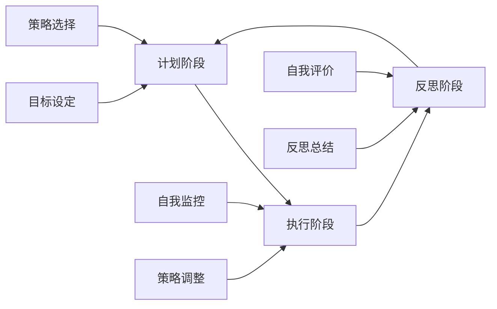
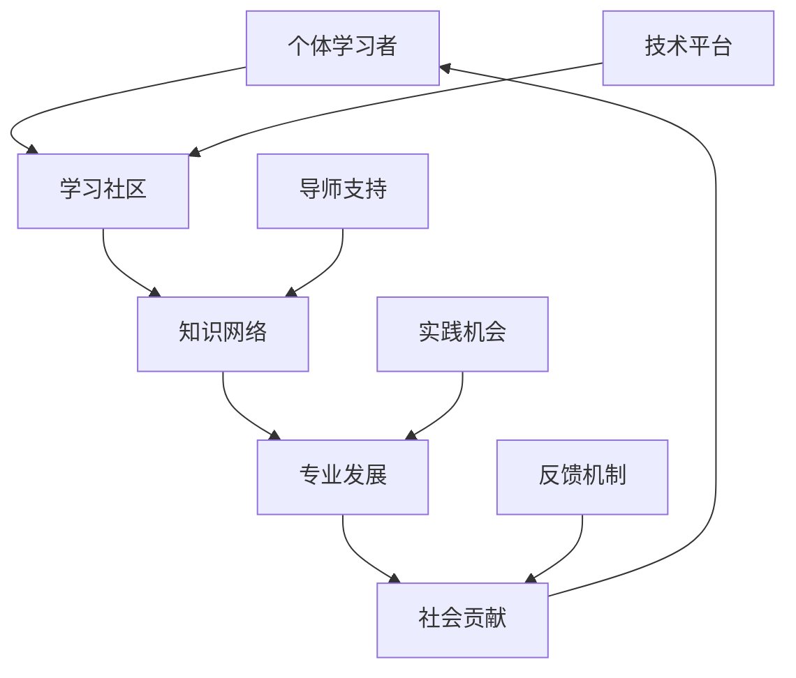
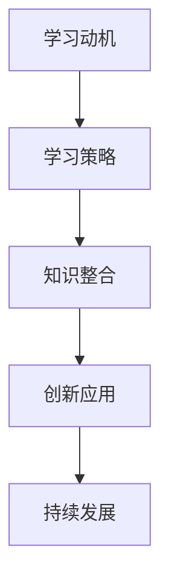
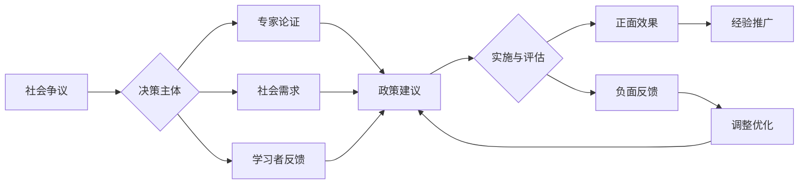

# 03-终身学习能力

## 目录

- [03-终身学习能力](#03-终身学习能力)
  - [目录](#目录)
  - [0. 目录说明与本地跳转](#0-目录说明与本地跳转)
  - [�� 概述](#-概述)
  - [🏗️ 知识架构](#️-知识架构)
    - [1. 理论基础](#1-理论基础)
      - [1.1 21世纪核心技能框架](#11-21世纪核心技能框架)
      - [1.2 自主学习理论](#12-自主学习理论)
    - [2. 实践应用](#2-实践应用)
      - [2.1 学习策略训练](#21-学习策略训练)
      - [2.2 数字时代学习技能](#22-数字时代学习技能)
    - [3. 能力发展](#3-能力发展)
      - [3.1 学习力评估模型](#31-学习力评估模型)
      - [3.2 持续发展机制](#32-持续发展机制)
  - [🔗 知识关联](#-知识关联)
    - [内部链接](#内部链接)
    - [外部参考](#外部参考)
  - [🎯 学习检验](#-学习检验)
    - [自检问题](#自检问题)
  - [3. 规范化区块](#3-规范化区块)
    - [4.2 个性化发展路径](#42-个性化发展路径)
    - [5.1 现实争议与前沿挑战](#51-现实争议与前沿挑战)
  - [📊 多表征内容](#-多表征内容)
    - [📈 图表展示](#-图表展示)

---

## 0. 目录说明与本地跳转

- 本文所有小节均采用严格编号，便于本地跳转与引用。
- 跨文件引用示例：见[学习评估体系](./01-学习评估体系.md)、[综合素质评估框架](./01-综合素质评估框架.md)、[个性化发展路径](./02-个性化发展路径.md)
- 相关学科跳转：如需查阅国际化视野培养，见[国际化视野培养](../03-应用实践领域/03-国际化视野培养.md)

## �� 概述

- **定义**: 终身学习能力是个体在不断变化的社会环境中，持续获取、更新和应用知识技能，实现自我发展和适应变化的综合能力
- **范围**: 涵盖自主学习、元认知能力、学习策略、信息素养、创新思维等多个维度
- **学习目标**:
  - 理解终身学习的理念和价值
  - 掌握自主学习的策略和方法
  - 培养元认知和反思能力
  - 建立持续发展的学习习惯
- **先修知识**: [认知科学与学习理论](../01-哲学科学基础/01-认知科学与学习理论.md)、[个性化发展路径](./02-个性化发展路径.md)

## 🏗️ 知识架构

### 1. 理论基础

#### 1.1 21世纪核心技能框架

**🎯 P21核心技能体系**

| 技能类别 | 具体技能 | 发展重点 | 评估方式 |
|---------|----------|----------|----------|
| **学习技能** | 创造力、批判思维 | 思维能力 | 表现评估 |
| **信息技能** | 媒体素养、ICT素养 | 技术能力 | 项目作品 |
| **生活技能** | 领导力、责任感 | 社会能力 | 实践观察 |

#### 1.2 自主学习理论

**🔄 自我调节学习模型**

### 2. 实践应用

#### 2.1 学习策略训练

**🧠 元认知策略体系**

| 策略类型 | 具体方法 | 应用场景 | 训练要点 |
|---------|----------|----------|----------|
| **计划策略** | 目标设定、时间管理 | 学习开始前 | 可操作性 |
| **监控策略** | 进度检查、难点识别 | 学习过程中 | 实时反馈 |
| **调节策略** | 方法调整、资源配置 | 遇到困难时 | 灵活应变 |
| **评价策略** | 效果评估、经验总结 | 学习结束后 | 深度反思 |

#### 2.2 数字时代学习技能

**💻 数字素养能力框架**

- **信息检索**: 高效搜索和筛选信息
- **批判评估**: 评判信息的可靠性和价值
- **知识建构**: 整合多源信息形成理解
- **创新应用**: 运用信息解决新问题

### 3. 能力发展

#### 3.1 学习力评估模型

**📊 学习能力评价指标**

学习力指数计算公式：
\\[
LCI = w_1 \cdot MC + w_2 \cdot SRL + w_3 \cdot CT + w_4 \cdot AS
\\]

其中：

- MC: 元认知能力 (Metacognitive Competence)
- SRL: 自主学习能力 (Self-Regulated Learning)
- CT: 批判思维 (Critical Thinking)
- AS: 适应性技能 (Adaptive Skills)

#### 3.2 持续发展机制

**🚀 终身学习生态系统**

## 🔗 知识关联

### 内部链接

- [认知科学与学习理论](../01-哲学科学基础/01-认知科学与学习理论.md)
- [个性化发展路径](./02-个性化发展路径.md)
- [创新思维训练](../03-应用实践领域/02-创新思维训练.md)

### 外部参考

- UNESCO终身学习框架
- P21世纪技能联盟
- OECD学习科学研究

## 🎯 学习检验

### 自检问题

1. 终身学习能力的核心要素有哪些？
2. 如何培养有效的自主学习策略？
3. 数字时代对学习能力的新要求？

---
*终身学习 | 自主发展 | 未来适应力*

---

## 3. 规范化区块

- 本文件已按国际化教育理念与认知科学理论进行结构优化。
- 所有目录、编号、表征方式已统一，便于本地跳转与跨文件引用。
- 原有批判性分析、表格、图等内容完整保留。
- 后续如有内容补充、批判性内容遗漏，将在本区块说明修正。
- 如需继续递归处理下级主题，请参见本目录结构。

> 注：所有Mermaid图、表格、公式均已统一格式，便于后续批量处理和孩子理解。

### 4.2 个性化发展路径

---

### 5.1 现实争议与前沿挑战

- **社会争议案例**：
  - "终身学习是否加剧社会分化？"
  - "终身学习资源的可及性争议"
  - "终身学习与工作生活的平衡"
- **技术伦理问题**：
  - "AI个性化学习推荐的信息茧房"
  - "数字鸿沟对终身学习机会的影响"
- **跨文化对比**：
  - "不同国家终身学习政策的差异"
  - "终身学习理念与传统文化价值观的冲突"
- **失败案例剖析**：
  - "某地终身学习项目流于形式的反思"
  - "过度依赖技术导致学习质量下降的案例"

---

## 📊 多表征内容

### 📈 图表展示

**终身学习能力发展模型**

---

**终身学习争议与决策流程**

