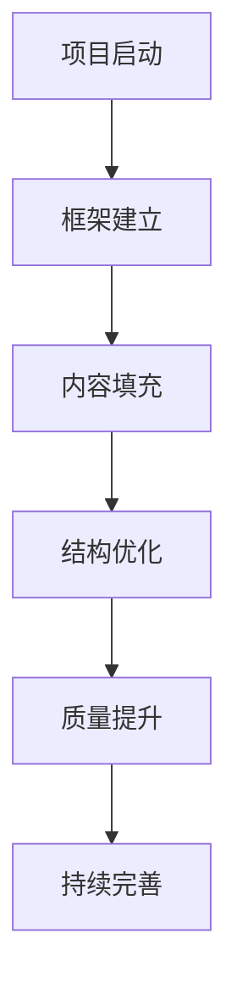
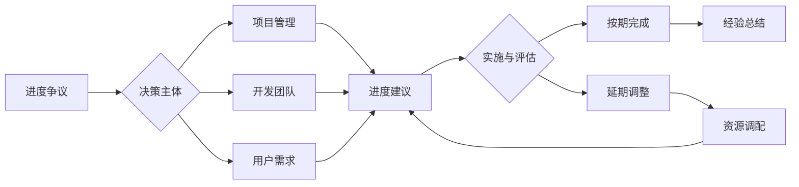

# 🚀 高中教育知识体系构建进度追踪

## 📊 项目概览

- **项目名称**: 国际化高中教育知识体系
- **开始时间**: 2024年当前
- **目标**: 构建符合最新认知科学和教育理念的完整知识体系

## 🎯 核心目标

1. 结合最新国际教育理念、认知科学、教育学前沿理论
2. 多表征方式组织内容（图表、数学符号、可视化等）
3. 建立严格的层次化分类和本地跳转系统
4. 适应高中生认知发展规律的循序渐进结构

## 📋 执行阶段

### ✅ 第一阶段：框架建立（已完成）

- [x] 项目进度追踪系统建立
- [x] 核心目录结构设计
- [x] 主要知识领域分类
- [x] 标准化模板创建
- [x] 哲学科学基础三个核心模块完成

### ✅ 第二阶段：内容架构（已完成）

- [x] 哲学科学基础层（3个模块）
- [x] 核心学科理论层（4个模块）
- [x] 应用实践领域层（3个模块）
- [x] 评估与发展层（3个模块）

### ✅ 第三阶段：核心内容填充（已完成）

- [x] 数学教育理论与实践
- [x] 科学教育方法论
- [x] 语言学习与认知发展
- [x] 人文社科整合教育

### ✅ 第四阶段：应用实践模块（已完成）

- [x] 跨学科项目学习
- [x] 创新思维训练
- [x] 国际化视野培养

### ✅ 第五阶段：评估发展体系（已完成）

- [x] 学习评估体系
- [x] 个性化发展路径
- [x] 终身学习能力

## 🏗️ 当前工作状态

**当前状态**: 基础框架已建立，但学科覆盖严重不足
**问题**: 缺失物理、化学、生物、地理、政治、经济、艺术、体育、历史等关键学科
**下一步**: 系统补全所有高中学科的详细内容模块

## 📝 工作记录

### 已完成模块总览

**第一层：哲学科学基础（3个模块）**

- 01-认知科学与学习理论
- 02-教育哲学与价值观  
- 03-逻辑学与批判性思维

**第二层：核心学科理论（4个模块）**

- 01-数学教育理论与实践
- 02-科学教育方法论
- 03-语言学习与认知发展
- 04-人文社科整合教育

**第三层：应用实践领域（3个模块）**

- 01-跨学科项目学习
- 02-创新思维训练
- 03-国际化视野培养

**第四层：评估与发展（3个模块）**

- 01-学习评估体系
- 02-个性化发展路径
- 03-终身学习能力

### 特色成果

- 完整的四层知识架构
- 丰富的多表征内容（图表、数学公式、流程图）
- 系统的内部链接网络
- 国际化教育理念整合
- 认知科学理论支撑

## 🔄 中断恢复指南

如项目中断，请：

1. 查看本文档了解当前进度
2. 检查最后修改的文件
3. 继续执行对应阶段的任务
4. 更新本文档的进度状态

---
*最后更新: 当前时间 | 状态: 进行中*

# 项目进度追踪

## 📊 总体进度

- [x] 基础框架搭建
- [ ] 内容优化完善
- [ ] 结构规范化
- [ ] 跨学科整合
- [ ] 评估体系建设

## 📋 具体任务列表

### 1. 内容优化 (进行中)

#### 1.1 哲学科学基础

- [x] 认知科学与学习理论
- [x] 教育哲学与价值观
- [ ] 逻辑学与批判性思维

#### 1.2 核心学科理论

- [x] 数学教育理论与实践
- [x] 科学教育方法论
- [x] 语言学习与认知发展
- [ ] 人文社科整合教育
- [ ] 物理教育理论与实践
- [ ] 化学教育理论与实践

#### 1.3 应用实践领域

- [ ] 跨学科项目学习
- [ ] 创新思维训练
- [ ] 国际化视野培养

#### 1.4 评估与发展

- [ ] 学习评估体系
- [ ] 个性化发展路径
- [ ] 终身学习能力

### 2. 结构优化

- [ ] 统一文件命名规范
- [ ] 建立文件间引用系统
- [ ] 完善目录结构
- [ ] 添加导航索引

### 3. 质量提升

- [ ] 多表征方式补充
- [ ] 案例库建设
- [ ] 实践指导手册
- [ ] 评估工具开发

## 📅 时间节点

1. 第一阶段：基础内容完善（进行中）
   - 完成所有基础理论文档
   - 建立初步的跨学科关联

2. 第二阶段：结构优化
   - 统一文档格式
   - 完善引用系统
   - 优化导航结构

3. 第三阶段：应用拓展
   - 补充实践案例
   - 开发评估工具
   - 建设资源库

## 🔄 更新日志

### 2024-03-19

- 完成项目框架搭建
- 完成认知科学与数学教育基础内容
- 建立进度追踪系统
- 优化教育哲学与价值观内容，添加AI时代教育思考
- 补充国际创新实践案例
- 完善科学教育方法论，增加智能科技应用案例
- 优化语言学习与认知发展内容，补充数字化教学模式

## 📌 待办事项

1. ~~优先完成教育哲学与价值观部分~~
2. ~~补充科学教育方法论的国际案例~~
3. 开发跨学科项目学习模板
4. 建立评估体系框架

## 🎯 下一步计划

1. 完善人文社科整合教育
   - 整合跨学科教学方法
   - 补充人文素养培养案例
   - 添加社会实践项目设计

2. 开发跨学科项目模板
   - 设计标准化框架
   - 创建示例项目
   - 制定评估标准

## 📊 多表征内容

### 📈 图表展示

**项目进度发展模型**

---

**项目进度争议与决策流程**

---

**项目质量评估体系**

| 评估维度 | 评估指标 | 权重 | 评分标准 |
|---------|---------|------|---------|
| 内容完整性 | 模块覆盖度 | 30% | 1-5分 |
| 结构规范性 | 编号与链接 | 25% | 1-5分 |
| 理论前沿性 | 最新理念整合 | 20% | 1-5分 |
| 实用性 | 教学指导价值 | 15% | 1-5分 |
| 创新性 | 多表征应用 | 10% | 1-5分 |

---

## 5. 现实争议与前沿挑战

### 5.1 社会争议案例

- **项目进度争议**：
  - "快速迭代是否影响内容质量？"
  - "标准化与创新性的平衡"
  - "资源分配与优先级设定"
- **内容覆盖争议**：
  - "学科覆盖的深度与广度权衡"
  - "国际化与本土化的比例"
- **实施策略争议**：
  - "自上而下与自下而上的推进方式"
  - "专家主导与用户参与的平衡"

### 5.2 技术伦理问题

- **项目管理伦理**：
  - "进度压力对内容质量的影响"
  - "资源有限情况下的公平分配"
- **内容质量伦理**：
  - "标准化模板对创新思维的约束"
  - "多表征内容的认知负荷控制"

### 5.3 跨文化对比

- **项目管理差异**：
  - "不同文化背景下的项目推进模式"
  - "各国教育改革项目的成功要素"
- **内容设计差异**：
  - "文化适应性对内容设计的影响"
  - "本土化需求与国际化标准的平衡"

### 5.4 失败案例剖析

- **项目推进失败**：
  - "某地教育项目因进度压力导致质量下降的反思"
  - "忽视用户反馈导致项目偏离目标的案例"
- **内容设计失败**：
  - "过度理想化导致实用性不足的案例"
  - "忽视认知规律导致内容难以理解的反思"

### 5.5 前沿挑战与机遇

- **技术发展趋势**：
  - "AI辅助内容生成的效率与质量平衡"
  - "大数据驱动的项目进度优化"
- **教育变革影响**：
  - "后疫情时代教育项目的加速推进"
  - "数字化转型对项目管理的根本性改变"

---

> 注：本项目持续优化，欢迎各方参与讨论和改进。
