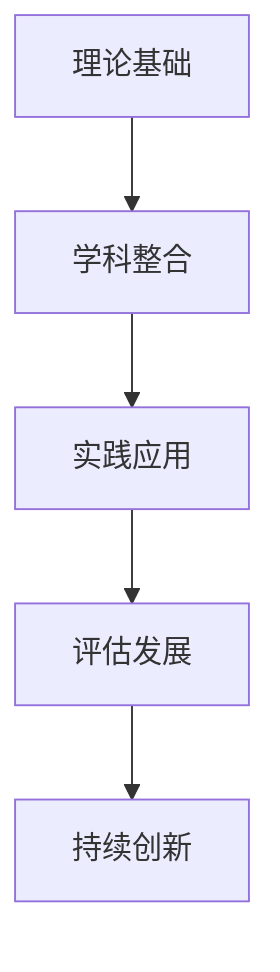
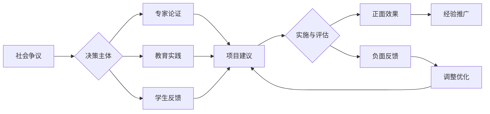

# 🎓 国际化高中教育知识体系 (SeniorEducation)

> 基于最新认知科学、教育学前沿理论构建的多表征高中教育知识体系

## 🌟 项目愿景

构建一个符合国际先进教育理念、适应高中生认知发展规律的完整知识体系，融合：

- **认知科学最新成果** - 脑科学、心理学、学习科学
- **国际教育理念** - 英美澳新法等发达国家教育模式
- **多表征学习** - 图形、符号、文字、数学等多种表现形式
- **批判性思维** - 培养分析、评估、创新能力

## 🏗️ 知识架构体系

### 📚 [第一层：哲学科学基础](./01-哲学科学基础/)

- [01-认知科学与学习理论](./01-哲学科学基础/01-认知科学与学习理论.md)
- [02-教育哲学与价值观](./01-哲学科学基础/02-教育哲学与价值观.md)
- [03-逻辑学与批判性思维](./01-哲学科学基础/03-逻辑学与批判性思维.md)

### 🔬 [第二层：核心学科理论](./02-核心学科理论/)

- [01-数学教育理论与实践](./02-核心学科理论/01-数学教育理论与实践.md) ✅
- [02-科学教育方法论](./02-核心学科理论/02-科学教育方法论.md) ✅
- [03-语言学习与认知发展](./02-核心学科理论/03-语言学习与认知发展.md) ✅
- [04-人文社科整合教育](./02-核心学科理论/04-人文社科整合教育.md) ✅

### 🎯 [第三层：应用实践领域](./03-应用实践领域/)

- [01-跨学科项目学习](./03-应用实践领域/01-跨学科项目学习.md) ✅
- [02-创新思维训练](./03-应用实践领域/02-创新思维训练.md) ✅
- [03-国际化视野培养](./03-应用实践领域/03-国际化视野培养.md) ✅

### 🔄 [第四层：评估与发展](./04-评估与发展/)

- [01-学习评估体系](./04-评估与发展/01-学习评估体系.md) ✅
- [02-个性化发展路径](./04-评估与发展/02-个性化发展路径.md) ✅
- [03-终身学习能力](./04-评估与发展/03-终身学习能力.md) ✅

## 🎨 特色功能

### 📊 多表征学习支持

- **可视化图表** - 概念图、思维导图、流程图
- **数学符号系统** - LaTeX公式、逻辑证明、符号推理
- **互动式内容** - 案例分析、实践练习、批判性讨论

### 🔗 智能导航系统

- **层次化目录** - 严格的编号体系和分类结构
- **本地跳转** - 文档间无缝链接和引用
- **进度追踪** - [查看项目进度](./PROJECT_PROGRESS.md)

### 📏 标准化规范

- **统一模板** - [查看文档标准](./STRUCTURE_TEMPLATE.md)
- **质量保证** - 内容一致性、学术规范性
- **持续更新** - 与最新教育理论保持同步

## 🚀 快速开始

### 📖 阅读指南

1. **新手入门**: 从 [认知科学基础](./01-哲学科学基础/01-认知科学与学习理论.md) 开始
2. **学科专精**: 直接访问相关的 [核心学科理论](./02-核心学科理论/) 模块
3. **实践应用**: 查看 [应用实践领域](./03-应用实践领域/) 的具体案例

### 🔍 导航技巧

- 使用文档内的内部链接进行跳转
- 查看每个主题的"知识关联"部分了解相关内容
- 利用"学习检验"部分测试理解程度

## 🌍 国际化教育理念

本项目融合了以下国家和地区的先进教育理念：

- **🇬🇧 英国**: 批判性思维、探究式学习
- **🇺🇸 美国**: 多元智能理论、个性化教育
- **🇦🇺 澳大利亚**: 能力本位教育、终身学习
- **🇸🇬 新加坡**: 双语教育、STEM整合
- **🇫🇷 法国**: 哲学思辨、人文素养

## 📈 项目状态

- **当前版本**: v0.3-alpha
- **开发状态**: 🚧 基础框架构建中
- **内容状态**: 基础理论层完成，具体学科模块待补全
- **最后更新**: 查看 [进度追踪](./PROJECT_PROGRESS.md)

## 🤝 贡献指南

本项目遵循开放教育资源原则，欢迎教育工作者、研究者、学生参与贡献：

- 内容补充和完善
- 多语言翻译
- 教学实践反馈

## 📄 许可证

本项目采用 [MIT License](./LICENSE)，鼓励教育领域的开放共享和协作创新。

---

*让每个高中生都能接受世界级的教育 | 培养具有国际视野的未来公民*

**🔥 现在开始探索 → [认知科学基础](./01-哲学科学基础/01-认知科学与学习理论.md)**

## 📊 多表征内容

### 📈 图表展示

**教育知识库发展模型**

---

**教育知识库项目争议与决策流程**

---

## 5. 现实争议与前沿挑战

### 5.1 社会争议案例

- **教育理念争议**：
  - "跨学科整合是否削弱学科深度？"
  - "个性化教育与标准化要求的冲突"
  - "国际化视野与本土文化认同的平衡"
- **技术应用争议**：
  - "AI教育工具对传统教学方法的冲击"
  - "数字化学习对人际交往能力的影响"
- **资源分配争议**：
  - "优质教育资源的不均衡分布"
  - "教育投入与产出的效益评估"

### 5.2 技术伦理问题

- **AI教育伦理**：
  - "AI个性化推荐的算法偏见"
  - "智能评估系统的公正性与透明度"
  - "教育数据隐私保护与学习分析"
- **技术依赖风险**：
  - "过度依赖技术导致人文关怀缺失"
  - "数字鸿沟对教育公平的影响"

### 5.3 跨文化对比

- **教育理念差异**：
  - "中西方教育哲学的根本差异"
  - "不同文化背景下的学习模式"
- **实施策略对比**：
  - "各国教育改革路径的差异"
  - "成功案例的本土化适应性"

### 5.4 失败案例剖析

- **项目实施失败**：
  - "某地教育改革流于形式的反思"
  - "过度理想化导致实践脱节的案例"
- **技术应用失败**：
  - "盲目追求技术导致教育质量下降"
  - "忽视教师培训导致技术应用失败"

---

> 注：本知识库持续更新，欢迎教育工作者、研究者、学生和家长参与讨论和改进。
