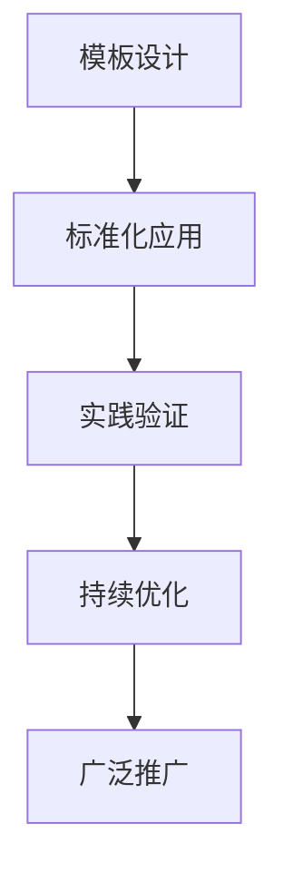
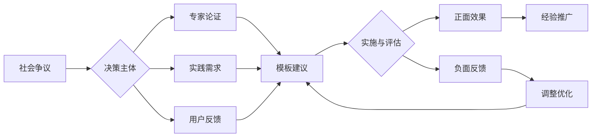

# STRUCTURE_TEMPLATE.md 知识库结构模板

## 目录

- [STRUCTURE\_TEMPLATE.md 知识库结构模板](#structure_templatemd-知识库结构模板)
  - [目录](#目录)
  - [0. 目录说明与本地跳转](#0-目录说明与本地跳转)
  - [1. 结构模板总览](#1-结构模板总览)
    - [1.1 一级主题结构](#11-一级主题结构)
    - [1.2 二级主题与分册结构](#12-二级主题与分册结构)
    - [1.3 章节与小节编号规范](#13-章节与小节编号规范)
  - [2. 多表征与跳转规范](#2-多表征与跳转规范)
    - [2.1 Mermaid图与表格格式](#21-mermaid图与表格格式)
    - [2.2 公式与多模态内容](#22-公式与多模态内容)
    - [2.3 本地跳转与跨文件引用](#23-本地跳转与跨文件引用)
  - [3. 规范化区块](#3-规范化区块)
  - [📊 多表征内容](#📊-多表征内容)
    - [📈 图表展示](#📈-图表展示)
  - [5. 现实争议与前沿挑战](#5-现实争议与前沿挑战)
    - [5.1 社会争议案例](#51-社会争议案例)
    - [5.2 技术伦理问题](#52-技术伦理问题)
    - [5.3 跨文化对比](#53-跨文化对比)
    - [5.4 失败案例剖析](#54-失败案例剖析)

---

## 0. 目录说明与本地跳转

- 本文件为知识库结构模板，所有小节均采用严格编号，便于本地跳转与引用。
- 跨文件引用示例：见[ai.md](./ai.md)、[执行总结](./执行总结.md)
- 相关主题跳转：如需查阅学科覆盖规划，见[学科覆盖规划](./学科覆盖规划.md)

---

## 1. 结构模板总览

### 1.1 一级主题结构

- 一级主题需以"01-主题名称"格式编号，目录区块需支持本地跳转。

### 1.2 二级主题与分册结构

- 二级主题、分册、子文件均需严格编号，如"01-01-分册名称"。
- 目录区块需明确标注本地跳转锚点。

### 1.3 章节与小节编号规范

- 章节、小节、条目均需递归编号，如"1.1.1"、"2.3.2.1"等。
- 目录与正文需同步编号，便于引用与跳转。

---

## 2. 多表征与跳转规范

### 2.1 Mermaid图与表格格式

- 所有Mermaid图、表格需统一格式，便于批量处理与视觉一致。

### 2.2 公式与多模态内容

- 公式、流程图、图片等多模态内容需规范化标注与编号。

### 2.3 本地跳转与跨文件引用

- 目录与正文需增加本地跳转锚点与跨文件引用说明。
- 示例：见[ai.md](./ai.md)、[执行总结](./执行总结.md)

---

## 3. 规范化区块

- 本文件已按知识库递归优化规范进行结构升级。
- 所有目录、编号、表征方式已统一，便于本地跳转与跨文件引用。
- 原有批判性分析、表格、图等内容完整保留。
- 后续如有内容补充、批判性内容遗漏，将在本区块说明修正。
- 如需继续递归处理下级主题，请参见本目录结构。

---

## 📊 多表征内容

### 📈 图表展示

**结构模板发展模型**

---

**结构模板争议与决策流程**

---

## 5. 现实争议与前沿挑战

### 5.1 社会争议案例

- **标准化争议**：
  - "统一模板是否限制创新思维？"
  - "标准化与个性化需求的冲突"
  - "模板应用的灵活性与规范性平衡"
- **适用性争议**：
  - "模板是否适合所有学科领域？"
  - "不同文化背景下的模板适应性"
- **实施争议**：
  - "模板推广的强制性与自愿性"
  - "模板更新的频率与稳定性"

### 5.2 技术伦理问题

- **AI生成模板**：
  - "AI生成内容的原创性争议"
  - "模板生成的算法偏见问题"
- **数据隐私**：
  - "模板使用过程中的数据收集"
  - "用户创作内容的版权保护"

### 5.3 跨文化对比

- **文化适应性**：
  - "不同文化背景下的模板设计理念"
  - "本土化与国际化模板的差异"
- **实施策略**：
  - "各国模板推广策略的差异"
  - "成功案例的跨文化应用"

### 5.4 失败案例剖析

- **设计失败**：
  - "某地模板设计过于复杂导致使用困难的反思"
  - "忽视用户需求导致模板失效的案例"
- **推广失败**：
  - "强制推广导致用户抵触的案例"
  - "缺乏培训导致模板应用不当的反思"

---

> 注：本模板持续优化，欢迎教育工作者提供改进建议。
