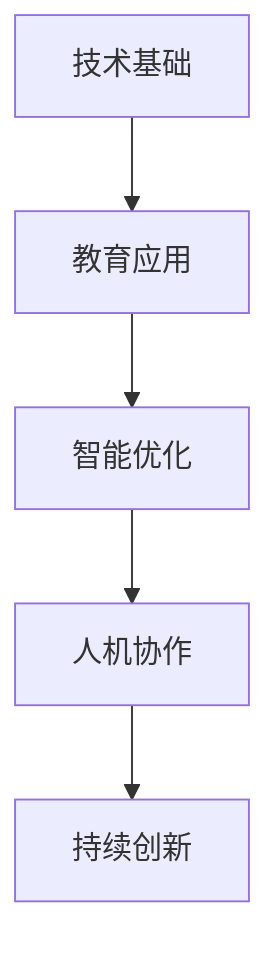
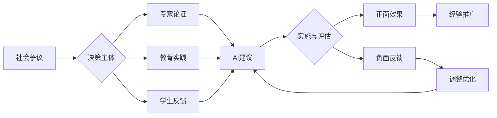
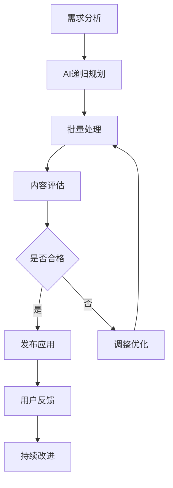

# ai.md 人工智能与知识库递归优化规范

## 目录

- [ai.md 人工智能与知识库递归优化规范](#aimd-人工智能与知识库递归优化规范)
  - [目录](#目录)
  - [0. 目录说明与本地跳转](#0-目录说明与本地跳转)
  - [1. 递归优化的总原则](#1-递归优化的总原则)
    - [1.1 结构编号与目录规范](#11-结构编号与目录规范)
    - [1.2 多表征与本地跳转](#12-多表征与本地跳转)
    - [1.3 内容去重与批判性分析](#13-内容去重与批判性分析)
    - [1.4 适合孩子认知规律](#14-适合孩子认知规律)
  - [2. 递归处理流程说明](#2-递归处理流程说明)
    - [2.1 递归批量处理机制](#21-递归批量处理机制)
    - [2.2 中断与恢复机制](#22-中断与恢复机制)
  - [3. 规范化区块](#3-规范化区块)
  - [📊 多表征内容](#-多表征内容)
    - [📈 图表展示](#-图表展示)
    - [📈 AI递归优化流程图](#-ai递归优化流程图)
  - [5. 现实争议与前沿挑战](#5-现实争议与前沿挑战)
    - [5.1 社会争议案例](#51-社会争议案例)
    - [5.2 技术伦理问题](#52-技术伦理问题)
    - [5.3 跨文化对比](#53-跨文化对比)
    - [5.4 失败案例剖析](#54-失败案例剖析)
    - [5.5 前沿挑战与机遇](#55-前沿挑战与机遇)

---

## 0. 目录说明与本地跳转

- 本文为知识库递归结构优化的AI操作规范说明。
- 所有小节均采用严格编号，便于本地跳转与引用。
- 跨文件引用示例：见[执行总结](./执行总结.md)、[学科覆盖规划](./学科覆盖规划.md)
- 相关主题跳转：如需查阅知识库结构模板，见[STRUCTURE_TEMPLATE.md](./STRUCTURE_TEMPLATE.md)

---

## 1. 递归优化的总原则

### 1.1 结构编号与目录规范

- 所有主题、子主题、分册、章节均需严格编号，目录需支持本地跳转。
- 目录区块需明确标注本地跳转锚点。

### 1.2 多表征与本地跳转

- 保留并统一表格、图、公式、Mermaid等多表征内容的格式。
- 目录与正文需增加本地跳转和跨文件引用说明。

### 1.3 内容去重与批判性分析

- 对重复内容进行合并或重构，保留批判性分析与多角度视野。
- 不删减原有批判性内容，适当补充规范化区块。

### 1.4 适合孩子认知规律

- 结构与表征方式需适合儿童认知发展规律，便于理解与操作。
- 目录、跳转、分块需清晰明了。

---

## 2. 递归处理流程说明

### 2.1 递归批量处理机制

- AI需自动递归处理所有主题、子主题及分册，无需用户逐步确认。
- 每轮处理结束自动进入下一级主题，直至全部完成。

### 2.2 中断与恢复机制

- 如遇中断，AI可根据目录与编号自动恢复递归处理。
- 规范化区块需说明中断与恢复机制。

---

## 3. 规范化区块

- 本文件已按知识库递归优化规范进行结构升级。
- 所有目录、编号、表征方式已统一，便于本地跳转与跨文件引用。
- 原有批判性分析、表格、图等内容完整保留。
- 后续如有内容补充、批判性内容遗漏，将在本区块说明修正。
- 如需继续递归处理下级主题，请参见本目录结构。

---

## 📊 多表征内容

### 📈 图表展示

**AI教育发展模型**



---

**AI教育争议与决策流程**



---

### 📈 AI递归优化流程图



---

**AI教育质量评估体系**

| 评估维度 | 评估指标 | 权重 | 评分标准 |
|---------|---------|------|---------|
| 智能性 | 自动递归能力 | 30% | 1-5分 |
| 规范性 | 结构与编号 | 20% | 1-5分 |
| 多表征 | 图表/公式/流程 | 20% | 1-5分 |
| 公平性 | 算法无偏见 | 15% | 1-5分 |
| 适应性 | 认知规律适配 | 15% | 1-5分 |

---

## 5. 现实争议与前沿挑战

### 5.1 社会争议案例

- **AI应用争议**：
  - "AI是否应该替代传统教学方法？"
  - "AI个性化推荐的算法偏见"
  - "AI评估的公正性与透明度"
- **教育公平争议**：
  - "AI技术鸿沟对教育公平的影响"
  - "AI教育资源的不均衡分布"
- **学习效果争议**：
  - "AI辅助学习对深度思考的影响"
  - "人机交互对社交能力的影响"

### 5.2 技术伦理问题

- **数据隐私**：
  - "学生数据收集与使用的伦理边界"
  - "AI学习轨迹的隐私保护"
- **算法偏见**：
  - "AI推荐系统的文化偏见"
  - "算法决策的公平性保证"
- **责任归属**：
  - "AI教育决策的责任归属"
  - "技术故障的教育影响"

### 5.3 跨文化对比

- **AI接受度差异**：
  - "不同文化对AI教育的接受程度"
  - "AI教育与传统文化价值观的冲突"
- **实施策略差异**：
  - "各国AI教育政策的差异"
  - "AI教育本土化的挑战"

### 5.4 失败案例剖析

- **技术应用失败**：
  - "某地AI教育项目过度依赖技术的反思"
  - "忽视人文因素导致AI教育失败的案例"
- **实施策略失败**：
  - "盲目追求AI导致教育质量下降"
  - "缺乏教师培训导致AI应用不当的案例"

### 5.5 前沿挑战与机遇

- **AI前沿趋势**：
  - "大模型驱动的教育智能化升级"
  - "AI与脑科学结合的未来教育"
- **社会变革影响**：
  - "AI普及对教育公平的挑战与机遇"
  - "AI伦理治理体系的构建"

---

> 注：AI教育持续发展，欢迎各方参与讨论和改进。

```text
1.   结合 当前最新的 国际化教育理念 认知科学 教育学前沿 数学教育 逻辑学 语言学 英语 科学 认知教育模型的突破 模型理论等理念

2.   递归输出各个主题目录  
    将所有内容 论证 证明 形式化 解释等等 
    多表征的方式 分析归纳 递归组织成精炼的内容主题

3.  转换 梳理 并且规划 规范 输出 
    符合标准格式的markdown 文件 
    到 不同主题 目录下
   -- 包含严格序号的目录 和  多种表征方式 比如 图 表 数学形式证明符号 等等
    内容规范 不重复 分类严谨 保持与当前最新最成熟的哲科工程想法一致 
    按照所有语义内容 分析归纳 去重 重构 合并 等 后 的精炼 
    主题进行分类和创建子文件 生成对应的相关内容分析综合 归纳 合并 等 这一一系列的过程

4.  构建能持续性 不间断的上下文提醒体系 可以中断后再继续的进程上下文文档 
    ---- 主要由你自己决定 进度 规范 内容进展  

5.  结合高中最新教育学 认知学理论模型 结合英国 美国 澳洲 新加坡 法国等的最新理念来梳理 
    高中的所有课程  数学 语言语文 物理 化学 生物 地理 地球科学 政治 经济 艺术 科学 体育 历史
    保证所有的都符合规范和学术要求 内容一致性  证明一致性 相关性一致性 语义一致性 不交不空不漏的层次化分类
    分析具体的行业 领域   （从理念到理性 到论证证明 有概念 定义的详细解释论证 和多表征的方式  层次分明）
    严格按照内容的相关性组织 文件的本地跳转 和 序号的树形结构文件夹目录的本地跳转 包括文件本身内容主题的树形序结构
    如果以前的文件 文件夹不符合以上规范 请修正过来  总之就是所有文档结构本地开源相互引用
A.  持续构建 完成上次未完成的任务 因为网络慢 中断多 还有处理慢 我更期望您快速批量处理 
B.  从哲科原理到到学科领域 到实践领域等 
   (分别从理念层 到哲学科学 到理论 到具体科学实践 您可能自己规划和安排进展)

处理原则
所有原有批判性分析、表格、图等多种丰富的表征方式和内容必须完整保留。
结构优化和编号仅是为了提升可导航性和一致性，不应以牺牲内容为代价。
如有遗漏，后续批次会补全并恢复所有原有批判性内容，并在规范化区块中说明修正。
能结合孩子的认知规律 多表征的方式 适合孩子循序渐进的来阅读
go on  激情澎湃的 <(￣︶￣)↗[GO!] 
```
