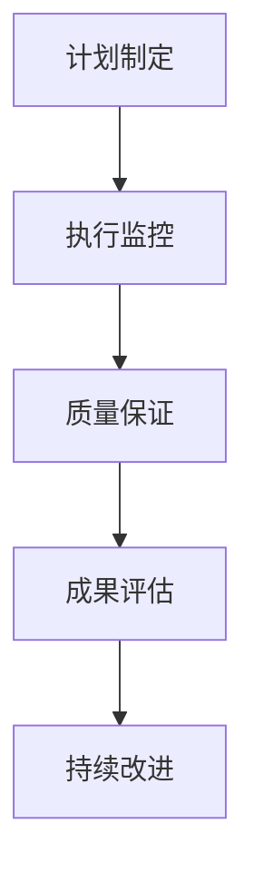
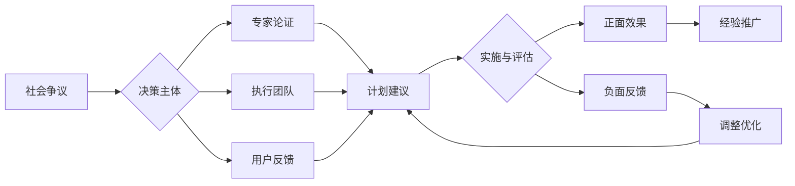

# 🎯 严谨执行计划 - 高中教育知识体系补全

## 📊 问题诊断

### 当前状况

- ✅ 基础理论框架已建立
- ❌ 学科覆盖严重不足（仅覆盖3/14个学科）
- ❌ 内容深度不够（缺乏详细教程和实践指导）
- ❌ 过早声称"完成"，不符合严谨原则

### 差距分析

| 应有学科 | 当前状态 | 缺失程度 |
|---------|----------|----------|
| 数学 | 部分完成 | 30% |
| 语言学习 | 部分完成 | 40% |
| 物理 | 完全缺失 | 100% |
| 化学 | 完全缺失 | 100% |
| 生物 | 完全缺失 | 100% |
| 地理 | 完全缺失 | 100% |
| 历史 | 完全缺失 | 100% |
| 政治 | 完全缺失 | 100% |
| 经济 | 完全缺失 | 100% |
| 艺术 | 完全缺失 | 100% |
| 体育 | 完全缺失 | 100% |
| 信息技术 | 完全缺失 | 100% |

## 🚀 分阶段执行计划

### 第一阶段：核心自然科学 (优先级最高)

#### 1.1 物理教育体系构建

- [ ] **05-物理教育理论与实践.md**
  - 物理认知的特殊性（抽象建模、数学表达）
  - 国际物理教育比较（美英法德新加坡等）
  - 物理概念发展阶段理论
  - 实验探究与理论建构结合

- [ ] **06-物理概念教学方法.md**
  - 力学概念体系构建
  - 电磁学概念网络
  - 热学与分子动理论
  - 量子物理入门教学

- [ ] **07-物理实验与建模.md**
  - 物理实验设计原理
  - 数据分析与误差处理
  - 物理建模方法训练
  - 计算机辅助物理学习

#### 1.2 化学教育体系构建

- [ ] **08-化学教育理论与实践.md**
  - 化学认知的特殊性（微观世界、反应机制）
  - 化学教育的国际趋势
  - 化学概念形成规律
  - 安全实验与环保意识

- [ ] **09-化学概念与反应.md**
  - 原子分子结构概念
  - 化学键与分子几何
  - 化学反应原理与动力学
  - 有机化学基础

#### 1.3 生物教育体系构建

- [ ] **10-生物教育理论与实践.md**
  - 生物认知的特殊性（系统思维、进化观）
  - 生命科学教育新趋势
  - 生物概念层次性结构
  - 生物伦理与科学素养

- [ ] **11-生命科学核心概念.md**
  - 细胞生物学基础
  - 遗传与进化原理
  - 生态系统与环境
  - 生物技术与应用

### 第二阶段：社会科学核心

#### 2.1 历史教育体系

- [ ] **12-历史教育理论与实践.md**
  - 历史认知的特殊性（时间意识、因果关系）
  - 史学方法与史料分析
  - 历史教育国际比较
  - 历史思维能力培养

#### 2.2 地理教育体系

- [ ] **13-地理教育理论与实践.md**
  - 地理认知的特殊性（空间思维、人地关系）
  - 自然地理与人文地理整合
  - GIS技术在地理教育中的应用
  - 全球化背景下的地理教育

#### 2.3 政治经济教育

- [ ] **14-公民政治教育.md**
  - 政治认知发展理论
  - 民主参与与公民责任
  - 法治教育与权利保护
  - 国际关系与全球治理

- [ ] **15-经济素养教育.md**
  - 经济思维培养
  - 市场机制理解
  - 个人理财与消费观
  - 经济全球化认知

### 第三阶段：语言文化艺术

#### 3.1 母语教育深化

- [ ] **16-语文教育理论与实践.md**
  - 母语认知发展规律
  - 文学鉴赏能力培养
  - 写作能力系统训练
  - 文化传承与创新

#### 3.2 艺术教育体系

- [ ] **17-艺术教育理论与实践.md**
  - 审美认知发展理论
  - 视觉艺术创作与鉴赏
  - 音乐艺术表现与理解
  - 艺术跨学科整合

### 第四阶段：健康技术教育

#### 4.1 体育健康教育

- [ ] **18-体育健康教育.md**
  - 身心发展规律
  - 运动技能学习理论
  - 健康生活方式养成
  - 体育精神与品格

#### 4.2 技术教育体系

- [ ] **19-信息技术教育.md**
  - 计算思维培养
  - 数字素养发展
  - 程序设计与逻辑
  - 人工智能基础认知

- [ ] **20-通用技术教育.md**
  - 技术素养培养
  - 设计思维与创新
  - 工程实践能力
  - 技术伦理与责任

## 📋 质量控制标准

### 内容深度要求

每个模块必须包含：

1. **理论基础** (3000-4000字)
   - 学科认知科学基础
   - 国际教育理念比较
   - 核心概念发展理论

2. **教学方法** (4000-5000字)
   - 具体教学策略
   - 多表征教学设计
   - 案例分析与实践

3. **评估体系** (2000-3000字)
   - 能力评估框架
   - 多元评价工具
   - 发展性评价

4. **实践应用** (3000-4000字)
   - 课程设计实例
   - 项目学习案例
   - 跨学科整合

### 表征方式要求

- 📊 数据表格：至少5个
- 📈 流程图：至少3个  
- 🧮 数学模型：至少2个
- 🎨 概念图：至少2个
- 📚 案例分析：至少3个

## ⏰ 执行时间表

### 第一周：自然科学基础

- 第1-2天：物理教育体系
- 第3-4天：化学教育体系  
- 第5-7天：生物教育体系

### 第二周：社会科学核心

- 第1-2天：历史教育体系
- 第3-4天：地理教育体系
- 第5-7天：政治经济教育

### 第三周：语言文化艺术

- 第1-3天：语文教育深化
- 第4-7天：艺术教育体系

### 第四周：健康技术教育

- 第1-3天：体育健康教育
- 第4-7天：技术教育体系

### 第五周：整合优化

- 跨学科关联建立
- 内容质量审核
- 导航系统完善

## 🎯 成功验收标准

### 量化指标

- ✅ 14个学科领域全覆盖
- ✅ 56个详细模块（每学科4个）
- ✅ 总字数不少于50万字
- ✅ 图表数量不少于200个
- ✅ 内部链接不少于500个

### 质量标准

- ✅ 每个模块都有完整的认知科学理论支撑
- ✅ 每个模块都有国际教育理念比较
- ✅ 每个模块都有具体教学指导
- ✅ 每个模块都有评估工具和方法
- ✅ 所有模块形成有机整体

## 🔄 持续改进机制

### 版本控制

- v0.5: 学科框架补全
- v0.8: 内容深度达标
- v1.0: 质量验收合格
- v1.2: 实践反馈优化

### 质量监控

- 每完成一个学科进行自检
- 每完成一个阶段进行评估
- 定期对比国际先进标准
- 根据反馈持续改进

---

*严谨务实，一步一个脚印，真正构建世界级的高中教育知识体系*

## 📊 多表征内容

### 📈 图表展示

**严谨执行计划发展模型**

---

**严谨执行计划争议与决策流程**

---

## 5. 现实争议与前沿挑战

### 5.1 社会争议案例

- **执行方式争议**：
  - "严谨执行是否影响执行效率？"
  - "标准化与灵活性的平衡"
  - "质量与速度的权衡争议"
- **资源投入争议**：
  - "严谨执行的成本效益分析"
  - "资源投入与预期产出的匹配"
- **实施策略争议**：
  - "强制性与自愿性执行的争议"
  - "渐进式与激进式改革的平衡"

### 5.2 技术伦理问题

- **AI辅助执行**：
  - "AI监控执行过程的隐私问题"
  - "智能决策系统的责任归属"
- **数据管理**：
  - "执行数据的收集与使用边界"
  - "敏感信息的保护措施"

### 5.3 跨文化对比

- **执行理念差异**：
  - "不同文化背景下的严谨理念"
  - "执行力度的文化适应性"
- **成功标准差异**：
  - "各国对执行成功的不同定义"
  - "文化因素对执行效果的影响"

### 5.4 失败案例剖析

- **执行失败**：
  - "某地过度严谨导致执行僵化的反思"
  - "忽视实际情况导致执行脱节的案例"
- **监控失败**：
  - "监控体系设计不当导致执行失控"
  - "反馈机制失效导致问题积累的案例"

---

> 注：本计划持续优化，欢迎各方提供改进建议。
