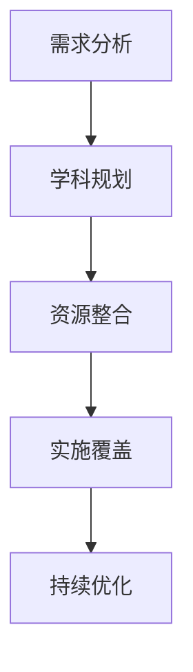
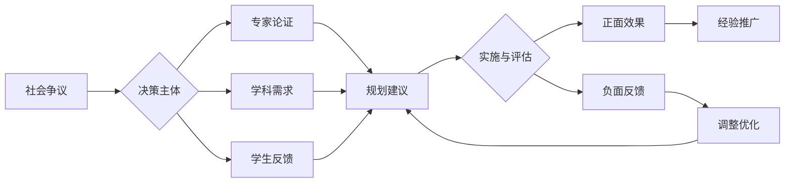

# 🎯 高中教育知识体系-学科覆盖规划

## 📊 当前状态评估

### ✅ 已完成基础模块

- 哲学科学基础 (3个模块)
- 基础教育理论框架 (4个模块)  
- 应用实践领域 (3个模块)
- 评估发展体系 (3个模块)

### ❌ 缺失的核心学科内容

根据原始需求，必须覆盖**高中所有课程**：

## 🔬 自然科学学科群

### 1. 物理教育

- [ ] 01-物理教育理论与实践.md
- [ ] 02-物理概念教学方法.md  
- [ ] 03-物理实验与探究.md
- [ ] 04-物理建模与数学应用.md

### 2. 化学教育  

- [ ] 01-化学教育理论与实践.md
- [ ] 02-化学概念与反应机制.md
- [ ] 03-化学实验与安全.md
- [ ] 04-化学与生活应用.md

### 3. 生物教育

- [ ] 01-生物教育理论与实践.md
- [ ] 02-生命科学概念体系.md
- [ ] 03-生物实验与观察.md
- [ ] 04-生态环境与可持续发展.md

### 4. 地球科学教育

- [ ] 01-地球科学教育理论.md
- [ ] 02-地质与地理过程.md
- [ ] 03-气候与环境变化.md
- [ ] 04-资源与环境保护.md

## 🌍 社会科学学科群

### 5. 地理教育

- [ ] 01-地理教育理论与实践.md
- [ ] 02-自然地理与人文地理.md
- [ ] 03-区域地理与全球化.md
- [ ] 04-地理信息技术应用.md

### 6. 历史教育

- [ ] 01-历史教育理论与实践.md
- [ ] 02-史学方法与史料分析.md
- [ ] 03-中外历史文明比较.md
- [ ] 04-历史思维与批判能力.md

### 7. 政治教育

- [ ] 01-政治教育理论与实践.md
- [ ] 02-政治制度与公民教育.md
- [ ] 03-法律基础与权利义务.md
- [ ] 04-国际关系与全球治理.md

### 8. 经济教育

- [ ] 01-经济教育理论与实践.md
- [ ] 02-微观经济与宏观经济.md
- [ ] 03-市场机制与经济政策.md
- [ ] 04-经济全球化与发展.md

## 🎨 人文艺术学科群

### 9. 语文教育（母语）

- [ ] 01-语文教育理论与实践.md
- [ ] 02-文学鉴赏与写作能力.md
- [ ] 03-语言文字运用规范.md
- [ ] 04-文化传承与创新表达.md

### 10. 英语教育（外语）

- [ ] 01-英语教育理论与实践.md
- [ ] 02-英语语言技能培养.md
- [ ] 03-跨文化交际能力.md
- [ ] 04-英语应用与实践.md

### 11. 艺术教育

- [ ] 01-艺术教育理论与实践.md
- [ ] 02-视觉艺术与设计.md
- [ ] 03-音乐艺术与表演.md
- [ ] 04-艺术鉴赏与创作.md

## 💪 健康体育学科群

### 12. 体育与健康教育

- [ ] 01-体育教育理论与实践.md
- [ ] 02-运动技能与身体素质.md
- [ ] 03-健康教育与生活方式.md
- [ ] 04-体育精神与团队合作.md

## 🔧 技术应用学科群

### 13. 信息技术教育

- [ ] 01-信息技术教育理论.md
- [ ] 02-计算思维与编程.md
- [ ] 03-数字化工具应用.md
- [ ] 04-信息素养与网络安全.md

### 14. 通用技术教育

- [ ] 01-技术教育理论与实践.md
- [ ] 02-设计思维与工程实践.md
- [ ] 03-技术评价与决策.md
- [ ] 04-技术创新与社会责任.md

## 📋 执行优先级

### 第一批（核心学科）

1. 物理教育 - 理科基础
2. 化学教育 - 理科基础  
3. 生物教育 - 理科基础
4. 语文教育 - 文科基础
5. 英语教育 - 语言基础

### 第二批（社会科学）

6. 历史教育 - 人文基础
7. 地理教育 - 综合学科
8. 政治教育 - 公民素养
9. 经济教育 - 社会认知

### 第三批（艺体技术）

10. 艺术教育 - 审美素养
11. 体育教育 - 身心健康
12. 信息技术 - 数字素养
13. 通用技术 - 工程素养
14. 地球科学 - 环境素养

## 📏 质量标准

每个学科模块必须包含：

### 1. 理论基础

- 学科教育的认知科学基础
- 国际先进教育理念对比
- 学科核心素养分析

### 2. 内容体系

- 学科知识结构图谱
- 核心概念递进体系
- 跨学科关联分析

### 3. 教学方法

- 具体教学策略和技巧
- 多表征教学设计
- 案例分析和实践指导

### 4. 评估体系

- 学科能力评估框架
- 多元化评价工具
- 发展性评价策略

### 5. 实践应用

- 课程设计实例
- 项目学习案例
- 国际化视野培养

## ⏰ 时间规划

- **当前阶段**: 学科覆盖缺口分析 ✅
- **第一阶段**: 核心学科模块创建 (物化生语英)
- **第二阶段**: 社会科学模块创建 (史地政经)  
- **第三阶段**: 艺体技术模块创建
- **第四阶段**: 整体优化和关联完善
- **第五阶段**: 内容深化和教程开发

## 🎯 成功标准

- ✅ 覆盖高中所有14个学科领域
- ✅ 每个学科4个核心模块，共56个详细模块
- ✅ 符合国际化教育理念和认知科学原理
- ✅ 提供具体可操作的教学指导
- ✅ 建立完整的评估和发展体系

---

-*只有完成了所有学科的系统梳理，才能称为真正的"高中教育知识体系"*

## 📊 多表征内容

### 📈 图表展示

**学科覆盖规划发展模型**

---

**学科覆盖规划争议与决策流程**

---

## 5. 现实争议与前沿挑战

### 5.1 社会争议案例

- **学科选择争议**：
  - "核心学科与边缘学科的界定争议"
  - "传统学科与现代学科的平衡"
  - "学科覆盖的深度与广度冲突"
- **资源分配争议**：
  - "不同学科间的资源分配不均"
  - "学科发展优先级的设定争议"
- **实施策略争议**：
  - "学科覆盖的强制性与选择性"
  - "学科整合与独立发展的平衡"

### 5.2 技术伦理问题

- **AI学科规划**：
  - "AI推荐学科选择的算法偏见"
  - "智能规划系统的透明度和可解释性"
- **数据隐私**：
  - "学科选择数据的隐私保护"
  - "学习轨迹数据的合理使用"

### 5.3 跨文化对比

- **学科理念差异**：
  - "不同国家学科设置理念的差异"
  - "文化背景对学科选择的影响"
- **实施策略对比**：
  - "各国学科覆盖策略的差异"
  - "成功案例的跨文化适应性"

### 5.4 失败案例剖析

- **规划失败**：
  - "某地学科规划脱离实际需求的反思"
  - "过度理想化导致实施困难的案例"
- **实施失败**：
  - "强制推行导致学生抵触的案例"
  - "资源不足导致规划流产的反思"

---

> 注：本规划持续优化，欢迎教育工作者提供改进建议。
