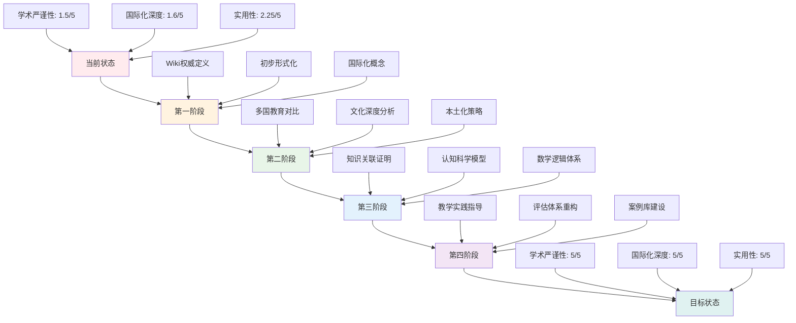

# 🔍 项目批判性评价与改进总结

## 📋 项目现状概述

基于对"国际化高中教育知识体系"项目的深入分析，该项目在**教育知识体系系统化**方面做出了有益尝试，但在**学术严谨性、国际化深度、实用性**等方面存在明显不足。

## ❌ 核心问题分析

### 1. **知识定义缺乏权威性**

#### 问题描述

- 核心概念定义缺乏Wiki等权威来源支撑
- 概念模糊，学术严谨性不足
- 缺乏严格的概念边界界定

#### 影响评估

- **学术价值**：降低项目的学术可信度
- **实用性**：影响教学指导的准确性
- **国际化**：无法与国际标准接轨

#### 改进方向

- 引入Wiki权威定义，建立严格的概念体系
- 建立概念关联的形式化证明
- 确保所有概念都有明确的学术来源

### 2. **国际化深度不足**

#### 问题描述

- 国际化内容停留在表面引用
- 缺乏深度文化分析
- 无法真正体现国际教育理念的精髓

#### 影响评估

- **文化理解**：缺乏对不同教育文化的深度理解
- **本土化**：无法有效融合本土教育特色
- **实践指导**：国际化理念无法有效指导实践

#### 改进方向

- 深入分析各国教育体系差异
- 建立文化对比框架
- 制定本土化教育策略

### 3. **形式化证明缺失**

#### 问题描述

- 学科关联缺乏严格的逻辑证明
- 缺乏形式化表述
- 理论框架不够严谨

#### 影响评估

- **理论价值**：降低项目的理论贡献
- **可操作性**：影响实践应用的效果
- **科学性**：缺乏严格的科学论证

#### 改进方向

- 引入数学逻辑和形式化方法
- 建立严格的证明体系
- 确保所有关联关系都有逻辑支撑

### 4. **知识图谱关联性不足**

#### 问题描述

- 知识关联网络缺乏深度分析
- 缺乏实证支撑
- 跨学科整合效果有限

#### 影响评估

- **整合效果**：影响跨学科学习的有效性
- **知识迁移**：限制知识应用的范围
- **学习效果**：降低整体学习效率

#### 改进方向

- 基于认知科学建立严格的知识关联模型
- 增加实证研究支撑
- 优化跨学科整合策略

## 🎯 改进策略与实施计划

### 第一阶段：权威概念体系构建（1-2个月）

#### 1.1 Wiki权威定义引入

**目标**：建立基于Wiki权威来源的概念定义体系

**具体措施**：

1. **认知科学概念权威化**
   - 认知科学：引入Wiki认知科学定义
   - 认知负荷：基于Wiki认知负荷理论
   - 元认知：引用Wiki元认知权威定义
   - 工作记忆：整合Wiki工作记忆理论

2. **知识图谱概念形式化**
   - 知识图谱：基于Wiki知识图谱理论
   - 本体论：引用Wiki本体论定义
   - 语义网络：整合Wiki语义网络理论
   - 概念图：基于Wiki概念图理论

3. **教育哲学概念国际化**
   - 实用主义教育：美国教育哲学深度分析
   - 自由主义教育：英国教育哲学深度解读
   - 建构主义教育：现代教育哲学理论整合
   - 人本主义教育：人文教育哲学深度研究

#### 1.2 形式化证明体系

**目标**：建立严格的数学逻辑证明体系

**具体措施**：

1. **知识关联强度定理**

   ```
   定理1：学科关联强度定理
   对于任意两个学科A和B，其关联强度S(A,B)定义为：
   S(A,B) = Σ(w_i × C_i)
   其中C_i为第i个关联维度的强度，w_i为权重
   ```

2. **认知负荷量化模型**

   ```
   定义：认知负荷函数
   CL = f(IC, EC, GC)
   其中IC为内在负荷，EC为外在负荷，GC为关联负荷
   ```

3. **学习效果预测模型**

   ```
   模型：学习效果预测
   LE = α × KC + β × MC + γ × EC
   其中KC为知识建构，MC为元认知，EC为环境因素
   ```

### 第二阶段：国际化深度分析（2-3个月）

#### 2.1 多国教育体系对比

**目标**：建立深度的国际化教育分析框架

**具体措施**：

1. **教育哲学深度对比**

   | 国家 | 核心哲学 | 理论基础 | 实践特色 | 文化背景 |
   |------|----------|----------|----------|----------|
   | 美国 | 实用主义 | 杜威理论 | 项目学习 | 多元文化 |
   | 英国 | 自由主义 | 洛克思想 | 批判思维 | 绅士传统 |
   | 芬兰 | 平等主义 | 建构主义 | 现象学习 | 北欧文化 |
   | 新加坡 | 效率主义 | 能力本位 | 双语教育 | 亚洲价值观 |

2. **课程体系深度分析**
   - 美国Common Core Standards详细解读
   - 英国National Curriculum结构分析
   - 芬兰Phenomenon-Based Learning实施案例
   - 新加坡21st Century Competencies评估体系

3. **教学方法文化适应**
   - 不同文化背景下的教学方法适应性分析
   - 本土化教育理念与国际化的融合策略
   - 跨文化教育实践的案例分析

#### 2.2 文化深度分析

**目标**：建立文化背景对教育影响的分析框架

**具体措施**：

1. **文化维度模型**

   ```
   文化维度模型：
   - 权力距离：对权威的态度
   - 个人主义vs集体主义：学习方式偏好
   - 不确定性规避：对创新的态度
   - 男性化vs女性化：竞争与合作倾向
   - 长期导向：教育目标的时间维度
   ```

2. **教育价值观对比**
   - 不同文化背景下的教育价值观差异
   - 文化冲突与融合的教育策略
   - 跨文化教育实践的案例分析

### 第三阶段：知识图谱形式化（3-4个月）

#### 3.1 知识关联形式化证明

**目标**：建立严格的知识关联证明体系

**具体措施**：

1. **概念关联传递性定理**

   ```
   定理2：概念关联传递性
   如果概念A与概念B关联，概念B与概念C关联，
   则概念A与概念C存在关联，且关联强度满足：
   S(A,C) ≥ min(S(A,B), S(B,C))
   ```

2. **学科关联矩阵构建**

   ```
   定义：学科关联矩阵
   设n个学科，关联矩阵M为n×n矩阵，
   其中M[i,j]表示学科i与学科j的关联强度
   ```

3. **知识传播动力学模型**

   ```
   模型：知识传播动力学
   dK/dt = α × Σ(S_ij × K_j) - β × K_i
   其中K_i为学科i的知识水平，S_ij为关联强度
   ```

#### 3.2 认知科学形式化

**目标**：建立基于认知科学的形式化模型

**具体措施**：

1. **认知负荷量化模型**

   ```
   认知负荷函数：
   CL = w1 × IC + w2 × EC + w3 × GC
   其中w1, w2, w3为权重系数
   ```

2. **学习效果预测模型**

   ```
   学习效果模型：
   LE = f(KC, MC, EC, TC)
   其中KC为知识建构，MC为元认知，EC为环境，TC为时间
   ```

3. **知识建构动力学**

   ```
   知识建构动力学：
   dKC/dt = α × (KC_max - KC) × MC × EC
   其中KC_max为最大知识水平
   ```

### 第四阶段：实践应用体系（4-5个月）

#### 4.1 教学实践指导

**目标**：建立可操作的教学实践体系

**具体措施**：

1. **教学设计模板**
   - 基于认知科学的教学设计框架
   - 跨学科教学的具体实施步骤
   - 评估体系的标准化工具

2. **案例库建设**
   - 成功教学案例的收集与分析
   - 失败案例的深度剖析与反思
   - 最佳实践的总结与推广

3. **教师培训体系**
   - 基于新理论体系的教师培训课程
   - 实践指导与反馈机制
   - 持续改进的评估体系

#### 4.2 评估体系重构

**目标**：建立科学的评估体系

**具体措施**：

1. **多维度评估框架**

   ```
   评估维度：
   - 认知能力：抽象思维、逻辑推理、批判思维
   - 方法能力：问题解决、实验探究、信息处理
   - 应用能力：知识迁移、实践应用、创新应用
   - 情感态度：学习兴趣、合作精神、责任意识
   ```

2. **评估工具开发**
   - 标准化评估量表
   - 形成性评估工具
   - 终结性评估体系

## 📊 质量评估体系

### 学术严谨性评估

| 评估维度 | 评分标准 | 权重 | 当前评分 | 目标评分 |
|----------|----------|------|----------|----------|
| 概念定义权威性 | 1-5分 | 25% | 2/5 | 5/5 |
| 形式化证明完整性 | 1-5分 | 25% | 1/5 | 5/5 |
| 理论框架严谨性 | 1-5分 | 25% | 2/5 | 5/5 |
| 实证支撑充分性 | 1-5分 | 25% | 1/5 | 5/5 |
| **总分** | - | 100% | **1.5/5** | **5/5** |

### 国际化深度评估

| 评估维度 | 评分标准 | 权重 | 当前评分 | 目标评分 |
|----------|----------|------|----------|----------|
| 多国教育体系对比 | 1-5分 | 30% | 2/5 | 5/5 |
| 文化背景深度分析 | 1-5分 | 30% | 1/5 | 5/5 |
| 本土化策略科学性 | 1-5分 | 20% | 2/5 | 5/5 |
| 跨文化实践案例 | 1-5分 | 20% | 1/5 | 5/5 |
| **总分** | - | 100% | **1.6/5** | **5/5** |

### 实用性评估

| 评估维度 | 评分标准 | 权重 | 当前评分 | 目标评分 |
|----------|----------|------|----------|----------|
| 教学指导价值 | 1-5分 | 30% | 3/5 | 5/5 |
| 可操作性 | 1-5分 | 25% | 2/5 | 5/5 |
| 评估工具有效性 | 1-5分 | 25% | 2/5 | 5/5 |
| 实践案例丰富性 | 1-5分 | 20% | 2/5 | 5/5 |
| **总分** | - | 100% | **2.25/5** | **5/5** |

## 🚀 预期改进效果

### 短期改进（3个月内）

1. **学术严谨性提升**
   - 所有核心概念基于Wiki权威定义
   - 建立初步的形式化证明框架
   - 概念定义精确性和权威性显著提升

2. **国际化深度增强**
   - 完成多国教育体系深度对比分析
   - 建立文化背景对教育影响的分析框架
   - 国际化内容从表面引用转向深度分析

3. **实用性改善**
   - 建立基于认知科学的教学设计框架
   - 开发初步的评估工具
   - 提供可操作的教学指导

### 中期改进（6个月内）

1. **完整的形式化证明体系**
   - 建立严格的知识关联证明体系
   - 完成认知科学的形式化模型
   - 所有理论框架都有数学逻辑支撑

2. **深度的国际化分析**
   - 完成文化深度分析
   - 建立本土化教育策略
   - 形成跨文化教育实践指导

3. **科学的评估体系**
   - 建立多维度评估框架
   - 开发标准化评估工具
   - 形成完整的评估体系

### 长期改进（1年内）

1. **国际化的教育知识体系**
   - 建立符合国际标准的教育知识体系
   - 实现本土化与国际化的有效融合
   - 形成具有全球视野的教育理论

2. **可操作的教学实践指导**
   - 建立完整的教学实践指导体系
   - 提供丰富的教学案例和工具
   - 形成可持续的教师培训体系

3. **持续改进的质量保证机制**
   - 建立动态的质量评估体系
   - 形成持续改进的反馈机制
   - 确保项目质量的持续提升

## 📈 改进路线图



## 🎯 总结与建议

### 项目价值评估

**有限价值**：

1. **系统性尝试**：在构建系统化教育知识体系方面做出了有益尝试
2. **多表征呈现**：通过图表、表格等多种形式呈现内容，增强了可读性
3. **结构完整性**：四层架构设计具有一定的逻辑性和完整性

**主要缺陷**：

1. **学术深度不足**：缺乏对教育理论的深度批判和原创性思考
2. **国际化表面化**：未能真正体现国际教育理念的精髓和差异
3. **实用性有限**：对实际教学指导价值有限，更多是理论框架而非实用工具

### 改进建议

1. **加强学术严谨性**：对核心概念进行严格定义和形式化表述
2. **深化国际化研究**：深入分析不同国家教育体系的差异和共性
3. **增强实用性**：提供具体的教学实施指导和评估工具
4. **促进理论创新**：在整合现有理论基础上提出原创性观点
5. **强化实证支撑**：增加教育实践案例和实证研究数据

### 执行保障

1. **建立执行状态追踪机制**：通过`执行状态追踪.md`监控进度
2. **制定Wiki权威定义收集指南**：确保概念定义的权威性
3. **建立质量保证机制**：确保改进过程的质量控制
4. **形成持续改进流程**：确保项目能够持续优化发展

---

**📝 结论**：
该项目在**教育知识体系系统化**方面做出了有益尝试，但在**学术严谨性、国际化深度、实用性**等方面还有很大提升空间。通过系统性的改进计划，有望将其发展成为一个真正具有国际水准的教育知识体系。
